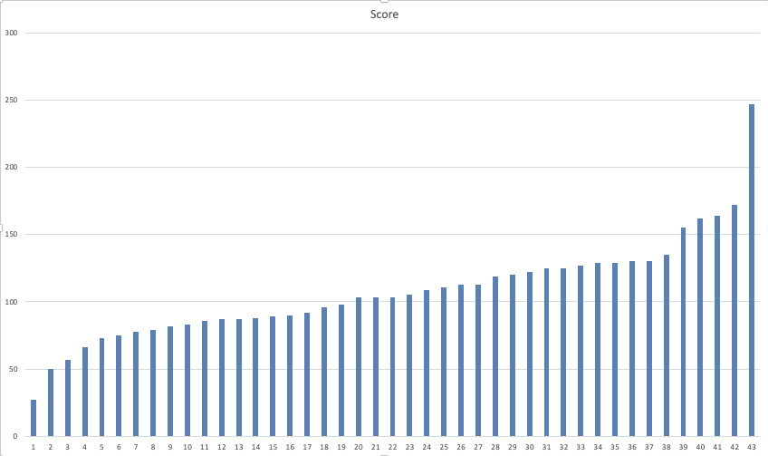

# コンピュータ演習 <!-- omit in toc --> 

    04. ファイルとフォルダの操作

# 目次<!-- omit in toc -->
1. [前回のおさらい](#前回のおさらい)
2. [教科書で利用するファイルのダウンロード](#教科書で利用するファイルのダウンロード)
3. [STEP2 ファイルとフォルダーを操作しましょう。(P.19)](#step2-ファイルとフォルダーを操作しましょうp19)
   1. [Lesson1 移動とコピーをしましょう(P.19)](#lesson1-移動とコピーをしましょうp19)
   2. [Lesson2 ファイルを管理しましょう(P.23)](#lesson2-ファイルを管理しましょうp23)
   3. [iCloudについて](#icloudについて)
4. [その他](#その他)
   1. [タイピングの基本](#タイピングの基本)

# 初めに<!-- omit in toc -->

---
1. 席自由とします。
2. モニタの電源を入れて下さい。資料がみれます。

## HPの資料<!-- omit in toc -->

https://sammyppr.github.io/

に置きます。これは学外からも閲覧可能です。予習復習にはもちろん、あれなんだっけー？みたいな時に利用してください。

## 全員パソコン揃ったかな<!-- omit in toc -->
セットアップ終わっていない人、わからなかったら聞きにきてください。

# 前回のおさらい

1. 大学で利用するWebサービス等について
2. 大学推奨パソコンを購入した人向けのアンケート
3. コンピュータに接する心構え
4. OSアップデートについて
5. Step1 Lesson1 パソコンを起動しよう
6. Step1 Lesson2 エクスプローラーを操作しましょう

# 教科書で利用するファイルのダウンロード
http://noa-prolab.co.jp/download/

にいって、「パソコン教育」-「Office基礎と情報モラル Office365・Office2019対応」からダウンロードしましょう。

動画あります。
[ダウンロード](https://www.youtube.com/watch?v=4OK8d9HC_ww)

## フォルダの保存場所<!-- omit in toc -->
このファイルは、教科書終わるまで利用します。わかりやすい場所に保存しておきましょう。

- 書類フォルダに
- 「コンピュータ演習」フォルダを作成
- その中に解凍したフォルダを保存

が良いと思います。

# STEP2 ファイルとフォルダーを操作しましょう。(P.19)

ここまで操作わかればSTEP2の内容はほぼ理解しているはずなのですが、説明していきます。

## Lesson1 移動とコピーをしましょう(P.19)

動画で説明していきます。
[Lesson1 移動とコピーをしましょう](https://www.youtube.com/watch?v=COy2mXSe4oQ)

## Lesson2 ファイルを管理しましょう(P.23)

動画で説明していきます。
[Lesson2 ファイルを管理しましょう](https://www.youtube.com/watch?v=h2Nua2Q2Cng)

---
### 削除の補足
- ゴミ箱に入れる = 入れただけなので削除されていない
- ゴミ箱を空にする = ディスクから完全に削除

完全に削除をした場合、作成したデータは戻ってきません。
(一応、可能性はゼロではないけど)

本当に削除して良いか、よく確認しましょう。

---
### バックアップ
ディスクが壊れたりすることもあります。
そうすると、非常に多大なダメージを負うことがあります。
特に、
- 学生ならレポート提出前
- 社会人なら仕事のデータ

バックアップを取る癖をつけましょう。

---
### 2カ所以上に同じデータを保存しておこう
最低限
- コンピュータ上とそれ以外

の2カ所にはデータを保存するようにしましょう。

USBメモリでもNASでもいいです。SSDも最近では安くなっているので購入を検討していいでしょう。

---
### NASについて
デジタルデザイン基礎演習で学んでいるかもしれませんが、おさらいしておきます。NASは学内からのみアクセスすることができます。

MacならFinderから「移動」-「サーバへ接続」として
smb://nas1-mc.thu.ac.jp

WinならExplorerで
¥¥nas1-mc.thu.ac.jp

でアクセス可能です。

homeフォルダはバックアップ先として自由に使ってください。(容量制限は設定されています)

## iCloudについて
iCloud とは、Apple のクラウドサービス (ネット上にデータを置いてお ける) です。

Mac や iPhone のデータを iCloud にバックアップとる「同期」という機能があり便利なのですが、これやってると、あっという間に容量がオーバーしてしまいます。

無料だと、5G までしかないのですぐにオーバーします。有料プランにすれば、便利な機能を使い続けられるのですが、無料プランで行くなら、同期させない方が良いと思います。

---
### 同期の設定方法
システム環境設定の Apple ID の iCloud を選んで、同期するもの、しないものを設定できます。

同期をしない、にすると、iCloud 上のデータはそのままで、Mac からその情報が消えた気がする...

---
### 容量が多くなりがちなもの
- 写真：Macでたくさん写真を管理している人
- iCloud Drive: 特に、オプションで「デスクトップフォルダと書類フォルダ」のところ

無料プランなら、このチェックを外した方が良いと思います。

ただし、その代わり自分でバックアップは責任を持って行いましょう。

---
### 設定を変えようと思う人
データが無くならないように気をつけて作業した方がいいので、相談しにきてください。

一応、記事を貼っておきます。

[【Mac】デスクトップとiCloudとの同期を解除、容量を節約する方法](https://info-pocket.com/%E3%80%90mac%E3%80%91%E3%83%87%E3%82%B9%E3%82%AF%E3%83%88%E3%83%83%E3%83%97%E3%81%A8icloud%E3%81%A8%E3%81%AE%E5%90%8C%E6%9C%9F%E3%82%92%E8%A7%A3%E9%99%A4%E3%80%81%E5%AE%B9%E9%87%8F%E3%82%92%E7%AF%80/)

# その他
## タイピングの基本
テキストではWordの章の中のP.36-37の内容となります。

タイピングのスキルは非常に大事なのでここでやっておこうと思います。

---
### 前回の結果

---
### スコアの目安
前回行ったように200を目指しましょう。

[レベルはどうなってるの？](https://www.e-typing.ne.jp/help/015.asp)

---
### タッチタイピング・ブラインドタッチとは
「文字を入力するときに、キーボードを見ずに前(画面)だけを向いて入力すること」
となります。

見て200を超えてしまう人は今から矯正する必要はないかと思いますが、そうでない人は身につけましょう。

最初は大変ですが(一時的にスコアが落ちます。)、一度正しい方法を覚えて仕舞えばその後は早くなっていきます。

---
### まずはアカウント作成しましょう。
[e-typing](https://www.e-typing.ne.jp/)

に行って、「会員登録をしましょう」

---
### タッチタイピングの基本
- ホームポジションを忠実に守る
- ホームポジションから動いたら、必ずホームポジションに戻る
- 下を見ない

e-typingでは
> どの指を使ってどのキーを押すか

を示してくれます。正しい指を使いましょう。そして、必ずホームポジションに戻りましょう。

---
### ホームポジション
F,Jにポッチがついているのわかりますか？
ここに人差し指がきます。

(まれにD,Kにポッチがついているキーボードもあります)

---
### 攻略法
- キーの位置を覚える
  - 練習メニューの基礎練習を使って
    - 中段左手・中段右手・中段全部
    - 上段左手・上段右手・上段全部
    - 下段左手・下段右手・下段全部
    - 全部のキーを制覇
  - 基本練習を使って
    - 50音に慣れる
    - 単語に慣れる
  - 応用演習を使って
    - 色々な文章に慣れる

---
### 最初はイライラするけど

キーボードの位置を覚えるのに役立つツールは「タオル」です。

強制的にキーボードを見えなくします。その状態で、基礎練習をすれば必ず場所を覚えることができます。

---
### 焦らないで！
コンピュータ演習の授業時間内だけではなかなか覚えられませんが、1日10〜15分はやって欲しいです。

もっと時間をかけてくれれば(1〜2時間)、1週間で学ぶことも可能です。
- 集中してまずは場所を覚えることに専念
- 場所を覚えてから徐々にスピードアップ

が一番良いと思います。

---
### やってみよう
基礎練習を（可能であればタオルを手にかけて)やってみましょう。

最後、トップページから腕試しレベルチェックを行なってmanabaのアンケートから提出して下さい。

# 終わり<!-- omit in toc -->

