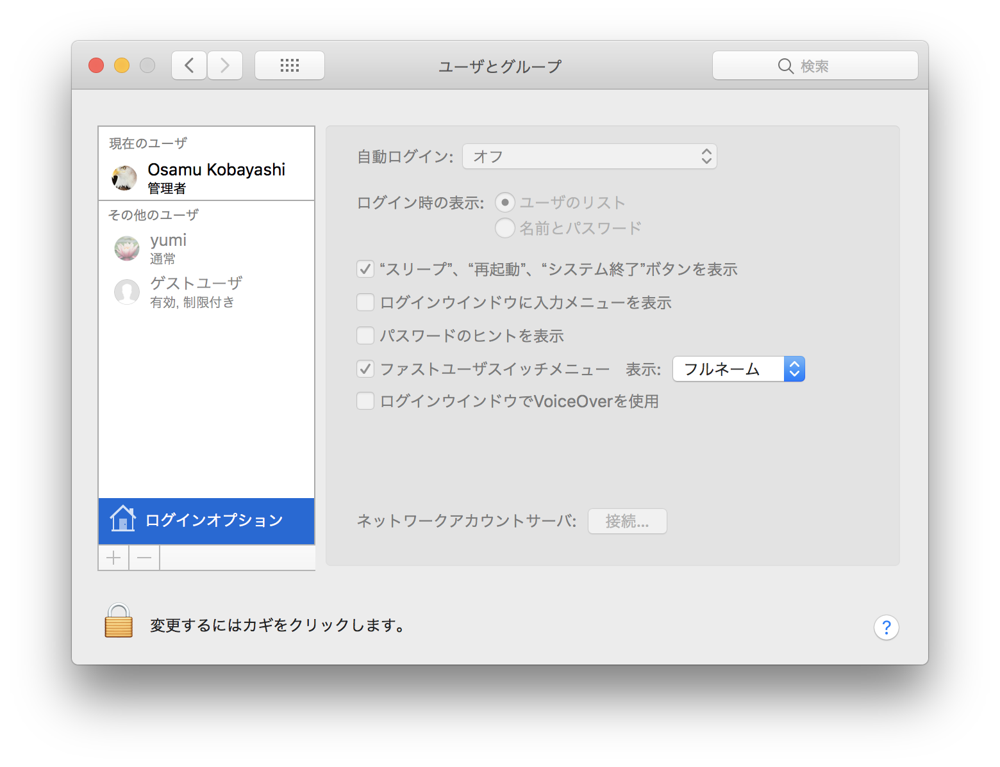
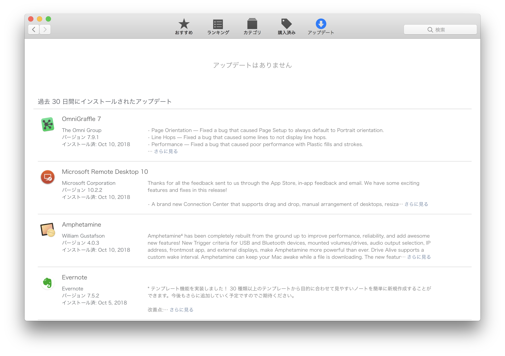
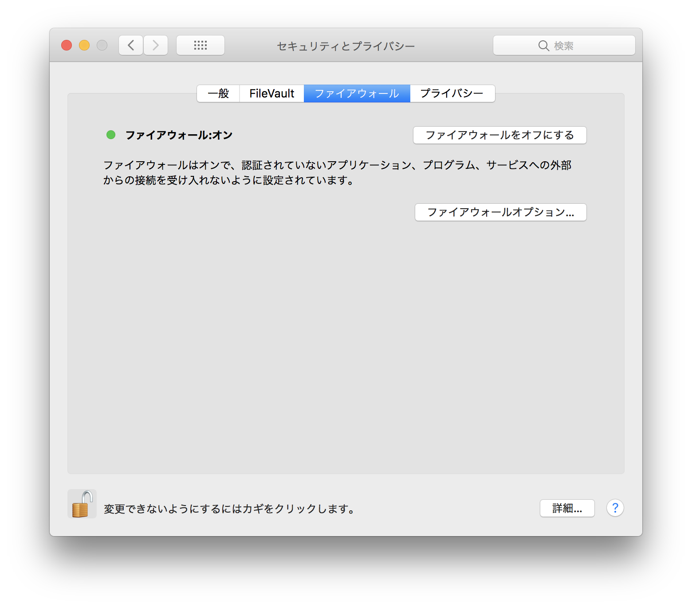
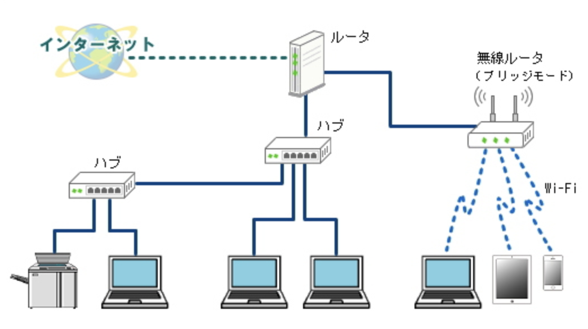
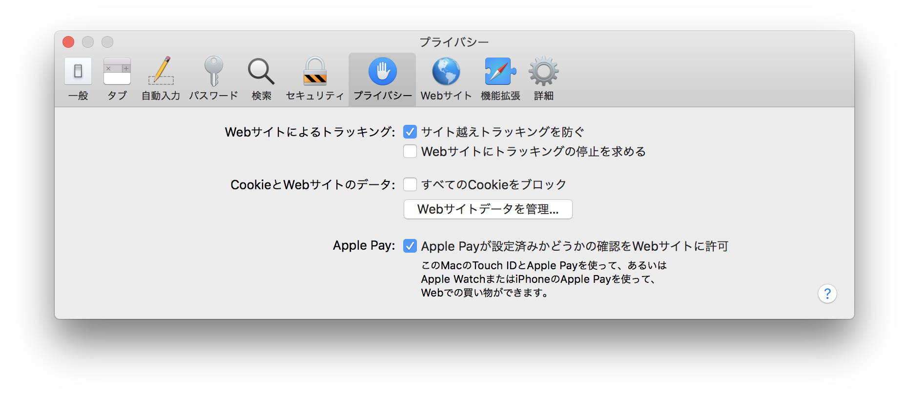

<!--
YouTube 
2020
https://www.youtube.com/playlist?list=PL_g66qvNMUfSeBQvg6IsVBnvMzEvG3hPu
2021
https://www.youtube.com/playlist?list=PL_g66qvNMUfTi41G75an3JwffeJMeVcV3
-->

# コンピュータ演習 <!-- omit in toc --> 

    09.情報リテラシー

# 目次<!-- omit in toc -->
1. [前回のおさらい](#前回のおさらい)
2. [今日の内容](#今日の内容)
   1. [情報リテラシー](#情報リテラシー)
   2. [情報リテラシーの進め方](#情報リテラシーの進め方)
   3. [Lesson3 不正アクセスを防ぎましょう](#lesson3-不正アクセスを防ぎましょう)
   4. [練習問題解説](#練習問題解説)
3. [タイピングの基本(再掲)](#タイピングの基本再掲)

# 初めに<!-- omit in toc -->

---
1. 席自由とします。
2. モニタの電源を入れて下さい。資料がみれます。

## HPの資料<!-- omit in toc -->

https://sammyppr.github.io/

に置きます。これは学外からも閲覧可能です。予習復習にはもちろん、あれなんだっけー？みたいな時に利用してください。

# 前回のおさらい

1. レポートについて
   - Microsoft 365/ Office 2021 違い
   - Microsoft Editor
   - 演習という授業について
   - レポートとは？
   - レポート書き方講座
   - フォーマットについて
2. タイピング

---
### 教科書で利用するファイルのダウンロード(再掲)
http://noa-prolab.co.jp/download/

にいって、「パソコン教育」-「Office基礎と情報モラル Office365・Office2019対応」からダウンロードしましょう。

動画あります。
[ダウンロード](https://www.youtube.com/watch?v=4OK8d9HC_ww)

---
### フォルダの保存場所(再掲)<!-- omit in toc -->
このファイルは、教科書終わるまで利用します。わかりやすい場所に保存しておきましょう。

- 書類フォルダに
- 「コンピュータ演習」フォルダを作成
- その中に解凍したフォルダを保存

が良いと思います。

# 今日の内容
シラバスでは
> Section2 「Word」STEP2 文書を作成しましょう 
 Lesson1 チラシを作成しましょう チラシの作成で必要となるWordの操作方法を学修することにより，情報アウトプット(文書作成)の基礎的な能力を身につける。

ですが、終わっています。
情報リテラシーの方を進めていきましょう。

## 情報リテラシー

---
### 初回
コンピュータを全員持ってきている訳ではなかったので、初回に
#### STEP1 セキュリティを高めましょう
##### Lesson1 コンピュータウイルスを防ぎましょう
##### Lesson2 スパイウェアを防ぎましょう

をやってみました。P.250-258ページにあたります。

## 情報リテラシーの進め方

---
### 講義形式?
講義形式で情報リテラシーを教えると、ほぼ聞いてくれません(泣)。
ということで、去年からリアルタイムで内容をWordでまとめてもらうと言うことを始めました。

Wordのレポート作成機能に慣れてもらう、と言う意味もあります。

タイピングのスピードなど人それぞれだと思いますので、重要なポイントをまとめていきましょう。

---
### と言うことで今日の課題は
- レポートタイトル「Lesson3 不正アクセスを防ぎましょう」
- 内容を重要なことを中心にレポートとしてまとめよう
- 表紙必須
- 余白：やや狭い　行数：30行
- 見出しも入れよう。
- ページは表紙に入れず、2枚目に1を入れよう。

まず、表紙・ページ設定を行なってみましょう。

## Lesson3 不正アクセスを防ぎましょう

---
### 不正アクセスとは?
許可されていないコンピュータシステムに侵入することです。
不正アクセス禁止法により、不正アクセス行為は禁止されています。

---
### クラッカー
不正アクセスをして、悪意を持って
- データを破壊する
- 改ざんする
- 盗んだ情報を悪用する
ことを「クラッキング」といい、そのような行為をする人を「クラッ
カー」といいます。

---
### ハッカー
似たような単語に「ハッカー」があります。
もともとハッカーは
> コンピュータなどについて常人より深い技術的知識を持ち、その知識を利用して技術的な課題をクリアする人々

と定義されていましたが、その知識を使って悪いことをする人もハッカーと呼ばれたりもします。

今は、コンピュータを
- ハッカー 深い技術的知識をもとに使いこなす人
- クラッカー 技術的知識をもとに悪事をはたらく人

と使い分けようという試みがなされています。(あまりうまくいってないけど...)

---
### 不正アクセス禁止法
2000 年に施行された「不正アクセス行為の禁止などに関する法律」が正式名称です。

- 不正に利用したり利用できる状態にすることに対する処罰
- 第三者に ID, パスワードなどを提供することに対する処罰
- 管理者に対して不正サクセスされないよう常に適切な管理処置を講ずる努力義務
- 
などが書かれています。

---
### 不正アクセスによる被害
- コンピュータのデータを盗まれる、破壊される、改ざんされる
- 勝手にメールやファイルを外部に送信される
- 特定のコンピュータを工芸するための踏み出しとして利用される

---
### 不正アクセスの手段
- なりすまし (ID, パスワードを利用して他人になりすますこと)
- セキュリティーホールからコンピュータに侵入する

※ セキュリティーホール:ソフトウェアの欠陥によりセキュリティが脅かされている不具合

---
### ユーザーアカウント制御
ID,Password を設定しておかないと、誰でも利用できる状態となります。

また、学生はアクセスできないが、教員はアクセスできる、のような制御も必要となります。

---
### Mac でのアクセス管理
一人で利用しているとわからないかもしれませんが、Macでは複数人数で利用する環境が元々備わっています。

システム環境設定-ユーザとグループを見てみましょう。 
- 管理者
- ユーザ
- ゲストユーザ

でできることが変わります.

---
### ユーザとグループ

---
### セキュリティーホールをふさぐ
セキュリティーホールはソフトウェアの欠陥です。

定期的に修正されたパッチファイル (Windows では「更新プログラム」 と呼ぶ) が配布されますので、アップデートするようにしましょう。

---
### Mac の場合

---
### ファイアウォールの有効活用

#### ファイアウォール
> 防火壁の意味で外部からの攻撃、あるいはコンピュータからの情報の流出を防ぎ、コンピュータを守る役目 を果たすハードウェアまたはソフトウェアのこと

ただし、アプリケーションが利用するところは開けておかないと、アプリケーションが正しく動作することができなくなります。

---
### Mac の場合

---
### ルータの利用
ルータ (router) は、異なるネットワークどうしをつないで道先案内人を するものです。

異なるネットワークがある場合、外部からは内部のネットワークの状況が見えにくくなるため、セキュリティが高くなります。

---
### ルータの利用によるネットワークの分割

---
### ブラウザの設定-ID, パスワードの保存
コンピュータに ID, パスワードを保存すると
- 便利 (自分の Mac なら OK)
-  なりすまされる (506 の Mac では NG)

ということになります。気をつけましょう。

---
### ブラウザの設定-Cookie
ホームページの製作者は、訪れた人のブラウザに Cookie と呼ばれる情報を残すことができます。

- 長所： ホームページの用意する便利な機能(ログイン等)が利用できる
- 短所： 悪意のあるホームページが悪意のある情報を蓄積することができる

信頼できないホームページの Cookie は削除しておいた方がよいかもしれません。

---
### Mac の場合

---
### パスワードの管理
- 8 文字以上を使う
- 数字・記号・大文字・小文字を組み合わせる
- ID と同一にしない
- 名前、電話番号、誕生日など利用しない
- 辞書に載っているような単語は利用しない
- メモして貼らない
- 他人に教えない
- 入力の際に人に入力しているところを見られない
- 過去に使ったパスワードと同じものを使わない

---
### パスワードの管理:国の方針変更
過去においては、「定期的にパスワードを変更しなさい」と言われてきましたが、それが撤回されました。

記事をみてみましょう。

[不要になったパスワードの定期変更と管理のあり方](https://japan.zdnet.com/article/35118794/)

---
### パスワードが漏洩したかどうか
最近「Firefox Monitor」というサイトができました。

あなたの利用しているメールアドレスを ID とした情報漏洩があったかどうかを確認することができます。

ググって、確認してみましょう。

[Firefox Monitor](https://monitor.firefox.com/)

---
### ソーシャルエンジニアリング
コンピュータをクラッキングするために、人間の心理などを利用して弱点を突く社会的な手口の総称です。

振り込め詐欺とかはよい例だと思います。

---
### ソーシャルエンジニアリング手口
- トラッシング： 廃棄されたコンピュータやゴミから情報を取り出す
- 構内侵入： 関係者を装ったりIDカードなどを偽造して内部に侵入
- のぞき見： パスワード入力中の手元やパスワードを書いた紙などを覗き見
- なりすまし： 公共サービスの関係者を装って、ユーザから情報を聞き出す
- Web Spoofing： 懸賞サイトなどと偽って個人情報を入力させる
- 個人情報を聞き出す： 同窓会名簿を作成する・アンケートなどと偽って個人情報を聞き出す

---
### ソーシャルエンジニアリング対策
- 個人情報や重要な情報に関する問い合わせがあれば、相手をよく確認する
- 周囲に相談する
- ログオンしている間は席を離れない
- 重要なメモや書類はシュレッダーにかける
- ハードディスク等のメモリメディアは物理的に破壊してから捨てる

---
### フィッシング詐欺
> メールや Web ページを通じて、ユーザの個人情報やパスワードなどを漏洩させる詐欺行為。

差出人や URL を確認して、不用意に個人情報を入力しない

## 練習問題解説

---
### 
ちょっと時間置いたので、P.250-267全て説明します。

---
### 練習25-I(P.255)
1. ○ 知人のメールが乗っ取られているかもしれません。確認しましょう。
2. × 感染が疑われたらすぐにネットから切り離しましょう。
3. × 個人でも感染することがあります。
4. ○ ウイルスチェックサービスをすり抜ける迷惑メールもあります。
5. × ゲームのフリをしているウイルスの可能性があります。

---
### 練習25-I(P.255)

6. × 電源コードからはウイルス感染しません。
7. × 嘘の内容を記載したウイルスの可能性があります。
8. × ウイルス定義ファイルが古ければ感染の恐れがあります。
9. ○ 画面表示がおかしくなるウイルスがあります。
10. × .doc, .docx などでもウイルスの可能性があります。

---
### 練習25-II(P.256)
1. 1
2. 1
3. 2
4. 1
5. 1
6. 1
7. 2
8. 2
9. 2
10. 1

---
### 練習25-II 補足
5. まずはシステム管理者 (情報センター) に
6. ウイルスをばらまいて他のコンピュータが利用できなくなれば器物損壊罪に問われます。
7. 文字化け、という可能性もあります。
8. ウイルス定義ソフトに登録されていない新しいウイルスも存在の可能性は排除できません。
9. テキスト形式では実行できないため、感染の恐れがありません。

---
### 練習26 I(P.258)
1. × スパイウェアは害があります。
2. ○ 動作がおかしい場合にはウイルス対策ソフトでスキャンしてみよう。
3. × 気づいたら登録されている検索バーはスパイウェアの可能性が高 いです。
4. × 確かに動作が遅くなりますが、危険です。
5. ○ 使用条件にスパイウェアをインストールすることが明記されていることがあります。
6. × 標準ではない安心できる対策ソフトを入れたほうが良いです。

6 について windows の話ですが、 教科書の説明だとこうなります。

---
### Windowsのウイルス対策の必要性
[Windows10＆11にはいらない？セキュリティソフトの必要性を目的別に解説](https://news.mynavi.jp/securitysoft/necessity/)

---
### 練習26 II(P.258)
1. 2
2. 2
3. 2 判断が難しいものがあります。
4. 1 頻度と時刻を設定できます。
5. 2

---
### 練習 27-I(P.267)
1. × 生年月日など他人に推測されやすいパスワードは厳禁です。
2. ○ パスワードをめもするのは危険です。どうしてもメモしておきたいならば、コンピュータとは別の安全な場所に保管しましょう。
3. ○ システム管理者がパスワードを尋ねることはまずありえません。ほかの人にも注意を促すためにも、スステム管理者に連絡してください。
4. ○ 最近多くなっているフィッシング詐欺の典型的な例です。メールにあるアドレスは偽のホームページにジャンプする可能性もありま 。念を入れて確認しましょう。

---
### 練習 27-I(P.267)
5. × フォーマットしても、特定のソフトウェアを使用すればデータは読み取ることができます。
6. × この行為は不正アクセスに該当します。
7. × まず、相手の素性を確認すべきです。また、他人の情報を本人に断らずに教えてはいけません。
8. ○ 個人情報を変更する画面で、ID とパスワードを入力させないのは疑わしいと言えます。

---
### 練習 27-II(P.267)
ア：5,  イ：10,  ウ：3,  エ：4,  オ：8,  カ：2,  キ：11

### 提出
今日作成したレポートをmanabaのレポートから提出してください。

# タイピングの基本(再掲)

---
### e-typing
- e-typingのアカウント作成がおわっていない人は作成しましょう。
- 200を目指しましょう。
- ホームポジションを確実に覚えましょう。
- e-typingの基礎練習をしっかりやって、場所を覚えよう
- ひらがな・単語に慣れていこう

[e-typing](https://www.e-typing.ne.jp/)
[レベルはどうなってるの？](https://www.e-typing.ne.jp/help/015.asp)

---
### タッチタイピングの基本
- ホームポジションを忠実に守る
- ホームポジションから動いたら、必ずホームポジションに戻る
- 下を見ない

e-typingでは
> どの指を使ってどのキーを押すか

を示してくれます。正しい指を使いましょう。そして、必ずホームポジションに戻りましょう。

---
### ホームポジション
F,Jにポッチがついているのわかりますか？
ここに人差し指がきます。

(まれにD,Kにポッチがついているキーボードもあります)

---
### 攻略法
- キーの位置を覚える
  - 練習メニューの基礎練習を使って
    - 中段左手・中段右手・中段全部
    - 上段左手・上段右手・上段全部
    - 下段左手・下段右手・下段全部
    - 全部のキーを制覇
  - 基本練習を使って
    - 50音に慣れる
    - 単語に慣れる
  - 応用演習を使って
    - 色々な文章に慣れる

---
### 最初はイライラするけど

キーボードの位置を覚えるのに役立つツールは「タオル」です。

強制的にキーボードを見えなくします。その状態で、基礎練習をすれば必ず場所を覚えることができます。

---
### 焦らないで！
コンピュータ演習の授業時間内だけではなかなか覚えられませんが、1日10〜15分はやって欲しいです。

もっと時間をかけてくれれば(1〜2時間)、1週間で学ぶことも可能です。
- 集中してまずは場所を覚えることに専念
- 場所を覚えてから徐々にスピードアップ

が一番良いと思います。

---
### やってみよう
基礎練習を（可能であればタオルを手にかけて)やってみましょう。

最後、トップページから腕試しレベルチェックを行なってmanabaのアンケートから提出して下さい。

# 終わり<!-- omit in toc -->

