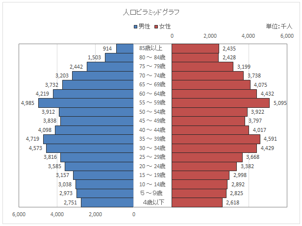

<!--
YouTube 
2020
https://www.youtube.com/playlist?list=PL_g66qvNMUfSeBQvg6IsVBnvMzEvG3hPu
2021
https://www.youtube.com/playlist?list=PL_g66qvNMUfTi41G75an3JwffeJMeVcV3
-->

# コンピュータ演習 <!-- omit in toc --> 

    17.Excel グラフ 複合グラフ

# 目次<!-- omit in toc -->
1. [前回のおさらい](#前回のおさらい)
2. [今日の内容](#今日の内容)
   1. [code.org](#codeorg)
3. [タイピングの基本(再掲)](#タイピングの基本再掲)

# 初めに<!-- omit in toc -->

---
1. 席自由とします。
2. モニタの電源を入れて下さい。資料がみれます。

## HPの資料<!-- omit in toc -->

https://sammyppr.github.io/

に置きます。これは学外からも閲覧可能です。予習復習にはもちろん、あれなんだっけー？みたいな時に利用してください。

# はじめに

---
### 前回のおさらい
グラフの基本をやりました。

終わっていない人は、引き続き、終わった人は複合グラフをやっていきましょう。

---
### manabaレポート提出について
履修者結構いるはずなんですが、回数を重ねるごとにどんどん提出率が悪くなっています。

しっかり毎回提出していきましょう。

---
### 情報倫理テスト
得点取れていない人、取れるまでやらせます。

-10以下だった人、再テスト対象です。

Excel終わって、AIに入ったあたりでやります。

---
### 教科書で利用するファイルのダウンロード(再掲)
http://noa-prolab.co.jp/download/

にいって、「パソコン教育」-「Office基礎と情報モラル Office365・Office2019対応」からダウンロードしましょう。

動画あります。
[ダウンロード](https://www.youtube.com/watch?v=4OK8d9HC_ww)

---
### フォルダの保存場所(再掲)
このファイルは、教科書終わるまで利用します。わかりやすい場所に保存しておきましょう。

- 書類フォルダに
- 「コンピュータ演習」フォルダを作成
- その中に解凍したフォルダを保存

が良いと思います。

# 今日の内容
シラバスでは
> 【第17回】 Section3 Excel/STEP2 表を作成しましょう/Lesson3 計算しましょう

どんどん先に行きます。

---
### 今日の範囲
P.172-176をやっていきます。

複合グラフの作り方について学びます。

---
### 課題
- P.172-176まで練習20,21を含めてやってみよう
- タイピングもいつも通り

わからないときには動画を見てみましょう。

---
### 早く終わった人
人口ピラミッドのグラフを自分でググりながら、データもダウンロードして作って見ましょう。

# タイピングの基本(再掲)

---
### タイピングの重要性(追加)
就活の内定決まった学生が

> 4月までに寿司打で平均キータイプ数5.6以上出せるようになってね

と言われたそうです。
4年になってあたふたしないように、今からスキルを上げていきましょう。

- [寿司打](http://typingx0.net/sushida/)

---
### e-typing
- e-typingのアカウント作成がおわっていない人は作成しましょう。
- 200を目指しましょう。
- ホームポジションを確実に覚えましょう。
- e-typingの基礎練習をしっかりやって、場所を覚えよう
- ひらがな・単語に慣れていこう

[e-typing](https://www.e-typing.ne.jp/)
[レベルはどうなってるの？](https://www.e-typing.ne.jp/help/015.asp)

---
### タッチタイピングの基本
- ホームポジションを忠実に守る
- ホームポジションから動いたら、必ずホームポジションに戻る
- 下を見ない

e-typingでは
> どの指を使ってどのキーを押すか

を示してくれます。正しい指を使いましょう。そして、必ずホームポジションに戻りましょう。

---
### ホームポジション
F,Jにポッチがついているのわかりますか？
ここに人差し指がきます。

(まれにD,Kにポッチがついているキーボードもあります)

---
### 攻略法
- キーの位置を覚える
  - 練習メニューの基礎練習を使って
    - 中段左手・中段右手・中段全部
    - 上段左手・上段右手・上段全部
    - 下段左手・下段右手・下段全部
    - 全部のキーを制覇
  - 基本練習を使って
    - 50音に慣れる
    - 単語に慣れる
  - 応用演習を使って
    - 色々な文章に慣れる

---
### 最初はイライラするけど

キーボードの位置を覚えるのに役立つツールは「タオル」です。

強制的にキーボードを見えなくします。その状態で、基礎練習をすれば必ず場所を覚えることができます。

---
### 焦らないで！
コンピュータ演習の授業時間内だけではなかなか覚えられませんが、1日10〜15分はやって欲しいです。

もっと時間をかけてくれれば(1〜2時間)、1週間で学ぶことも可能です。
- 集中してまずは場所を覚えることに専念
- 場所を覚えてから徐々にスピードアップ

が一番良いと思います。

---
### やってみよう
基礎練習を（可能であればタオルを手にかけて)やってみましょう。

最後、トップページから腕試しレベルチェックを行なってmanabaのアンケートから提出して下さい。

# 終わり<!-- omit in toc -->

