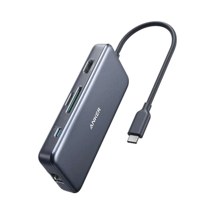

<!--
YouTube 
2020
https://www.youtube.com/playlist?list=PL_g66qvNMUfSeBQvg6IsVBnvMzEvG3hPu
2021
https://www.youtube.com/playlist?list=PL_g66qvNMUfTi41G75an3JwffeJMeVcV3
-->

# コンピュータ演習 <!-- omit in toc --> 

    26-28. PowerPoint発表 + AI,DS テスト

# 目次<!-- omit in toc -->
- [25回の補足](#25回の補足)
- [今日の内容](#今日の内容)
    - [今後の予定](#今後の予定)
  - [発表について](#発表について)
    - [外部モニタ](#外部モニタ)
    - [発表者ツール](#発表者ツール)
    - [発表中のツール](#発表中のツール)
    - [発表していきましょう](#発表していきましょう)
  - [AI・DSテスト](#aidsテスト)

# 初めに<!-- omit in toc -->

1. 席自由とします。
2. モニタの電源を入れて下さい。資料がみれます。

## HPの資料<!-- omit in toc -->

https://sammyppr.github.io/

に置きます。これは学外からも閲覧可能です。予習復習にはもちろん、あれなんだっけー？みたいな時に利用してください。

### manabaレポート提出について<!-- omit in toc -->
履修者結構いるはずなんですが、回数を重ねるごとにどんどん提出率が悪くなっています。

しっかり毎回提出していきましょう。

### 教科書で利用するファイルのダウンロード(再掲)<!-- omit in toc -->
http://noa-prolab.co.jp/download/

にいって、「パソコン教育」-「Office基礎と情報モラル Office365・Office2019対応」からダウンロードしましょう。

動画あります。
[ダウンロード](https://www.youtube.com/watch?v=4OK8d9HC_ww)

### フォルダの保存場所(再掲)<!-- omit in toc -->
このファイルは、教科書終わるまで利用します。わかりやすい場所に保存しておきましょう。

- 書類フォルダに
- 「コンピュータ演習」フォルダを作成
- その中に解凍したフォルダを保存

が良いと思います。

# 25回の補足
Finderのラベルも便利です。

- [キーボードショートカットを使ってMacのFinderでタグ（ラベル）付けする方法](https://shimesan.com/2019/12/07/mac-finder-tag-keybord-shortcuts/)

# 今日の内容
シラバスでは

> 【第27-30回】Section4 PowerPoint/STEP3 発表しましょう

の部分とAI,DSのテストを行なっていきます。

### 今後の予定
- 26回目：PowerPoint発表, 第1講-第3講 30問 ドリル＆テスト
- 27回目：PowerPoint発表, 第4講-第6講 30問 ドリル＆テスト
- 28回目：PowerPoint発表, 第7講-第8講 20問 ドリル＆テスト
- 29回目：Excelテスト
- 30回目：再テスト(29回目でクリアした人はなし)

Excelテストでわからないことがある人は質問してくださいね。

## 発表について
### 外部モニタ
ノートパソコンは液晶ディスプレイの他に外側のモニタ(プロジェクタ等)と接続することができます。

最近のMacではHDMI端子が標準搭載されていないため、USB-C / HDMI 変換やUSB-Cハブが必要となります。

### USB-C ハブ<!-- omit in toc -->
例えば、ANKER PowerExpander+ 7 in 1 (7,190円)

機能を限れば、もっと安いものもありますが、多機能HUBを持っておくと、何かと便利です。

### 2画面以上の場合<!-- omit in toc -->
Macでは自動的に認識しますが、次の設定が可能となります。
- 画面のミラーリング
- 画面の拡張

**ミラーリング**では、液晶ディスプレイと外部モニタに同じものが表示されます。
一方、**画面の拡張**では、別のエリアとして利用することができます。

- メニューバーのコントロールセンター
- システム環境設定のディスプレイ

から設定ができます。

[winの場合](https://www.eizo.co.jp/support/compati/monitor/multimonitor/win10/index.html)

### Excelと外部モニター<!-- omit in toc -->
Excelではスライドショーを開始すると画面がミラーリングでも、自動的に
- 液晶モニタでは発表者ツール
- 外部ディスプレイがスライド

の様になります。これを経験しておきましょう。

### 発表者ツール
- 現在の時間 / 経過時間
- ノート
- 次のスライド
- スライド全体のサムネイル

が表示されます。

### 発表中のツール
また、
- レーザーポインター
- ペン
- 蛍光ペン

を使うこともできます。

### CC(すごっ)<!-- omit in toc -->
しゃべった言葉、文字起こししてくれるみたい...(実験します...うまくいけば...)

### 発表していきましょう
1人持ち時間3−4分(入れ替え込みで5分)です。

それでは学籍番号順にやってみましょう。
余裕ある人は、レーザーポインター・ペン・蛍光ペンとか使ってもOKです。

## AI・DSテスト
本番の解答回数は1回のみです。
少しドリルをやってからトライしましょう。

- 26回目：第1講-第3講 30問
- 27回目：第4講-第6講 30問
- 28回目：第7講-第8講 20問

