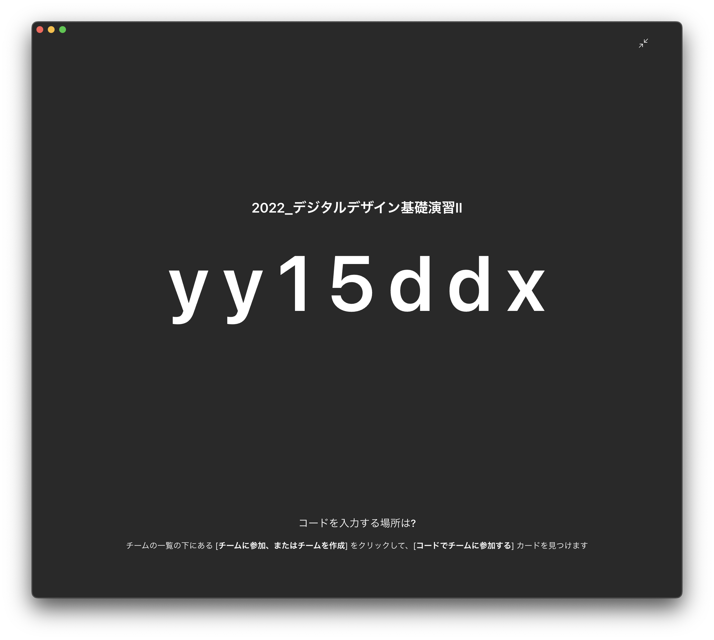

# デジタルデザイン基礎演習 第2ターム 
> 1. Illustrator復習<!-- omit in toc -->

# 目次<!-- omit in toc -->

1. [Illustrator 基本操作の復習](#illustrator-基本操作の復習)
   1. [ワークスペース](#ワークスペース)
   2. [新規](#新規)
   3. [画面操作](#画面操作)
   4. [オブジェクトの作成・操作・複製](#オブジェクトの作成操作複製)
   5. [レイヤー・グループ化・ロック](#レイヤーグループ化ロック)
   6. [整列・分布](#整列分布)
   7. [パスファインダー](#パスファインダー)
   8. [定規・ガイド](#定規ガイド)
   9. [テキスト](#テキスト)
2. [今日の課題](#今日の課題)

# 初めに<!-- omit in toc -->

## クラス間違えてない？<!-- omit in toc -->
ホワイトボード見て、クラス間違えていないか確認しましょう。

## デジタルデザイン基礎演習について

---
### デジタルデザイン基礎演習I,IIの位置付け
デジタルデザイン基礎演習では基本的に 
> 1 年を通して コンピュータを利用したクリエイティブ作業に慣れ親しんでもらう
> 
ということを目標にしています。

---
### クリエイティブ作業
おおまかに二つの側面に分けられると思います。
- 何を作るか考える力
- 実際に制作する技術

この二つの違いを意識するようにしましょう。

---
### 例えば
鉛筆で文字書けない人はいないでしょう。

でも、小説書ける人は少ないでしょう。

このように、クリエイティブな作業には二つの側面があります。

---
### デジタルデザイン基礎演習I
デジタルデザイン基礎演習I においては山本・田畑・中村先生に
- Mac の基本操作方法
- デザイン基礎
- Illustrator・Photoshop の使い方

を学んだかと思います。

---
### 後期は
- 映像(音)
- ホームページ
- +α？

を中心に慣れ親しんでもらおうと考えています。

---
### キーワード
キーワードとしては
- 映像制作
- 映像合成
- モーショングラフィックス
- アニメーション制作
- ホームページ

を想定しています。

---
### あくまで入門
1 年生のうちに、いろいろなことができることを体感してもらうのが趣旨です。

「面白い!やってみたい!」と思ったら、演習と関係なく、どんどんいろんなソフトに触ってみてください。わからないことがあったら可能な範囲で教えます。

---
### 2年生になると
- 造形デザイン
- グラフィックデザイン
- 映像デザイン
- 情報デザイン

の4つの柱に分かれていきます。(複数選択可)
自分が何に興味を持っているか何を見付けたいかを1年の後期の間に明確にしていきましょう。

## その他注意事項

---
### 506演習室利用においての注意事項
[506演習室利用においての注意事項](./dd2_506_caution.md)

意図としては
1. なるべくたくさん使ってもらって、スキルを上げてほしい
2. みんなが利用しやすい環境をみんなで守ろう・つくろう

ということですね。自由な中でも最低限のルールは守りましょう。

---
### 最近の悩み
- 椅子がどっか行き過ぎ
- マウスがたまになくなったりする
- キーボードのケーブルもたまになくなったりする

気をつけましょう。

---
### ネットワークについて
[ネットワークについて](./dd2_about_network.md)

---
### iMacでの作業について
iMacで作業する時は次のようにしましょう。
1. 書類フォルダの中に**学籍番号**のフォルダを作成
2. ファイルは全てこの中に保存

夏休み・冬休みなどにメンテナンスで削除することはありますが、授業期間中に削除されることはありません。

それ以外に保存したもの(例えばダウンロード)は、不定期に削除される可能性があります。

---
### 資料について
コンピュータ演習で1組の人はもう知っていると思いますが、学外からも閲覧できるように以下のURLに資料をおいています。

https://sammyppr.github.io

ブラウザにブックマークしておくと良いでしょう。

---
### Teams
コロナなどのことを考えると、Teamsのチームを作成しておいた方が良いと思うので、参加してください。

---
### 就活状況
最近就活の日程が繰り上がっています。

クリエイティブな業界を目指す人は、ポートフォリオが3年の夏には必要にな場合もありますので、どんどん作品制作していきましょう。

---
### 506にある気になる?もの
3Dプリンタ・液晶タブレット・VR・ドローン・撮影機器などいろいろなものがおいてあります。

使える状況だと教員が判断すれば、自由に使って構いません。作品制作に役立ててください。

# デジタルデザイン基礎演習II<!-- omit in toc -->
> 第2ターム：モーショングラフィックス

## 進め方<!-- omit in toc -->

---
### シラバス
- 【第１回】Illustrator復習 Illustratorの基本操作を復習する。
- 【第２回】キーフレームアニメーション入門 キーフレームを用いたアニメーションの基礎について学修する。
- 【第３回】シェイプアニメーション入門 ベクトルデータを使ったシェイプアニメーションの基礎について学修する。
- 【第４回】3Dレイヤー入門 3D空間での操作を可能にする3Dレイヤーの基礎について学修する。
- 【第５回】自由課題 学修した内容をもとに自由課題に取り組む。

---
### GarageBand
前期に、昨年までやっていたGarageBandをやっていないようなので、2回目に入れる予定です。

---
### 評価方法
- 毎回の提出物
- 自由課題
- 他の人の自由課題を見たレポート

にて評価します。

# Illustrator復習<!-- omit in toc -->

## Illustrator覚えてますか？<!-- omit in toc -->

---
### Illustrator基本操作 次の操作できますか？1

- 新規ドキュメントを A4 縦位置で開く
- 図形オブジェクトの描画、正方形を描く、正円を描く
- オブジェクトを選択、移動、削除する
- オブジェクトを複製、変形する (カット、コピー、ペースト)
- 塗りと線の色を設定 (変更) する
- 取り消し、やり直し (undo、redo)
- 重ね順を変更 ... 最前面へ、前面へ、背面へ、最背面へ
- リフレクトコピー (左右反転コピー、上下反転コピー)
- 縦横比を保ったまま拡大、縮小 (スケール) する
- 画面表示の拡大・縮小 (ズームイン、ズームアウト)

---
### Illustrator基本操作 次の操作できますか？2
- アートボード全体を表示する
- オブジェクトをアートボード中央に整列させる
- 1000px × 1000px のアートボードに、500px × 500px のガイドを作成
- 文字を打つ、テキストオブジェクトのアウトライン化を行う
- パス化したオブジェクトに色を付ける (塗り)
- クリッピングマスクを作成して画像をマスキングする
- 画像をリンク画像として配置する
- 保存先を確認して別名で保存する
- 背景の透過処理
- 複数のオブジェクトをグループ化、グループ解除
- オブジェクトのロック、ロック解除

---
### Illustrator 応用操作 次の操作できますか？
- オブジェクト変形の繰り返し
- 回転を 45 度ずつ繰り返す
- ドキュメントのカラーモードを切り替え (RGB ⇔ CMYK)
- オブジェクトの線の太さを変更 (設定) する
- ワークスペースの初期化
- 定規を表示、ガイドラインの作成
- 複数の重なり合うオブジェクトの分割
- 前面へペースト、背面へペースト
- 複数のオブジェクトの分割、合体 
- 複数のオブジェクトの整列、分布
- 新規レイヤーを作成し、そのレイヤーにオブジェクトを移動
- 画像をハート型に切り抜く (クリッピングマスク)

---
### 身につけてほしいこと
Illustrator は後述する用途にもよりますが
- 基本的に使う機能
- より便利に使う機能
- 
とにわかれていると思います。

まずは基本的な機能を抑えて、必要に応じて便利な機能を使っていきましょう。
あまり使わない機能はできることだけ知ってれば OK かと思います。

できることがわかっていれば、その都度ググってやり方を調べればいいだけです。

---
### Illustrator 利用の目的
Illustrator 利用の目的は主に
- イラスト描画
- ロゴ等のパーツ作成
- 印刷等のためのデザイン
の 3 つに分かれます。

1 つ目はパスを高度に攻略する必要があります。2つ目もたまにパス使うかな...3つ目はそんなにパスは使いません。1つ目にトライしたい人 は、パスに慣れてください。鉛筆や筆のように利用できるまで練習しましょう。

---
### IllustratorとPhotoshopの使い分け
どう使い分けるんでしょう?基本自由ですが、
- 素材となる写真の加工を Photoshop
- 加工した写真や文章を配置してデザインするのが Illustrator
という風に考えて良いと思います。

# Illustratorでできること<!-- omit in toc -->

## パス<!-- omit in toc -->

---
### パスに慣れよう
- 選択ツール(黒い矢印)
- ダイレクト選択ツール(白い矢印)

この二つは役割が異なります。

パスを描くにはペンツールを基本的には利用しますが、パスを使いこな
すにはダイレクト選択ツールや、ショートカットを覚える必要があるで
しょう。

---
### 曲線の描き方のコツ
Illustrator ではベジエ曲線という方法で曲線を描いていきます。
- 接線を意識してどこにポイントを打つか?
- いかにポイント数を少なくするか

がわかってくるとかなり描きやすくなってきます。ちょっとホームページを見てみましょう。

- [ペンツールでベジェ曲線を描くコツはアンカーポイントの打ち方にあり！](https://cultureacademia.jp/illustrator/108/)

---
### 慣れが必要
Adobe が公開しているページに沿って、おさらいしてみましょう。

- [ペンツールで描くベジェ曲線をマスターする](https://helpx.adobe.com/jp/illustrator/how-to/draw-edit-curves.html)

## トレース<!-- omit in toc -->

---
### 画像トレース
ビットマップ画像を「トレース」という機能を利用するとベクター画像にすることができす。手書きのものをベクターデータ化するのに利用できます。LINE スタンプとかでやったかな...

1. 手書きのイラストなどを写真にとる (解像度を大きめに)
2. 必要に応じて、Photoshop でコントラストなどをしっかりつける
3. Illustrator に写真を配置
4. 「画像トレース」してから「拡張」
5. ダイレクト選択ツールを利用して修正

こういう風に取り込むことができる、ということを知っておきましょう。

---
### トレースの例
準備するビットマップ画像は解像度が高い(マス目がたくさんある) 必要があります。
- ホームページからもってきた解像度の低い画像
- 解像度の高い画像

の二つで比較してみてみます。

## レイアウトデザイン<!-- omit in toc -->

---
### レイアウトデザイン
画像や文章という素材があった上で、情報内容の重要性を資格的に表現
し、認識させるための**レイアウトデザイン**という考え方があります。一般的に「デザイン」というと、このことを指すことが多いかもしれませんね。

---
### レイアウト
**何をどこに、どのように配置するか**がレイアウト、という考え方です。雑誌・広告・ポスター・Web・アプリなどありとあらゆるところで利用されます。

- [レイアウトとは？意味を分かりやすく解説](https://saruwakakun.com/design/tips/what-is-layout)

# Illustrator 基本操作の復習
基本のおさらいをしてみましょう。

## ワークスペース

---
### ワークスペースについて
動画とパネルの**位置が違う・ない**等の質問がよくあります。

Adobe のソフトの場合には、ワークスペースという考え方でそれらを管理しています。「ウィンドウ」-「ワークスペース」-「初期設定のリセット」とするとデフォルトになります。
それでも出てこない場合には、ウィンドウメニューから該当するパネルを選択してください。

---

## 新規

---
### 新規書類の作成
利用目的がはっきりしている場合、それに基づいて新規書類を作成しましょう。

- 雑誌 (A4?)
- 広告 (A1?)
- Web (1920?)
- 映像 (HD?4K?)

サイズを最初に指定するため、何のために使うかについてよく考えて選択しましょう。
基本はプリセットか選べば良いと思います。

---
### 印刷物のサイズ
ノート等は A4,B5 などのサイズですね。これは大きくわけて A 列と B 列と呼ばれる基準となる原紙のサイズがあって、それをどのくらい切ったものかで表されてます。

- [紙の寸法ABC♪用紙サイズがわかれば紙がもっと好きになる！楽しく覚える印刷用語](https://www.moriichi-net.co.jp/blog/youshi-size/)

---
### 映像のサイズ

- [動画サイズ（解像度）とは？　動画配信に関する動画サイズとアスペクト比の基礎知識](https://www.stream.co.jp/blog/blogpost-32396/)

---
### ロゴ等を作る時は?
Illustrator のプリセットに「アートとイラスト」とありますが、これも印刷物ベースで設定されています。

サイズ関係なく作りたい時は (ベクターは拡大縮小しても劣化しない)、変な話どれでも良いので、自分は A4 を使う時が多いです。

## 画面操作

---
### 実際の編集でなく
Photoshop でもそうですが、画面を拡大・縮小・移動はよく使います。操作はPhotoshop と一緒で

- 拡大 Command+Shift+「+」
- 縮小 Command+「-」
- 移動 スペースしてドラッグ

を利用します。テンキーがある場合は拡大の時に Command+「+」で十分です。

## オブジェクトの作成・操作・複製

---
### オブジェクト
Illustrator では Illustrator 上で扱う物体 (パス・画像・テキスト) のこと をオブジェクトといいます。

---
### パス
これは先ほど説明しました。ペンツール等で作成します。

---
### 基本的な図形
- 長方形ツール
- 楕円形ツール
- 多角形ツール
- スターツール
- 直線ツール
- ブラシツール
- 鉛筆ツール

で作成できます。

ツールを選択したあとクリックをキャンバス上ですると、オプションが出ることが多いです。

---
### 線と塗り
「パス」や「基本的な図形」で作成したオブジェクトには
- 線
- 塗り

という考え方があります。

線には太さがありますが、拡大縮小した場合、線の太さは変わりません。 太さも含めて拡大縮小させたい場合、 「オブジェクト」-「パス」-「パスのアウトライン」を行って、線がない状態にする必要があります。

---
### 画像
Illustrator ではビットマップ画像をファイルとして用意しておいて、リンク (指し示す) というやり方で配置します。

Illustrator のファイル (.ai) が不必要に大きくなることを避けるためです。

Illustrator で作業する時には作業用フォルダを作成して、その中に素材としての画像ファイルを置くことを徹底しましょう。そうでないと、簡単にどっかにいってしまいます。

---
### オブジェクトの移動
基本は選択ツールでドラッグすれば OK です。

水平・垂直・斜め 45 度などに移動したい場合には Shift キーを押しましょう。

---
### 複製
Mac の多くのソフトでは複製は Option を押しながらドラッグで行うことができます。

Illustrator のオブジェクトでも、Finder のファイルでも、Option を押す と複製されることを確認しましょう。

---
### 変形の繰り返し
意味的には正しくは**直前の操作の繰り返し**です。

一つ前の操作を繰り返す機能が「オブジェクト」-「変形」-「変形の繰り返し」です。Command+D です。複製する時によく使います。

---
### 複数オブジェクトの選択
Illustrator では複数のオブジェクトを選択することがよくあります。

- 選択ツールで同時に選択
- Shift キーを押しながら、追加していく

の二つの方法があります。

## レイヤー・グループ化・ロック

---
### レイヤーの概念
レイヤー・ロックに関しては基本的には Photoshop と同じです。ただし、グループ化というのは Illustrator にしかありません。

複数のオブジェクトを一つのオブジェクトとして扱うことができます。
- グループ化 Command+G
- グループ化解除 Shift+Command+G

レイヤーパネルでグループ化がどのようにみえるか確認してみましょう。

---
### レイヤーの中でのオブジェクトの重ね順
Photoshop と異なり、レイヤーの中に Illustrator では複数のオブジェクトを配置できます。

そのオブジェクトには前面・背面という重なり順があります。
レイヤーパネルで入れ替えててもいいし、オブジェクトを右クリックして「重ね順」から入れ替えることが可能となります。

---
### 階層化
オブジェクトは、レイヤーやグループ化を使って整理することができます。

階層化して考える方法はいろいろなソフトで利用するので慣れておきましょう。

---
### クリッピングマスク
画像を配置すると必ず長方形で表現されます。(透明情報がある場合は別ですが...)

レイアウトする上で、写真を円形や任意の形状にしたいことがあるでしょう。これを可能にするのがクリッピングマスクです。

Photoshop では白黒でマスクを作成しました。グレーだと半透明とかもできました。

Illustrator では基本的に形状を決定することしかできませ ん。ただし、オブジェクト全体に対して不透明度を設定することは可能です。

---
### クリッピングマスク
二つのオブジェクトを選択して、前面のオブジェクトで背面のオブジェクトの見える部分を決定することができます。

「オブジェクト」-「クリッピングマスク」-「作成」でできますが、よく使うので

- クリッピングマスクの作成 Command+7
- クリッピングマスクの解除 Option+Command+7

を覚えてもいいでしょう。クリッピングマスクを解除すると、色・塗りが元に戻らないので注意してください。

## 整列・分布

---
### 複数のオブジェクトの整列・分布
レイアウトする時には綺麗に並べることが必要となります。

整列パネルはよく使うので、慣れておきましょう。右下のオプションもよく使います。
- 選択範囲に整列
- アートボードに整列

はよく使います。... キーオブジェクトに配列ってのも増えてるな... 便利そうかも... 複数選択したあとに、基準となるキーオブジェクトをもう一度クリックすることで設定できるようです。

## パスファインダー

---
### 複数のオブジェクトから...
合成したり、分離したりして、異なる形状を作り出すことができます。

これも、パスファインダーパネルを見て、実験して、慣れるのが一番だです。

## 定規・ガイド

---
### 見えない線
レイアウトデザインにおいて見えない線を意識することはわりと重要です。

意識してレイアウトすることですっきりみせることができます。そのためには定規やガイドを使うとよいです。

---
### グリッドデザイン
Web でよく使われる手法ですが、最初にグリッドと呼ばれる線を引いておいて、それに合わせてデザインする手法です。

- [グリッドって万能！デザインがグンと良くなる15の理由まとめ](https://photoshopvip.net/83489)

---
### 定規(ルーラー)
Command+R で定規の表示・非表示ができます。

---
### ガイドの作成
作成には次の二つの方法があります。 
- 定規を表示して、そこからドラッグ
-  オブジェクトを選択して「表示」-「ガイド」-「ガイドを作成」

ガイドの表示・非表示は Command+; でできます。ガイドはロックして利用した方がいいでしょう。

自分は、ガイドを使う時にはガイド用のレイヤーを作成します。

## テキスト

---
### テキスト
文字ツール・エリア内文字ツールを使って文字を入力します。
- 文字ツール 普通に文字を入力できます。
- エリア内文字ツール 正方形などの長方形を用意しておいて、その中に文字を入力します。

---
### 字間・行間
レイアウトする上で、字と字の間の間隔は重要です。

文字を選択した上で、Option キーと矢印キーで調整することができます。

---
### テキストのアウトライン
文字ツールを使うと、Illustrator は 
- どんなフォントを使うか
- どんなサイズか
- どんな色か
- どんな文章か

等をデータとして持ちます。

フォントは使っているコンピュータによって利用できるものが異なります。そのため、他の人にデータを渡した時に、フォントがないと異なるフォントが使われてしまい、異なるデザインになってしまいます。そのため、テキストのアウトライン化を行います。

---
### いつアウトライン化する?
アウトライン化を行うとベクトルデータの図形に変換されます。

人にデータを渡す時にはアウトライン化した方が安全です。ただし、文章を後で打ち直すことができなくなります。

そのため、アウトライン化する前にそのレイヤーを複製しておいて、一つを非表示にしておいて、表示しているのをアウトライン化することで、 あとでの修正にも困らなくなります。

又は、ファイル複製して、アウトラインバージョンとテキストバージョンを保持しておくのも手です。

---
### トンボ (トリムマーク)
印刷物においては 
1. 印刷
2. 断裁

というステップを行います。

---
### 名刺の場合
例えば、名刺を考えましょう。名刺サイズの紙があってそこに印刷するわけではありません。大きな紙に名刺のデータを複数並べて印刷して、最後に名刺サイズに切っていきます。

断裁するときには1枚1枚切ると非効率ですから、複数枚重ねて一気にざっくり切っていきます。

すると、ずれが出てしまいます。ずれても良いようにデータを作成する必要があります。

---
### 塗り足し
具体的には、ずれて、白い部分が残らないように3mmほど外側までデータを作っておく方法となります。

- [塗り足しって？印刷で足りないと困る！作り方を解説](https://well-direct.com/blog/archives/20201225/2012/)

---
### トンボとアートボードの関係
最近、印刷所によってはデータの作成方法が変わっているようです。
実際に印刷する場合には、印刷所の入稿方法をよく確認するようにしましょう。

- [Illustratorのトンボの最新の作り方と使い道のない残念なトンボ](https://design-trekker.jp/design/illustrator/trim-marks/)

# 今日の課題

---
###
1. A4 サイズの新規文書を作成
2. 「Illustrator Test」というタイトルを適当なフォント・サイズでアウトライン化して上部に配置せよ
3. 同じ高さの正方形・円・六角形・星形を横に並べよ
4. 150mm x 150mm の正方形の印刷物を作るために、トリムマークを作成し、塗り足しを適当な色で作成せよ
5. 写真を適当に 9 枚選んで配置し、正方形の形にクリッピングマスクし、3 行 3 列でトリムマークの中に配置せよ

---
###
6. 複数のオブジェクトから、パスファインダーを使って異なる図形を作成せよ
7. ファイル名を**学籍番号+氏名.ai**として保存せよ
8. **ファイル - 別名で保存 / ファイル形式をPDF / プリセットを最小ファイルサイズ**にして**学籍番号+氏名.pdf**を書き出せ
9. **nas1-mc.thu.ac.jp**に接続して、**StudentVolume - 2022演習 - デジタルデザイン基礎演習II**の中の該当するフォルダ内に**学生番号_名前**のフォルダを作成し、そこにPDFファイルを提出