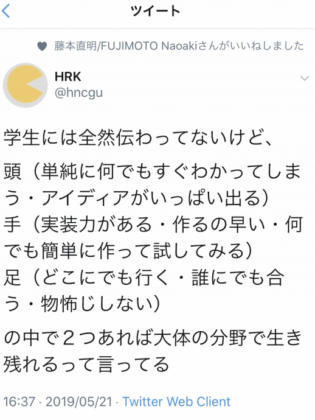

# 情報デザイン演習I 6.Webの構造化<!-- omit in toc -->
> 構造化言語としてのHTML、セマンティックコーディングについて学修する。

---
1. [これまで学んだこと](#これまで学んだこと)
2. [改めて学んでほしいこと](#改めて学んでほしいこと)
3. [4章で学ぶこと](#4章で学ぶこと)
   1. [文書をHTMLで構造化する](#文書をhtmlで構造化する)
   2. [HTML アウトラインを確認する](#html-アウトラインを確認する)
   3. [セマンティックコーディングをしていこう](#セマンティックコーディングをしていこう)
   4. [ページ全体のレイアウトとナビゲーションを配置する](#ページ全体のレイアウトとナビゲーションを配置する)
   5. [Webのレイアウトの基本「フロート処理」](#webのレイアウトの基本フロート処理)
   6. [ページのマージンとパディングを調整する](#ページのマージンとパディングを調整する)
   7. [まとめ](#まとめ)

# 前回のおさらい<!-- omit in toc -->
- CSSの実践
   - LINEの様なインターフェイスを作ってみよう
   - Web用の画像
   - 画像の作成
   - WebP
   - animate.css

# これまで学んだこと
- 基本的な HTML,HEAD,BODY の役割などを学んだ (最小限の HTML ファイル)
- HTML というタグについて学んだ
- CSS の概念について学んだ
- CSS におけるボックスモデルについて学んだ
- ブラウザの差異をなくすデフォルト CSS について学んだ
- 画像の利用方法・作成方法について学んだ

# 改めて学んでほしいこと

---
### この演習は
- この演習はタイピング練習ではない
- 一つ一つについて覚えろとは言ってない
- 考え方を学んでほしい

ということです。

最初は言われた通りに入力したら、言われた通りに表示された、でいいです。

でも、なぜそのように表示されたか、という理屈、考え方を身につけてほしいです。

---
### 今週から
教科書の4,5章をベースに新しい考え方を学んでいきます。

Webは、「素敵に見えてれば良い」というものではなく、SEO(サーチエンジン最適化)として、主にGoogleさんが巡回させているロボットに正しく情報を与える必要があります。

---
### Webの進化は早い
Webの仕様はニーズ(要求)に応じてどんどん進化していきます。

CSSの作成方法も去年までと異なる方法で教えざるをなくなりました。

既存の技術を覚えるだけでなく、考え方を学んでいき、新技術にも対応できる適応力が求められます。

---

---
### 実際のWeb仕事
ざっくりですが
#### Webディレクター
クライアントと話し合いながら方向性考える人

#### Webデザイナー
デザイン考える人

#### エンジニア・プログラマー・コーダー
ディレクターとデザイナーと共有しながら実際に制作する人

となります。

---
### Webディレクター
- インターネット・Webの仕組みが理解できる
- クライアントの要求が理解できる
- どう形にすればよいかアイディアを出しながらまとめられる

頭と足が必要ですね。

---
### Webデザイナー
- インターネット・Webの仕組みが理解できる
- クライアントの要求が理解できる
- デザインのアイディアが出る
- 形にするのが得意

頭と手が必要ですね。

---
### エンジニア・プログラマー・コーダー
- インターネット・Webの仕組みが理解できる
- とりあえずトライすることに躊躇しない
- わからないことがあればネットを調べたり、誰かに聞いたりとかしながら解決していく

手と足が必要ですね。

---
### いずれにせよ
- インターネット・Webの仕組みが理解できる
の部分が必要ですので、この演習で身につけてほしいと思います。

# 4章で学ぶこと

---
### 教科書ベース
教科書に沿ってこれから数回すすめていきます。(4,5章)
- 文書をHTMLで構造化する
- HTMLアウトラインを確認する
- セマンティックコーディングをしていこう
- ページ全体のレイアウトとナビゲーションを配置する
- Webレイアウトの基本「フロート処理」...これ以外にもFlexBox, CSS Gridにも触れます。

これまで触ってきたことをより体系的に利用し、学んでいきます。

P.244以降は小数点の嵐になるので、新しい方法で実装していこうと思います。

## 文書をHTMLで構造化する

---
### Webレイアウトと印刷物のレイアウトは何が違うのか？(P.138〜)

---
### セクションとアウトライン(p.140〜145)
P.40のコンテンツモデルを確認しましょう。

---
### 難しいですね...
うまいスライドがあったので見てみましょう。
[コンテンツ・モデルのおはなし](https://speakerdeck.com/atsuco/kontentumoderufalseohanasi)

## HTML アウトラインを確認する

---
### Chromeを使っているはずだけど...
VSCでLiveServer使うとSafariの人いますか？
そういう人は次を試してください。

1. VSCode の左から拡張機能を選ぶ
2. live で検索して Live Server を選ぶ
3. アンインストールの横の歯車を押す-拡張機能の設定
4. 「Live Server > Settings: Custom Browser」を「chrome」に

これでChromeが立ち上がるはずです。うまくいかなかったら呼んでください。

---
### HTML5文書のアウトライン(階層構造を確認する方法)(P.146)
「Chrome HTML5 Outliner」で検索してChromeに追加しましょう。
[HTML5 Outliner](https://chrome.google.com/webstore/detail/html5-outliner/afoibpobokebhgfnknfndkgemglggomo?hl=ja)

HTML5 Outlinerはサーバ上のファイルでないとうまく動作しないので、LiveServerとセットで利用しましょう。

---
### 今日利用するデータ
- ID_06フォルダを作成
- ダウンロードしたフォルダのChapter4の4-02から4-06をコピーしておこう

---
### ソースとアウトラインを確認しよう
P.147-P.159までLiveServerで
- Part4-02-HTML4-Sample-1.html
- Part4-02-HTML4-Sample-2.html
- Part4-02-HTML5-Sample-1.html
- Part4-02-HTML5-Sample-2.html
- Part4-02-HTML5-Sample-3.html
- Part4-02-HTML5-Sample-4.html

を開いて、なぜそのようになるか確認・考えてみよう。

---
### 考え方
HTML5.1ではH1,H2といった見出しでの階層構造も気にすることが推奨されています。が、HTML Living Standardではまだその記述がありません。

- 暗黙的なアウトライン
- 明示的なアウトライン

の双方をうまく利用するといいのかな、という状況ですが、正式な仕様決定が待たれるところです。

[HTML のアウトラインアルゴリズムが見出しレベルをベースとしたものに刷新されそう](https://blog.w0s.jp/671)

## セマンティックコーディングをしていこう

---
### 文章の構造化をやってみよう
ここからは実際にVSCodeを利用して教科書に沿って記述していきましょう。
- 今日のフォルダ「ID_06」の中に
- chapter04.htmlを作成

P.154-P.159までやってみましょう。

アウトラインに意識して入力してみましょう。

## ページ全体のレイアウトとナビゲーションを配置する

---
### CSSスタイリングのための準備
レイアウトとナビゲーションをやっていきましょう。

P.160-165やってみましょう。

「〜レベルのコンテンツ」「関連コラム」「参考サイトのリンク集」とかわざわざ変更する必要ないからね。

コーディングをしていきましょう。

## Webのレイアウトの基本「フロート処理」

---
### 水平に並べる方法
P.169の下に小さく
「※CSS3には段組みなどを表現できるプロパティがあります」
と書いてあり、このテキストの執筆時点ではフロート処理が基本だったのですが、現在では異なる方法がスタンダードになりつつありますが、とりあえずテキストどおりにやっていきましょう。

P.169-P.176

## ページのマージンとパディングを調整する

---
### マージンとパディング
ボックスモデルで
- マージン：ボーダーの外の余白
- パディング：ボーダーの中の余白

と学びました。これらを使って調整していきましょう。

P.178-183

## まとめ
時間がある人は、実習課題No.12-13もやってみましょう。

前回に引き続き、
第4章の流れがわかると、基本的なコーディングをマスターしたことになります。

1. HTMLで文章の構造化
2. CSSにてレイアウト

来週は5章のP.243あたりまでやります。そこからあとは新しい方法を学んでいきます。

## 終わり<!-- omit in toc -->

ID_06を圧縮したzipファイルをmanabaに提出してください。

