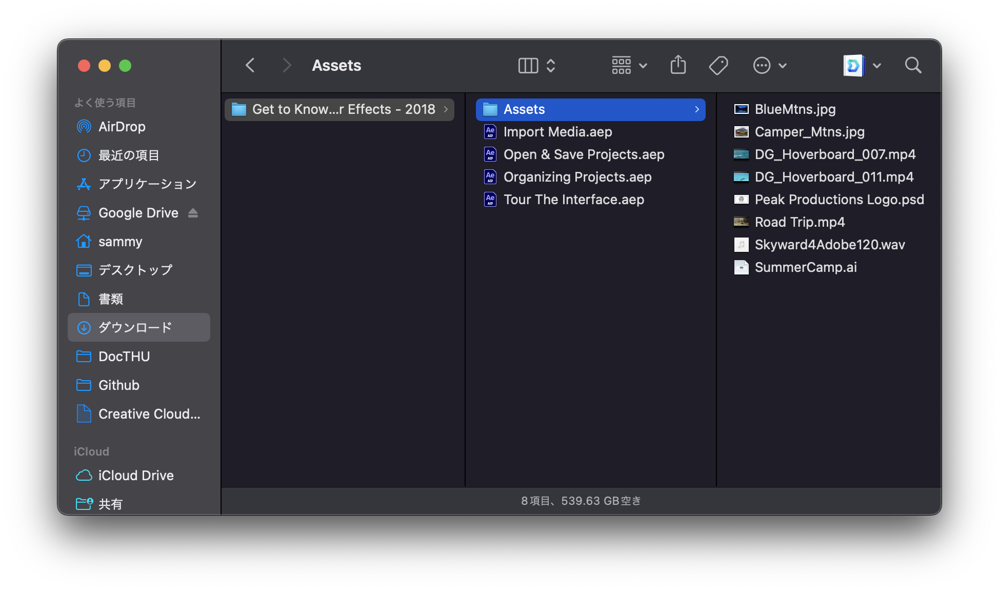

# メディア表現III 2. PremierePro/AfterEffects基本操作<!-- omit in toc -->

# 目次<!-- omit in toc -->

1. [PremierePro/AfterEffectsの特徴](#premiereproaftereffectsの特徴)
2. [今日の内容](#今日の内容)
   1. [プロジェクト・データ管理](#プロジェクトデータ管理)
   2. [ワークスペースとパネル](#ワークスペースとパネル)
   3. [シーケンス・コンポジション](#シーケンスコンポジション)
   4. [書き出し](#書き出し)
   5. [二つのソフトの連携について](#二つのソフトの連携について)
3. [終わり](#終わり)

# 前回のおさらい<!-- omit in toc -->

- 画像サイズ・アスペクト比
- フレームレート
- 動画フォーマット・コーデック・エンコード設定

について学びましたね。今回から実際に触っていきましょう。

# PremierePro/AfterEffectsの特徴
- Premiere Pro：素材となる映像を時間軸でつなぎ合わせて1本の作品に仕上げることができるソフト
- After Effects：短いカットの映像や、細かい設定が必要な映像などを編集する際に使用

どちらも映像編集ソフトですが、役割が明確に異なります。

- Premiere Pro：カット・トランジション・エフェクト・BGM挿入・アニメーション・テロップ
- After Effects：ビデオの合成・モーショングラフィックス・VFX

# 使い分け<!-- omit in toc -->

役割が違うということは、どちらを使うとより効率的に制作できるかを考える必要があります。

もちろん、両方の良いところを使っていくことも大事です。

## <!-- omit in toc -->
Adobeさんが
- Premiere Proの基礎
- After Effectsの基本を学ぶコース

を用意してくれているので、一応参考に貼っておきます。

## Premiere Proの基礎<!-- omit in toc -->
- [Premiere Proの5つの基本編集操作](https://helpx.adobe.com/jp/premiere-pro/how-to/easy-video.html)
- [Premiere Proのインターフェイスについて](https://helpx.adobe.com/jp/premiere-pro/how-to/overview-interface-premiere-cc.html)
- [カラーとホワイトバランスの補正](https://helpx.adobe.com/jp/premiere-pro/how-to/lumetri-color-overview.html)
- [ビデオ編集プロジェクトを始める](https://helpx.adobe.com/jp/premiere-pro/how-to/video-editing-project.html)
- [ビデオとオーディオにトランジションエフェクトを適用](https://helpx.adobe.com/jp/premiere-pro/how-to/apply-transitions-premiere-cc.html)
- [タイトルグラフィックスの作成](https://helpx.adobe.com/jp/premiere-pro/how-to/essential-graphics-panel.html)
- [ビデオ編集テクニックの基本](https://helpx.adobe.com/jp/premiere-pro/how-to/edit-videos.html)
- [デジタル一眼レフ動画の編集](https://helpx.adobe.com/jp/premiere-pro/how-to/dslr-video.html)
- [ミュージックビデオの編集](https://helpx.adobe.com/jp/premiere-pro/how-to/edit-music-video.html)
- [よりスムーズなスローモーションエフェクトを作成する](https://helpx.adobe.com/jp/premiere-pro/how-to/slow-motion.html)
- [ローワーサードタイトルを作成し、アニメーション化する](https://helpx.adobe.com/jp/premiere-pro/how-to/create-animated-title.html)
- [Premiere ProのビデオをMedia Encoderで書き出す](https://helpx.adobe.com/jp/media-encoder/how-to/export-video-from-premiere-pro.html)

## After Effectsの基本を学ぶコース<!-- omit in toc -->
- [After Effects入門](https://helpx.adobe.com/jp/after-effects/how-to/getting-started-after-effects.html)
- [コンポジションの操作](https://helpx.adobe.com/jp/after-effects/how-to/create-composition-animation.html)
- [テキストの作成とアニメーション化](https://helpx.adobe.com/jp/after-effects/how-to/creating-animating-text.html)
- [ビデオの修復](https://helpx.adobe.com/jp/after-effects/how-to/repair-video.html)
- [カスタムトランジションの作成](https://helpx.adobe.com/jp/after-effects/how-to/create-custom-transitions.html)
- [ビジュアルエフェクトの作成](https://helpx.adobe.com/jp/after-effects/how-to/create-video-visual-effects.html)
- [アニメーション背景の作成](https://helpx.adobe.com/jp/after-effects/how-to/create-animated-background.html)
- [レイヤーの選択とアニメーション化](https://helpx.adobe.com/jp/after-effects/how-to/animate-group-layers.html)
- [3Dの操作](https://helpx.adobe.com/jp/after-effects/how-to/work-in-3d.html)
- [作品のレンダリング](https://helpx.adobe.com/jp/after-effects/how-to/render-video-composition.html)

# 今日の内容
## プロジェクト・データ管理
作業するにあたり、Pr,Aeとも新規プロジェクトを作成する必要があります。

動画や画像(.psd, .ai)などを利用して映像制作を進めるにあたりデータ管理は非常に大切なことです。

1. プロジェクトに必要な素材は全てフォルダにまとめておくこと
2. バックアップは定期的に行うこと

## <!-- omit in toc -->

## Premiereで気をつけること<!-- omit in toc -->
Premiereではプロジェクト名だけでなく、場所(フォルダ)を設定する必要があります。

これを間違えると、トラブル間違いありません。
1. プロジェクト用のフォルダを作成する
2. 新規プロジェクトを作成する

この順番を間違えないようにしてください。

Premiereは計算に必要なファイルをこのフォルダの中に適当に作ったりします。

## やってみよう01<!-- omit in toc -->
1. 今日のプロジェクト用のフォルダを作成する(mr3_01等)
2. Premiereでmr3_01としてそのフォルダの中にプロジェクトを作成しよう。

## ワークスペースとパネル
Adobeの製品ではワークスペースとパネルという考え方があります。
- パネル：各機能を表現するためのウィンドウ
- ワークスペース：パネルのレイアウトのセット

くらいに考えておけばいいかな。

これは、好きに移動しても良いのですが、ぐちゃぐちゃになった時には次のようにして元に戻しましょう。

- ウィンドウ - ワークスペース - 保存したレイアウトにリセット

## どのワークスペース？<!-- omit in toc -->
AdobeさんがPremierならきっと
- 学習・編集・カラー・エフェクト・オーディオ・キャプションとグラフィック・ライブラリ

AfterEffectsなら
- デフォルト・学習・標準・小さい画面・ライブラリ・アニメーション・エッセンシャルグラフィックス・カラー・エフェクト・最小構成・ペイント・テキスト・モーショントラッキング

が使いやすいのでは？と提案してくれています。

一応、提案にのってみて、使いづらかったら、好きなパネルを削除・追加するなりすれば良いと思います。

## 逆にいうと?<!-- omit in toc -->
1. 自分は今からどんな操作をするんだろう？
2. それに適したワークスペースはどれだろう？

と考えることは重要ですね。

微妙にAdobe製品によって表示方法が変わりますが、今後統一されていく模様で、扱いやすくなるらしいです。

## パネル<!-- omit in toc -->
一つ一つは説明しないですが、メニューバーの「ウィンドウ」をクリックすると利用できるパネルが現れます。

ここをみて知らないのがあれば、ググって何ができるのか調べてみましょう。

## シーケンス・コンポジション

素材を組み立てる基本となるのを
- シーケンス：Pr
- コンポジション：Ae

と呼びます。役割的にはほぼ一緒で名称が異なるだけです。

## シーケンス設定・コンポジション設定<!-- omit in toc -->

これらには、それぞれ「シーケンス設定」「コンポジション設定」があり、前回学んだ
- 画像サイズ・アスペクト比
- フレームレート

等を設定します。

## Premierでのシーケンス設定<!-- omit in toc -->

Premiereの場合には、元素材の映像がある場合がほとんどですから、シーケンス設定を自分でするより、動画をタイムラインパネルにドラッグ&ドロップすることで、自動的に設定をしてくれて便利です。

## やってみよう02<!-- omit in toc -->
1. 今日のフォルダの中に「assets」フォルダを作成
2. https://sammyppr.github.io
から今日のページに飛んで、サンプルデータをダウンロード
3. ダウンロードしたデータを「assets」フォルダの中に移動
4. 左下のプロジェクトパネルに2つの動画を登録(ファイル-読み込みでもOK)
5. 「1920-1080-30fps.mp4」をタイムラインにドラッグ&ドロップ
6. シーケンス設定を確認
7. シーケンスパネルを一度閉じる
8. 同様に「1280-720-24fps.mp4」をして設定を確認して見る。

## 確認してみよう<!-- omit in toc -->
どちらのシーケンスも5秒なんですけど、なんか違いますね。
- 画像サイズ・アスペクト比
- フレームレート
が異なる動画だったため、ドラッグ&ドロップで自動的にシーケンス設定がこのようになっています。プロジェクトパネルを見るとメディアの情報がわかります。

## 大きな画面で見たい時<!-- omit in toc -->
プログラムパネルをアクティブにしてから「ウィンドウ-フレームを最大化」で大きくすることができます。

Aeだと、プレビューパネルの「フルスクリーン」にチェックを入れます。

## 動作がキツくなってきたら<!-- omit in toc -->
編集中に動作が重くなってきた場合には、
「フル画質」を下げていきましょう。

どのくらいコンピュータが忙しいかを簡単に知るためには「RunCat」というアプリがあります。もちろん、忙しくなれば、動きがぎこちなくなるので必須ではないです。

## 学生の作業を見ていて思うこと<!-- omit in toc -->
スマホなどのアプリではほとんどサクサク動作するので、「コンピュータが重い」ことを知らない人がいます。

そうすると、「コンピュータはなんでもサクッと計算して答えを出してくれる」と勘違いする人がいるようです。

コンピュータが速くなったからとはいえ、計算させる計算量が増えるため、どこかのタイミングで必ず動作が重くなります。

コンピュータに負荷をかけないような作業をすることも大事です。

## 書き出し
「書き出し-メディア-書き出し」(Pr), 「書き出し-レンダーキューに追加」(Ae)でも書き出すことは可能です。

が、トラブルがない限りは、MediaEncoderを使うことをAdobeは望んでいます。
ただ、1年の時にトラブルがあった人がいるように、すごく安定しているわけではありませんが、試してみましょう。

[ウイルス対策ソフトが邪魔していることなどもあるようです。](https://bizvalley.co.jp/blog/15171.html)

## 書き出し時に気をつけること<!-- omit in toc -->
該当する
- シーケンス
- コンポジション
のパネルを選択してから書き出すようにしましょう。

関係ないパネルを選んでいると、Pr,Aeは「えっ？どれ書き出したいかわかんないんだけど」として困ってしまいます。

## 画像サイズの違いがわかるように...<!-- omit in toc -->
1. シーケンス「1920-1080-30fps」の後ろに「1280-720-24fps.mp4」をを二つ追加
2. V1にある映像クリップをV2に移動
3. 新規 - カラーマットで黒以外のものを作成
4. カラーマットをV1に追加
5. 2つ目の「1280-720-24fps」を選択してエフェクトコントロールのスケールを150%に
6. 最大化して画質について確認してみよう
7. 1フレームずつ送ると不思議なことに気づくでしょう。

## フレームレート...<!-- omit in toc -->
24fpsの動画を30fpsのシーケンスに貼ったので、
1. 1秒間に6枚絵が足りなくなる
2. 尺が短くなる

のどちらかになりますね。
時間を合わせることを優先しているので、1.になっています。

撮影時に設定を間違えると大変なことになることが理解できるでしょうか？

## 書き出し<!-- omit in toc -->
1. シーケンスがアクティブになっている状況で
2. 書き出し-メディア - キュー
3. MediaEncoderが起動したら、「H.264」「高品質1080p HD」と設定し、右上の再生ボタンを押して書き出しましょう。

## 二つのソフトの連携について
今日は、Premiereを中心に説明してきましたが、二つのアプリを利用して作品制作する場合にはどうしたら良いでしょうか？

1. ProResで書き出して他のソフトに持っていく
2. DynamicLinkを利用する

どちらも一長一短あります。

## ProResで書き出して他のソフトに持っていく<!-- omit in toc -->
劣化の少ないProRes形式を利用することで通常の動画として利用します。

ただ、修正が入るといちいち
1. 修正
2. 読み込み直し

の作業が入ります。

## DynamicLinkを利用する<!-- omit in toc -->
Adobeでは
1. PremiereにAfterEffectsのデータを直接読み込む
2. AfterEffectsにPremiereのデータを直接読み込む

のどちらも可能です。

この場合、修正したい時には該当場所をダブルクリックで他のアプリを起動させることができます。

## DynamicLinkのデメリット<!-- omit in toc -->
ただし、便利な一方、
1. バグる時がある
2. プレビュー時に毎回計算するのでコンピュータに負荷をかける

というデメリットもあります。

タイミングをみて一度くらいやってみようとは思いますが、個人的にはProRes経由が好きだったりします。

# 終わり
網羅的に全てを説明できたわけではありませんが、使う上での重要な箇所については説明できたかな...

興味ある人は、前の方で紹介したAdobeの基本チュートリアルをやってみるとさらに理解が深まると思います。

では終わります。

