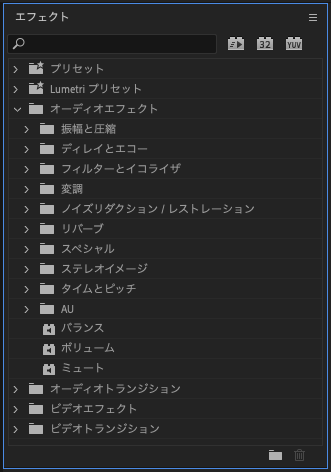
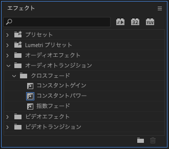
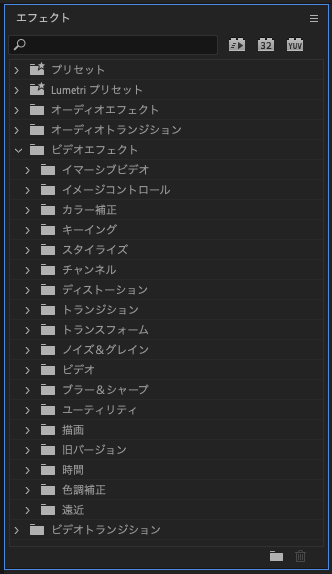
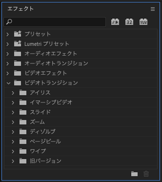
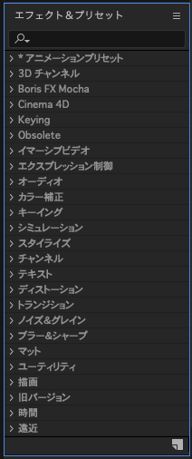

# メディア表現III 6. エフェクト<!-- omit in toc -->

# 目次<!-- omit in toc -->
1. [基本的な使い方](#基本的な使い方)
   1. [キーフレーム](#キーフレーム)
   2. [プリセット](#プリセット)
   3. [基本エフェクト](#基本エフェクト)
2. [標準エフェクト](#標準エフェクト)
   1. [エフェクトについて](#エフェクトについて)
   2. [補正に利用できるエフェクト](#補正に利用できるエフェクト)
3. [クリエイティブなエフェクト利用例](#クリエイティブなエフェクト利用例)

# 前回のおさらい<!-- omit in toc -->

- スキントーン
- カラーグレーディング
   - Look
   - カーブ
   - カラーホイールとカラーマッチ
   - HSLセカンダリ
   - ビネット
   - ティールアンドオレンジ
 - フィルムグレイン
 - シネマティック

<!--
# MEMO
- VFXソフトウェア
DavinciResolve(Fusion)/Motion/NUKE/Houdini/Blender/Cinema4D/Maya/Unity/UnrealEngine
- PCスペック

- エフェクト(PremiereでもAfterEffectsでも)
https://b-risk.jp/blog/2021/12/premiere-effect/
Premiereは素材をカットして繋ぎ合わせたりすることを得意としていますが、特殊効果系のエフェクトを付けるのは苦手としています。
逆にAfter Effectsは特殊効果系のエフェクトを付けることを得意としており、素材をカットして繋ぎ合わせるといったことは出来ません。
- Lumetriカラーも実はエフェクト
- 補正/クリエイティブの使い方がある
- エフェクトワークスペース
- どこにかける？(ソースクリップエフェクト)
- 何がかかってる？(FXバッジ)
- どう使う？(キーフレーム・組み合わせ)
- プリセット

## Premiere
- https://www.youtube.com/watch?v=jydPlFQFf1M
0:43 Offset
1:23 Ultrakey
1:45 Gaussian blur
2:12 Camera blur
2:55 Denoise
4:30 Lowpass
4:52 Crop
5:32 Unsharp mask
6:05 Lumetri color
7:11 Warp stabilizer
- https://www.youtube.com/watch?v=GhhFe8vz6bA
WARP STABILIZER
GAUSSIAN BLUR
LUMETRI COLOR
LOWPASS FILTER
CROP
ULTRA KEY
DEREVERB
DENOISE
DROP SHADOW
POSTERIZE TIME
- https://www.youtube.com/watch?v=oJ5UmP38Imk
INVERT
PAINT BACKET
EMBOSS
STROBE LIGHT
4COLOR GRADIENT
- https://www.youtube.com/watch?v=BW1gUXhsTF4
ECHO
4COLOR GRADIENT
DENOISE/DEREVERB
ULTRA kEY
POSTERIZE TIME
WARP STABILIZER
CAMERA BLUR
- https://helpx.adobe.com/jp/premiere-pro/using/video-effects-transitions.html
基本エフェクト(勝手に追加)
標準エフェクト(自分で追加)
トラックベースのエフェクト(ネストしたシーケンスに対して)
エフェクトプリセット
カラー補正
デュレーションと速度
- https://www.youtube.com/watch?v=c0pE8mWbeLQ
Fxバッジ
ソースクリップエフェクト
- https://www.youtube.com/watch?v=QEYDYp908bs
スピードランプ
長い尺を短くする
ものや人に意識を向ける
カットを滑らかにつなぐ
単純にかっこいい
- https://www.youtube.com/watch?v=RYuOMfWoaOQ
音声補正
- https://www.youtube.com/watch?v=VWtA10fHbLU
Premiere Proだけで作れる5つのカッコ良いエフェクト
## AfterEffects
https://liginc.co.jp/576812
https://good-elephant.co.jp/toranomaki/work/1481/
https://ae-style.net/
https://aaee.link/
https://douga-tec.com/?p=7113
https://film-walker.com/aftereffects-cando/
-->

# エフェクトとは
---
### CG・VFX・SFX
CG(Computer Graphics：コンピュータグラフィックス)・VFX(Visual Effects：視覚効果)・SFX(Special Effects：特殊効果)様々な用語がありますが、デジタルで映像制作する方法の用語であり、そんなに違いは気にしなくていいかな、と思います。

これらを実現できるエフェクトについて学んでいきましょう。

---
### エフェクトを利用できるアプリ
この演習ではPremiere ProとAfterEffectsを取り上げていますが、世の中には

> DavinciResolve(Fusion)/Motion/NUKE/Houdini/Blender/Cinema4D/Maya/Unity/UnrealEngine

とたくさんのアプリがあります。必要に応じて必要なものを使っていきましょう。
もちろん、Premiere Pro, AfterEffectsでも様々なことができます。

---
### どう利用するの？
- カラーコレクション
- カラーグレーディング

が補正とクリエイティブな作業に別れた様に、エフェクトも
- 素材の補正
- クリエイティブな効果

に分かれると思います。

---
### Premiere Pro エフェクトパネル

---

---

---

---

---
### AfterEffects エフェクトパネル

---
### PremierePro/AfterEffectsの違い
Premiereは素材をカットして繋ぎ合わせたりすることを得意としていますが、特殊効果系のエフェクトを付けるのは苦手としています。

逆にAfter Effectsは特殊効果系のエフェクトを付けることを得意としており、素材をカットして繋ぎ合わせるといったことは出来ません。

パネルを見るだけでその違いがわかりますね。

# 基本的な使い方

---
### 基本的な使い方
- 基本エフェクト(自動で追加)
- 標準エフェクト(自分で追加)
- トラックベース(ネストしたシーケンス)のエフェクト

標準エフェクト・トラックベースのエフェクトは、クリップやネストしたシーケンスにエフェクトをドラッグ&ドロップするだけです。

エフェクトコントロールから削除することもできます。

AfterでもPremiereでも一緒となります。

## キーフレーム

---
### キーフレーム
エフェクトにはパラメータがありますが、キーフレームを用いて時間軸でコントロールすることができます。

- Premiereではエフェクトコントロールで作業します。
- AfterEffectsではタイムラインで作業します。

---
### キーフレームの追加・削除方法
ストップウォッチのアイコンをクリックすることでキーフレームが利用できる様になります。

丸と左右に三角の矢印がついたところで、
- キーフレームの追加・削除
- キーフレームの移動

ができます。

---

---
### キーフレームの考え方
ある時点での値を指定し、その間についてはコンピュータで自動的に計算してもらう方法となります。

基本的には直線的に数値は変化しますが、変化の仕方を曲線で表すことも可能です。

---
### キーフレームでの曲線的な変化について
#### premiere pro
キーフレームの上で、右クリックすると
- 時間補間法(時間軸の動き方)
- 空間補間法(位置情報の動き方)

を変えられます。項目名の左の「>」をクリックすることでグラフが出てきます。

#### after effects
キーフレームの上で、右クリックする
- キーフレーム補助

が出てきます。グラフエディターをクリックするとグラフが出てきます。

---
### イージング
動きに緩急をつけることを「イージング」と言います。
- イーズイン
- イーズアウト

を選択するだけでもいいですし、詳細につめたい場合には、グラフエディタでハンドルを触って、調整できます。

---
### やってみよう
Premiereでやってみましょう。
1. 作業フォルダ「mr3_06」を作成
2. [PremiereLogo](img/adobe-premiere-logo.png)をダウンロードしてフォルダの中に
3. 新規シーケンス「AVCHD」「1080p」「AVCHD 1080p30」を選択
4. プロジェクトにロゴを読み込んで、シーケンスに配置。選択
5. エフェクトコントールで次の位置にキーフレーム
   - 位置:0,15フレーム
   - スケール:15,30フレーム
6. 位置0フレームのXを0。スケール30フレームを300に

---
### やってみよう2
7. 位置・スケールの項目名の左の三角を開く
8. 位置・スケールとも、二つ目のキーフレームで速度を0にしてみよう
   - キーフレームを選択すると青いハンドルが速度のところに出てくるので、それの値を0にして、ハンドルを左に長くしてみよう。
9. ついでに不透明度を0,30フレームにキーフレームを追加して、0フレームを0%にして、同様にイージングをつけてみよう。

## プリセット
エフェクトの時間によるパラメータの変化を保存したものがプリセットとなります。

自分で作成することもできます。

---
### やってみよう3
1. モーションと不透明度を両方ともコマンドキーを使って選択
2. 右クリックで「プリセットの保存」で「ロゴ登場」として保存しよう。
3. 新たにロゴをタイムラインに追加
4. エフェクトのプリセットの中の「ロゴ登場」を当ててみる。

## 基本エフェクト
- モーション
- 不透明度
- タイムリマップ

は基本エフェクトと呼ばれ、どのクリップにも最初から適応されています。(タイムリマップがグレーになってるね)

---
### モーション
#### 位置・スケール・回転
言葉の通りです。
#### アンカーポイント
スケールや回転の中心ポイントのことです。
#### アンチフリッカー
画像中の細い線や鋭い角（ストライプ柄など）は、インターレース表示方式のせいでちらつくことがあります。蛍光灯が原因でチラつくこともあります。アンチフリッカーという機能を使うことで、ちらつきを抑えることができます。

---
### 不透明度
#### マスク
表示する部分を限定することができます。
#### 不透明度
透過の具合を調整できます。
#### 描画モード
下の素材とどのように合成するかを決めます。通常以外に色々なモードがありますが、スクリーンを覚えておくと良いでしょう。

---
### タイムリマップ
映像の時間軸を変化させる方法です。
単純な早回し、スローモーションであれば、
- クリップを右クリック
- 速度・デュレーション

を用いましょう。タイムリマップを使うとより積極的に、時間軸の制御が可能です。

---
### やってみよう4
Premiereは最新版だよね？
1. 読み込みに戻って、サンプルメディアから「A002_C086_09220G_001.mp4」を選択して読み込もう
2. クリップを右クリックして「クリップキーフレームを表示」「タイムリマップ」「速度」
3. 右のスクロールバーの下の○をドラッグしてトラックの幅を拡大しよう。
4. まずは全体を250%に
5. 9フレーム目に移動して、左の○を押してキーフレーム追加
6. キーフレームより右の線をドラッグして30%に
7. 30フレームにキーフレーム。後ろを100%に
8. 急にスピードが変化するので、キーフレームの上のグレーのハンドルを移動させて滑らかに

---
### ソースクリップエフェクト
エフェクトコントロールをよく見ると
- ソース
- シーケンス

と書いてあります。ソースにエフェクトをかけるとどうなるのでしょうか？

---
### やってみよう5
1. mp4をもう一つ後ろに追加
2. エフェクトコントロールの「シーケンス」の左の下矢印をみると同じ素材の映像が2回使われていることがわかる。
3. エフェクトの「ビデオエフェクト」「カラー補正」「輝度＆コントラスト」をソースに追加
4. コントラストを50に

ソースにエフェクトをかけると、タイムライン上の全てに影響があります。

---
### FXバッジ
クリップに「fx」というマークがついています。色が変わりますが、説明しておきます。
- グレー：変更なし
- 黄色：基本エフェクトが変更されている
- 紫：エフェクトを追加している
- 緑：黄色と紫の条件が揃っている
- 赤下線：ソースクリップエフェクトを追加している

編集したつもりなくて、色がついている場合には何かいじってる可能性があるので注意しましょう。

---
### Lumetriカラー
ついでに、カラーワークスペースに行って、Lookを当ててみましょう。

エフェクトコントロールのところに「Lumetriカラー」が追加されます。つまり、Lumetriカラーもただのエフェクトに過ぎないということがわかります。

# 標準エフェクト

## エフェクトについて
全部紹介は無理です。
本やネットでどんなことがエフェクトでできるのかをざっと目を通しておくことをお勧めします。
そして、「こんな表現にしたい」と思ったときに使い方を学べば良いと思います。

[AfterEffectsエフェクト一覧](https://aaee.link/)

うーん、Premiereの一覧は見つからなかった...

---
### エフェクトの組み合わせ
エフェクトは複数かけることで様々な効果を作り出すことができます。 
初めは、ひとつづつの効果を確認して利用するので良いですが、
- これとこれを使ったらどうなるかな？

と考えていきましょう。

---
### コンピュータへの負荷
エフェクトはかければかけるほど、コンピュータに負荷がかかります。

ある一定の負荷を越えると、滑らかに再生することはできなくなります。

タイムラインにカラーバーがありますが、色の意味は
- 緑：レンダリング済みのプレビューファイルが関連づけられている
- 黄：レンダリング済みのプレビューファイルが関連づけられていないが、リアルタイム再生可能
- 赤：レンダリング済みのプレビューファイルが関連づけられていなく、リアルタイム再生ができない

赤の場合には、選択して「シーケンス」-「選択範囲をレンダリング」としてプレビューファイルを作成させましょう。
ProResで書き出して利用するのも一つの手です。

## 補正に利用できるエフェクト

---
### 音のエフェクト
音については、詳しくはサウンドデザイン演習の方でやりたいのですが(この演習でやる時間はないかな)、少し紹介。

- クロマノイズ除去(雑音を抑える)
- DeEsser(歯擦音を抑える)
- リバーブを除去(反響音を抑える)

を使うことで音を補正することができます。

また音質を整えるために
- パラメトリックイコライザー(音質を整える)
- ダイナミック(音量差を少なくする)

の扱い方を知っていると劇的に音が良くなると思います。

---
### ワープスタビライザー
手ブレしている素材をある程度抑えることができます。

# クリエイティブなエフェクト利用例
参考:[Premiere Proだけで作れる5つのカッコ良いエフェクト](https://www.youtube.com/watch?v=VWtA10fHbLU)

---
### モザイク
1. mp4をタイムラインに追加
2. Option(Alt)キーを押しながらV2にコピー
3. モザイクを適用
4. 水平ブロック:320、垂直ブロック5
5. 不透明度の描画モードをスクリーンに

---
### ポスタリゼーション時間/ブラー(チャンネル)
1. mp4をタイムラインに追加
2. Option(Alt)キーを押しながらV2にコピー
3. ポスタリゼーション時間を適用
4. フレームレート6
5. 不透明度の描画モードをスクリーンに
6. ブラー(チャンネル)を適用
7. 青ブラーを50

---
### エンボス/ブラー(チャンネル)
1. mp4をタイムラインに追加
2. Option(Alt)キーを押しながらV2にコピー
3. エンボスを適用
4. フレームレート6
5. 不透明度の描画モードをスクリーンに
6. ブラー(チャンネル)を適用
7. 青ブラーを50
8. 不透明度の描画モードをカラーに
9. エンボスのパラメータを調整(方向：0, レリーフ：5、コントラスト150)

---
### 4色グラデーション
1. mp4をタイムラインに追加
2. カラー2,3を黒に。
3. 描画モードをスクリーンに。ブレンドを300

---
### おまけ
1. プログラムウィンドウの右下のボタンエディターをクリック
2. 上から2番目、右から2番目のループ再生をドラッグして追加
3. ループ再生をクリックして青にすると、ループ再生ができるようになるよ。

# まとめ<!-- omit in TOC -->
エフェクトを使うことで映像表現の可能性は無限に広がるよ。

いろんなチュートリアルが出ているから真似をして表現力をどんどん上げていこう。
