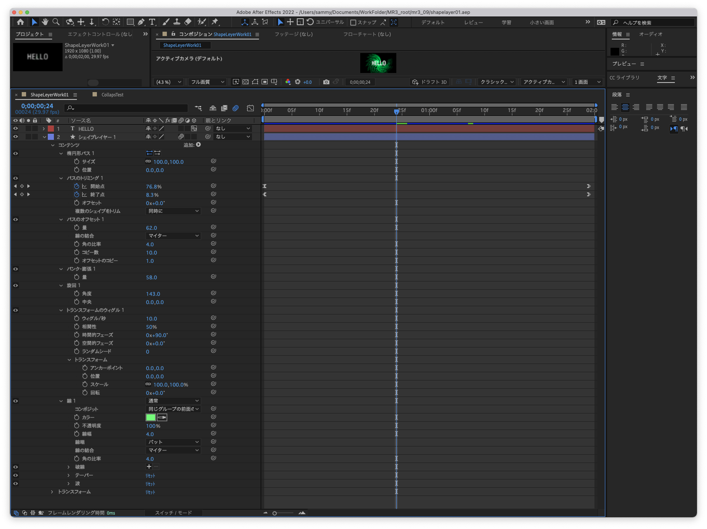

# メディア表現 III 9.シェイプアニメーション

[メディア表現III TOP に戻る](./index.md)

---

## 目次

1. [メディア表現 III 9.シェイプアニメーション](#メディア表現-iii-9シェイプアニメーション)
   1. [目次](#目次)
   2. [スライド](#スライド)
   3. [データ](#データ)
   4. [授業後補足](#授業後補足)

---

## スライド

[スライド資料](./mr3_09slide.pdf){:target="_blank"}

## データ
- [Illustrator Icon](data/Adobe_Illustrator_CC_icon.ai.zip)

## 授業後補足
授業中に見せたAEは以下のように設定されています。

