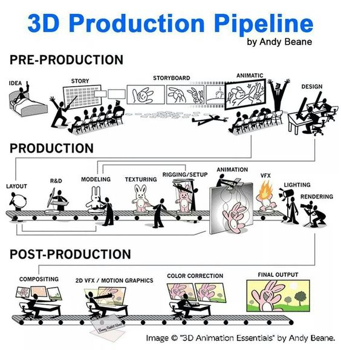
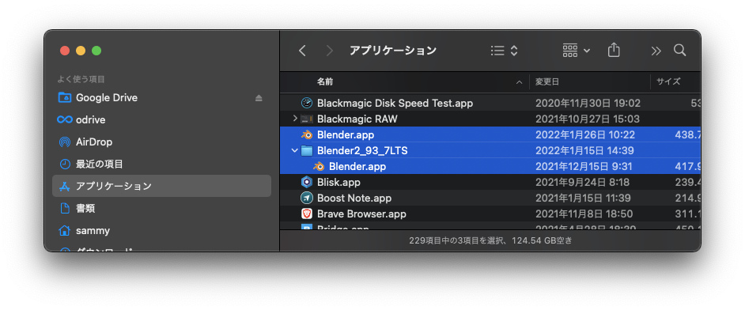
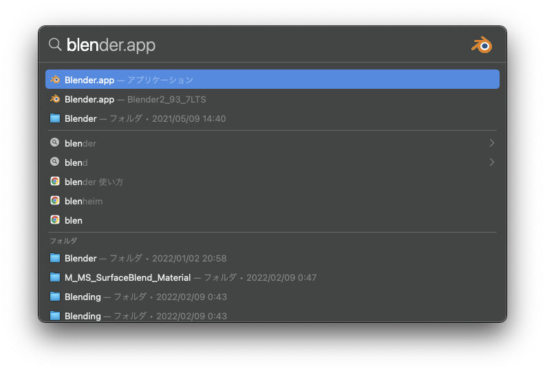

# メディア表現 V 1. オリエンテーション

[メディア表現 V TOP に戻る](./index.md)

---

## 目次

1. [メディア表現 V 1. オリエンテーション](#メディア表現-v-1-オリエンテーション)
   1. [目次](#目次)
   2. [シラバス紹介](#シラバス紹介)
      1. [授業のねらい及び到達目標](#授業のねらい及び到達目標)
      2. [授業の形式・計画](#授業の形式計画)
   3. [利用するアプリについて](#利用するアプリについて)
      1. [Blender について](#blender-について)
      2. [Blender Overview](#blender-overview)
      3. [他の 3D 系アプリについて](#他の-3d-系アプリについて)
   4. [授業の進め方](#授業の進め方)
   5. [3D Production Pipeline](#3d-production-pipeline)
   6. [心構え](#心構え)
      1. [いろんなリンク](#いろんなリンク)
   7. [Blender インストール](#blender-インストール)
      1. [LTS 使う人(バグなどの時用)](#lts-使う人バグなどの時用)
   8. [起動しよう](#起動しよう)
   9. [言語設定について(個人的には英語推奨)](#言語設定について個人的には英語推奨)
   10. [画面を有効に使おう](#画面を有効に使おう)
   11. [ファイルの管理について](#ファイルの管理について)
   12. [物をおいてみよう](#物をおいてみよう)
      1. [viewport の視点操作](#viewport-の視点操作)
      2. [ライブラリから追加してみよう](#ライブラリから追加してみよう)
      3. [Object の操作について](#object-の操作について)
      4. [Render について](#render-について)
      5. [(おまけ)スクリーンキャストについて](#おまけスクリーンキャストについて)
   13. [お疲れ様でした〜](#お疲れ様でした)

---

## シラバス紹介

### 授業のねらい及び到達目標

映像制作の CG/VFX は凄まじい進化を遂げている。無料で利用できるオープンソースの統合型 3DCG 製作・2D アニメーション製作・VFX 向けデジタル合成・動画編集ソフトウェアである Blender を用いて、「デジタルコンポジット」「モーショングラフィックス」「VFX」について理解し、制作技術を高める。

1. Blender を用いてコンテンツ制作ができる。
2. 状況に応じて適切な技術を用いて表現力豊かな制作ができる。

### 授業の形式・計画

1. オリエンテーション
2. Blender 基本操作
3. モデリング
4. モディファイア
5. マテリアルとテキスチャ
6. キーフレームアニメーション・カメラ切り替え
7. シェープキーアニメーション
8. アーマチュア・IK・リグ
9. ライティング・レンダリング
10. グリースペンシル
11. 物理演算・パーティクル
12. シェーダーエディター
13. ジオメタリーノード
14. コンポジット・動画編集
15. モーショントラッキング

---

## 利用するアプリについて

### Blender について

- 最近すごく勢いがあるアプリ。自分は 2021 年度に触り始めたばかり
- 2.8(2019)あたりから使いやすいインターフェイスになった
- 異なるバージョンを使っているチュートリアルだと、同じ操作ができなかったりするので注意(2.8 以降推奨)
- 最新版を使うとバグもあるので、LTS も必要に応じて使っていこう
- マウス・テンキーがあったほうが良いという意見もあるけど、なくてもいける

### Blender Overview

{:target="_blank"}

### 他の 3D 系アプリについて

- アプリは道具でしかないので、何を使っても良い
- 特に 3D では用途に応じていろいろなアプリがあるため、便利に使いわければ良い
- Blender はずっと無料、Maya は学生の間だけ無料だが、その後は年間数十万かかる
- プロは Maya と言われていたが、最近ではゲーム業界・アニメ業界にて Blender も使われ始めている
- 参考 [『シン・エヴァ』で 3DCG を手がけたプロジェクトスタジオ Q、Blender の魅力を語る](https://news.mynavi.jp/article/20210804-1927380/){:target="_blank"}
- 参考 [エヴァ制作のカラーが Blender への移行を進める理由とは？](https://japanese.engadget.com/jp-2019-08-14-blender-khara.html){:target="_blank"}

---

## 授業の進め方

- 毎回、トピックを決めて取り組んでもらう。
- 3D を使いこなすには数学や物理法則等を知る必要があるけど、必要最低限にとどめて「使う」ことをメインに進めていく。
- 慣れてから技術的な背景については必要に応じて学んでいこう。

## 3D Production Pipeline

[3D Production Pipeline](https://animeight.com/2018/02/21/3d-production-pipeline/){:target="_blank"}

## 心構え

- 好きになろう(楽しもう)。モチベが大事。とにかく触ろう。
- 多くのことができるので、興味があるところから重点的に取り組もう。(授業だから順番にやるけど)
- Twitter で「Blender」ぐぐると、初心者たくさんいて刺激になるよ
- まずはチュートリアル見ながらすげー！と思おう。
- なるべく 15 分くらいのチュートリアルやってみよう。(長いとめげる)
- みないでできるようになってみよう。
- 自分なりのアレンジを加えてみよう。
- 他の人に見てもらうのも励みになる。
- ある程度わかったところで体系的に何ができるか学ぼう。

### いろんなリンク

- [Twitter#Blender 初心者](https://twitter.com/search?q=%23blender%E5%88%9D%E5%BF%83%E8%80%85){:target="_blank"}
- [Twitter#Blender](https://twitter.com/search?q=%23blender){:target="_blank"}
- [YouTube Blender チュートリアル](https://www.youtube.com/results?search_query=blender+%E3%83%81%E3%83%A5%E3%83%BC%E3%83%88%E3%83%AA%E3%82%A2%E3%83%AB){:target="_blank"}

---

## Blender インストール

1. [Blender 公式サイト](https://www.blender.org/){:target="_blank"}
2. 「Download Blender」をクリック
3. Intel なら intel, M1 なら AppleSilicon, Win なら Installer
4. 「Download Blender3.0.1」をクリック
5. ディスクイメージを開けて、Blender をアプリケーションフォルダにコピー

{:target="_blank"}

### LTS 使う人(バグなどの時用)

- [Download の Long-term-support](https://www.blender.org/download/lts/){:target="_blank"}からダウンロードできる
- アプリケーションフォルダに「Blender2.93LTS」とかフォルダ作成し、その中に入れることで、複数のバージョンを使うことが可能。
- Command+スペースで Blender を検索した時に、フォルダ名が出るので、どっちをつかっているかわかるよ
- Win の人は[BlenderHub](https://3dnchu.com/archives/blenderhub-1-1-0/){:target="_blank"}を導入しよう。(必要に応じて)

---

## 起動しよう

- とりあえずそのまま何もせずに「Save New Setting」を押そう。
- ~Library/Application Support/Blender の中にバージョンごとに設定ファイルができるよ。
- 3.0.0 と 3.0.1 は兼用だけど、3.0 と 3.1 は別になるみたい。
- ここには設定と、追加された AddOn のファイルが入るよ。

{:target="_blank"}

## 言語設定について(個人的には英語推奨)

- チュートリアル動画には英語・日本語がある。
- 英語がどうしても苦手な人は日本語設定にしよう。
- Edit-Preferences, Interface, Language を Japanese に
- 「新規データ」はチェックを外しておこう
- 2.9 系は Mac で日本語のフォントが化ける可能性あり
- 切り替えに[Toggle Translated UI](https://www.cgradproject.com/archives/5503/){:target="_blank"}を入れよう。
- 編集-プリファレンス、アドオン、インストールでダウンロードした py ファイルを選択。チェックを入れて有効に
- Mac では編集-プリファレンス、キーマップ、ウィンドウの ToggleTranslated UI で、「[」とかに変えておこう。
- 文字のところをクリックしてから「[」で切り替え

{:target="_blank"}

---

## 画面を有効に使おう

- iMac では Blender, Web ページを両方おくことができるが、ノートパソコンなら、三本指でスワイプして 2 画面をうまく使いこなそう。
- [EasyRes](https://apps.apple.com/jp/app/easyres/id688211836?mt=12){:target="_blank"}を使うと、Mac の標準設定より解像度をさらに広げることができる。文字は小さくなるけど便利。(自分は 2048\*1280)

{:target="_blank"}

---

## ファイルの管理について

- 書類フォルダに「Blender」フォルダを作ろう
- 日付と「チュートリアル」「オリジナル」そして内容がわかるといいと思う。

チュートリアル
: 20220401t_basic.blend

オリジナル
: 20220401o_domino.blend

- 自分でわかれば問題はないけど。あとで何をいつやったかわかると便利。
- 参考にしたページや YouTube を TextEditor で書いておくと忘れないので便利

{:target="_blank"}

---

---

## 物をおいてみよう

- 3.0 から追加されたアセットブラウザのデモが公開されている。
- [Blender 公式サイト](https://www.blender.org/){:target="_blank"}
- Download - Demo Files - Cube Diolama
- 書類-Blender-DemoFiles フォルダを作成してそこに移動
- zip ファイルを解凍しよう。
- オリジナルは取っておきたいから、.blend ファイルをコピーして開いてみよう。

{:target="_blank"}

### viewport の視点操作

#### トラックパッド

- 視点回転は 2 本指
- 視点平行移動は Shift+2 本指
- 拡大縮小は Ctrl ＋ 2 本指 or ピンチイン・ピンチアウト
- 上手くいかない人は、システム環境設定のトラックパッドを確認

{:target="_blank"}

#### マウス

- ホイール付きマウスは、ホイールが中ボタンとなっている
- 視点回転は中ボタンドラッグ
- 視点平行移動は Shift+中ボタンドラッグ
- 拡大縮小はホイールを回転

{:target="_blank"}

### ライブラリから追加してみよう

- Material は材質を変える
- Object は配置されるよ

### Object の操作について

- 消すのは X
- T を押すとツールパネルがでてくるので、移動、回転ツールをセレクトして GIZMO で動かそう

{:target="_blank"}

### Render について

- Render Image とすると時間かかるね。かかるんです。たくさんいろんな計算をしてる
- Eevee にしてみよう。はやくなるね！
- Blender ではコンピュータに負荷をかけないように、どのようにつくるか、ということも必要なこと

{:target="_blank"}

### (おまけ)スクリーンキャストについて

- Blender の Addon の[screencastkey](https://www.cgradproject.com/archives/5495/){:target="_blank"}だけでいきたいのだけど、不備あり
- 今日は扱わないけど、G,R,S を押した後の X,Y,Z が表示されない。
- そのため[keycastr](https://softantenna.com/blog/keycastr/){:target="_blank"}も併用するよ。

{:target="_blank"}

## お疲れ様でした〜
