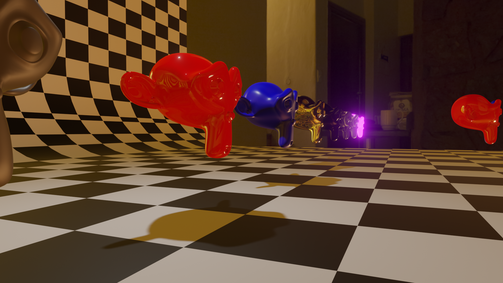
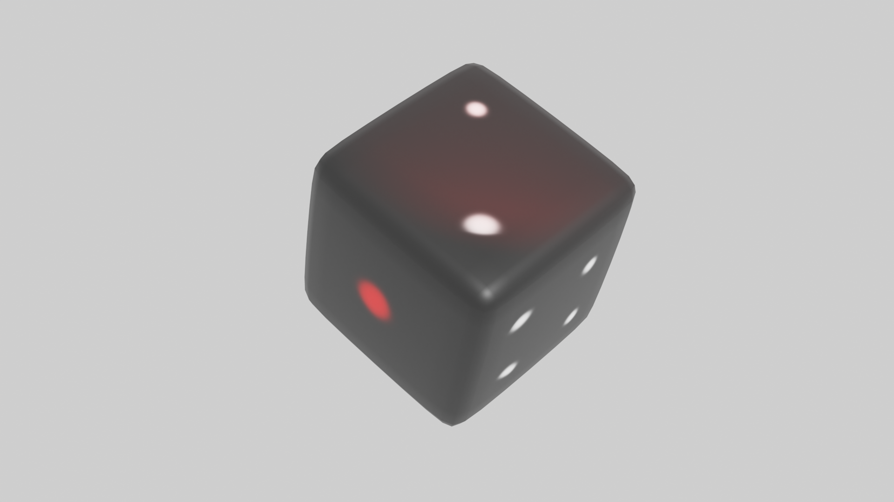
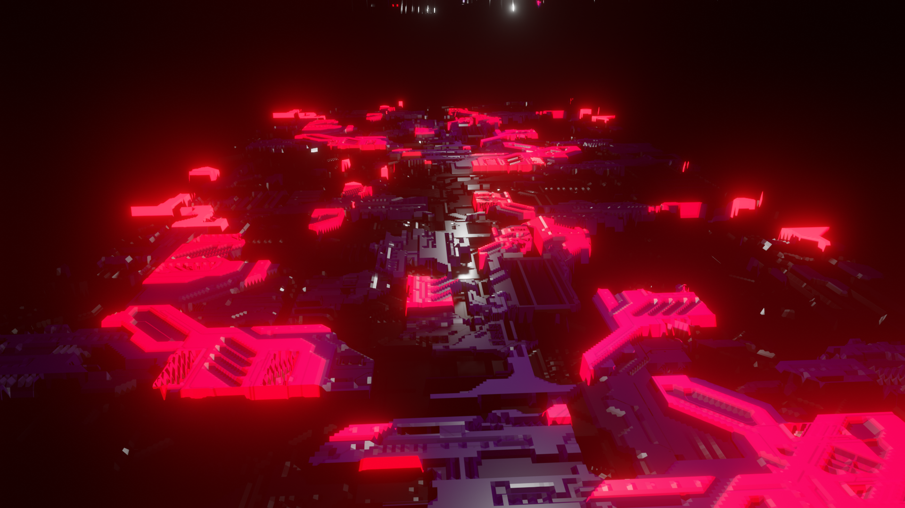

# メディア表現V 5. マテリアルとテキスチャ

[メディア表現V TOPに戻る](./index.md)

---
## 目次

1. [メディア表現V 5. マテリアルとテキスチャ](#メディア表現v-5-マテリアルとテキスチャ)
   1. [目次](#目次)
   2. [マテリアル/テキスチャとは](#マテリアルテキスチャとは)
   3. [プリンシプルBSDF](#プリンシプルbsdf)
   4. [マテリアルスロット](#マテリアルスロット)
   5. [やってみようPart1](#やってみようpart1)
   6. [UV展開](#uv展開)
   7. [やってみようPart2](#やってみようpart2)
   8. [色情報だけでない画像の役割](#色情報だけでない画像の役割)
   9. [やってみようPart3](#やってみようpart3)
   10. [その他参考](#その他参考)
   11. [お疲れ様](#お疲れ様)

---

## マテリアル/テキスチャとは
共に、形状ではなく見た目をコントロールするためのものですが、
- マテリアルは物質の質感
- テキスチャは模様

とざっくり考えて良いです。

なお、シェーディング(陰影処理)を行うシェーダーという概念もありますが、
「シェーダー」+「テキスチャ」=「マテリアル」
くらいになんとなく思っておきましょう。

さて、これまで造形基礎演習などで質感について学習してきましたが、質感ってなんでしょう？
- ベースとなる色
- 金属?非金属?
- 表面の粗さ
- 透過 及び 屈折率

など様々な要素が複合的にからみあっています。

質感の基本的な設定について試してみましょう。
なお、レンダリングエンジンCyclesの方が圧倒的に表現力が上ですが、処理速度的にはEeveeが優れていて、質もそこそこなので、Eeveeで試します。

---

## プリンシプルBSDF
他のソフトとも互換性を持つシェーダ。項目が多いが主な項目は限られている。
### 参考にしたページ
[Principled BSDFでいろんな材質を表現する](https://light11.hatenadiary.com/entry/2019/03/25/214201){:target="_blank"}

[プリンシプルBSDFで樹脂製品の作り方](https://hainarashi.hatenablog.com/entry/2020/06/30/130241){:target="_blank"}

### 主な項目と設定例
とりあえずこの辺覚えておこう

| 項目         | 意味                       |
| ------------ | -------------------------- |
| Base Color   | 基本となる色               |
| Metalic      | 金属？非金属?              |
| Roughness    | 表面の粗さ(コート・マット) |
| Transmission | 透明度                     |
| Emission     | 放射                       |

#### ゴム

| 項目       | 値   |
| ---------- | ---- |
| Base Color | 灰色 |
| Metalic    | 0    |
| Roughness  | 0.5  |

#### 光沢のあるプラスチック

| 項目       | 値     |
| ---------- | ------ |
| Base Color | 適当に |
| Metalic    | 0      |
| Roughness  | 0      |

#### マットなプラスチック

| 項目       | 値     |
| ---------- | ------ |
| Base Color | 適当に |
| Metalic    | 0      |
| Roughness  | 0.24   |

#### 鏡(Cycles Only)

| 項目       | 値  |
| ---------- | --- |
| Base Color | 白  |
| Metalic    | 1   |
| Roughness  | 0   |

#### 鈍い光沢の金属

| 項目       | 値   |
| ---------- | ---- |
| Base Color | 茶系 |
| Metalic    | 1    |
| Roughness  | 0.2  |

#### ガラス

| 項目         | 値  |
| ------------ | --- |
| Base Color   | 白  |
| Metalic      | 0   |
| Roughness    | 0   |
| Transmission | 1   |

#### すりガラス

| 項目         | 値  |
| ------------ | --- |
| Base Color   | 白  |
| Metalic      | 0   |
| Roughness    | 0.2 |
| Transmission | 1   |

#### 放射

| 項目                                       | 値       |
| ------------------------------------------ | -------- |
| Emission                                   | 放射の色 |
| Emission Strength                          | 適当に   |
| ※レンダープロパティのBloomにチェックいれる |

追記(2022/8/16)
- [PHYSICALY BASED](https://physicallybased.info/)

---
---

## マテリアルスロット
- 一つのオブジェクトに複数のマテリアルを登録できる
- どの面をどのマテリアルにするかを設定できる

---
## やってみようPart1
- スザンヌをたくさん並べていろいろなマテリアルを当ててみよう

{:target="_blank"}

---
---
## UV展開
- 3次元のオブジェクトを、2次元の座標に対応させる方法。
- これを使うと、3次元オブジェクトに画像を貼ることが可能となる。
- 展開するときにはシームという切れ目を作り、作業しやすくする
- 今回はUV展開の作業自体は行わない

[参考: UV展開のやり方【考え方・注意点・展開方法】](https://bookyakuno.com/how-to-uv/)

## やってみようPart2
- Shift+Aで追加した状態ではUV展開されている。
- 立方体をUV展開した画像をペイントして、サイコロを作ろう

{:target="_blank"}

[参考:テクスチャペイントを使ってサイコロを作ろう](https://www.youtube.com/watch?v=gV-E0XJUTWg){:target="_blank"}

---
---
## 色情報だけでない画像の役割
- 画像は色だけでなく、凸凹・法線の向きなど様々な用途に使うことが可能

## やってみようPart3
- JSplacementというアプリを使って、Sci-Fi系テクスチャを作成し利用してみよう

- ちょっと先取りする内容も触れます。
- Node Wrangler(Ctrl+T) 

{:target="_blank"}

[JSplacement](https://windmillart.net/?p=jsplacement){:target="_blank"}

[参考:Using Displacement to create a Sci-Fi Scene in Blender](https://www.youtube.com/watch?v=ocpOZ6dc0Hs){:target="_blank"}

---
---
## その他参考
- [Lily Surface Scrapper](https://indiegamesjp.dev/?p=1864){:target="_blank"}
- [B3DMatPack](https://www.youtube.com/watch?v=Zni54zJMnJY){:target="_blank"}

## お疲れ様
いろいろでてくるけど、魔法がたくさん使えるようになったと思ってくれれば嬉しいです

<!--
## memo
きのこ捨てがたいなぁ....サイコロのあとこっちか？
UV展開必要だし

https://www.youtube.com/watch?v=4d4N8d4ki2Y
-->
