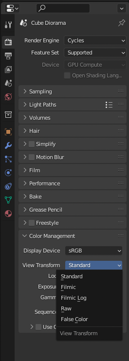
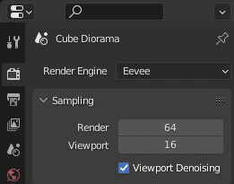
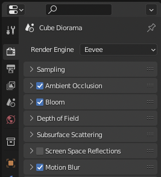
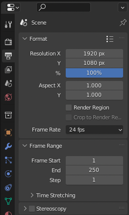
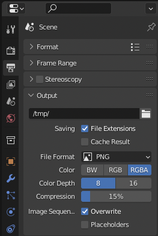
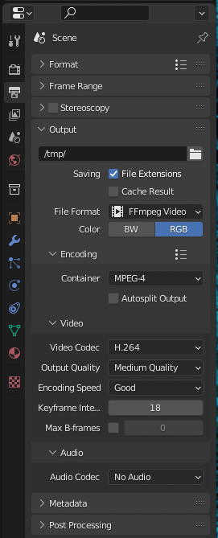
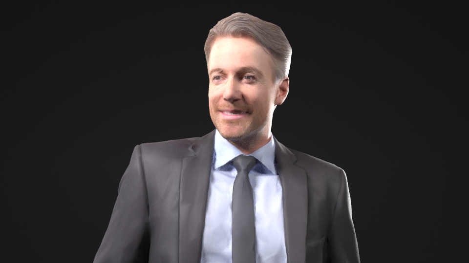
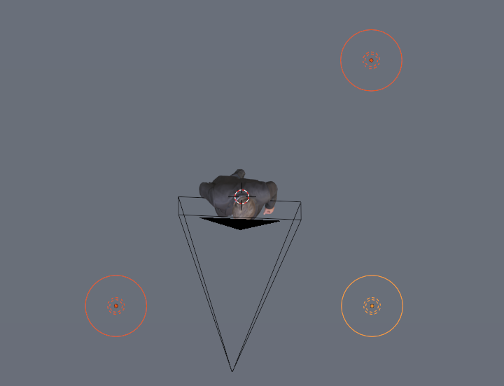

# メディア表現V 9.  ライティング・レンダリング

[メディア表現V TOPに戻る](./index.md)

---
## 目次

- [メディア表現V 9.  ライティング・レンダリング](#メディア表現v-9--ライティングレンダリング)
  - [目次](#目次)
  - [基本知識](#基本知識)
    - [Lightの種類](#lightの種類)
      - [Point Light](#point-light)
      - [Sun](#sun)
      - [Spot Light](#spot-light)
      - [Area Light](#area-light)
    - [環境テキスチャ](#環境テキスチャ)
      - [環境テキスチャとは](#環境テキスチャとは)
    - [カメラの設定](#カメラの設定)
    - [カラーマネージメント](#カラーマネージメント)
    - [レンダリング](#レンダリング)
      - [レンダリングエンジンCycles/Eevee違い](#レンダリングエンジンcycleseevee違い)
      - [レンダープロパティ](#レンダープロパティ)
      - [シーンプロパティ(フォーマット・レンジ)](#シーンプロパティフォーマットレンジ)
      - [シーンプロパティ(出力プロパティ)](#シーンプロパティ出力プロパティ)
      - [OpenEXR MultiLayer(上級者向け)](#openexr-multilayer上級者向け)
    - [3点ライティング](#3点ライティング)
      - [KeyLight](#keylight)
      - [FillLight](#filllight)
      - [BackLight](#backlight)
  - [やってみよう Part1](#やってみよう-part1)
    - [モデルdownload](#モデルdownload)
    - [地面、背景を作成しよう](#地面背景を作成しよう)
    - [3点ライティングを試そう](#3点ライティングを試そう)
  - [やってみようPart2+(余裕ある人)](#やってみようpart2余裕ある人)
    - [レンブラントライティングとは？](#レンブラントライティングとは)

---
今回は、知識ベースで進める。適宜試して欲しい。最後に3点ライティングをBlenderで試してみる。

---
## 基本知識
### Lightの種類
3Dでは光がなければ全くの暗闇になってしまい、レンダリングしても真っ黒になってしまう。

#### Point Light
- 電球を想像しよう。
- 発光限は点
- 全方向を照らす

#### Sun
- 太陽
- 位置は関係なく、方向のみが関係する
- 光は平行

#### Spot Light
- 発光源は点
- 指定した方向のみ照らす

#### Area Light
- 発光源は面
- 指定した方向のみ照らす

<!-- mov_sample_1 4 types of light -->

[参考：４種類のライトとその違いを把握しよう！](https://vtuberkaibougaku.site/2020/10/29/blender-light/){:target="_blank"}

[参考：照らす光を設定する「ライティング」の使い方](https://ytktfeelfree.com/tool/software/blender/how_to_use_lighting_/4138/){:target="_blank"}

[参考：Blender基本操作（光源）](https://cg.xyamu.net/Blender/entry35#light-type){:target="_blank"}

---
### 環境テキスチャ
#### 環境テキスチャとは
- 環境テクスチャとは、 周囲環境の映り込みや環境光、間接光などを再現するためのデータ。
- 多くの場合HDRIと呼ばれるフォーマットが利用される。
- マテリアルプレビューモードではダミーでHDRIが設定されている
- レンダリングで利用する場合には明示的に環境テキスチャの設定の必要がある。
- HDRIファイルは[Poly Haven](https://polyhaven.com/){:target="_blank"}が有名。

[参考:](https://reflectorange.net/archives/041.html){:target="_blank"}

<!-- mov_sample_2 How to Download HDRI -->
<!-- mov_sample_3 Setting up Environment Texture-->

---
### カメラの設定
- 焦点距離・被写界深度などは実際のカメラと全く変わらない
- 変わるとすれば、ありえない数値を設定できること
- オブジェクトを決めて、オートフォーカスみたいなこともできる。

<!-- mov_sample_4 Camera Setting-->

---
### カラーマネージメント
- Blenderの画面で見える色はカラーマネージメントされている
- デフォルトでは「Filmic」となっていて、フォトリアルにみえるようにカラーコレクションされている
- 意図がある場合には、これを「Standard」等他のモードに変えなくてはいけない

- Filmic

- Standard

<!-- mov_sample_5 Camera Setting-->
---

### レンダリング
- Blenderで設定されたファイルを静止画・動画に計算すること
- メッシュ数が多かったり、多くの指示をすればするほど時間はかかる
- 基本的には、動画では1フレームにかかる時間xフレーム数だけレンダリングに時間がかかる
- 例えば1フレームに5秒かかって、フレーム数が100フレームあれば、500秒(約8分)かかる

#### レンダリングエンジンCycles/Eevee違い
- Cyclesの方が綺麗だけど、いろんなこと計算するので遅い
- 静止画ならよいが、動画はEevee推奨
- レンダリングエンジンによって使えるパラメータが異なるものがある
- マテリアルもCyclesでないとちゃんと表示できないものもあるので注意

#### レンダープロパティ
- レンダー・ビューポートのSamplingの数値が高くなると綺麗になるが、計算に時間がかかる

- Ambient Occulusion(環境遮蔽したい時)、Bloom(オブジェクトを光らせる時)、Motion Blur(動画の時)にチェックを入れとこう
  

#### シーンプロパティ(フォーマット・レンジ)
- 解像度、アスペクト比はデフォルトだと1920x1080,1:1。必要があれば変更
- フレームレートはデフォルトで24fps(アニメーション向け)なので、29.97を使いたい人は変更
- 動画の場合は書き出す開始・終了フレームを指定する。

#### シーンプロパティ(出力プロパティ)
- ファイルフォーマットは静止画ならpng, jpeg
- 動画はFFmpegVideo(Encoding:Mpeg-4)で基本はOK
- 他のアプリで利用するために圧縮したくない場合は、連番形式、という静止画複数枚に描き差す方法がある。
- Compressionは画質の圧縮でなく、レンダリングを圧縮するかどうか、という意味らしい
- Blenderでは色の管理を「Filmic」というモードをデフォルトとしている。もっと明るくパキッとさせたい時は、Standardに変更した方がよいかも

#### OpenEXR MultiLayer(上級者向け)
- 3Dアプリでは、色だけでなく、質感(光沢・ラフネス等)などを画像で出力することができる。
- OpenEXRという画像フォーマットでは、これらの画像をレイヤー形式にしてひとつのファイルとして扱うことができる。
- BlenderからAfterEffectsなどに持って行く時に利用できる。

[参考：BlenderでEXRマルチのレンダからコンポジットまで](http://dekapoppo.blogspot.com/2017/06/blenderexr.html){:target="_blank"}

[参考：Blender2.8 レンダーパスを出力する](https://www.3dcgnya.com/entry/Blender/RenderPass){:target="_blank"}

[参考：Rendering » Layers & Passes » Passes](https://docs.blender.org/manual/en/latest/render/layers/passes.html){:target="_blank"}

---

### 3点ライティング
#### KeyLight
- メインのライト
- ライティングしたい対象物の斜め前方に配置する
- 光量が一番多い

#### FillLight
- サブのライト
- キーライトの影が暗すぎる時にキーライトの反対側において補完する

#### BackLight
- 対象物の輪郭をはっきりさせるためのライト

[参考:ライティングの基礎！映画や写真撮影でも使われている照明技法とは？- 初心者向け簡単解説！](https://www.youtube.com/watch?v=_bWYZ3lrGHI){:target="_blank"}

---
---

## やってみよう Part1
人への照明の当て方(3点ライティング)をBlender上で試してみよう。

### モデルdownload
今日は、人の顔にどう照明を当てるか、を試したいので、まずはなるべくリアルなモデルをダウンロードしましょう。

元のファイルはここ[RenderPeople.com(rp_dennis_posed_004_BLD)](https://renderpeople.com/free-3d-people/){:target="_blank"}にあるのですが、他のフォーマットのもの、高解像度のものも入っていて、データが重くなるので、Blenderの低解像度版のみをここにおきました。ダウンロードしましょう。

[ダウンロード](data/rp_dennis_posed_004_BLD_Blender30kOnly.zip)

- Blenderフォルダの中にの中に「mr5_08Part1」フォルダを作って、そこに解凍しましょう。

### 地面、背景を作成しよう
- .blendファイルを開く
- Viewportのメニューが下にいっているのでflip to top
- Shift+AでPlane追加
- 適当にScale
- Editモードで奥の辺をEZで押し出して背面を作る
- マテリアルは適当に
- 画面を分割して、片方はカメラビューにしておこう
- Light削除して、真っ暗になることを確認しておこう

### 3点ライティングを試そう
- PointLightを追加して、KeyLight, FillLight, BackLightを適当に置いて、きれいにみえる位置・パラメータを探そう

<!--
今日はちゃんとした人の顔を使ってライティングをしてみたいので、次のページからダウンロードしてみよう。
[健康な人の全身3Dモデル](https://open3dmodel.com/ja/3d-models/healthy-man-full-body_40403.html){:target="_blank"}

ちょっとダウンロードしづらいので動画みながらダウンロードしよう。

1. ダウンロードリンクのテキストをクリック
2. グレーアウトしてみえるダウンロードをクリック
3. Objをインポートした後、Textureを貼ってあげないといけない
Body_Subdermal.jpg
を貼ればとりあえずどうにかなる
Bump->normal?
(質感に関して、もうちょいやりたい)
-->

---
## やってみようPart2+(余裕ある人)
レンブラントライティングを試してみよう。

### レンブラントライティングとは？
- ポートレイトなどでよく使われるライティング
- 顔に立体感が出て、ドラマティックに見える
- 基本的には人物の鼻筋に対して上方斜め45度から光をあてることで表現できる
- 光をあてていない方は基本暗くなり、ほほのあたりだけが少し光があたる

[参考：レンブラントライティングで撮るポートレイト](https://shuffle.genkosha.com/technique/lighting/7342.html){:target="_blank"}

<!-- ## CyclesだとnodeでblackbodyでKelvin使える-->

