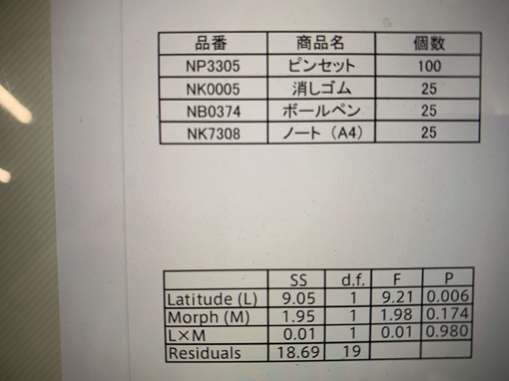

# メディア表現 VI 6. モダンExcel Part2

[メディア表現 VI TOP に戻る](./index.md)

---

## 目次<!-- omit in toc -->

- [メディア表現 VI 6. モダンExcel Part2](#メディア表現-vi-6-モダンexcel-part2)
  - [前回のおさらい](#前回のおさらい)
  - [モダンExcel](#モダンexcel)
    - [MacとWin版のExcelの差](#macとwin版のexcelの差)
    - [本の紹介](#本の紹介)
  - [データの取得](#データの取得)
    - [ETL](#etl)
    - [データの読み込みについて](#データの読み込みについて)
      - [ファイルメニューのインポートから](#ファイルメニューのインポートから)
      - [データTABのデータファイル指定(PowerQuery)](#データtabのデータファイル指定powerquery)
      - [データTABの画像からのデータ](#データtabの画像からのデータ)
    - [PowerQueryを使ってCSVを取り込んでみよう](#powerqueryを使ってcsvを取り込んでみよう)
    - [悲しいお知らせ](#悲しいお知らせ)
  - [おまけ](#おまけ)

---

## 本日の内容<!-- omit in toc -->
- 【第6回】モダンExcelII を用いた分析・可視化について学修する。

4回目に特別講師の方の話が入っているため、1つずれています。

---
## 前回のおさらい
- Officeのバージョンについて
- ピボットテーブル(クロス集計)
- テーブル
- スピル

今日はいよいよモダンExcelに入っていきましょう。

---
## モダンExcel
- Power Query(パワークエリー)
- Power Pivot(パワーピボット)

の二つの重要な機能があると説明しました。

それぞれについて順に(関連することも含めて)やってみましょう。

なお、win/macで機能の差があり、winの方が開発が進んでいるようですが、macに合わせてやっていこうと思います(後でごめんなさいします。)

### MacとWin版のExcelの差
- [参考:Mac版ExcelではWindows版と違う方法を使い外部データを取り込む](https://qiita.com/tex_owleyes/items/00b26bd2e479a679387e){:target="_blank"}
- [参考:MacのExcelアプリでパワークエリ機能が強化された。](https://akmemo.info/mac-powerquery-update/){:target="_blank"}

もう少しで本当の機能までアップデートされそうです。現在実装されている範囲で行っていきましょう。

### 本の紹介
- [モダンExcel入門](https://www.amazon.co.jp/%E3%83%A2%E3%83%80%E3%83%B3Excel%E5%85%A5%E9%96%80-%E6%9D%91%E4%BA%95-%E7%9B%B4%E5%BF%97/dp/4296109324){:target="_blank"}

---
## データの取得
### ETL
ETLという考え方があります。
- Extract 抽出する
- Transform 変換する
- Load 読み込む

モダンExcelにてこのETLを担うのがパワークエリとなります。

### データの読み込みについて
#### ファイルメニューのインポートから
CSV,HTML,Textファイルを選ぶことができます。

#### データTABのデータファイル指定(PowerQuery)
Excelブック、テキスト・CSVが選択できます。

#### データTABの画像からのデータ
気づいたら画像認識できるようになっています。

試しておきましょう。
https://tsutawarudesign.com/miyasuku1.html
を写真にしたこのファイルを使いましょう。

1. 画像をデスクトップにドラッグして保存
2. 挿入するセルを選択
3. データTAB - 画像からのデータ
4. ファイルから画像...
5. 解析させる
6. ピンクのところが間違えか怪しいと思ったところなのでそこを手で修正(または同意する)
7. 挿入

これって、写真の撮り方によっては非常に有効ですね。覚えておきましょう。

### PowerQueryを使ってCSVを取り込んでみよう
1. https://www.data.jma.go.jp/risk/obsdl/index.php
2. 地点を選ぶ：東京の東京、練馬
3. 項目を選ぶ：日別値
   - 気温：日平均気温
   - 降水：降水量の日合計
   - 日照/日射：日照時間
   - 風：日平均風速,日最大風速(風向)
4. 期間を選ぶ：最近1年
5. 表示オプションを選ぶ：まま

としてCSVファイルをダウンロード

なお、Excel,CSVファイルの位置関係が重要ですので
1. 今日の作業ファイルを作成
2. Excel,CSVファイルともその中に移動
3. Excelファイルを開く

としてから先に行きましょう。

1. データタブの「データファイルの指定(PowerQuery)」
2. テキスト/CSV
3. 参照でdata.csvを選択してデータ取り出し
4. 次へ
5. 文字化けしているので「932：日本語(シフトJIS)」
6. 読み込む
7. シートが新しく作成されて、テーブルとして作成される。

ん？インポートと何が違う？と思いますよね？

それでは、実験してみましょう。

1. data.csvをテキストエディットで開く
2. 日付の入っている1行消す
3. Excelに戻って、テーブルが作成されている状態で、すべて更新

これは何を意味するのでしょうか？

- 外部データの場所を保持している
- 読み込みの条件を保持している
- データが変更されると、即時反映することができる。

例えば、毎日売上表が各店舗からExcel等でくるとします。

フォーマットが一緒です。

「すべて更新」とするだけで、表を取り込むことができ、さらには、そのデータを利用した以降の処理に反映することが可能、ということになります。

---
### 悲しいお知らせ
シラバス作成時に先走りすぎました。
ETLのE(Extract),L(Load)の部分を試しましたが、Transformはやってません。

これ、PowerQueryエディターを搭載してくれないと動かないのです。

Macのベータ版では動いているのですが、皆さんのにベータ版を入れるわけにもいかないので、YouTubeで見てみましょう。英語なので注釈入れながら見ましょう。

- [Excel Update: Power Query Editor for Mac](https://www.youtube.com/watch?v=lPEDULKhgRM){:target="_blank"}

そして、現在のMac版ExcelにてPowerPivotが利用できない、と動画でも言っていました。

ただ、個人的見解ですが、近い将来には実装されると思います。

それは、AirTableでわかるように、うかうかしているとExcelも安泰ではないと考えるからです。ローコード・ノーコードの波は確実に来ています。

それは、難しい関数を覚えなくても、考え方さえわかれば簡単に分析をすることが可能になるということです。考え方は知っておきましょう。

モダンExcelとは何かをPowerPivot含めて、次は日本語で見てみましょう。

- [最近注目度が高まってきているスキル！モダンExcelについて詳しく解説します！パワークエリ、パワーピボットについて概要説明あり！](https://www.youtube.com/watch?v=YfIlxtX9IQ8){:target="_blank"}

---
## おまけ
Macでしか使えないようですが、ポートフォリオ等で使えるかもしれないツールがリリースされたので試してみましょう。

- [rotato](https://rotato.app/){:target="_blank"}

1. ダウンロードしましょう
2. 起動してアカウント作成してアンケートに答えましょう
3. 1170 x 2532 ピクセルの画像または動画を用意しましょう。サイズ違うと画面にうまくはまって見えないだけです。(なくても実験できます)
4. Newしてドラッグ&ドロップしましょう。
5. 画像で保存したり、動画で書き出せたりします。

無料版だと「rotate.app/free」とついてしましますが、問題ないのではないでしょうか？
XDで作成したプロトタイプをより素敵に見せられるかもしれません。

