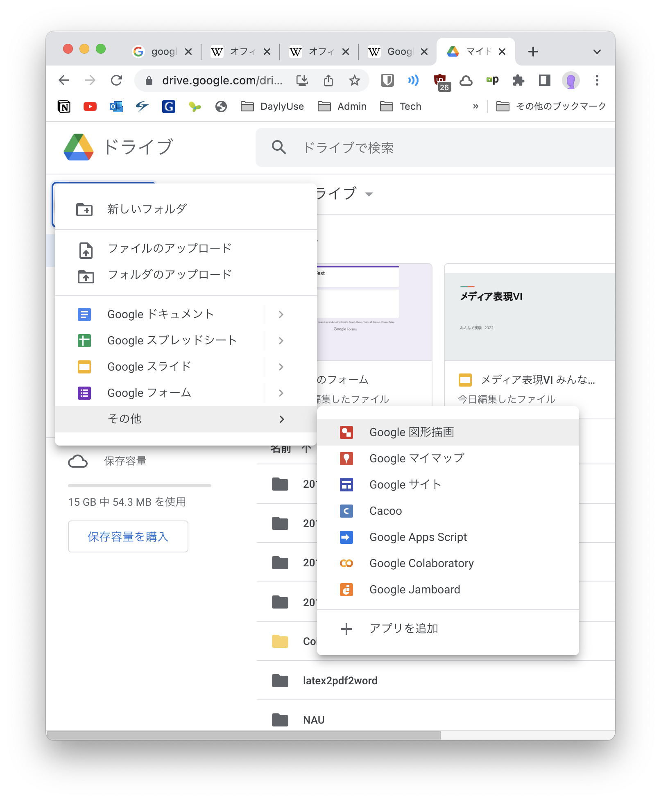

# メディア表現 VI 8. GoogleツールI

[メディア表現 VI TOP に戻る](./index.md)

---

## 目次<!-- omit in toc -->

- [メディア表現 VI 8. GoogleツールI](#メディア表現-vi-8-googleツールi)
  - [生産性を上げるツール群](#生産性を上げるツール群)
    - [増え続けるツール群](#増え続けるツール群)
    - [注意するべきこと](#注意するべきこと)
    - [今日の進め方](#今日の進め方)
    - [Googleについて](#googleについて)
    - [Googleのプロダクト](#googleのプロダクト)
    - [ブラウザ](#ブラウザ)
      - [機能拡張](#機能拡張)
    - [メール](#メール)
      - [メールアプリケーション](#メールアプリケーション)
      - [Webメール](#webメール)
    - [オフィススイート](#オフィススイート)
      - [オフィススイートとは](#オフィススイートとは)
      - [オフィススイートの変遷](#オフィススイートの変遷)
      - [ネット上に文書を置くことのメリット](#ネット上に文書を置くことのメリット)
    - [クラウドストレージ](#クラウドストレージ)
      - [ローカルとクラウド](#ローカルとクラウド)
      - [GoogleDrive と GoogleDocs](#googledrive-と-googledocs)
    - [GoogleDriveで利用できるアプリ1 Google Slide](#googledriveで利用できるアプリ1-google-slide)
      - [実験してみよう](#実験してみよう)
    - [GoogleDriveで利用できるアプリ2 追加ができる！](#googledriveで利用できるアプリ2-追加ができる)
    - [アイディアを出そう](#アイディアを出そう)
      - [やってみよう](#やってみよう)
    - [その他使いやすいGoogleツール紹介](#その他使いやすいgoogleツール紹介)
      - [Googleトレンド](#googleトレンド)
      - [やってみよう](#やってみよう-1)
  - [ビジネスツール](#ビジネスツール)

---

## 本日の内容<!-- omit in toc -->
- 【第7回】Googleツール I Googleが提供する様々なツールについて学修する。
- 【第8回】Googleツール II Googleが提供する様々な管理ツールについて学修する。

4回目に特別講師の方の話が入っているため、1つずれています。
シラバス作成時にGoogleツールI,IIとしましたが、今回二つをまとめてしまいます。

---
## 気になっているwebサービス(シラバス変更の可能性)<!-- omit in toc -->
**Bubble**というWebサービスの開発用のノーコードツールが非常に注目を浴びています。

- ノーコードツールの中でトップクラスに柔軟な開発ができる
- 無料から利用できる
- プログラミング不要でWebサービスの開発ができる

というメリットがあります。

**AirTable**を利用してもらいましたが、これはノーコードのデータベース管理ツールです。
プログラミングの必要がなかったため、みんな全く苦にせず扱えてた気がします。

元々**Python**というプログラミング言語を利用して、12回目-14回目のシラバスを作成していましたが、
プログラミング言語扱うよりも、ノーコードツールの方が理解できるかな...とも思うので、悩み中です。

[NoCode Ninjaが推薦！間違いのないノーコードツール８選](https://note.com/nocodeninja/n/n644970b1fbb3)

---
## 前回のおさらい<!-- omit in toc -->
Macでは現在完全な形ではモダンExcelを利用できませんでしたが、もうすぐ利用できるようになります。
- Power Query(パワークエリー)
- Power Pivot(パワーピボット)

の二つの重要な機能があると説明しました。

の考え方を理解しておくことで、今後PowerBI等でも利用ができ、可視化が簡単にできます。

---
## 生産性を上げるツール群
### 増え続けるツール群
Googleツール、とシラバスでは記載しましたが、Googleだけでなく、Microsoft(Office365)・Apple等さまざまな会社が生産性を上げるためのツールが頻繁にリリースされています。

より便利なツールを知っていれば、それだけ効率的に情報操作が可能となります。

スマホのアプリで便利なものがあれば利用するように、便利なツールは利用していきましょう。

### 注意するべきこと
無料で利用できるツールがさまざまリリースされていることは素晴らしいことですが、

- サービスが勝手に終了してしまう

という可能性もあります。

有料のソフトウェアでも、OSのバージョンアップによって利用できなくなることもありますが、この点、Web系のサービスでは特に顕著にいきなりサービス停止があることは知っておきましょう。

サービス停止でなくても、他のサービスに吸収されることもあります。

### 今日の進め方
Googleが展開するツールをベースにさまざまなツール群を紹介していきます。

また、アイディア出しに利用できるツールについても紹介していきます。

---
### Googleについて
みなさんご存知のように、Googleは元々検索エンジンの会社として発足しましたが、オンライン広告、クラウドコンピューティング、ソフトウェア、ハードウェア等多岐に渡るサービスを展開しています。

その目標を
> Google の使命は、世界中の情報を整理し、
> 世界中の人がアクセスできて使えるようにすることです。

と設定しています。

### Googleのプロダクト
[便利なプロダクトをすべての人に。](https://about.google/products/?tab=rh){:target="_blank"}

たくさんありますね...種類ごとに見ていきましょう。

---
### ブラウザ
Chromeは日本で50.3%, 世界で66.3%とのシェアをとっています。
Safari, Edge, Firefoxもある程度利用されていますが、開発やテスト等にChromeは外せないことを意味しています。
好みでも構いませんが、Chromeをデフォルトブラウザにすることをお勧めします。

[【2022年6月】日本とグローバルのWEBブラウザシェアランキング（PC・モバイル）](https://shiftasia.com/ja/column/2022%E5%B9%B46%E6%9C%88web%E3%83%96%E3%83%A9%E3%82%A6%E3%82%B6%E3%82%B7%E3%82%A7%E3%82%A2/){:target="_blank"}

#### 機能拡張
chromeには
[chrome ウェブストア](https://chrome.google.com/webstore/category/extensions?hl=ja){:target="_blank"}
という機能拡張用のストアがあり、機能を増やすことができます。

ネットを利用する上で、ブラウザを利用することは多いですから、そこでの作業効率は非常に大事なことです。
必要に応じて入れてみましょう。

- [作業効率・生産性を爆上げ！おすすめのGoogle Chrome拡張機能10選【2022年版】](https://www.notta.ai/blog/10-best-google-chrome-extensions){:target="_blank"}
- [Chrome拡張機能おすすめ10選。作業効率UPにおすすめ！](https://yourclip.life/post/google-chrome-extension-for-work/){:target="_blank"}
- [Chrome拡張機能おすすめ｜長年使って生き残った便利なアドオン](http://pasokatu.com/6802){:target="_blank"}

種類がありすぎて、人によっておすすめ違いますね。

自分もかなり入れているので、全て紹介はできませんが、誰にでも便利なkeepaを紹介しておきます。

- [keepa](https://chrome.google.com/webstore/detail/keepa-amazon-price-tracke/neebplgakaahbhdphmkckjjcegoiijjo?hl=ja){:target="_blank"}

---
### メール
#### メールアプリケーション
メールは元々メールアプリケーションにて利用していました(います)。
もちろん今でもメールアプリケーションは便利ですが、問題があります。

メールはSMTP,POP3,IMAPといったプロトコルを利用し、ポート番号を利用します。
[SMTPとPOPとIMAPの違い(メールのプロトコル)](https://itsakura.com/network-smtp-pop-imap){:target="_blank"}

> ポート番号: インターネット上の通信において、複数の相手と同時に接続を行なうためにIPアドレスの下に設けられたサブ(補助)アドレスのこと

環境によってはポート番号を塞いでしまって利用できなくしてる場合があります。そうすると、事実上メールアプリケーションの利用ができなくなります。

#### Webメール
Webではポート番号80,443を利用しています。
この二つのポート番号はHP閲覧に必ず必要なため、閉じている環境はほぼありません。(インターネットに接続できないくらいですね)

すると、Webを利用したWebメールが環境によらず使えて便利、ということになっています。
- Gmail(Google)
- Outlook(Office 365)

がこの形態をとっています。

Googleアカウントは便利なので一つ持っておくと良いでしょう。
- 大学メール：大学生の間に利用するアカウント
- Gmail：将来も利用するアカウント

と切り分けると便利です。

---
### オフィススイート
#### オフィススイートとは
オフィスで利用する
- ワープロ
- 表計算
- 電子メール
- 個人情報管理
- プレゼンテーション
- データベース

等をセットにしたソフトウェアをオフィススイートと言います。

歴史は古く、1990年代から開発されています。

#### オフィススイートの変遷
昔はアプリケーション形式でした(インストール必須)。
現在でもアプリケーション形式のものも当然ありますが、現在ではWeb上で利用できるものが増えています。
後述するクラウドストレージと連携して使えるようになり、
- 複数人での共有
- 同期
- バージョン管理

なども可能となっています。

#### ネット上に文書を置くことのメリット
仕事をする上で、文書の更新は頻繁に行われますが(特にExcel)、これは非常に非効率なことを生み出していました。
- 最新版がメールにて届く
- 頻繁に更新されると、どれが最新版だかわからなくなる

ところが、これをネット上に置くことで
- 更新を複数人で可能
- 誰が変更したか後で確認可能
- ネット上の文書を見ることで、必ず最新版を利用できる

---
### クラウドストレージ
#### ローカルとクラウド
コンピュータに搭載のHDDやSSDをローカルストレージと呼び、インターネット上の記憶容量をクラウドストレージと呼びます。
- OneDrive(2007-)
- iCloud(2011-)
- GoogleDrive(2012-)

となっています。使っている人もいると思います。無料で利用できる容量には限りがあるため、計画的に使いましょう。

#### GoogleDrive と GoogleDocs
オフィススイートであるGoogleDocument(2006-)とGoogleDriveが連携されたことで、かなり便利になってきています。
現在ではOneDriveとOffice365が連携できていますが、Googleの方がこの連携が早く行えていた気がします。

---
### GoogleDriveで利用できるアプリ1 Google Slide
GoogleDriveで利用できるアプリとしてGoogleDocs(document, spreadsheet, slide etc...)があります。

これ非常に便利で、誰がどのように変更を加えているか確認できます。

#### 実験してみよう
共有リンクをTeamsに貼りますので、そこからアクセスして、新しいスライドを作成して、全員で一気にスライド編集してみましょう。
(この人数でやったことないので失敗するかもだけど...)

---
### GoogleDriveで利用できるアプリ2 追加ができる！
GoogleDrive使っている人も新規でここまではみたことあるかもしれませんが

**アプリを追加**という項目が存在しています。

クリックしてみましょう。

いろいろなアプリを追加することが確認できます。
**MindMup for Google Drive**をインストールしてみましょう。

アクセス権を聞いてきますので、「許可」してください。

次に新規から開くと次のように追加されています。

---
### アイディアを出そう
アイディア出しの機会はこれからもどんどん増えていきます。
履歴書・ES作成時もそうですし、企画書作成などでも必要となります。

アイディア出しの方法を少し紹介しましょう。

[【企画担当者向け】アイデア出しの方法とおすすめのツール6選を紹介](https://www.stock-app.info/media/?p=9294){:target="_blank"}

アイディア出しにおいてツールを利用することで、
- 考えたのに忘れてしまうことを防げる
- 整理しやすい

というメリットがあります。

先ほどインストールしたMindMupは名前の通り(綴は異なりますが...)マインドマップのためのツールとなります。

#### やってみよう
- 真ん中に「私の強み」とかきましょう
- 周りに思い浮かぶ言葉をたくさん描きましょう
- その周りにさらに思い浮かぶ言葉を書きましょう。

---
### その他使いやすいGoogleツール紹介
- Google Fonts
- Google入力ツール
- Google翻訳
- Googleトレンド

くらいをよく使っている気がしますが、Googleトレンドを紹介します。

#### Googleトレンド
キーワードの検索需要の推移をグラフでチェックできるツールです。

エリアを限定したり、期間を限定したりできます。

シェアや、世の中で言われていることが客観的にデータとして正しいか調べる時などに利用します。

#### やってみよう
- **SDGs**をGoogleトレンドでググってみましょう。
- 気になることがあれば、その理由をググって探してみましょう。

---
## ビジネスツール
Googleでは一般的なツール以外にビジネスやサイト管理者向けのツールが存在しています。まとめて**Google Marketing Platform**と現在は読んでいるようです。

最後に紹介して終わりにします。

- [Google Marketing Platform](https://marketingplatform.google.com/intl/ja/about/){:target="_blank"}

