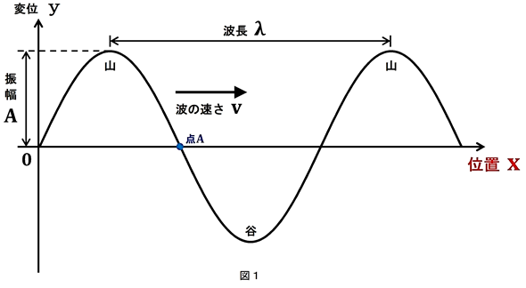
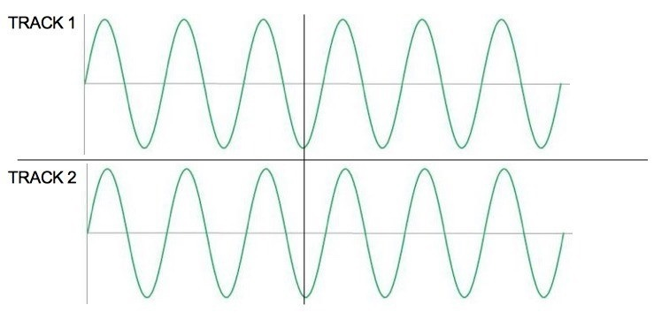
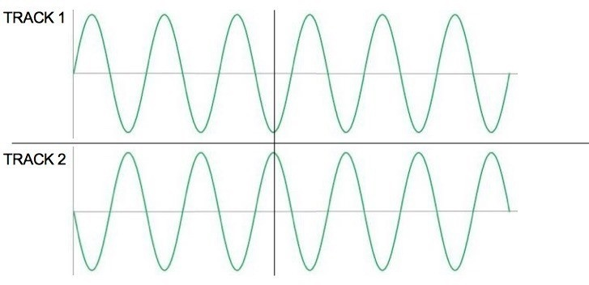
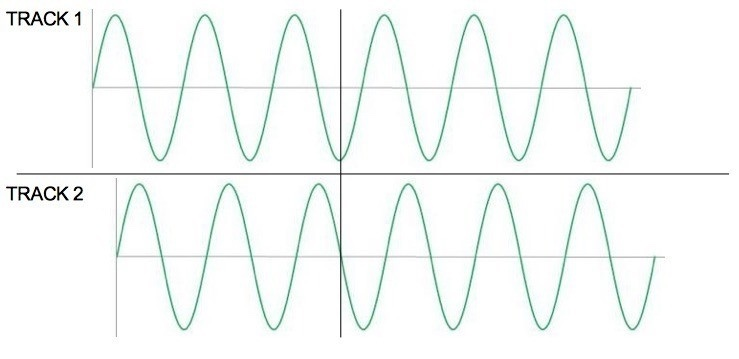
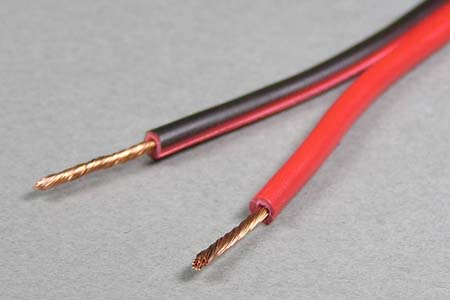
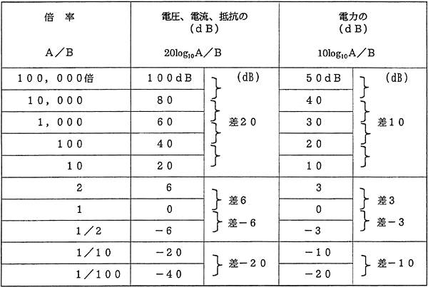

# サウンドデザイン演習 2. 音とは何か？<!-- omit in toc -->

# 目次<!-- omit in toc -->

1. [音とは?](#音とは)
   1. [原理](#原理)
   2. [音の三属性](#音の三属性)
   3. [いい音・悪い音](#いい音悪い音)
   4. [波の性質](#波の性質)
   5. [ステレオと位相について](#ステレオと位相について)
   6. [デシベルと音圧レベル](#デシベルと音圧レベル)
   7. [制作環境](#制作環境)
   8. [音声チャンネルについて](#音声チャンネルについて)
   9. [小レポート](#小レポート)

## はじめに

## HPの置き場所(再掲)

今年、ちょっとやり方を変えてみます。
これまで

http://nas1-mc.thu.ac.jp/joomla/

にデータを置いていましたが、これは学外から閲覧できませんでした。
そのため

https://sammyppr.github.io/

に置きます。これは学外からも閲覧可能です。

# 音とは?

## 原理
私たちは
```
外部の音源から空気を媒介として
聴覚が刺激されること
```
で音として感じています。

## ?<!-- omit in toc -->
宇宙では音が基本的には聞こえないということですね。

厳密には宇宙も完全な真空ではないので、少しは聞こえるようですが...

## 定義<!-- omit in toc -->

音源：発生する音の発信源となるモノ
媒介：2つのモノの間にあって、両者の関係のなかだちをするモノ 
聴覚：一定範囲の周波数の音波を感じて生じる感覚のこと

## みんな同じように聞こえているか?<!-- omit in toc -->
と思う?


同じ音でも聴こえ方は人それぞれ違って聴こえているよ!
そのため、
```
主観的な音 人が聴こえている音(バラバラ)
客観的な音 物理的に説明できる音(一つ) 
```
という視点をまず持って欲しいです。

## 音の三属性

音の
- 大きさ
- 高さ
- 音質 (音色) 

これらを「音の三属性」と呼びます。

## 音の大きさ:Loudness<!-- omit in toc -->
A と B の大きさを比較すると、どちらが大きいかは判別できますよね。

物理的には「音の強さ (音圧):Sound Intensity」といい dB(デシベル) という単位で数量化できます。

## テレビを見てて...<!-- omit in toc -->
CM になると、音が「でかっ」って思うことないですか?

あれは、音圧をあげることで、注意をひこうと思っているからです。

## (脱線)CM の音<!-- omit in toc -->
尺は 15 秒とか 30 秒等ですが、頭と終わりは 15 フレーム (0.5 秒) は無音になっています。

業界用語では「ノンモン」と呼びます。

そうしないと、CMとCMのつなぎが大変なことになるからです。

## 音の高さ:Pitch<!-- omit in toc -->

A と B の音の高さを比較できますよね。

物理的には「周波数」で Hz(ヘルツ) という単位で数量化できます。

## Hz とは?<!-- omit in toc -->

1 秒間に何回振動するかという単位です。 一般的に人は
```
20Hz~20kHz(20000Hz)
```
までを聞くことができると言われています。ただし、年をとると上が聞こえなくなってきます。

## モスキート音(高い音)<!-- omit in toc -->
17kHz 前後の高周波音で、聞こえる人と聞こえない人がいますよね。
ちょっと試してみましょう。

[モスキート音　測定](https://www.sainokuni-rionet.jp/choice/7_index_detail.html)

## ステンレス定規(低い音)<!-- omit in toc -->
机に押さえつけてブルブルさせたことあります?

20 回以上振動していれば、その Hz で空気が振動し、低い音が聞こえる という原理になっているわけです。

## ハイパーソニックエフェクト(聞こえないはずの音)<!-- omit in toc -->
まだ未解明なことの多い現象ではありますが、20kHz 以上の波も人の生理活動・脳活動に影響を与えることがわかってきています。

[ハイパーソニック・サウンド](https://www.env.go.jp/nature/nats/sound/about.html)

## 音質 (音色):timbre, sound quality, tone color<!-- omit in toc -->
定義が難しいらしく JIS(日本規格協会) にて次のように定義されています。
```
2音の大きさ、および高さがともに等しくても、その 2音が異なった感じを与える時、その相違に相当する性質をいう

備考:音色は音のスペクトル、波形、音圧およびそれらの時間的変化などに関係がある
```
JIS Z8109-1967

## 平たく言うと<!-- omit in toc -->
ピアノとギターは同じ音程を弾いても、音が違いますよね、くらいに捉えておきましょう。

## いい音・悪い音
「芸能人格付けチェック」という番組で、たまに高価な楽器と安価な楽器の聴き比べをしてますよね。

なかなか当てるのは難しいです。いい音悪い音、というのは感覚的にはありますが、それが絶対的でないということも視点として持っておきましょう。

## 波の性質


## 数式<!-- omit in toc -->
T: 周期(山と山の秒数)
F: 周波数(1秒祟りの振動)

$$ T = \frac{1}{F} $$

V: 波の速度(m)
λ: 波長(m)
T: 周期(sec)

$$ V = \frac{λ}{T}=λF $$
$$ λ = \frac{V}{F} $$

## 水の波紋で考えてみよう<!-- omit in toc -->

石をぽちゃっと投げると、波が出来ます。

波は広がっていますが、1 点のみを観測すると、水位が山になったり谷になったりしますね。

これが、波だと思っていいです。

## 空気の場合には?<!-- omit in toc -->

空気が上下に振動しているわけではありません。

密度が
- 疎: 間がすいている
- 密: すきまなく集まっている

の状態に変化しながら伝播していきます。

[縦波の横波表示の説明【高校物理】](https://www.youtube.com/watch?v=1K6QpWIa_bg)

## 広がり方<!-- omit in toc -->

水面では波は円状に伝わっていきますが、

音は空気を媒体として振動が伝わっていくので球面波として立体的に伝わっていきます。

## ステレオと位相について

多くの場合、スピーカーは左右二つあります。この2つの信号から人は、空間的に広がった音を感じることができます。

ですが、配線を間違えた場合には音がおかしく聞こえてしまいます。

これはステレオの信号を扱うときに非常に大事になるので気をつけましょう。位相があっているとかあってないとか言います。

[スピーカーチェック【パート2】 極性位相テスト](https://www.youtube.com/watch?v=PKHX7MvcfjA)

## 正相<!-- omit in toc -->



左右から同じ音を出すと中心から音が聞こえる

## 逆相<!-- omit in toc -->



打ち消しあって音が聞こえなくなる。

## 位相のずれ<!-- omit in toc -->



音は聞こえるけど、なんか迫力がなくなる。
これは、左右のケーブルの長さが異なっていたりすると起こるよ。

## スピーカーコード<!-- omit in toc -->
多くの場合赤・黒の2つの線でできています。
これを正しく接続しないと逆相になってしまうということです。



## デシベルと音圧レベル
電気回路にて音の信号を扱う場合、空気の振動が電気的な信号に変換されます。

信号の大きさを比較する時にそのまま利用すると値が大きくなってしまいます。

そのため、値が大きくならないように常用対数という仕組みを作って、小さな値で扱えるようにしました。

## dB<!-- omit in toc -->


左の数字に比べて、真ん中や右の表し方の方が数字が小さくなりますね。

## 絶対単位と相対単位<!-- omit in toc -->
### 絶対単位
騒音レベルなどは人が聞き取れる限界を0dBとして、それに比べてどのくらい音が大きいかを表しています。130dBとかだと耳が痛いレベルになります。

### 相対単位
音量を少し上げてほしい時には「3dB上げて」とか言われます。これは、現在の音を基準にして利用しています。

## 音圧レベルと音の大きさ<!-- omit in toc -->
さて、同じ音圧レベルの音は、みなさんには同じ音の大きさにきこえるでしょうか?

Auditionで試してみましょう。

## やってみよう<!-- omit in toc -->
1. Auditionを起動
2. 左上のファイルと書いてあるパネルの+から「新規オーディオファイル」-「OK」
3. エフェクト - 生成 - トーン...
4. プリセットが「デフォルト」になっていることを確認して、右のデュレーションを5にしてOK
5. スペースキーで再生して下のレベルが-18dBであることを確認しよう
6. 1-2秒を選択して同様に基本周波数を880にしてみよう
7. 同様に、2-3を1760,3-4を3520,4-5を7040として全体を聞いてみよう。

全て音圧レベルは-18dBなのに、音の大きさ変わるのわかるかな？

## つまり<!-- omit in toc -->
音圧レベルが同じ音が同じ大きさに聞こえるとは限らない、ということが分かりましたでしょうか？


--- 
### VUメーター
音量をみるためのメーター。アナログ時代に良く使われていた。
### ピークメーター
Auditionのレベルメーターはこれ。0を超えるとクリップしてしまう。
### RMSメーター
人の聴感上の音圧を測るのに使用される。しかし、人の周波数による音量の感じ方は反映できない。
### ラウドネスメーター
人が周波数帯域によって感じる音量の差を考慮した音圧を示す、今ある全てのメーターの中でも最も人の聴覚に近い値を調べることができるメーター

## 詳しく知りたい人<!-- omit in toc -->
ここが詳しいのでみてみましょう。
[ピーク、VU、RMS、ラウドネスの違いとは？](https://yugo-music.jp/article-5731.html)

## 制作環境
音は聞く人の環境によって聞こえ方が異なります。

制作する人はなるべく癖がない環境を用意しないといけません。
スピーカーやイヤホンは
- リスニング用
- モニター用

の2種類あり、できればモニター用を用意しましょう。

---
### スピーカー
[スタジオモニター](https://www.soundhouse.co.jp/category/middle/1105)
楽器屋さんで聴き比べてみることをおすすめします。

### CLASSIC PRO ( クラシックプロ ) / CPH7000 ヘッドフォン
安い

### SONY ( ソニー ) / MDR-7506・MDR-CD900ST 定番スタジオモニターヘッドホン
世界中で利用されている


### Sennheiser IE 100 PRO イヤホン
イヤホン型で最近評判が良い。


## 音声チャンネルについて
ステレオはL,Rの2チャンネルですが、サラウンドシステムではさらに立体的に音を再現させるために5.1ch,7.1ch等が存在します。

本演習ではサラウンドシステムについては扱いません。

## 小レポート
「音とは何か？」について簡潔にまとめ、manabaから提出してください。