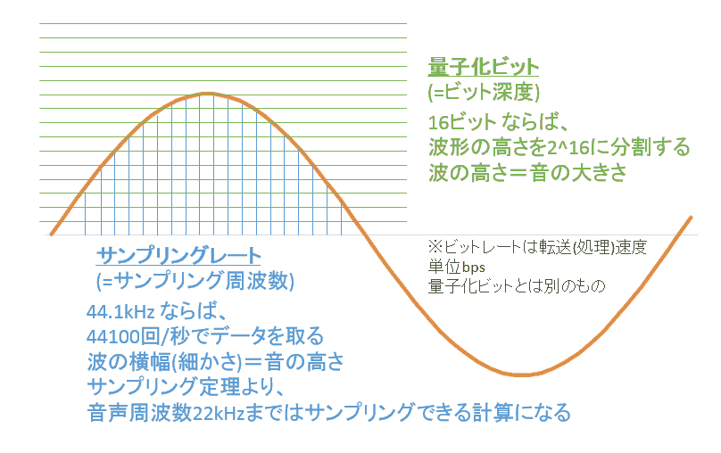
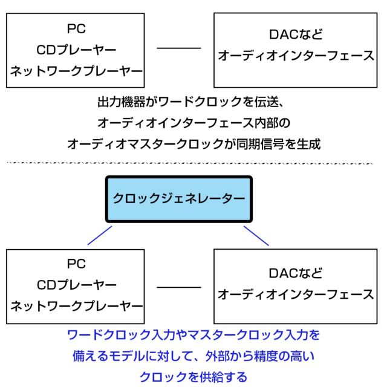

# サウンドデザイン演習 3.音のデジタル化<!-- omit in toc -->

# 目次<!-- omit in toc -->

1. [音のデジタル化](#音のデジタル化)
   1. [導入](#導入)
   2. [デジタル化(サンプリングレート・量子化ビット数)](#デジタル化サンプリングレート量子化ビット数)
   3. [圧縮](#圧縮)
   4. [同期](#同期)
   5. [オーディオインターフェイス](#オーディオインターフェイス)
   6. [周波数分析・スペクトログラム](#周波数分析スペクトログラム)
2. [小レポート](#小レポート)

## はじめに

## HPの置き場所(再掲)

今年、ちょっとやり方を変えてみます。
これまで

http://nas1-mc.thu.ac.jp/joomla/

にデータを置いていましたが、これは学外から閲覧できませんでした。
そのため

https://sammyppr.github.io/

に置きます。これは学外からも閲覧可能です。

# 音のデジタル化

## 導入

---
ハイレゾ音源って知ってますか?
高音質で音楽が楽しめるらしいとは知っているけど...みたいな人が多いかな?

[ハイレゾ音源って何だろう](https://www3.jvckenwood.com/audio_w/high-resolution/guidance.html)

クイズをまずしてみよう。

---
### 聴き比べ
ダウンロードして、3つのファイルをAuditionで開きましょう。
- まずは聴き比べてみましょう。
- 「ウィンドウ」 - 「周波数分析」を開けて、周波数の分布を確認しましょう。

- ハイレゾ音源(WAV/192kHz/24bit) サイズ50,593KB
- CDレベル(WAV/44.1kHz/16bit) サイズ7,747KB
- MP3(圧縮音源/128kbps) サイズ760KB

---
### 実は...
- みんなのMac/PCではハイレゾ音源/CDレベルの違いわからないはず
- なぜなら、コンピュータが通常では44.1kHzに設定されているから
- MacではAudio MIDI設定で96kHzまで(機種による)挙げることはできる
- 192kHzはオーディオインターフェイスを利用しないと実感できない
- さらには、スピーカーが96kHzまで再生できないと聞くことはできない

[AV42](http://m-audio.jp/av42/)

- 周波数特性：75Hz〜20kHz

今日はこの辺のことを学んでいきます。

## デジタル化(サンプリングレート・量子化ビット数)

---
### デジタル化の方法
音は波形ですが、デジタル化はこのように行われています。

---
### サンプリングレート(サンプリング周波数)

1 秒間に何回データをひろうか (横軸)、を決めます。
CD では 44.1kHz となっています。ですので、1 秒間を 44100 分割して データを拾っています。

---
### サンプリング定理
サンプリングレートの半分の周波数までしか音声情報を記録できないこ
とがわかっています。
ので、44.1kHz というのは人の可聴周波数といわれている 20kHz まで は聞こえる、ということで CD の規格が決定されました。

---
### 量子化ビット
縦軸を何分割にするか決めます。
CD では 16bit ですので、65536 分割しています。

---
### サンプルレートを下げて、音質の変化を確認しよう
- レベルメーターの下に「44100Hz/16bit/ステレオ」との記載があることを確認
- Auditionで先ほどのwavファイルを開く
- 編集 - サンプルタイプを変換...
- サンプルレートの変換で、6000まで徐々に落として聞いてみよう。

---
### ハイレゾ音源
さて、話題のハイレゾ音源ですが、定義としては 
> CD を超える高音質のこと

と定義します。

---
### ハイレゾを数値で定義すると

- CD 16bit / 44.1kHz
- ハイレゾ 24bit, 32bit / 48kHz, 96kHz, 192kHz

等となります。CD より、縦軸か横軸かどっちかが細分化されていれば ハイレゾ音源ということになります。さっきのファイル名も

- CD音源：Keep_your_side_16bit441kHz_short.wav
- ハイレゾ音源Keep_your_side_24bit192kHz_short.wav

となっていますね。

## 圧縮

---
### ファイルの容量
インターネットの初期、回線スピードが遅かったため、音声のファイル容量が大きいことが問題となりました。

また、ファイル容量が多いと、iPod,iPhoneに入れる曲数に直結します。

---
### mp3
そのため、圧縮という技術が用いられるようになります。

> Mpeg-1 Audio Layer 3

が正式名称となります。
インターネットを意識した規格のため、ビットレート(1秒間にどのくらいのデータ量か)という考え方を持っています。

192kbps, 256kbps, 384kbpsだと相当高音質に圧縮することができます。

先ほどのmp3ファイルは128kbpsだったので、高音質ではなかったわけですね。ただ、ファイルサイズはかなり小さくなっています。

---
### 圧縮の方法
圧縮の方法には二通りあります。
- 可逆圧縮
- 非可逆圧縮

文字通り、「元に戻せるものと元に戻せないもの」という意味になります。

音声ファイルの非可逆圧縮なものにはFLACがありますが、そんなに普及していません。

---
### 映像で音声を編集する時
劣化しないように、音声の非圧縮形式
- WAV
- AIFF(最近は少ないかな...)

を使いましょう。

---
### 再生目的の時
容量は小さくして、たくさんの曲数持ち運びたいですね。
- mp3
- AAC

などで多少の劣化があっても、そこそこ良い音の形式を利用しましょう。
AACの方が後から出たファイル形式なので、圧縮率が高いですが...

> AACやWMAはMP3より圧縮率が高く、同じビットレートでも容量が小さくなる。 低ビットレートにも強いため、128kbps以下ならAACやWMAの方が「いい音」に聴こえるかもしれない。 逆に160kbpsを超えると、理論上はMP3の方が高音質に。

[参考：MP3やAAC、WMAなどの圧縮音源は、どう使い分けるのがベスト？](https://koneta.nifty.com/koneta_detail/170721000334_1.htm#:~:text=AAC%E3%82%84WMA%E3%81%AFMP3,%E6%96%B9%E3%81%8C%E9%AB%98%E9%9F%B3%E8%B3%AA%E3%81%AB%E3%80%82)

---
### 映像の収録
時代によって変わる可能性がありますが、
- 24bit
- 48kHz
- 非圧縮

が現状では推奨されています。

## 同期

---
### デジタル機器を複数つなげたときの問題点

サンプリングレートを思い出しましょう。

1 秒間に 44100 回データを取っていました。複数の機器がきちんと、こ のタイミングで同じように挙動しないと、エラーが出てしまい、正しく 録音・再生することが出来ません。

そのため、ワードクロックという規格を使って、みんな一斉に同じよう
に行動しようね、という仕組みがあります。

---

## オーディオインターフェイス

---
音を録音・再生したりする時に、コンピュータにマイク端子・ヘッドフォ ン端子がついていれば、そこにつないで一応機能させることはできます。

しかし、音が気になり始めると、専用のオーディオインターフェイスと
いうものを利用することになります。

コンピュータ標準のものは、とりあえずの音を録音・再生する機能しかないため、ノイズがのってしまいます。

---
### 多種多様なオーディオインターフェイス

- 入出力チャンネル
- 音質
- ワードクロック対応/非対応

等によって様々なオーディオインターフェイスが売られています。

[USB接続オーディオインターフェイス 一覧](https://www.soundhouse.co.jp/search/index?s_maker_cd=&s_category_cd=191&s_mid_category_cd=&s_large_category_cd=&s_product_cd=&search_all=&sSeriesCd=&sPriceFrom=0&sPriceTo=9999999&s_spec=&s_zaiko=&i_type=c&i_sub_type=&i_page=1&i_sort=Price_DESC&i_page_size=32&i_ListType=type2&tag=)

今日利用しているのは
[PRESONUS ( プレソナス ) / Studio 26c](https://www.soundhouse.co.jp/products/detail/item/261283/)

---
### 購入を考えている人へ
昔に比べればどれも性能は優れていると思いますが、
- 独自のドライバが必須でないこと
- 普及しているインターフェイス(USB)を使っていること

に注意すると長く使えると思います。

## 周波数分析・スペクトログラム

---
波形を見ただけでは、どの辺の周波数が出ているかよくわかりません。
そのため、
- 周波数分析
- スペクトログラム

というツールを使って周波数の動向を確認します。

---
### 周波数分析

先ほど利用しましたね。
表示方法が
- リニア
- 対数

があります。個人的には対数の方がわかりやすいと思います。

---
### スペクトログラム
「ビュー」- 「周波数をスペクトル表示」
としてみましょう。
- 横軸に時間軸
- 縦軸に周波数分布

の図が出てきました。

音色によってどのように変わるのかみてみましょう
- [Spectrogram](https://musiclab.chromeexperiments.com/Spectrogram/)

# 小レポート
「音のデジタル化」について400字程度でまとめてmanabaにて提出

