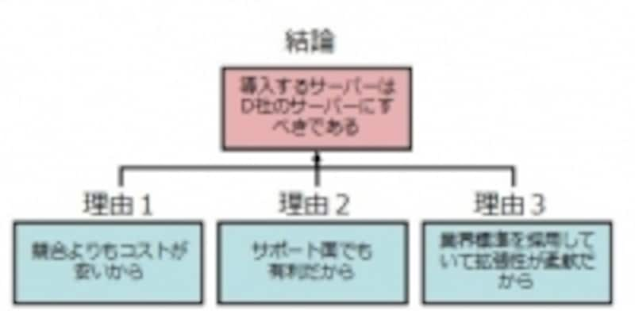
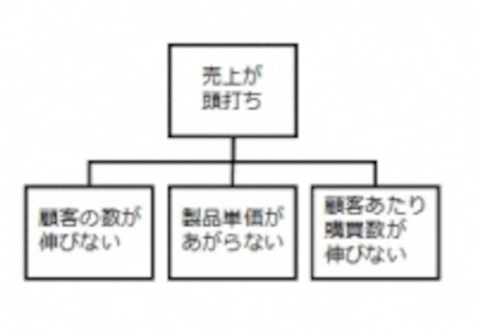
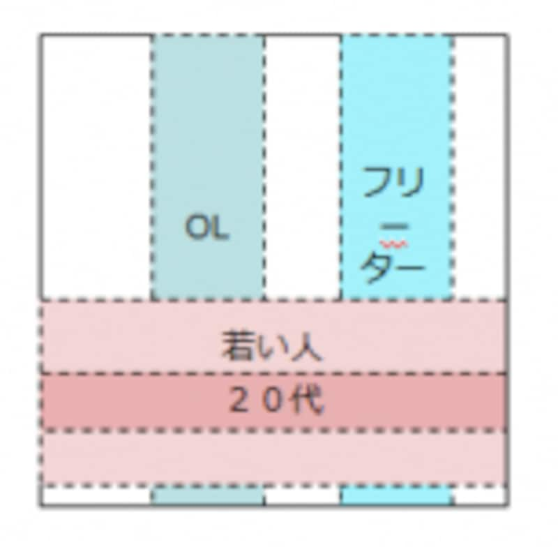

# 造形基礎演習II 第1ターム <!-- omit in toc -->
> 2. 情報・アイディアの整理(分類・階層化)

# 目次<!-- omit in toc -->

- [前回のおさらい](#前回のおさらい)
- [今日のテーマ](#今日のテーマ)
  - [KJ法](#kj法)
    - [今日のテーマ](#今日のテーマ-1)
  - [ロジカルシンキング](#ロジカルシンキング)
    - [ロジカルシンキングの手法・フレームワーク](#ロジカルシンキングの手法フレームワーク)
    - [演繹法](#演繹法)
    - [帰納法](#帰納法)
    - [ピラミッドストラクチャー](#ピラミッドストラクチャー)
    - [ロジックツリー](#ロジックツリー)
    - [MECE](#mece)
  - [本質的な問い](#本質的な問い)
  - [提出について](#提出について)

# はじめに<!-- omit in toc -->

## クラス間違えてない？<!-- omit in toc -->
クラス間違えていないか確認しましょう。

|            | 1-5回       | 6-10回      | 11-15回     | 
| ---------- | ----------- | ----------- | ----------- | 
| 1組+転科生 | 小林(618)   | 新井田(504) | 河内(506)   | 
| 2組        | 河内(506)   | 小林(618)   | 新井田(504) | 
| 3組        | 新井田(504) | 河内(506)   | 小林(618)   | 

転科生(2名)は1組の日程で動いてください。

# 前回のおさらい
>【第１回】アイディアのアウトプット(マインドマップ・ブレインストーミング)
として行いました。

頭に浮かぶことを
- 頭の外に吐き出す
- 人に正しく伝える

のは結構慣れが必要となります。

---
### マインドマップ<!-- omit in toc -->
表現したい概念の中心となるキーワードやイメージを中央に置き、そこから放射状にキーワードやイメージを広げ、つなげていく。思考を整理し、発想を豊かにし、記憶力を高めるために、想像 (imagination) と連想 (association) を用いて思考を展開する。この方法によって複雑な概念もコンパクトに表現でき、非常に早く理解できるとされる。

- 吐き出す
- 整理する
- アイディアをまとめる

等に利用できると思いますので積極的に利用していきましょう。

---
### ブレインストーミング<!-- omit in toc -->
複数人でアイディア出しをする手法で
1. 判断遅延（批判禁止）：他人のアイディアの批判NG
2. 突飛さ歓迎(自由奔放)：制限はなく、どんなアイディアもOK
3. 便乗歓迎：アイディアにただ乗りしよう！
4. 質より量：量が質を生む

という手法を学びました。

---
### これからのさまざまな課題において<!-- omit in toc -->
- どうして良いかわからない

と、思考停止するのは非常に時間がもったいないです。

このような
- アイディアの整理
- アイディアの吐き出し

方法をしっかり使っていきましょう。

# 今日のテーマ
> 情報・アイディアの整理(分類・階層化)

## KJ法
まず、アイディアを出してそれを整理する方法についてやってみようと思います。

**KJ法**とは、断片的な情報やアイデアを効率よく整理する手法です。

KJ法では、付箋などカード状の紙に一つひとつ情報を書き込み、そのカードを並べ変えたりグループ化したりすることで情報整理します。

[参考：https://blog.nijibox.jp/article/kjmethod/](https://blog.nijibox.jp/article/kjmethod/)

---
### KJ法のメリット<!-- omit in toc -->
- **付箋などの紙とペンがあれば実施することが可能**
身近にあるものを用意するだけで気軽に作業に取り組むことができます。

- **情報共有しやすい**
アウトプットが視覚的にまとめられるため、チームやプロジェクト間での情報共有がスムーズです。

- **アイデアを可視化できる**
頭の中にあるアイデアを整理し、分かりやすい形に可視化することが可能です。

- **課題や論点の抽出ができる**
KJ法で整理するテーマに関して、今課題となっていることや論点とすべきことの抽出がしやすくなります。

- **ロジカルに整理できる**
KJ法の進め方自体がロジカルな視点に基づいて考案されているため、論理的に情報を整理することが可能です。

---
### KJ法のステップ<!-- omit in toc -->
考えるテーマについて
1. カードに記入する
2. カードを整理する
3. 図解する
4. 文章にまとめる

---
### STEP1 カードに記入する<!-- omit in toc -->
はじめのステップでは、設定したテーマでアイディアを考え、**出てきたアイデアをカード（付箋など）に書き込んで**いきます。

前回学んだ
- マインドマップ
- ブレインストーミング

の手法も必要に応じて利用していきましょう。

- **質より量を意識しましょう。**
- **重要なことは、一つのカードに対して、書き込むアイデアは一つだけにすることです。**

---
### STEP2 カードを整理する<!-- omit in toc -->
カードをカテゴリごとのグループにまとめていきます。

どのグループにも属さないアイデアがある場合は、無理にどこかのグループに入れる必要はありません。

グループ化ができたら、それぞれにグループ名をつけます。

さらに「グループ同士で似たもの」をグループ化して
- 大グループ
- 小グループ

を作成していきましょう。

---
### STEP3 図解する<!-- omit in toc -->
STEP2で整理したグループの関係性を図解化しましょう。

因果関係・対立関係・相互に影響を与え合う関係など、グループ間にどんな関係性があるのかを考えていきます。

> 関係あり・原因・結果・因果・類似・反対

線・矢印等を用いてグループ間を接続しましょう。

---
### STEP4 文章にまとめる<!-- omit in toc -->
STEP3で図解化した関係性から見えてきたことを文章化することです。

解決すべき優先順位が高いグループは何か、何に着手すればいいのかを論理立てて落とし込んでいきましょう。

単なる情報整理ではなく、そこから問題への解決策や新たなアイデアを導き出すことが重要です。

---
### KJ法の注意点<!-- omit in toc -->
1. **無理にグループ化しない**
少数意見として貴重な可能性があります。
2. **手順に沿って、最後の文章化までやりきる**
「なんとなく情報整理できた」ような気になってしまうと、その先の価値が生まれません。
3. **参加者全員の同意を取りながら進める**
グループ化や図解化の際、誰か一人の考えだけで進めてしまうと、先入観による偏りが生じてしまうので注意が必要です。

---
### テーマ案<!-- omit in toc -->
アイディア浮かばないと、KJ法意味ないのでどれにするか非常に悩みました...
- 中野区におけるまちづくりの提案
- 子供と携帯電話
- レンガの変わった使い方
- 大学生活をもっと有意義にするには
- 将来の進路はどう決めるか
- 朝起きられず遅刻をしてしまうがどうしたら良いか

---
### 今日のテーマ
1,2限ですし...
> 朝に弱い学生に対してどうすれば良いのかのアイディアを考えよ

具体的には
- 朝起きられず遅刻をしてしまう学生がいるがどうしたら良いか
- 1限大学には来るけど、起きてられなくて寝てしまう学生がいるがどうしたら良いか

---
### 方法<!-- omit in toc -->
1. まずは自分で付箋にアイディアを書いていこう(1枚にひとつ)
2. グループ(5,6人かな)になろう
3. 模造紙にグループ分けしながら貼ってみよう。(試行錯誤もちろん可)
4. 途中で新しいアイディアが浮かんだら追加していこう
5. グループ分けできたら、関係性を図解してみよう(大グループ・小グループも)
6. 最後に文章化してみよう。

> アイデアを整理することができ、可視化することで新たなアイデアが生まれる可能性も出てくる

ができると意図に沿ったものとなります。

---
### 発表について<!-- omit in toc -->
「私たちの班は〇〇と△△を候補に挙げましたが、話し合った結果□□という理由で〇〇を最終案にすることに決めました」という形式で2分ほどで発表してもらいます。

---
## ロジカルシンキング
演習形式としては行いませんが、説明しておきます。

- 考える技術を学ぶ
- ロジカルシンキングとは根拠ある結論に到達するための方法

直感や感覚的に物事を捉えるのではなく、筋道を立てて矛盾・破綻がないように論理的に考え、結論を出す思考法です。

人に説明するときにこれができていないと人に正しく伝わりません。

アイディアをまとめる段階ではこのロジカルシンキングの方法が役立つかもしれません。

[参考・引用：ロジカルシンキングとは？手法や鍛え方、フレームワークを解説](https://go.chatwork.com/ja/column/efficient/efficient-283.html)

---
### うまくアイディアを相手に伝えられていない場合<!-- omit in toc -->
- 論理的に整理できていない
- 論理的に説明できない

ということを意味します。

---
### ロジカルシンキングの手法・フレームワーク
- 帰納法
- 弁証法
- 演繹法
- MECE
- ピラミッドストラクチャー
- ロジックツリー
- ゼロベース思考

---
### ロジカルシンキングの手法： 帰納法<!-- omit in toc -->
帰納法とは、複数の実例のなかに共通した部分を見つけ、それを用いて結論を出す思考法です。

たとえば、自社が運営している複数サイトの利用者比率で、女性の比率が高かった場合、「自社のサイトは女性利用者のほうが多い」という結論を導き出せます。

---
### ロジカルシンキングの手法： 弁証法<!-- omit in toc -->
弁証法とは、肯定と否定などの対立するふたつの思考をあわせ持つことで、解決へと導く思考法です。

たとえば、ジョギングをしたい（肯定）、しかし外に出るのが面倒（否定）と思う人がいたとします。

この場合、肯定と否定の双方の思考をあわせ、「家の中でジョギングができるようにジョギングマシンを買う」という解決法が導き出されるという思考法です。

---
### ロジカルシンキングの手法： 演繹法<!-- omit in toc -->
演繹法（えんえきほう）とは、三段論法とも呼ばれる手法で、「ルール」と「観察事項」から結論を導き出す思考法です。

たとえば、「A商品とB商品の売上が高いほうを主力商品とする」というルールを定め、B商品のほうが売上が高かったという観察事項を得た場合、主力商品はB商品となる、という結論を導き出せます。

---
### ロジカルシンキングの手法： MECE<!-- omit in toc -->
MECEは、「ミーシー」もしくは「ミッシー」と読み、Mutually（互いに）Exclusive（重複せず）Collectively（全体に）Exhaustive（漏れがない）のそれぞれの頭文字をとった言葉です。

「重複も漏れもない状態」という意味を持ち、商品やサービスのターゲット層を決めるときなどに、性別や年齢などを網羅的に考え、重複や漏れがないように仕分けていくフレームワークのひとつです。

---
### ロジカルシンキングの手法： ピラミッドストラクチャー<!-- omit in toc -->
ピラミッドストラクチャーは、結論と根拠をピラミッドのように組み立てるフレームワークです。

ピラミッドの頂上に自分が最も相手に伝えたい思考、その下になぜその思考を伝えたいのかの事実や根拠を用意します。

ピラミッドの下部に用意する事実や根拠は複数存在するため、ピラミッドストラクチャーは複数の実例から結論を導き出す、帰納法的なフレームワークといえます。

---
### ロジカルシンキングの手法： ロジックツリー<!-- omit in toc -->
ロジックツリーは、木が枝葉を広げるように、問題を細かく分解していくことで、原因を導き出すフレームワークです。

ロジックツリーには「要素分解ツリー」「原因究明ツリー」「問題解決ツリー」の3つの種類があります。

要素分解ツリーとは、発生した問題を細かく分解することで、原因がどこにあるのかを特定していくフレームワークです。

原因究明ツリーは、発生した問題の原因を細かく分析していくことで、なぜ問題が発生したのかを特定し、問題解決ツリーは、問題解決に向けて改善策ややるべきことを整理し、可視化することを目的としたフレームワークです。

---
### ロジカルシンキングの手法： ゼロベース思考<!-- omit in toc -->
ゼロベース思考とは、ロジカルシンキングの要素のひとつで、思い込みなどで物事を見ないようにする思考法のことです。

かたよった考えで物事を見てしまいそうになった場合、一度思考をクリアにし、ゼロベースであらためて思考するようにしましょう。

ゼロベース思考を意識することにより、世間の枠や既存概念にとらわれない斬新なアイデアを生み出せる可能性があります。

---
### 以下<!-- omit in toc -->
代表的なものについて説明していきます。

[参考：帰納法に演繹法？ロジカルシンキングの3つの手法とは](https://allabout.co.jp/gm/gc/301207/)

---
### 演繹法
演繹法は、「××だから、○○である」という論理を数珠つなぎにしていき、結論を引き出す方法です。代表的な例に、アリストテレスの3段論法があります。

大前提：すべての人間は死すべきものである
小前提：ソクラテスは人間である
結論: ゆえにソクラテスは死すべきものである

論理を作るのが簡単なため、一般に論理というとこの演繹法のことを指す場合が多いと言えます。身近な反面、落とし穴もあります。注意しないと論理の飛躍が起きたり、論理が長くなったりしがちで「屁理屈」のように聞こえる場合があります。

---
### 帰納法
帰納法は、多くの観察事項（事実）から類似点をまとめ上げることで、結論を引き出すという論法です。

例えば、
「A社は新製品が出ていない」
「A社の従業員が多く辞めている」
「A社から支払いの先延ばしがあった」
といういくつかの事実から、

「A社は経営難に陥っている」
という結論を引き出す、というものです。

観察事項が適切でなかったり、少ない観察事項からむりやり結論を引き出そうとすると、「納得感に欠けてしまう」ことがあります。

---
### ピラミッドストラクチャー

ピラミッドストラクチャーでは、下から上にツリーをさかのぼります。

---
### ロジックツリー

ロジックツリーでは、ツリーの一番上にある論点を、ツリーの下にいくにしたがって細かい論点に分けていきながら、問題の構造を明らかにします。

---
### MECE
MECEとは、Mutually Exclusive, Collectly Exhaustiveの略で、そのまま日本語に訳せば「モレなくダブりもない」ということになります。「ミーシー」と発音されるのが一般的。MECEを活用することによって、全体像を正しく認識することができます。

---
### MECEでない例<!-- omit in toc -->

携帯電話の利用者を「20代・若い人・OL・フリーター」の4つに分けて分類しています。これでは切り口がバラバラで（年齢の軸、職業の軸、性別の軸）抜け漏れやダブリが発生しています。

---
### MECEな分け方<!-- omit in toc -->

抜け漏れがないMECEな切り口

---
### 検討時に観点が間違えていないかを確認するのに便利<!-- omit in toc -->
検討事項に抜け漏れがないかどうかをMECEで常にチェックしています。プロジェクトが終盤になって「あの対象がモレていたのではないか？ もう一度検討してほしい」といった出戻りが発生しないようMECEを活用しています。

---
### ロジカルシンキングの例題<!-- omit in toc -->
- [ロジカルシンキングの例題10選](https://service.alue.co.jp/blog/examples-of-logical-thinking#63f2e467b74fb52dd9e29f35-1676862632321)

一緒に見ながらロジカルシンキングの思考法について学んでいきましょう。

## 本質的な問い

---
### 本質的な問い<!-- omit in toc -->
論理的に考えるためには、「本質的な問い」を押さえることも重要です。

前回のトンネルのバッテリー上がりの問題の時に紹介しませんでしたが、本には
> これは誰の問題なのだろうか？

ということも書かれていました。

- 運転者たち・同乗者たち・主任技師・警官たち・県知事・自動車連盟・その誰でもない・その全員

誰も問題か、を考えることにより解決策も変わってきますよね。

---
### 本質的な問いの見つけ方<!-- omit in toc -->
[参考：論理的思考力（ロジカルシンキング）を鍛える4つの方法](https://mba.globis.ac.jp/careernote/1006.html)
問いを押さえるためのコツは2つあります。

1. 問いを分解する
2. 問いの背景を確認する

---
### 1. 問いを分解する<!-- omit in toc -->
例えば、皆さんが人事担当だったとして、上司から「社内のグローバル人材の育成施策を考えてくれ」と言われたとします。
このままでは漠然とした「大きな問い」過ぎるので、
- 「どのような人材を？」
- 「いつまでに？」
- 「どの程度？」
- 「いくらかけて？」

といったように、検討すべき問いを分解していきます。

MECEに考えることも必要ですね。

---
### 2. 問いの背景を確認する<!-- omit in toc -->
- 「問いを提示している側の背景には、どのような問題意識があるのか？」
- 「どのような経緯で、その問いは出てきたのか？」

ということを理解することも重要です。

先ほどのグローバル人材の例で言うと、人事だけの問題なのか、全社的な戦略転換なのかによって、考えるべきことの範囲が変わってくるからです。
背景を確認するには、「こういうテーマが今出てきた背景には何があるのでしょうか？」とシンプルに聞くことをおすすめします。

---
### 多分余るので<!-- omit in toc -->
ワークショップのスライドをざっと見てみましょう。

- [考える技術（ロジカルシンキング・ワークショップ）](https://www.slideshare.net/Management_CoLtd/ws-72625413)

---
### 難しかったかな？<!-- omit in toc -->
難しそうなので、「こんな方法あるよ」の説明を多めにしました。

考え方にはいろいろありますが、
他の人とそれを共有して理解してもらうためには、
ロジカルシンキングも利用しながらまとめていくことが大事だと思います。

これらの手法の名前を覚えたり、というよりは、
> こういう考え方があるんだ

という引き出しが増えてくれれば幸いです。

---
### KJ法をもう一度...
テーマはグループによって変わると思いますが、KJ法でのアイディア出しにもう一度慣れておきましょう。

- 第一グループ:「KJ法でどんなテーマを扱ったら良いかKJ法を使ってアイディアを出そう」
- 第二グループ：
- 第三グループ：

---
## 提出について
- 参加したグループの模造紙の右下？に学籍番号と氏名記入してください。
- 写真を撮って記録したいと思います。(模造紙どうしよ...)

では終わります。

