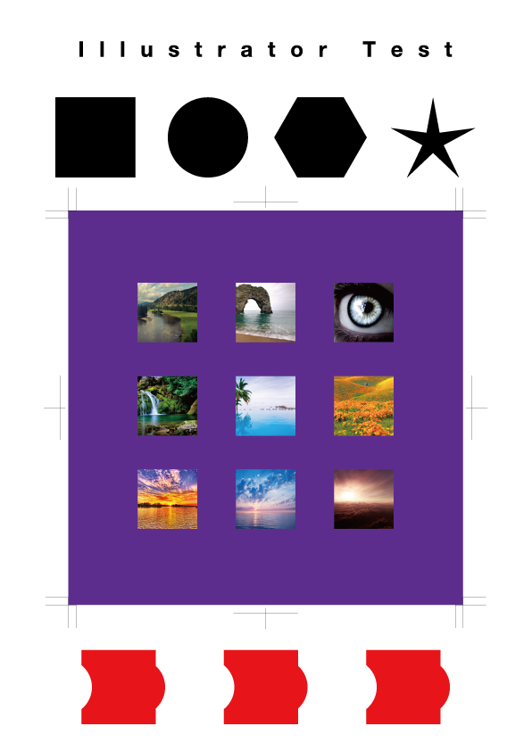

# デジタルデザイン基礎演習 第2ターム 1. PremierePro復習・AfterEffects基本操作

[デジタルデザイン基礎演習II TOP に戻る](./index.md)

---
## 目次

1. [デジタルデザイン基礎演習 第2ターム 1. Illustrator復習](#デジタルデザイン基礎演習-第2ターム-1-illustrator復習)
   1. [目次](#目次)
   2. [スライド](#スライド)
   3. [Illustrator 復習](#illustrator-復習)
   4. [課題](#課題)

---

## スライド

TODO:
[スライド資料](./dd2_01slide.pdf){:target="_blank"}

---
TODO:
## Premiere Pro 復習

## Photoshop 復習

## AfterEffects基本操作？

---
506・メディア文化コースNASを使うための注意事項
- [506 利用上の注意](./dd2_506_caution.md)
- [NASについて](./dd2_about_network.md)

---
<!--
## Illustrator 復習
前期にやったIllustratorをおさらいしてみましょう

### パス
パスを慣れておくと、画像や動画作成時に役立ちます

- [ベジエ曲線について](https://cultureacademia.jp/illustrator/108/){:target="_blank"}
ポイントが書いてあります。

- [ペンツールで描くベジェ曲線をマスターする](https://helpx.adobe.com/jp/illustrator/how-to/draw-edit-curves.html){:target="_blank"}
Adobeの公式ページです。

### トレース
{:target="_blank"}

### レイアウトデザイン
- [レイアウトとは？意味を分かりやすく解説](https://saruwakakun.com/design/tips/what-is-layout){:target="_blank"}

### Adobe製品のワークスペースのリセット
{:target="_blank"}

### 画面操作方法
{:target="_blank"}

### オブジェクトの作成・操作・複製
{:target="_blank"}

### レイヤー
{:target="_blank"}

### クリッピングマスク
{:target="_blank"}

### 整列
{:target="_blank"}

### パスファインダー
{:target="_blank"}

### 定規・ガイド
{:target="_blank"}

### テキスト
{:target="_blank"}

### トンボ(トリムマーク)
注意：トンボの作り方は、現在印刷所の受け入れ状態によって2通りある模様です。
- [Illustratorのトンボの最新の作り方と使い道のない残念なトンボ](https://design-trekker.jp/design/illustrator/trim-marks/){:target="_blank"}

{:target="_blank"}

---
## 課題
1. A4 サイズの新規文書を作成
2. 「Illustrator Test」というタイトルを適当なフォント・サイズでアウトライン化して上部に配置せよ
3. 同じ高さの正方形・円・六角形・星形を横に並べよ
4. 150mm x 150mm の正方形の印刷物を作るために、トリムマークを作成し、塗り足しを適当な色で作成せよ
5. 写真を適当に 9 枚選んで配置し、正方形の形にクリッピングマスクし、3 行 3 列でトリムマークの中に配置せよ
6. 複数のオブジェクトから、パスファインダーを使って異なる図形を作成せよ
7. ファイル名を**学籍番号+氏名.ai**として保存せよ
8. **ファイル - 別名で保存 / ファイル形式をPDF / プリセットを最小ファイルサイズ**にして**学籍番号+氏名.pdf**を書き出せ
9. **nas1-mc.thu.ac.jp**に接続して、**StudentVolume - 2022演習 - デジタルデザイン基礎演習II**の中の該当するフォルダ内に**学生番号_名前**のフォルダを作成し、そこにPDFファイルを提出

### サンプル

#### サンプル作成動画
なるべくみないで自分でやってみよう。

{:target="_blank"}
-->

