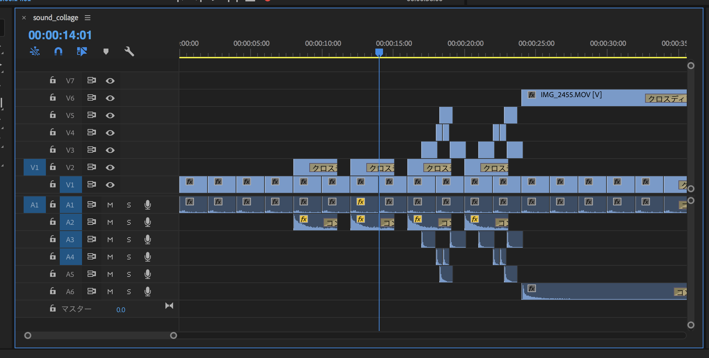

# デジタルデザイン基礎演習 第2ターム 1. PremierePro復習・AfterEffects基本操作

[デジタルデザイン基礎演習II TOP に戻る](./index.md)

---
## 目次
- [デジタルデザイン基礎演習 第2ターム 1. PremierePro復習・AfterEffects基本操作](#デジタルデザイン基礎演習-第2ターム-1-premierepro復習aftereffects基本操作)
  - [目次](#目次)
  - [506・メディア文化コースNASを使うための注意事項](#506メディア文化コースnasを使うための注意事項)
  - [スライド](#スライド)
  - [Premiere Pro 復習...サウンドコラージュの制作](#premiere-pro-復習サウンドコラージュの制作)
    - [制作の流れ](#制作の流れ)
    - [完成サンプル](#完成サンプル)
    - [やってみよう](#やってみよう)
      - [準備 その1 フォルダを準備しよう](#準備-その1-フォルダを準備しよう)
      - [準備 その2 AirDrop](#準備-その2-airdrop)
      - [準備 その3](#準備-その3)
      - [準備 その4 Premiereのプロジェクト作成・シーケンス作成まで](#準備-その4-premiereのプロジェクト作成シーケンス作成まで)
      - [編集　その1 中心となるリズムを作ってみよう](#編集その1-中心となるリズムを作ってみよう)
      - [編集　その2 Premiereのレイヤーの概念について](#編集その2-premiereのレイヤーの概念について)
      - [編集　その3 音量のバランスを調整しよう。](#編集その3-音量のバランスを調整しよう)
      - [自由な発想で編集してみよう](#自由な発想で編集してみよう)
      - [書き出し](#書き出し)
      - [提出](#提出)

---
## 506・メディア文化コースNASを使うための注意事項
- [506 利用上の注意](./dd2_506_caution.md)
- [NASについて](./dd2_about_network.md)

---

## スライド

[スライド資料](./dd2_01slide.pdf){:target="_blank"}

---
## Premiere Pro 復習...サウンドコラージュの制作
シラバスではAfterEffects基本操作も入っていますが、2回目以降とします。

### 制作の流れ
1. 撮影
   1. 音が出ているところを余韻まで含めて撮影しよう
   2. 少なくとも10個くらい使えそうな音は録画(録音)しよう
2. 準備
   1. 作業フォルダを作り、その中に「mov」,「mov_unused」フォルダを作成する
   2. iPhoneならAirDropで転送してください。Androidの人はいいにきてください。
   3. 作業用フォルダ「mov」フォルダに素材を移動
   4. 使える音と使えない音を吟味していらないものは「mov＿unused」に移動
   5. premiereを起動。作業フォルダ内にプロジェクトを作成
   6. 素材をインポート
3. 編集
   1. リズムを作ってみよう
   2. レイヤーの仕組みを理解して音を重ねよう
   3. 音のバランスを調整しよう
   4. 種明かし映像を調整しよう
4. 書き出し・提出
   1. 音データのみ・映像と音のデータ、の二つを書き出そう
   2. StudentVolume - 2023演習 - デジタルデザイン基礎演習II - 第二ターム(小林)...の中の該当箇所に提出

### 完成サンプル
- [音のみ](mp3/dd2-soundcollage.mp3){:target="_blank"}
- [種明かし編](https://www.youtube.com/shorts/qCfUFkYaP1M){:target="_blank"}

---
---
### やってみよう
少し前に作った動画なのでインターフェイスが異なっていてわからなかったら質問してください。

#### 準備 その1 フォルダを準備しよう

#### 準備 その2 AirDrop

#### 準備 その3

使えそうな素材をmovの中へ。使えなさそうでも後で使うかもなのでmov_unusedへ整理しよう

#### 準備 その4 Premiereのプロジェクト作成・シーケンス作成まで
ここのインターフェイス最近のは変わってます。

#### 編集　その1 中心となるリズムを作ってみよう

#### 編集　その2 Premiereのレイヤーの概念について

#### 編集　その3 音量のバランスを調整しよう。

#### 自由な発想で編集してみよう
長さも特に指定はしません。

ちなみにサンプルの編集最終画面はこれ

#### 書き出し
あ、バージョン古いかも...

#### 提出
StudentVolume - 2023演習 - デジタルデザイン基礎演習II - 第二ターム(小林)...の中の該当箇所に提出
