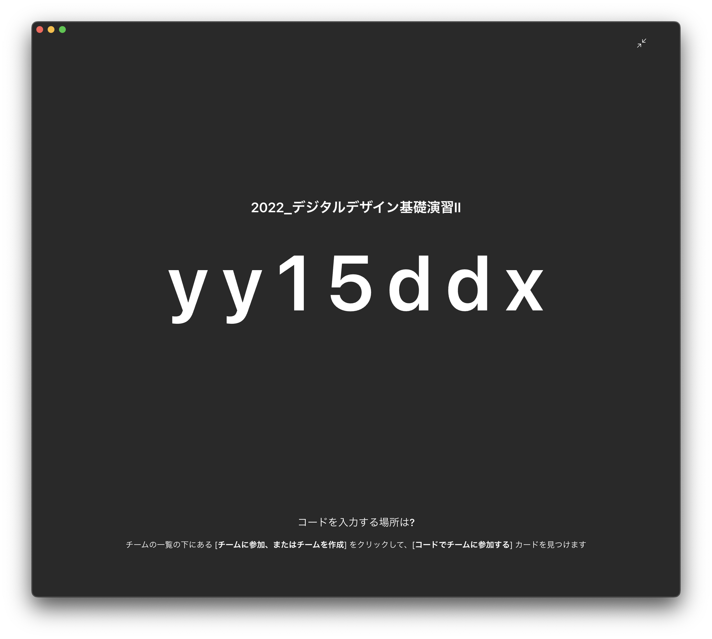

# デジタルデザイン基礎演習 第2ターム 
> 1. Illustrator復習<!-- omit in toc -->

# 目次<!-- omit in toc -->

1. [Illustrator 基本操作の復習](#illustrator-基本操作の復習)
   1. [ワークスペース](#ワークスペース)
   2. [新規](#新規)
   3. [画面操作](#画面操作)
   4. [オブジェクトの作成・操作・複製](#オブジェクトの作成操作複製)
   5. [レイヤー・グループ化・ロック](#レイヤーグループ化ロック)
   6. [整列・分布](#整列分布)
   7. [パスファインダー](#パスファインダー)
   8. [定規・ガイド](#定規ガイド)
   9. [テキスト](#テキスト)
2. [今日の課題](#今日の課題)

# 初めに<!-- omit in toc -->

## クラス間違えてない？<!-- omit in toc -->
ホワイトボード見て、クラス間違えていないか確認しましょう。

## デジタルデザイン基礎演習について

---
### デジタルデザイン基礎演習I,IIの位置付け
デジタルデザイン基礎演習では基本的に 
> 1 年を通して コンピュータを利用したクリエイティブ作業に慣れ親しんでもらう
> 
ということを目標にしています。

---
### クリエイティブ作業
おおまかに二つの側面に分けられると思います。
- 何を作るか考える力
- 実際に制作する技術

この二つの違いを意識するようにしましょう。

---
### 例えば
鉛筆で文字書けない人はいないでしょう。

でも、小説書ける人は少ないでしょう。

このように、クリエイティブな作業には二つの側面があります。

---
### デジタルデザイン基礎演習I
デジタルデザイン基礎演習I においては
- Mac の基本操作方法
- Illustrator・Photoshop・Premiere Pro の使い方

を学んだかと思います。

---
### 後期は
- デザイン基礎
- AfterEffects(モーショングラフィックス)
- XD, VSC(情報デザイン)

を中心に慣れ親しんでもらおうと考えています。

---
### キーワード
キーワードとしては
- 映像制作
- 映像合成
- モーショングラフィックス
- アニメーション制作
- ホームページ

を想定しています。

---
### あくまで入門
1 年生のうちに、いろいろなことができることを体感してもらうのが趣旨です。

「面白い!やってみたい!」と思ったら、演習と関係なく、どんどんいろんなソフトに触ってみてください。わからないことがあったら可能な範囲で教えます。

---
### 2年生になると
- 造形デザイン
- グラフィックデザイン
- 映像デザイン
- 情報デザイン

の4つの柱に分かれていきます。(複数選択可)
自分が何に興味を持っているか何を見付けたいかを1年の後期の間に明確にしていきましょう。

---
### 自己紹介・SA紹介
...

## その他注意事項

---
### 506演習室利用においての注意事項
[506演習室利用においての注意事項](./dd2_506_caution.md)

意図としては
1. なるべくたくさん使ってもらって、スキルを上げてほしい
2. みんなが利用しやすい環境をみんなで守ろう・つくろう

ということですね。自由な中でも最低限のルールは守りましょう。

---
### 最近の悩み
- 椅子がどっか行き過ぎ
- マウスがたまになくなったりする
- キーボードのケーブルもたまになくなったりする

気をつけましょう。

---
### ネットワークについて
[ネットワーク利用について](./dd2_about_network.md)

---
### iMacでの作業について
iMacで作業する時は次のようにしましょう。
1. 書類フォルダの中に**学籍番号**のフォルダを作成
2. ファイルは全てこの中に保存

夏休み・冬休みなどにメンテナンスで削除することはありますが、授業期間中に削除されることはありません。

それ以外に保存したもの(例えばダウンロード)は、不定期に削除される可能性があります。

---
### 資料について
自分は学外からも閲覧できるように以下のURLに資料をおいています。

https://sammyppr.github.io

ブラウザにブックマークしておくと良いでしょう。

---
### Teams
コロナなどのことを考えると、Teamsのチームを作成しておいた方が良いと思うので、参加してください。

---
### 就活状況
最近就活の日程が繰り上がっています。

クリエイティブな業界を目指す人は、ポートフォリオが3年の夏には必要にな場合もありますので、どんどん作品制作していきましょう。

---
### 506にある気になる?もの
3Dプリンタ・液晶タブレット・VR・ドローン・撮影機器などいろいろなものがおいてあります。

使える状況だと教員が判断すれば、自由に使って構いません。作品制作に役立ててください。

# デジタルデザイン基礎演習II<!-- omit in toc -->
> 第2ターム：モーショングラフィックス

## 進め方<!-- omit in toc -->

---
### シラバス
- 【第１回】PremierePro復習 前期の復習
- 【第２回】キーフレームアニメーション入門 キーフレームを用いたアニメーションの基礎について学修する。
- 【第３回】シェイプアニメーション入門 ベクトルデータを使ったシェイプアニメーションの基礎について学修する。
- 【第４回】3Dレイヤー入門 3D空間での操作を可能にする3Dレイヤーの基礎について学修する。
- 【第５回】自由課題 学修した内容をもとに自由課題に取り組む。

---
### GarageBand
前期に、昨年までやっていたGarageBandをやっていないようなので、2回目に入れる予定です。

---
### 評価方法
- 毎回の提出物
- 自由課題
- 他の人の自由課題を見たレポート

にて評価します。

# PremierePro復習<!-- omit in toc -->
## Adobe：ワークスペース

---
### ワークスペースについて
パネルの**位置がない・位置が変**等の質問がよくあります。

Adobe のソフトの場合には、ワークスペースという考え方でそれらを管理しています。「ウィンドウ」-「ワークスペース」-「初期設定のリセット」とするとデフォルトになります。
それでも出てこない場合には、ウィンドウメニューから該当するパネルを選択してください。

## プロジェクト管理

---
### 作業フォルダ
Wordと異なり、素材などはPremire Proファイルの「.prproj」の中には保存されません。
> この素材使いたいのね。ファイルの中に保存するね

ではなく
> この素材とこの素材のこの部分を使うね

という情報が.prprojには存在するだけです。

そのため、素材の管理は非常に大事なものとなります。
**必ずプロジェクトファイル・素材は同じフォルダにまとめましょう**

---
### editformat
メディア文化コースでは映像を扱うときにeditformatというフォルダ構成を利用しています。

- editformat
  - 01_PROJECT : prprojファイルを格納
  - 02_MEDIA : 素材を格納
    - 01_MOVIE : 映像素材を格納
    - 02_MUSIC : 音声素材を格納
    - 03_AE : 他アプリケーションのファイルを格納
  - 03_OUT : 書き出したファイルを格納
  - 04_OTHERS : 絵コンテ等を格納

木田チャンネルでも使ったと思いますが、とにかく全ての素材がeditformatのフォルダ内にあるようにしましょう。バックアップ等の時のトラブルを防げます。
  

## シーケンス
編集するための土台となるものでしたね。
- 映像サイズ
- フレームレート

指定されていましたが、少し学んでいきましょう。

---

### 映像のサイズ

- [動画サイズ（解像度）とは？　動画配信に関する動画サイズとアスペクト比の基礎知識](https://www.stream.co.jp/blog/blogpost-32396/)

---
### フレームレート
映像は
> 画像を連続して見せているにすぎない

わけですが、1秒間に何枚の画像を見せるか、ということを表します。
単位はfps(フレームパーセカンド)です。

https://www.youtube.com/watch?v=rQz4fOXCjE4

24fpsか30(29.97)fpsを利用することが多いです。

### シーケンスの設定
よくわからないうちは、
- 適当にシーケンスを作る
- 素材を読み込む
- シーケンスに素材を置く

とするのが良いです。設定が異なると
> 「あわせますか？」
と聞いてきます。

## 編集
### やったこと
YouTube編集では
- カット編集
- トランジション
- テキスト
- 音声の調整

Vlogでは
- キーフレーム
- Lumetriカラー

をやりましたね。

## 書き出し
TODO:

# 今日の課題

---
###
1. A4 サイズの新規文書を作成
2. 「Illustrator Test」というタイトルを適当なフォント・サイズでアウトライン化して上部に配置せよ
3. 同じ高さの正方形・円・六角形・星形を横に並べよ
4. 150mm x 150mm の正方形の印刷物を作るために、トリムマークを作成し、塗り足しを適当な色で作成せよ
5. 写真を適当に 9 枚選んで配置し、正方形の形にクリッピングマスクし、3 行 3 列でトリムマークの中に配置せよ

---
###
6. 複数のオブジェクトから、パスファインダーを使って異なる図形を作成せよ
7. ファイル名を**学籍番号+氏名.ai**として保存せよ
8. **ファイル - 別名で保存 / ファイル形式をPDF / プリセットを最小ファイルサイズ**にして**学籍番号+氏名.pdf**を書き出せ
9. **nas1-mc.thu.ac.jp**に接続して、**StudentVolume - 2022演習 - デジタルデザイン基礎演習II**の中の該当するフォルダ内に**学生番号_名前**のフォルダを作成し、そこにPDFファイルを提出