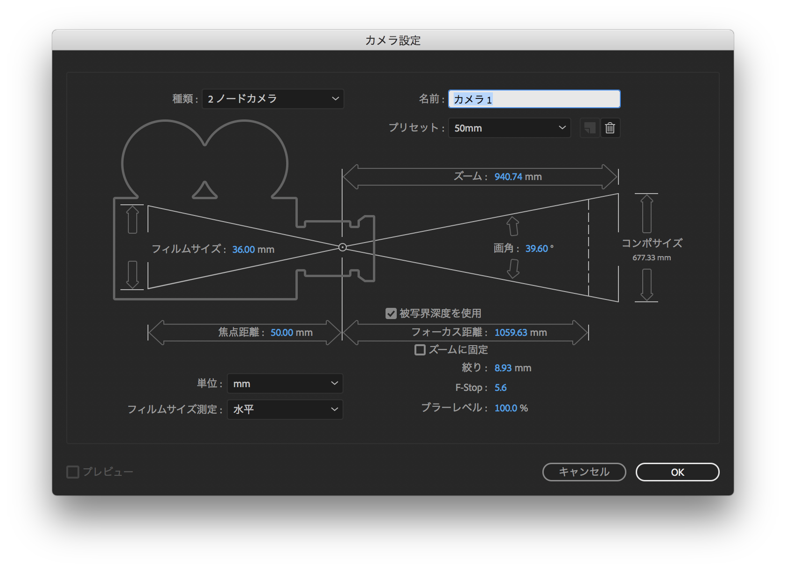

# デジタルデザイン基礎演習 第2ターム 4. 3Dレイヤー入門

[デジタルデザイン基礎演習II TOP に戻る](./index.md)

---
## 目次

- [デジタルデザイン基礎演習 第2ターム 4. 3Dレイヤー入門](#デジタルデザイン基礎演習-第2ターム-4-3dレイヤー入門)
  - [目次](#目次)
  - [スライド](#スライド)
  - [3Dの表現](#3dの表現)
    - [完成サンプル](#完成サンプル)
    - [準備　作業用フォルダを準備しよう](#準備作業用フォルダを準備しよう)
    - [3次元空間を作る準備](#3次元空間を作る準備)
    - [いろいろな方向から見てみよう](#いろいろな方向から見てみよう)
    - [3Dカメラ](#3dカメラ)
    - [プリコンポーズから仕上げ](#プリコンポーズから仕上げ)
    - [書き出し](#書き出し)
  - [早く終わってしまった人へ](#早く終わってしまった人へ)
    - [サンプル](#サンプル)
    - [モーショングラフィックスのアイディア](#モーショングラフィックスのアイディア)
    - [AfterEffects系YouTuber](#aftereffects系youtuber)
  - [提出](#提出)

---

## スライド

[スライド資料](./dd2_04slide.pdf){:target="_blank"}

---
## 3Dの表現
### 完成サンプル
{:target="_blank"}

### 準備　作業用フォルダを準備しよう
{:target="_blank"}

### 3次元空間を作る準備
{:target="_blank"}

### いろいろな方向から見てみよう
AfterEffects2020以降、統合カメラツールがなくなってる(0:33)

その代わり、カメラツールが3種類に別れています

[Aeの統合カメラツールが無くなった？！](https://note.com/crecochan/n/n43ef673c74cd){:target="_blank"}

{:target="_blank"}

### 3Dカメラ
訂正：フォーカス距離と焦点距離は別もの。焦点距離は、レンズの中心点からイメージセンサーまでの距離。

被写界深度をオンにしないとボケません

{:target="_blank"}

### プリコンポーズから仕上げ
ネスト化(入れ子)はプリコンポーズという機能でも利用できます。

{:target="_blank"}

### 書き出し
{:target="_blank"}

---
## 早く終わってしまった人へ
- 5回目は、AfterEffectsを利用した自由課題制作となります。
- アイディアを練って、制作に取り掛かれる人は取り掛かりましょう。
- 5回目の2限の始まる前に提出となります。(2限は講評会予定)

### サンプル
- [100 Best Logo Animation l 100 Best Motion logos l 100 Cool Logos l 100 Logo Intro](https://www.youtube.com/watch?v=m-osco-Xuqs){:target="_blank"}
- [2D Motion Graphics Animation Referentes](https://www.youtube.com/watch?v=UH76-7CsOa4&list=PLqmEWnA8-0blfI7woK7aBVy8bTmCRtIKn){:target="_blank"}
- [Top 10 Typography Animation Trends in 2020](https://www.youtube.com/watch?v=xoTp1tFBat0){:target="_blank"}

### モーショングラフィックスのアイディア
- [モーション周期表](http://foxcodex.html.xdomain.jp/index.html){:target="_blank"}

### AfterEffects系YouTuber
AfterEffects系で有名なYouTuberさんを紹介しておきます。
- [ダストマン](https://www.youtube.com/c/%E3%83%80%E3%82%B9%E3%83%88%E3%83%9E%E3%83%B3Tips){:target="_blank"}
- [サンゼ](https://www.youtube.com/c/sanze-studio){:target="_blank"}
- [Action Planetあくしょんプラネット](https://www.youtube.com/c/%E3%81%82%E3%81%8F%E3%81%97%E3%82%87%E3%82%93%E3%83%97%E3%83%A9%E3%83%8D%E3%83%83%E3%83%88ActionPlanet){:target="_blank"}
- [カズノコ](https://www.youtube.com/c/%E3%82%AB%E3%82%BA%E3%83%8E%E3%82%B3){:target="_blank"}
- [TORAERA DOUGA](https://www.youtube.com/c/TORAERADOUGA){:target="_blank"}

---
<!--
## 準備

### Chrome
よく利用されているブラウザです。
#### インストール
- [Chrome ダウンロード](https://www.google.com/intl/ja_jp/chrome/)

### Visual Studio Code
現在最もポピュラーなテキストエディタです。
#### インストール
- [Visual Studio Code](https://azure.microsoft.com/ja-jp/products/visual-studio-code/)

#### 拡張機能
次の拡張機能を入れておきましょう。(左の上から5つ目のアイコンから)
- Japanese Language Pack(Japaneseで検索)
- Live Server(Liveで検索)
- zenkaku(zenkakuで検索)

それぞれ
- 日本語化
- Webサーバを利用可能に
- 全角スペースをわかりやすく表示

するためのものです。

### XD

#### インストール
Adobe Creative Cloudから**XD**をインストールしておきましょう。

---
## XDを使ってみよう
### 注意！！！(2022/12/15調べ)
AdobeがスターターキットやUIキットの配布をやめてしまった模様です。(ページの作りが別物になっている...)
過去のものをなるべく、元の状態にしたものをここに置いておきます。
[スターターキット](./adobe-xd-starter-kit-basic-mac.xd.zip)

現在、っぽいものは、
[UI/UX 無料アセット](https://creativecloud.adobe.com/cc/discover/free-assets/?filter=ui-and-ux)
にありますが、全く同じものは置いてありません。

UIキットに関しては、
- [Wires jp 2.0](https://www.behance.net/gallery/67284971/Wires-jp)
等にはまだある模様です。 

以下の「XDの紹介」「スターターキット」のリンクは切れていますので、注意してください。

### XDの紹介
- [Adobe XD 紹介ページ](https://www.adobe.com/jp/products/xd.html){:target="_blank"}

### スターターキット
- [ここ](https://www.adobe.com/jp/products/xd.html){:target="_blank"}から「スターターキットをダウンロード」を押してダウンロードしよう。(画面の下1/3くらいにあります)

- 解凍して**adobe-xd-starter-kit-basic-mac.xd**を開いてやってみましょう。興味持った人は**adobe-xd-starter-kit-intermediate-mac.xd**もトライしていいです。

動画の**プレビューウィンドウ**は右上の再生ボタンを押すと出ます。

### 課題
次の挙動のクイズアプリを作ってください。
- 最初の画面：クイズアプリの説明＋「スタート」ボタン
- 質問画面：質問＋4択のボタン
- 解答画面：あっていた場合、間違っていた場合の2画面＋「もう一度トライ」のボタン

注意事項
- 操作に慣れるのが目的のため著作権は今日は無視して良いです。
- 余裕のある人は質問を複数にしてもいいです。
- 提出は、共有されたURLにしてください。

### XDの注意事項
- 「保存」とすると、CreativeCloud(ネット上)に保存する画面が出てきます。XDはチームで共有することが前提のアプリのため、こういう挙動になっているようです。「ローカルドキュメントとして保存」とすれば、通常通り、コンピュータに保存されます。
- 共有されたURLは、ブラウザに表示後、URL部分の左のアイコンをデスクトップにドラッグ&ドロップすると「.weblock」というファイルができます。これを提出しましょう。

-->
---
## 提出

1. nas1-mc.thu.ac.jpに接続して、
2. StudentVolume - 2023演習 - デジタルデザイン基礎演習IIの中の該当するフォルダ内に学生番号_名前のフォルダを作成し、
3. 今日の作業フォルダを提出してください。

