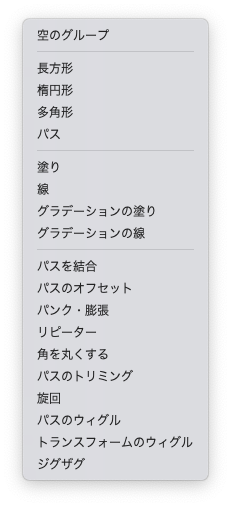
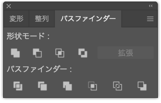

# メディア表現III<!-- omit in toc -->
> 9.シェイプアニメーション

# 目次<!-- omit in toc -->
1. [シェイプアニメーション](#シェイプアニメーション)
   1. [シェイプアニメーションとは](#シェイプアニメーションとは)
   2. [モーショングラフィックスアプリの歴史](#モーショングラフィックスアプリの歴史)
   3. [ベクトルデータやコンポジションが汚い時の回避方法](#ベクトルデータやコンポジションが汚い時の回避方法)
   4. [シェイプレイヤーでできること](#シェイプレイヤーでできること)
   5. [グループ化](#グループ化)
   6. [パス](#パス)
   7. [色](#色)
   8. [シェイプエフェクト](#シェイプエフェクト)
   9. [やってみよう](#やってみよう)

# 前回のおさらい<!-- omit in toc -->

- ネスト/プリコンポーズ
- 調整レイヤー
- トラックマット
- 親子づけ

# シェイプアニメーション

## シェイプアニメーションとは

---
### シェイプアニメーションとは
シェイプアニメーションとは
> 線や図形に動きをつけたアニメーション

のことを指します。

シェイプアニメーションを実現するAEのシェイプレイヤーは、
一つのコンポジションになるくらい強力な機能を持っていますので、使いこなしていきましょう。

---
### 基本的なこと
キーフレームの使い方は、1年生の時に触れたと思います。
(順番入れ替えで詳しくは次回？になってしまった...)

A,Bの二つの時刻においてパラメータの値をキーフレームで設定すれば、あとは自動的にアニメーションしてくれます。
イージングという機能もありますが、とりあえずキーフレームにてアニメーションを作成するのが基本となります。

---
### 線や図形について
簡単なものはAfterEffects内で作成できますが、凝った図形になるとIllustrator必須となります。

## モーショングラフィックスアプリの歴史

---
### AfterEffectsと今はなきFlash
歴史的な話になりますが、かつて
- AfterEffects
- Flash(現Animate)

という二つのモーショングラフィックス用のソフトがありました。何が違ったのでしょうか？

---
### Flash(現Animate)
現在では
> インタラクティブアニメの制作環境

と位置付けられています。
Flashの技術は無くなりましたが、HTML Canvasの機能を用いて現在でも利用可能です。
プログラミングができることが一つの特徴です。

それをおいておいても、AEとFlashは別物でした。何が違ったのでしょうか？

---
### 内部のデータの扱い方が異なる
画像には
- ビットマップ形式
- ベクター形式

の二つがありますね。それぞれ、Photoshop, Illustratorが得意なものです。それと同様に
- AfterEffects: ビットマップが得意
- Flash: ベクターが得意

という内部構造の違いがあります。

## ベクトルデータやコンポジションが汚い時の回避方法

---
### ベクター形式の特徴
数学的に線の情報を保持しているためにいくら拡大しても問題ない、というのがビットマップ形式との違いでした。

---
### それでは試してみましょう。
1. WebからAdobe_Illustrator_CC_icon.zipをダウンロード
2. 解凍
3. AfterEffectsで新規プロジェクト
4. 新規コンポジション(HDTV 1080 29.97)
5. aiファイルを読み込み
6. コンポに配置
7. トランスフォームで500%に

汚いよねーーーー。ベクター形式なのに何故だろう？

---
### 汚い理由
- AfterEffectsでは内部処理が基本的にビットマップ
- ベクター形式の画像はどこかのタイミングでラスタライズされてビットマップ形式に変換されている

トランスフォームで500%で汚くなっているので、その前で汚くなっていますね。

---
### AfterEffectsのエフェクト
AfterEffectsのエフェクトは全てビットマップ形式に対して有効となります。
そのため、

1. ベクター形式の画像情報
2. マスク
3. ラスタライズされてビットマップ形式に
4. エフェクト
5. トランスフォーム

の順に処理されるため、汚くなっているのです。

---
### 回避するには？
> スイッチ/モード

を押して、トラックマットでない方を選択し、左から二番目の太陽みたいなマーク

> コンポジションの場合：コラップストランスフォーム、ベクトルレイヤーの場合：連続ラスタライズ

にチェック入れることで回避できます。

---
### 何が起こっている？
連続ラスタライズだと

1. ベクター形式の画像情報
2. マスク
3. トランスフォーム
4. ラスタライズされてビットマップ形式に
5. エフェクト

とトランスフォームの処理が、マスクの直後に来るようです。

同じく、ネストしたコンポジションが汚かった場合には、このマークにチェックを入れることできれいになるようです。

詳しく知りたい人はこちら [コラップスアルゴリズム](https://www.youtube.com/watch?v=45y7dkevao4)

## シェイプレイヤーでできること

---
### シェイプレイヤー
ここからは、シェイプレイヤーに絞ってやっていこうと思います。

---
### シェイプレイヤーの「追加」の項目

---
### 追加の項目の種類
- グループ
- パス
- 色
- シェイプエフェクト

の4種類ありますが、これらもレイヤーの様になっていて順番の入れ替えが可能となります。
入れ替えによって表示され方が変わりますので、いろいろ試してみましょう。

ここの構造、下手すると前回の構造よりかなりエグいです。

## グループ化

---
### グループ化
シェイプレイヤーには複数の図形を作成することができますが、たくさん利用するとイラストレーターの様にグループ化したくなります。

そんな時は、複数選んで、
- グループ化　Command+G
- 解除　　　　Command+Shift+G

で利用できます。

または、空のグループを作成して、パスをその中にドラッグすることでもグループ化できます。

---
### グループ化のメリット
構造が分かりやすくなることも当然ですが、

> グループにはグループ独自のトランスフォームが利用できる

ことが大きいかと思います。

## パス

---
### シェイプレイヤーで利用できるパス
- 長方形
- 楕円形
- 多角形
- パス

の4種類となります。

## 色

---
### 色の指定
パスに対して以下の4つの方法で色指定が可能です。
- 塗り
- 線
- グラデーションの塗り
- グラデーションの線

塗りが複数あると、設定によって挙動が変わるようです。

## シェイプエフェクト

---
### シェイプエフェクトとは
AfterEffectは基本的にビットマップが得意なモーショングラフィックソフトと説明しました。しかし、シェイプレイヤーの中ではパスに作用するシェイプエフェクトが利用できます。

- パスを結合
- パスのオフセット
- パンク・膨張
- リピーター
- 角を丸くする
- パスのトリミング
- 旋回
- パスのウィグル
- トランスフォームのウィグル
- ジグザグ

---
### パスを結合
「結合・追加・型抜き・交差・中マド」が利用できます。

Illustratorのパスファインダーを思い出しましょう。

---
### パスのオフセット
パスが拡大または縮小されます。

---
### パンク・膨張
言葉の通り、図形が歪んでいきます。

---
### リピーター
言葉の通り、繰り返して図形を表示できます。

---
### 角を丸くする
言葉の通り、頂点が丸くなります。

---
### パスのトリミング
パスの開始点と終了点にキーフレームを打てる様になります。

これで、パスを描くような表現をつけることができます。

---
### 旋回
図形の一部だけをぐるっと回すような表現ができます。

---
### パスのウィグル/トランスフォームのウィグル
ウィグルによってランダムな動きをキーフレームなしでつけることができます。

「パス」では形状が変わり、「トランスフォーム」では指定したスケールや位置などが変わります。

これ、いいなぁ....普通のレイヤーでもこのやり方があればいいのに...

---
### ジグザグ
言葉通り、パスがジグザグになります。

---
### シェイプエフェクトまとめ
たくさんありますし、非常にたくさんいろいろなことができそうですね。

## やってみよう

---
処理が重たくなったら、画質を下げよう

1. 新規コンポジション(HD 1920x1080 29.97 背景黒 デュレーション2:00)
2. 新規シェイプレイヤー作成(モーションブラーをON)
3. 楕円形追加
4. 線追加 色を適当に設定
5. パスのトリミング追加(開始点 0:00 0%, 1:29 100%)
6. キーフレーム状で右クリック キーフレーム補助 イージーイーズ
7. 同じく(終了点 50%)
8. パスのオフセット追加(量 50, コピー数 5)
9.  パンク膨張追加(量 50)
10. 旋回追加(角度 145)

パスのウィグル・トランスフォームのウィグルも楽しいけど負荷かかるよ。

---
### やってみよう(時間あれば)
シェイプレイヤーの中で説明した機能を使って、
オリジナルでなんか作成してみよう

# まとめ<!-- omit in TOC -->
シェイプレイヤーだけで、かなりのことができるのが理解できたでしょうか？
組み合わせて、いろいろ作ってみましょう。

構造的に考えると、ビットマップを扱えないコンポジションと思っても良いくらいの機能を持っています。

また、授業内では詳しく扱いませんが(来週扱うかな...)、テキストのところにある「アニメーター」も使うと色々なことを表現できます。

