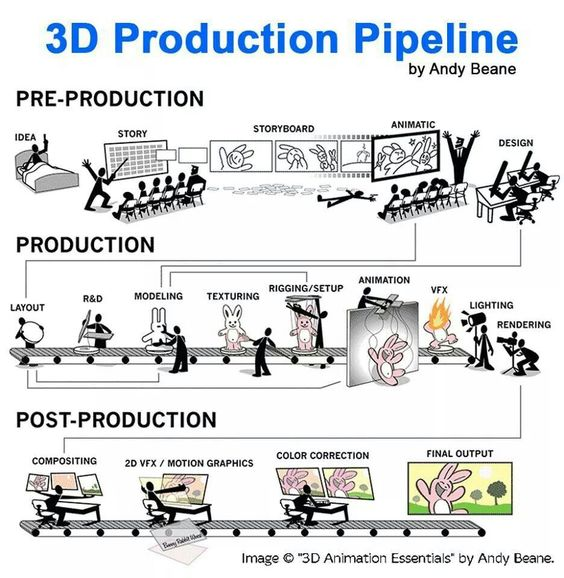
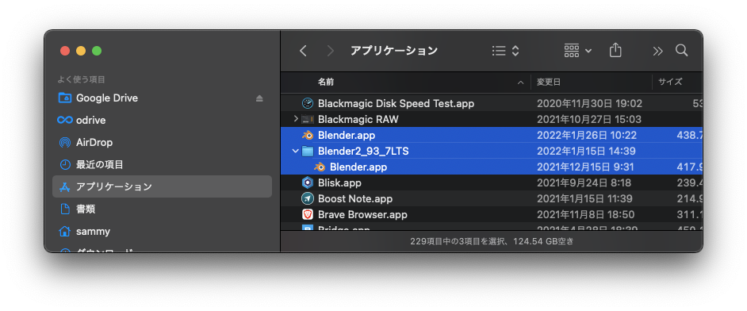
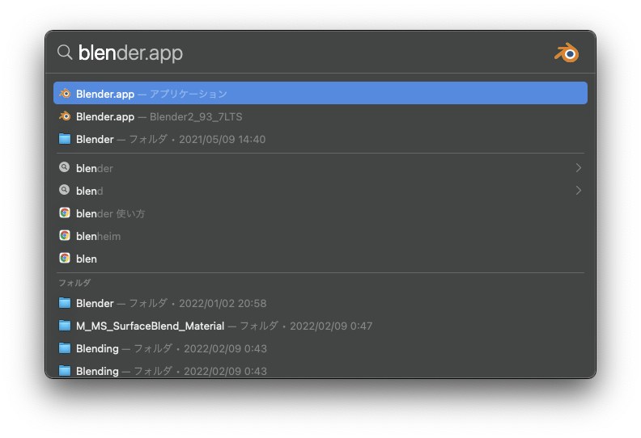

# メディア表現 V 1. オリエンテーション

[メディア表現 V TOP に戻る](./index.md)

---

## 目次

- [メディア表現 V 1. オリエンテーション](#メディア表現-v-1-オリエンテーション)
  - [目次](#目次)
  - [シラバス紹介](#シラバス紹介)
    - [授業のねらい及び到達目標](#授業のねらい及び到達目標)
    - [授業の形式・計画](#授業の形式計画)
  - [利用するアプリについて](#利用するアプリについて)
    - [Blender について](#blender-について)
    - [Blender Overview](#blender-overview)
    - [他の 3D 系アプリについて](#他の-3d-系アプリについて)
  - [授業の進め方](#授業の進め方)
  - [3D Production Pipeline](#3d-production-pipeline)
  - [心構え](#心構え)
  - [3DCGにハマった人](#3dcgにハマった人)
    - [いろんなリンク](#いろんなリンク)
  - [Blender インストール](#blender-インストール)
    - [LTS 使う人(バグなどの時用)](#lts-使う人バグなどの時用)
  - [起動しよう](#起動しよう)
  - [言語設定について(個人的には英語推奨)](#言語設定について個人的には英語推奨)
  - [画面を有効に使おう](#画面を有効に使おう)
  - [ファイルの管理について](#ファイルの管理について)
  - [物をおいてみよう](#物をおいてみよう)
    - [viewport の視点操作](#viewport-の視点操作)
      - [トラックパッド](#トラックパッド)
      - [マウス](#マウス)
    - [ライブラリから追加してみよう](#ライブラリから追加してみよう)
    - [Object の操作について](#object-の操作について)
    - [Render について](#render-について)
    - [(おまけ)スクリーンキャストについて](#おまけスクリーンキャストについて)
  - [お疲れ様でした〜](#お疲れ様でした)

---

## シラバス紹介

### 授業のねらい及び到達目標

映像制作の CG/VFX は凄まじい進化を遂げている。無料で利用できるオープンソースの統合型 3DCG 製作・2D アニメーション製作・VFX 向けデジタル合成・動画編集ソフトウェアである Blender を用いて、「デジタルコンポジット」「モーショングラフィックス」「VFX」について理解し、制作技術を高める。

1. Blender を用いてコンテンツ制作ができる。
2. 状況に応じて適切な技術を用いて表現力豊かな制作ができる。

### 授業の形式・計画

1. オリエンテーション
2. Blender 基本操作
3. モデリング
4. モディファイア
5. マテリアルとテキスチャ
6. キーフレームアニメーション・カメラ切り替え
7. シェープキーアニメーション
8. アーマチュア・IK・リグ
9. ライティング・レンダリング
10. グリースペンシル
11. 物理演算・パーティクル
12. シェーダーエディター
13. ジオメタリーノード
14. コンポジット・動画編集
15. モーショントラッキング

---

## 利用するアプリについて

### Blender について

- 最近すごく勢いがあるアプリ。自分は 2021 年度に触り始めたばかり
- 2.8(2019)あたりから使いやすいインターフェイスになった
- 異なるバージョンを使っているチュートリアルだと、同じ操作ができなかったりするので注意(2.8 以降推奨)
- 最新版を使うとバグもあるので、LTS も必要に応じて使っていこう
- マウス・テンキーがあったほうが良いという意見もあるけど、なくてもいける
- 1年で、2.93から3.5までバージョンアップしてできることが増えてる。

### Blender Overview

{:target="_blank"}

### 他の 3D 系アプリについて

- アプリは道具でしかないので、何を使っても良い
- 特に 3D では用途に応じていろいろなアプリがあるため、便利に使いわければ良い
- Blender はずっと無料、Maya は学生の間だけ無料だが、その後は年間数十万かかる
- プロは Maya と言われていたが、最近ではゲーム業界・アニメ業界にて Blender も使われ始めている
- 参考 [『シン・エヴァ』で 3DCG を手がけたプロジェクトスタジオ Q、Blender の魅力を語る](https://news.mynavi.jp/article/20210804-1927380/){:target="_blank"}
- 参考 [エヴァ制作のカラーが Blender への移行を進める理由とは？](https://cgtracking.net/cg-news/khara-blender/){:target="_blank"}

---

## 授業の進め方

- 毎回、トピックを決めて取り組んでもらう。
- 3D を使いこなすには数学や物理法則等を知る必要があるけど、必要最低限にとどめて「使う」ことをメインに進めていく。
- 慣れてから技術的な背景については必要に応じて学んでいこう。
- 基本をベースに教えていくので、3.0以降の機能については各自調べてみよう。
- スクリーンキャスト・画像は、昨年度のを基本使い回すので、少し違ってたらごめんなさい。

## 3D Production Pipeline

[3D Production Pipeline](https://animeight.com/2018/02/21/3d-production-pipeline/){:target="_blank"}

## 心構え

- 好きになろう(楽しもう)。モチベが大事。とにかく触ろう。
- 多くのことができるので、興味があるところから重点的に取り組もう。(授業だから順番にやるけど)
- Twitter で「Blender」「#blender初心者」でぐぐると、初心者たくさんいて刺激になるよ(たまに、3Dやった人が"blenderは初心者"の人もいるけど)
- まずはチュートリアル見ながらすげー！と思おう。
- なるべく 15 分くらいのチュートリアルやってみよう。(長いとめげる)
- みないでできるようになってみよう。
- 自分なりのアレンジを加えてみよう。
- 他の人に見てもらうのも励みになる。
- ある程度わかったところで体系的に何ができるか学ぼう。

## 3DCGにハマった人
- トップからArchive - Contents 2022に昨年度の資料置いてあります。ほぼ同じでいくので、どんどん進んでください。

### いろんなリンク

- [Twitter#Blender 初心者](https://twitter.com/search?q=%23blender%E5%88%9D%E5%BF%83%E8%80%85){:target="_blank"}
- [Twitter#Blender](https://twitter.com/search?q=%23blender){:target="_blank"}
- [YouTube Blender チュートリアル](https://www.youtube.com/results?search_query=blender+%E3%83%81%E3%83%A5%E3%83%BC%E3%83%88%E3%83%AA%E3%82%A2%E3%83%AB){:target="_blank"}

---

## Blender インストール

1. [Blender 公式サイト](https://www.blender.org/){:target="_blank"}
2. 「Download」をクリック
3. Intel なら intel, M1 なら AppleSilicon, Win なら Installer。自動でレコメンドされる。
4. 「Download Blender3.5」をクリック
5. ディスクイメージを開けて、Blender をアプリケーションフォルダにコピー(Winは普通にインストール)

{:target="_blank"}

### LTS 使う人(バグなどの時用)
早速Mac(intel)で、後で使うcube-diolamaを利用しようとしたら、バグって利用できませんでした。そんな時はLTS(Long Term Support)バージョンを利用しましょう。M1では普通に動きました。

- [Download の Long-term-support](https://www.blender.org/download/lts/){:target="_blank"}からダウンロードできる
- アプリケーションフォルダに「Blender3.3LTS」とかフォルダ作成し、その中に入れることで、複数のバージョンを使うことが可能。
- Command+スペースで Blender を検索した時に、フォルダ名が出るので、どっちをつかっているかわかるよ
- Win の人は[BlenderHub](https://3dnchu.com/archives/blenderhub-1-1-0/){:target="_blank"}を導入しよう。(必要に応じて)

---

## 起動しよう

- とりあえずそのまま何もせずに「Save New Setting」を押そう。
- ~Library/Application Support/Blender の中にバージョンごとに設定ファイルができるよ。
- 3.0.0 と 3.0.1 は設定ファイル兼用だけど、3.0 と 3.1 は別になるみたい。
- ここには設定と、追加された AddOn のファイルが入るよ。

{:target="_blank"}

## 言語設定について(個人的には英語推奨)

- チュートリアル動画には英語・日本語がある。
- 英語がどうしても苦手な人は日本語設定にしよう。
- Edit-Preferences, Interface, Language を Japanese に
- 「新規データ」はチェックを外しておこう
- 2.9 系は Mac で日本語のフォントが化ける可能性あり
- 切り替えに[Toggle Translated UI](https://www.cgradproject.com/archives/5503/){:target="_blank"}を入れよう。
- 編集-プリファレンス、アドオン、インストールでダウンロードした py ファイルを選択。チェックを入れて有効に
- Mac では編集-プリファレンス、キーマップ、ウィンドウの ToggleTranslated UI で、「[」とかに変えておこう。
- 文字のところをクリックしてから「[」で切り替え

{:target="_blank"}

---

## 画面を有効に使おう

- iMac では Blender, Web ページを両方おくことができるが、ノートパソコンなら、三本指でスワイプして 2 画面をうまく使いこなそう。
- [EasyRes](https://apps.apple.com/jp/app/easyres/id688211836?mt=12){:target="_blank"}を使うと、Mac の標準設定より解像度をさらに広げることができる。文字は小さくなるけど便利。(自分は 2048\*1280)
- macOS 13.3 Venturaにアップデートした場合には、EasyResがいらなくて、システム環境設定から同様に設定することができる。[macOS 13.3 Venturaでは新しいシステム設定アプリで隠されていたディスプレイの解像度リストを表示させるオプションが追加。](https://applech2.com/archives/20230407-macos-133-ventura-back-show-resolutions-as-list.html){:target="_blank"}

{:target="_blank"}

---

## ファイルの管理について

- 書類フォルダに「Blender」フォルダを作ろう
- 日付と「チュートリアル」「オリジナル」そして内容がわかるといいと思う。

チュートリアル
: 20220401t_basic.blend

オリジナル
: 20220401o_domino.blend

- 自分でわかれば問題はないけど。あとで何をいつやったかわかると便利。
- 参考にしたページや YouTube を TextEditor で書いておくと忘れないので便利

{:target="_blank"}

---

---

## 物をおいてみよう
3.5でうまくいかない人は、3.3LTSをダウンロードしてみよう

- 3.0 から追加されたアセットブラウザのデモが公開されている。
- [Blender 公式サイト](https://www.blender.org/){:target="_blank"}
- Download - Demo Files - Cube Diolama
- 書類-Blender-DemoFiles フォルダを作成してそこに移動
- zip ファイルを解凍しよう。
- オリジナルは取っておきたいから、.blend ファイルをコピーして開いてみよう。

{:target="_blank"}

### viewport の視点操作
視点操作がスムーズにできるようにならないと、イライラします。確実に覚えていきましょう。

#### トラックパッド

- 視点回転はPreference-Input-Emulate 3Button Mouseにチェックを入れて Option+クリック or 2本指
- 視点平行移動は Shift+2 本指
- 拡大縮小は Ctrl ＋ 2 本指 or ピンチイン・ピンチアウト
- 上手くいかない人は、システム環境設定のトラックパッドを確認

{:target="_blank"}

#### マウス
利用するなら3ボタン対応マウスが良いです。
システム環境設定から、中ボタンをアサインしないと機能しないと思います。
- ホイール付きマウスは、ホイールが中ボタンと設定できる
- 視点回転は中ボタンドラッグ
- 視点平行移動は Shift+中ボタンドラッグ
- 拡大縮小はホイールを回転

{:target="_blank"}

### ライブラリから追加してみよう

- Material は材質を変える
- Object は配置されるよ

### Object の操作について

- 消すのは X
- T を押すとツールパネルがでてくるので、移動、回転ツールをセレクトして GIZMO で動かそう

{:target="_blank"}

### Render について

- Render Image とすると時間かかるね。かかるんです。たくさんいろんな計算をしてる
- Eevee にしてみよう。はやくなるね！
- Blender ではコンピュータに負荷をかけないように、どのようにつくるか、ということも必要なこと

{:target="_blank"}

### (おまけ)スクリーンキャストについて

- Blender の Addon の[screencastkey](https://www.cgradproject.com/archives/5495/){:target="_blank"}だけでいきたいのだけど、不備あり
- 今日は扱わないけど、G,R,S を押した後の X,Y,Z が表示されない。
- そのため[keycastr](https://softantenna.com/blog/keycastr/){:target="_blank"}も併用するよ。

{:target="_blank"}

## お疲れ様でした〜
