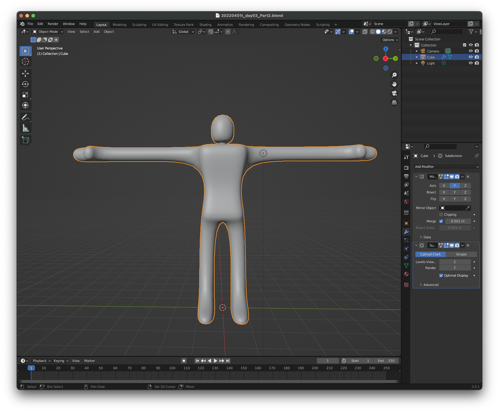

# メディア表現 V 3. モデリング

[メディア表現 V TOP に戻る](./index.md)

---

## 目次

- [メディア表現 V 3. モデリング](#メディア表現-v-3-モデリング)
  - [目次](#目次)
  - [モデリングの方法](#モデリングの方法)
    - [スカルプティングについて](#スカルプティングについて)
  - [ポリゴンモデリング](#ポリゴンモデリング)
    - [ポリゴンモデリングとは](#ポリゴンモデリングとは)
    - [主に利用するショートカット](#主に利用するショートカット)
    - [その他](#その他)
  - [やってみよう Part1(ワイングラス)](#やってみよう-part1ワイングラス)
    - [下準備](#下準備)
    - [ワイングラスを作ろう(外側)](#ワイングラスを作ろう外側)
    - [ワイングラスを作ろう(内側)](#ワイングラスを作ろう内側)
    - [滑らかにしよう](#滑らかにしよう)
    - [台を作ってみよう](#台を作ってみよう)
    - [ワイングラス・台に材質を設定しよう](#ワイングラス台に材質を設定しよう)
    - [HDRI(環境光)を設定](#hdri環境光を設定)
    - [レンダリングしてみよう](#レンダリングしてみよう)
    - [参考:色んな方法があるモデリング](#参考色んな方法があるモデリング)
  - [やってみよう Part2](#やってみよう-part2)
    - [立方体から人型を作ってみよう](#立方体から人型を作ってみよう)
  - [やってみよう Part3](#やってみよう-part3)
  - [好きな形を作るには？](#好きな形を作るには)
  - [気をつけること](#気をつけること)
  - [参考](#参考)
    - [Monster Mash(こんなモデリング方法も)](#monster-mashこんなモデリング方法も)
    - [Low Poly Character(英語の動画は字幕使ってみてみよう)](#low-poly-character英語の動画は字幕使ってみてみよう)
    - [本格的にキャラクター作りたい人向け](#本格的にキャラクター作りたい人向け)
    - [便利な Add ons](#便利な-add-ons)
  - [お疲れ様〜](#お疲れ様)

---

## モデリングの方法

- 大きく分けると Edit Mode(ポリゴンモデリング)と Sculpt Mode(スカルプティング)がある。
- Edit Mode は 3 つ以上の点で作られる面を組み合わせて形状を作る
- Sculpt は粘土細工・彫刻のように、盛り上げたり削ったりして形状を作る
- この演習ではスカルプティングは扱わない
- モデリングをしっかりやりたい人は、いろいろなチュートリアルを真似することをお勧めする

### スカルプティングについて
参考置いておきます。
- [【Blender 2.93 Tutorial】キャラクター頭のスカルプト解説 - How to sculpt a character's head](https://www.youtube.com/watch?v=JC7b3QLFyVA)

なお、ver3.5からVDMという強力な機能が追加されました
- [Blender3.5リリース!!新機能見てこう! Hair / VDM sculpt brush / Compositing on Viewport](https://www.youtube.com/watch?v=iDdnZmN-2v8&t=210s)

---
## ポリゴンモデリング

### ポリゴンモデリングとは

- ポリゴン(多角形)の集まりをメッシュと呼ぶ
- 多角形は頂点・辺・面から成り立っている

### 主に利用するショートカット

- 頂点・辺・面(1,2,3 でモード切り替え)の移動・回転・スケールは G,R,S
- E(Exlude)で押し出し
- I(Inset)で面の差し込み
- Ctrl-R でループカット
- Ctrl-B でベベル
- Option-右クリックでループ選択

### その他

- 右クリックで subdivide でポリゴンを細分化できる
- Modifier の SubDivision Surface で、非破壊的に滑らかにできる
- 滑らかに見せるのは、Object モードで Shade Smooth

---

---

## やってみよう Part1(ワイングラス)

{:target="\_blank"}

### 下準備

- Blender を起動して、立方体を削除(X)
- Edit - preferences - Add ons
- images を検索
- Import-Exmport Import images as Planes にチェック

[ワイングラス zip 形式](img/wineglass.jpg.zip)

- 上のリンク先の写真を Blender フォルダに wineglass.jpg として保存しておこう
- (注意)chrome だと勝手に webp 形式になって保存される(汗 2022/3/8)...zip ファイルを保存して解凍してください...
- File-Save で YYYYMMDDt_mr5_03_01.blend(保存は随時行おう)
- Import - Images as Planes で写真を選択
- マテリアルプレビューモードに
- S 10 で 10 倍に, G-X で少し後ろに、G-Z で少し上にあげて Z=0 のところにグラスの下をあわせる

### ワイングラスを作ろう(外側)

- Shift+A で Circle
- 円を選択して、TAB キーで Edit モードに
- F で面をつくる
- 右上の X を押して、X 軸側からにする
- S で、グラスの足の大きさにあわせる
- E で少し上に押し出し(Z 軸方向)
- E でさらに上に押し出し(Z 軸方向)
- S でサイズをあわせる
- これを繰り返して、グラスの外側をつくる

### ワイングラスを作ろう(内側)

- I で内側に狭めよう
- E で下に押し出して(Z 軸方向)
- S でグラスの内側にあうようにスケール
- これを繰り返して、グラスの内側をつくる

### 滑らかにしよう

- TAB キーで Object モードに
- 右クリックで Shade Smooth
- もう少し滑らかにしたいので、モディファイアから SubdivisionSurface
- 画像は表示を消しておこう

### 台を作ってみよう

- Shift+A で Plane
- S 10 で 10 倍に
- Tab で編集モードに入り、2 で辺編集モード
- 奥の辺を選んで、E Z で押し出し
- 交差する辺を選んで Ctrl-B でベベル スクロールでカーブに
- Tab でオブジェクトモードに戻り、右クリック Shade smooth で滑らかに

### ワイングラス・台に材質を設定しよう

[参考ページ](https://kemarii.com/blog/cg/blender-glass-material/){:target="\_blank"}

- MaterialProperties から New
- プリンシブル BSDF の設定を以下のように

| 項目                         | 値               |
| ---------------------------- | ---------------- |
| Roughness（粗さ）            | 0                |
| Transmission（伝播）         | 1.0              |
| IOR                          | 1.57             |
| Alpha（アルファ）            | 0.6              |
| Blend Mode（ブレンドモード） | アルファハッシュ |

レンダープロパティの ScreenSpaceReflections にチェックを入れる

- 台は適当に色をつけてみよう

### HDRI(環境光)を設定

- レンダープレビューモードに変更
- 環境光は確認用に設定されているが、レンダリングには反映されない。
- ガラスはまわりの環境光によってガラスに見えるので、HDRI(High Dynamic Range Image)を環境光として設定しよう。
- [Poly Haven](https://polyhaven.com/){:target="\_blank"}から適当にダウンロードして、Blender の中に「HDRI」フォルダを作成してそこに保存しておこう。
- World Properties の Color の左から EnvironmentTexture を選んで、写真を開こう。

### レンダリングしてみよう

- 前回の復習
- 視点を決めて、View - Align View - Align Active Camera to View
- 位置を微調整したい場合には、N でサイドバーが表示されている状態にして、View の Camera to View にチェックを入れて、それから調整しよう。
- Render Image
- Save

---

### 参考:色んな方法があるモデリング

今回は紹介にとどめるけど、こんな作り方もあるよ。

- Curve で軸を中心とした線を描く
- screw モディファイアで 360 度ぐるっと回す。

{:target="\_blank"}

---

---

## やってみよう Part2

- File-New-General
- File-Save で YYYYMMDDt_mr5_03_02.blend(保存は随時行おう)

### 立方体から人型を作ってみよう

{:target="\_blank"}

- 左右対称なので、Mirror モディファイア使うよ。
- ループカット(Ctrl+R)を使うと、分割できるよ
- 押し出し(E)を使うと、自由に伸ばせる
- 必要に応じてインセット(I)
- 曲面にするには SubdivisionSurface モディアファイアでできる。(逆にいうとこれを想定して作る必要あり)

---

---

## やってみよう Part3

時間がある人は最後にワインを注いでみよう

{:target="\_blank"}

1. 流入口
2. 影響あたえるもの
3. 液体自身を扱うもの

の 3 つが、液体シミュレーションには必要だよ。

- ワインの注ぎ口となる球を追加(Wine)
- 計算する範囲の Cube を(WineDomain)
- ワイングラスに Fluid 追加

| 項目      | 値       |
| --------- | -------- |
| Type      | Effector |
| Is Planer | チェック |

- Wine に Fluid 追加

| 項目           | 値     |
| -------------- | ------ |
| Type           | Flow   |
| Flowtype       | Liquid |
| FLow Behaviour | Inflow |

- WineDomain に Fluid 追加

| 項目                 | 値       |
| -------------------- | -------- |
| Type                 | Domain   |
| DomainType           | Liquid   |
| Mesh                 | チェック |
| Cache - Type         | All      |
| Cache - Is Resumable | チェック |

- BakeAll でシミュレーションしてみる
- だめなら FreeAll->調整->BakeAll
- Material の色(ワインの色)を適当につけてみよう

---

---

## 好きな形を作るには？

- まずは、いろんな人のモデリングを真似しよう
- 一つの形を作るにもいろいろな作り方あるよ
- 曲面を作る時には滑らかにする方法が shade smooth, subdivision surface, と方法があることをしっておこう
- ポリゴン数はなるべく少ない状態で大まかな形からディテイルに作業した方が効率よいよ

## 気をつけること

- ポリゴン数を増やしすぎない
- ポリゴン数を減らすリトポロジーという技術もある

---

---

## 参考

### Monster Mash(こんなモデリング方法も)

- [Monster Mash](https://paiza.hatenablog.com/entry/2021/04/07/150000){:target="\_blank"}

### Low Poly Character(英語の動画は字幕使ってみてみよう)

- [ローポリキャラクター tutorial1](https://www.youtube.com/watch?v=k5x1I6gwpiU){:target="\_blank"}
- [ローポリキャラクター tutorial2](https://www.youtube.com/watch?v=Ljl_QFs9xhE){:target="\_blank"}
- [ローポリキャラクター tutorial3](https://www.youtube.com/watch?v=Z3vdQj06DGo){:target="\_blank"}

### 本格的にキャラクター作りたい人向け

- [キャラクターモデリング解説](https://www.youtube.com/watch?v=BBtgjTiL1XQ&t=0s){:target="\_blank"f}

### 便利な Add ons

- [LoopTools](https://www.youtube.com/watch?v=LQjfJ3aUDYI){:target="\_blank"f}

---

---

## お疲れ様〜

- 今日学んだことを使っていろいろ作ってみよう
- モデリングをしっかりやりたい人は、いろいろなチュートリアルを真似することがお勧め
- 目に入るもの、どうやってモデリングしたらいいか考えてみよう。
