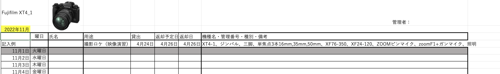

# メディア表現 VI 5. データベース

[メディア表現 VI TOP に戻る](./index.md)

---

## 目次<!-- omit in toc -->

- [メディア表現 VI 5. データベース](#メディア表現-vi-5-データベース)
  - [データベースとは](#データベースとは)
  - [簡単な例を挙げると](#簡単な例を挙げると)
  - [日常的にお世話になっているデータベース](#日常的にお世話になっているデータベース)
    - [Suica](#suica)
    - [unipa, manaba, teams等のサービス](#unipa-manaba-teams等のサービス)
    - [wordpress](#wordpress)
    - [このように](#このように)
  - [Excel, Google Spreadsheet](#excel-google-spreadsheet)
  - [Access, FileMaker](#access-filemaker)
  - [DB-engine ランキング](#db-engine-ランキング)
  - [DBに求められる機能](#dbに求められる機能)
  - [失敗する例](#失敗する例)
  - [リレーショナルデータベース](#リレーショナルデータベース)
  - [正規化](#正規化)
    - [第１正規化](#第１正規化)
    - [第２正規化](#第２正規化)
      - [購入履歴](#購入履歴)
      - [ユーザデータ](#ユーザデータ)
      - [商品データ](#商品データ)
      - [購入履歴明細](#購入履歴明細)
    - [第３正規化](#第３正規化)
    - [正規化まとめ](#正規化まとめ)
    - [正規化のメリット・デメリット](#正規化のメリットデメリット)
      - [メリット](#メリット)
      - [デメリット](#デメリット)
  - [SQL文](#sql文)
  - [カメラ貸し出しDBについて考えてみよう。](#カメラ貸し出しdbについて考えてみよう)
  - [AirTable](#airtable)
    - [とりあえず使えるようになるまで](#とりあえず使えるようになるまで)
    - [PrimaryField](#primaryfield)
    - [管理表](#管理表)
    - [機材表](#機材表)
    - [二つの表を結びつけよう](#二つの表を結びつけよう)
    - [ユーザ表作りましょう。](#ユーザ表作りましょう)
    - [フォームを作ってみよう](#フォームを作ってみよう)
    - [時間あれば...](#時間あれば)
    - [今日の提出物](#今日の提出物)
    - [データベースまとめ](#データベースまとめ)
  - [提出について](#提出について)

---

## 本日の内容<!-- omit in toc -->
- 【第4回】データベース
検索や蓄積が用意にできるように整理された情報の集まりであるデータベースについて学修する。

---
## データベースとは
コンピュータ上で集積・整理された情報のことで、
- 登録
- 編集
- 閲覧
- 検索(抽出)
などをしやすくしたものになります。

---
## 簡単な例を挙げると
Google検索は巨大なデータベースです。

世界中のホームページの内容をロボットがクロール(徘徊)して、データベースに登録していることで、皆さんググることができます。
イメージつくでしょうか。

動画でgoogle検索の仕組みについて確認してみましょう。

- [【Google】5分でわかる！グーグル検索の仕組み](https://www.youtube.com/watch?v=j7lypksdV0M){:target="_blank"}

---
## 日常的にお世話になっているデータベース
### Suica
SuicaやPasmo等交通系ICカードもデータベースが活躍しています。

ちょっと古い記事ですが
- [Suicaのシステムがいかにすごいか仕組みを徹底解説](https://tatase.hatenadiary.jp/entry/2015/11/09/%E4%BB%8A%E3%81%AE%E3%82%A8%E3%83%B3%E3%82%B8%E3%83%8B%E3%82%A2%E3%81%8C%E5%AD%A6%E3%81%B6%E3%81%B9%E3%81%8DSuica%E3%81%AE%E3%82%B7%E3%82%B9%E3%83%86%E3%83%A0%E3%81%AE%E5%87%84%E3%81%95)

システムが障害を起こすと大混乱になりますね。
大した障害を起こさずに運用ができているのは本当にすごいと思います。

### unipa, manaba, teams等のサービス
データの塊を扱ってますね。
これらもデータベースが支えています。

### wordpress
情報デザインとった人は、あまり覚えていないかもしれませんがwordpressを動作するためには
- webサーバ
- データベースサーバ
- php

が必要でしたね。MAMPは次のものをセットにしたアプリケーションでした。
- OS: Mac
- Webサーバ：Apache
- DBサーバ：MySQL
- PHP

### このように
あなたが日常使っているほぼありとあらゆるシステムでは、あなたが意識していないだけで、データベースが動いていると言えるでしょう。

データベースの存在を意識しましょう。

---
---
## Excel, Google Spreadsheet
表計算ソフトである Excel, Google Spreadsheetでも、一応データベースっぽく利用することはできます。

しかし、複数ユーザからの操作に弱かったり、大容量のデータの取り扱いに不向きだったりします。

業務として利用するには、データベース専用のアプリの利用が求められます。

## Access, FileMaker
個人や小規模なグループでデータベースを扱う時には
- Access
- FileMaker

といったアプリが使われることもあります。

## DB-engine ランキング
- [DB-Engines Ranking](https://db-engines.com/en/ranking)

DBはさっきも言ったように、ありとあらゆるシステムを支える技術ですから、信頼性が求められます。先ほどの個人・小規模向けのものではなく世の中では、より堅牢なデータベースが用いられています。

---
---
## DBに求められる機能
- 共有利用（複数ユーザーからの共有利用）
- 一元管理（1データ1個所の原則）
- 信頼性（耐障害性、高度なセキュリティ）
- 性能（処理速度）

等シビアな機能が求められます。

## 失敗する例
- [DBのロックについてあまり意識したことがない人に向けた、実は覚えておきたいロックについての知識](https://speakerdeck.com/carta_engineering/geek-camp-academia-2023-nakka?slide=14){:target="_blank"}

これに限らず、結構データベースは様々なことを考えて不具合が起きないようになっています。

---
## リレーショナルデータベース
- データ構造を決めたものを**テーブル**
- テーブルに記録されたデータを**レコード**

と言います。複数の**テーブル**に関連性を持たせたデータベースを**リレーショナルデータベース**と呼びます。

**データベースを設計する**とは実際には、このテーブルの構造を決めることになります。

例えば、個人情報のテーブル

| 個人ID | 氏名  | E-mail     | 
| ------ | ----- | ---------- | 
| 00001  | Aさん | a@test.com | 
| 00002  | Bさん | b@test.com | 
| 00003  | Cさん | c@test.com | 

と、出席確認テーブル

| 出席ID | 出席日     | 個人ID | 
| ------ | ---------- | ------ | 
| 000001 | 2022/10/14 | 00001  | 
| 000002 | 2022/10/14 | 00003  | 
| 000003 | 2022/10/15 | 00002  | 
| 000004 | 2022/10/15 | 00003  | 

の二つのテーブルがあった時に、個人IDで二つのテーブルが関連づけられていることが分かります。

テーブルはレコードに対して一意(ユニークな・重複しない)のIDを振っておくことが多いです。

---
## 正規化
リレーショナルデータベースには**設計が必要となり、コンピュータが扱いやすいテーブルの構造を作る必要**があります。

例えば、次のような表があったとしましょう。

|注文日|ユーザ名|発送先住所|商品名1|単価1|数量1|商品名2|単価2|数量2|商品名3|単価3|数量3|合計金額|
|:----|:----|:----|:----|:----|:----|:----|:----|:----|:----|:----|:----|:----|
|2022/10/14|A|住所A|商品A|100|1|商品B|80|2|商品C|50|6|560|
|2022/10/14|B|住所B|商品B|80|5| | | | | | |400|
|2022/10/15|C|住所C|商品B|80|1|商品C|50|5| | | |330|
|2022/10/16|B|住所B|商品C|50|5| | | | | | |250|

これは無駄が多いような気がしませんか？また、注文の中に商品欄が3つありますが、商品4個以上では対応できません。

### 第１正規化
まず、これを整理しましょう。商品の注文ごとにレコードを記録させます。

|注文日|ユーザ名|発送先住所|商品名1|単価1|数量1|合計金額|
|:----|:----|:----|:----|:----|:----|:----|
|2022/10/14|A|住所A|商品A|100|1|560|
|2022/10/14|A|住所A|商品B|80|2|560|
|2022/10/14|A|住所A|商品C|50|6|560|
|2022/10/14|B|住所B|商品B|80|5|400|
|2022/10/15|C|住所C|商品B|80|1|330|
|2022/10/15|C|住所C|商品C|50|5|330|
|2022/10/16|B|住所B|商品C|50|5|250|

これを**第１正規化**と呼びます。

### 第２正規化
住所・単価等が重複して表に現れていますね。これも整理しましょう。
ユーザ名・商品名・注文ごとにIDを振って整理してみましょう。

#### 購入履歴

|注文ID|注文日|ユーザID|合計金額|
|:----|:----|:----|:----|
|OID00001|2022/10/14|UID00001|560|
|OID00002|2022/10/15|UID00002|400|
|OID00003|2022/10/15|UID00003|330|
|OID00004|2022/10/16|UID00002|250|

#### ユーザデータ

|ユーザID|ユーザ名|発送先住所|
|:----|:----|:----|
|UID00001|A|住所A|
|UID00002|B|住所B|
|UID00003|C|住所C|

#### 商品データ

|商品ID|商品名|単価|
|:----|:----|:----|
|GID00001|商品A|100|
|GID00002|商品B|80|
|GID00003|商品C|50|

#### 購入履歴明細

|注文ID|商品ID|数量|
|:----|:----|:----|
|OID00001|GID00001|1|
|OID00001|GID00002|2|
|OID00001|GID00003|6|
|OID00002|GID00002|5|
|OID00003|GID00002|1|
|OID00003|GID00003|5|
|OID00004|GID00003|5|

### 第３正規化
この例では、ここまでで分離できるところを全てしました。

例えば、住所のところを「東京都」「神奈川県」「千葉県」などの都道府県ごとに管理すると、さらに分離することができます。

### 正規化まとめ
定義としては第５正規化まであるようですが、通常実務で必要とされているのは第３正規化までとなります。

[参考：リレーショナルデータベース正規形の種類と正規化手順](https://proengineer.internous.co.jp/content/columnfeature/6480)

### 正規化のメリット・デメリット
#### メリット
- データの汎用性アップ
- データの容量削減
- データの保守性アップ

#### デメリット
- 検索のパフォーマンスが低下する可能性

---
---
## SQL文
データベースにデータを蓄えるための準備としての設計について学んできましたが、
そのデータベースに対して**CRUD**
- Create: データ作成
- Read: データ取得
- Update: データ更新
- Delete: データ削除

することが基本的には必要となります。そのためのデータベース言語があり、その中で最も普及しているものが**SQL**です。

SQLはISO（国際標準化機構）で規格が標準化されており、一度学習すればほかのデータベースでもほぼ同じように操作可能です。

ここでは**CRUD**という概念と、SQLという言語があるということを理解しておきましょう。

---
---
## カメラ貸し出しDBについて考えてみよう。
正規化はまだ考えてなくて良いけど、どのような項目が必要になるか考えてみよう。
ちなみに、現状のファイルはTeamsのExcelファイルでカメラの機種ごとに次のように管理しています。

これ、ジンバルみんな借りたいって言ったときに、ぶつかっちゃいますね。どんな感じにしましょう...

&nbsp;

こんな感じでどうかな？

| 申請日     | 開始日     | 終了日     | 学籍番号 | 氏名           | 用途 | 機種名 | 備考           | 
| ---------- | ---------- | ---------- | -------- | -------------- | ---- | ------ | -------------- | 
| 2022/10/14 | 2022/10/14 | 2022/10/18 | ABC12345 | へのへのもへじ | ロケ | XT-4   | ジンバル・三脚 | 
|            |            |            |          |                |      |        |                | 
|            |            |            |          |                |      |        |                | 

---
これを正規化していこう。
- 管理表
- 物品表
- ユーザ表

の3つに分けられそうです。

正規化するとコンピュータが扱いやすいだけでなく、情報の整理ができます。

---
---
---
## AirTable
データベースソフトにはWordpressのときに使ったMySQLなどがありますが、最近ではWeb上のサービスがあるので、それを使っていきましょう。

> **Airtable**は、2012年にリリースされたクラウド型のデータベース管理に特化したノーコードツールです。

https://www.airtable.com/home/built-for-you

### とりあえず使えるようになるまで
このサインアップ部分、2022年度のバージョンなので、違ってたらごめんなさい。

1. Sign up しましょう。メアドでもGoogleアカウントでも構いません。
2. 「What team are you on?」はOther/PersonalでOK
3. 「Who do you collaborate with?」はSkip
4. 「Get up and running fast!」はContinue
5. 「I’m currently working on:」はTestとか
6. 「Now, we’ll add some info.」はとりあえず、ProjectsをクリックしてContinue
7. 「For each row in Projects, I’d also like to track:」はとりあえずStatusでContinue
8. 「+Create Your Own Workflow Later」
9. Grid only(for now)

ふう、やっと使える...初めてのデータベースですが、まずはこれから管理表を作成していきましょう。

**Workspace**の中に**Base**を作って、それから作業という感じです。

### PrimaryField
これからテーブルを作るときに、一番左に「Primary Field」という扱いの「NAME」があります。これは、レコードを代表する顔となるので、**削除したり、移動したり、非表示にしたりできない**という特徴があります。通常のDBでは「重複した値は登録できずに、空でない」として扱われますが、AirTableでは**そのレコードが一体何のレコードなのか**というを端的に表す必要があります。

### 管理表
- Nameのところの下矢印から「Edit Field」
- 「Name」 を「ID」に
- 下を「Autonumber」にしましょう。

IDには順番に番号が自動的に振られます。・

一度ID以外の3つ入ってる項目を削除しましょう。

- 申請日(Date)
- 開始日(Date)
- 終了日(Date)
- 用途(SingleTextLine)

を追加しましょう。タブの名前をからRename tableで**管理表**にしておきましょう。

### 機材表
「+ Add or import」からCreate blank tableとしましょう。**機材表**とします。

- 「Name」を「機材コード」(SingleTextLine)
- 3つの項目を消して
- 機種(SingleTextLine)

データとして
- glabn3_01, iMac(M1)
- glabn3_01, iMac(M2)

を追加しておきましょう。

### 二つの表を結びつけよう
管理表に戻って、
- 項目追加の+からLink to another record
- 機材表
- CreateField
- Add lookup fields? で機材コード,機種を選んで追加しましょう。

それではデータを追加してみましょう。
- 日付(申請日・開始日・終了日)は適当に(ダブルクリックでカレンダーでます)
- 機材表から「+」をクリック
- glabn3_01を追加すると！

### ユーザ表作りましょう。
「+ Add or import」からCreate blank tableとしましょう。**ユーザ表**とします。

- 「Name」を「学籍番号」(SingleTextLine)
- 氏名(SingleTextLine)

これでテーブルできました。

- データを適当に入れましょう。
- 管理表にリンクしましょう。

### フォームを作ってみよう
- Formの+を押して、「機材貸出申請フォーム」にしてみよう
- 項目が並んでるのを確認したら
- 右上のShareから
- View
- URLの右のPreviewをクリック
- 登録できることを確認しよう

しかも！
- iPhoneからこのURLにアクセスして、登録申請できることを確認しよう。

### 時間あれば...
フィールドタイプに気になる(Barcode)があります。iOS,Androidと書いてあります。何ができるか試してみてください。

### 今日の提出物
登録フォームのURLを提出してもらいます。

### データベースまとめ
世の中の情報システムには必ずと言ってよいほどデータベースが裏で動いています。
プログラミングは一切行いませんでしたが、データベース、およびリレーションについて理解できたでしょうか？

<!--
- ノーコードで試してみよう(AirTable)
  - https://www.youtube.com/watch?v=Jdspf-Y5adE
  - https://www.youtube.com/watch?v=Zrfs7uWMZiQ
  - https://www.youtube.com/watch?v=7pgeRa4Mq7Q
  - https://www.youtube.com/watch?v=2UllVJuaooY
  - 
- 非構造化データ

- [bubble](https://bubble.io/)も気になる...
  - https://marketing-wizard.biz/blog/no-code/nocode-db-design/
  - https://note.com/crowncat/n/neb967c829951
- [Glide](https://www.glideapps.com/)
  - bubbleより簡単いWebアプリ作れるくさい...

- その他
  - https://appmaster.io/ja/blog/no-codemobairuapurinishi-shitadetabesuwoxuan-ze-suru-kao-lu-subekidian#mobairu-apurinodetabesunozhong-lei
-->

## 提出について
メモをマークダウンで記述してPDFにしたものを提出とします。

