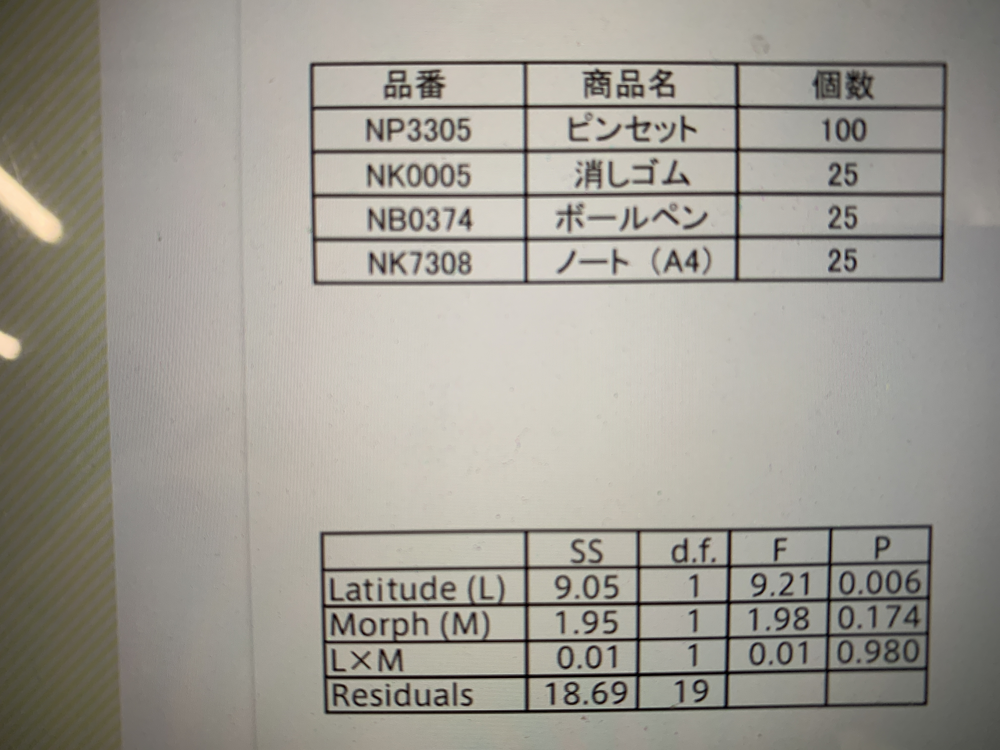

# メディア表現 VI 6. モダンExcel Part2

[メディア表現 VI TOP に戻る](./index.md)

---

## 目次<!-- omit in toc -->

- [メディア表現 VI 6. モダンExcel Part2](#メディア表現-vi-6-モダンexcel-part2)
  - [前回のおさらい](#前回のおさらい)
  - [モダンExcel](#モダンexcel)
    - [Power Query](#power-query)
    - [PowerPivot](#powerpivot)
    - [Macの状況](#macの状況)
    - [本の紹介](#本の紹介)
  - [データの取得](#データの取得)
    - [ETL](#etl)
    - [データの読み込みについて](#データの読み込みについて)
      - [ファイルメニューのインポートから](#ファイルメニューのインポートから)
      - [データTABのデータファイル指定(PowerQuery)](#データtabのデータファイル指定powerquery)
      - [データTABの画像からのデータ](#データtabの画像からのデータ)
    - [PowerQueryを使ってCSVを取り込んでみよう](#powerqueryを使ってcsvを取り込んでみよう)
    - [Power Queryエディタ](#power-queryエディタ)
    - [悲しいお知らせ](#悲しいお知らせ)
    - [ピボットグラフ](#ピボットグラフ)
  - [今日の課題](#今日の課題)
  - [まとめ](#まとめ)
  - [おまけ](#おまけ)

---

## 本日の内容<!-- omit in toc -->
- 【第6回】モダンExcel II 
モダンExcelを用いた分析・可視化について学修する。モダンExcelを用いた分析・可視化について学修する。

---
## 前回のおさらい
- Officeのバージョンについて
- ピボットテーブル(クロス集計)
- テーブル
- スピル

今日はいよいよモダンExcelに入っていきましょう。

---
## モダンExcel
- Power Query(パワークエリー)
- Power Pivot(パワーピボット)

### Power Query
PowerQueryはデータの取り込みと整形を行う機能です。
つまり、
- データの取り込み
- 取り込んだデータの加工

を行います。

### PowerPivot
PowerQueryで整形されたデータを集計し、視覚化するための機能です。

OSにより使える機能が異なっています。
現時点では、MacではPowerQueryのみが対象となっていて、残念なことにPowerPivotには対応していません。
(上位のサービスPowerBIはiOSでも対応しているのに...もう少し時間がかかりそうです。)

<!--
### MacとWin版のExcelの差
- [参考:Mac版ExcelではWindows版と違う方法を使い外部データを取り込む](https://qiita.com/tex_owleyes/items/00b26bd2e479a679387e){:target="_blank"}
- [参考:MacのExcelアプリでパワークエリ機能が強化された。](https://akmemo.info/mac-powerquery-update/){:target="_blank"}

もう少しで本当の機能までアップデートされそうです。現在実装されている範囲で行っていきましょう。
-->
### Macの状況
まとまっているのはこの記事でしょうか。この時期は2022.5に書かれていますが、現在は正式リリースされています。
- [MacのExcelアプリでパワークエリ機能が強化された。](https://akmemo.info/mac-powerquery-update/)

### 本の紹介
- [モダンExcel入門](https://www.amazon.co.jp/%E3%83%A2%E3%83%80%E3%83%B3Excel%E5%85%A5%E9%96%80-%E6%9D%91%E4%BA%95-%E7%9B%B4%E5%BF%97/dp/4296109324){:target="_blank"}

---
## データの取得
### ETL
ETLという考え方があります。
- Extract 抽出する
- Transform 変換する
- Load 読み込む

モダンExcelにてこのETLを担うのがパワークエリとなります。

### データの読み込みについて
#### ファイルメニューのインポートから
CSV,HTML,Textファイルを選ぶことができます。

#### データTABのデータファイル指定(PowerQuery)
Excelブック、テキスト/CSV, XML, JSON等が選択できます。

#### データTABの画像からのデータ
気づいたら画像認識できるようになっています。

試しておきましょう。
https://tsutawarudesign.com/miyasuku1.html
を写真にしたこのファイルを使いましょう。

1. 画像をデスクトップにドラッグして保存
2. 挿入するセルを選択
3. データTAB - 画像からのデータ
4. ファイルから画像...
5. 解析させる
6. ピンクのところが間違えか怪しいと思ったところなのでそこを手で修正(または同意する)
7. 挿入

うまく行ってないところもあるけど、
これって、写真の撮り方によっては非常に有効ですね。覚えておきましょう。

### PowerQueryを使ってCSVを取り込んでみよう
1. https://www.data.jma.go.jp/risk/obsdl/index.php
2. 地点を選ぶ：東京の東京、練馬
3. 項目を選ぶ：日別値
   - 気温：日平均気温
   - 降水：降水量の日合計
   - 日照/日射：日照時間
   - 風：日平均風速,日最大風速(風向)
4. 期間を選ぶ：最近1年
5. 表示オプションを選ぶ：まま

としてCSVファイルをダウンロード

なお、今回Excel,CSVファイルの位置関係が重要ですので
1. 今日の作業フォルダを作成
2. Excelファイルを新規作成して、フォルダの中に保存
3. CSVファイルをフォルダの中に移動

としてから先に行きましょう。

1. データタブの「データファイルの指定(PowerQuery)」
2. テキスト/CSV
3. 参照でdata.csvを選択してデータ取り出し
4. 次へ
5. 文字化けしているので「932：日本語(シフトJIS)」
6. 読み込む
7. シートが新しく作成されて、テーブルとして作成される。

ん？インポートと何が違う？と思いますよね？

それでは、実験してみましょう。

1. data.csvをテキストエディットで開く
2. 日付の入っている1行消す
3. Excelに戻って、テーブルが選択されている状態で、データの「更新

これは何を意味するのでしょうか？

- 外部データの場所を保持している
- 読み込みの条件を保持している
- データが変更されると、即時反映することができる。

例えば、毎日売上表が各店舗からExcel等でくるとします。

フォーマットが一緒です。

「更新」とするだけで、表を取り込むことができ、さらには、そのデータを利用した以降の処理に反映することが可能、ということになります。

一方、次を試してみましょう。
1. Column3(C列)を削除
2. すべて更新

元に戻ってしまいますね。
読み込んでから整理をした場合、読み込むごとに毎回整理し直さなくてはいけないことを意味します。

---
### Power Queryエディタ
2022年は対応していませんでしたが、2023年はMacも対応するようになりました。

これでELTの
- E：Extract
- T：Transform
- L：Load

の全てができるようになりました。

1. テーブルを選んで、PowerQueryエディタの起動
2. Column3を右クリックで、列の削除
3. 右の適用されたステップで、「列の削除」が追加されたことを確認
4. エディタを閉じて、変更を「保持」
5. data.csvのデータを1日削除して、更新してみよう。

ETLが自動的に適応されていることがわかったでしょうか？

<!--
---
### 悲しいお知らせ
シラバス作成時に先走りすぎました。
ETLのE(Extract),L(Load)の部分を試しましたが、Transformはやってません。

これ、PowerQueryエディターを搭載してくれないと動かないのです。

Macのベータ版では動いているのですが、皆さんのにベータ版を入れるわけにもいかないので、YouTubeで見てみましょう。英語なので注釈入れながら見ましょう。

- [Excel Update: Power Query Editor for Mac](https://www.youtube.com/watch?v=lPEDULKhgRM){:target="_blank"}

そして、現在のMac版ExcelにてPowerPivotが利用できない、と動画でも言っていました。

ただ、個人的見解ですが、近い将来には実装されると思います。

それは、AirTableでわかるように、うかうかしているとExcelも安泰ではないと考えるからです。ローコード・ノーコードの波は確実に来ています。

それは、難しい関数を覚えなくても、考え方さえわかれば簡単に分析をすることが可能になるということです。考え方は知っておきましょう。
-->

モダンExcelとは何かをPowerPivot含めて、次は日本語で見てみましょう。

- [最近注目度が高まってきているスキル！モダンExcelについて詳しく解説します！パワークエリ、パワーピボットについて概要説明あり！(13分)](https://www.youtube.com/watch?v=YfIlxtX9IQ8){:target="_blank"}

### 悲しいお知らせ
モダンExcelでは**データモデル**という概念を採用し、
- PowerQueryで読み込んだデータをそこに格納
- PowerPivotにて集計表やグラフを作成

という流れを取ります。

データモデルを利用すると、取り込んだデータのリレーションを貼ることも可能になります。(Vlookupいらない)

つまり、
- データの読み込み
- データの整理
- データの関連付け
- データの可視化

を自動で行うことができるようになります。
早くMacでもモダンExcelを利用できるようになって欲しいものです。

### ピボットグラフ
可視化部分を完全に触らないのも何なので、ピボットテーブル・ピボットグラフ・スライサーというのを試してみましょう。

1. データの[ダウンロード](mr6_06.xlsx.zip)
2. 開く
3. テーブルタブ - ピボットテーブルで集計
4. OK
5. 性別を行と値にドロップ
6. 作成されたピボットテーブルを選択して3つ横にコピー
7. 2つ目のテーブル選択、性別のチェックを外してから年代を行と値にドロップ
8. 3つめのテーブル選択、性別のチェックを外してから満足度を行と値にドロップ
9. 4つ目のテーブル選択、性別のチェックを外してから意見を行へ

ピボットテーブルが4つできましたね。グラフを作成してみましょう。

1. 3番目のピボットテーブルを選択して、ピボットテーブル分析タブへ
2. ピボットグラフ
3. デザインタブへ
4. グラフの種類の変更から円のオーソドックスなものへ
5. デザインタブで好きなものへ

これよりグラフをカスタマイズしたければ、1年生を思い出しましょう。次、強力なの行きます。

1. 4つ目のピボットテーブルを選択して、ピボットテーブル分析タブへ
2. スライサーの挿入で、性別、年代にチェックをつけOK
3. 適当に置き直し
4. 女性、とか10代とかシフト押して20代とかクリックしましょう。
5. クリアーするには右上の「フィルターのクリア」を押しましょう。

どうでしょう？データの可視化で分析が簡単にできることがわかったでしょうか？
モダンExcelを使わなくても、ここまではでき、モダンExcelを使うと自動でかなりのことができるようになります。

4つ目のピボットテーブルを選択して、スライサーを挿入したので、スライサーは4つ目にしか効いていません。
全てに効く様にしましょう。

1. スライサーを選択
2. スライサータブのレポートの接続
3. 全てのピボットテーブルにチェックを入れる。

ピボットテーブルに名前をつけるにはピボットテーブルを選択して、「ピボットテーブル分析」でピボットテーブル名を変えておきましょう。

## 今日の課題
4つ目以外のピボットテーブルにピボットグラフを作成し、スライサーで操作しやすいようにレイアウトせよ

## まとめ
将来会社などでWinの人はもちろん、卒業する頃にはMacでもPowerPivot含めて利用できると思いますので(希望的観測)是非使いこなしてください。
PowerPivotとピボットテーブルの違いはここにまとまっています。
- [PowerPivot【01】PowerPivot（パワーピボット）で出来ること](https://jsdg.org/blog/view061/)

なお、今日はやりませんが、Googleフォームとの連携、クエリ、という考え方を使ってもう少し詳しく説明してある動画はこちらとなります。

- [【知らないと損】Googleフォーム×Excelがすごかった！話題になった総務省Excelでの意見募集アンケートについて新生Excelスキルを使った方法を徹底解説します！](https://www.youtube.com/watch?v=IcGg_dlqC7k){:target="_blank"}

---
## おまけ
Macでしか使えないようですが、ポートフォリオ等で使えるかもしれないツールがリリースされたので試してみましょう。
スマホのモックアップジェネレータです。

- [rotato](https://rotato.app/){:target="_blank"}

1. ダウンロードしましょう
2. 起動してアカウント作成してアンケートに答えましょう
3. 1170 x 2532 ピクセルの画像または動画を用意しましょう。サイズ違うと画面にうまくはまって見えないだけです。(なくても実験できます)
4. Newしてドラッグ&ドロップしましょう。
5. 画像で保存したり、動画で書き出せたりします。

無料版だと「rotate.app/free」とついてしましますが、問題ないのではないでしょうか？
XDで作成したプロトタイプをより素敵に見せられるかもしれません。

