# スクーリング マルチメディア演習 Day1<!-- omit in toc -->
第１回 オリエンテーション
第２回 デジタルコンテンツの基礎知識
第３回 デジタルカメラによる撮影及びポスター制作演習

# <!-- omit in toc -->

1. [初めに](#初めに)
2. [本演習について](#本演習について)
   1. [マルチメディア演習の位置付け](#マルチメディア演習の位置付け)
   2. [マルチメディア](#マルチメディア)
   3. [「情報」について](#情報について)
   4. [進め方](#進め方)
3. [デジタルコンテンツ基礎知識](#デジタルコンテンツ基礎知識)
   1. [コンピュータへの取り組み方](#コンピュータへの取り組み方)
   2. [デジタルデザインの基礎](#デジタルデザインの基礎)
   3. [カメラの基礎知識](#カメラの基礎知識)
   4. [カメラの基本操作](#カメラの基本操作)
4. [デザインの基礎知識](#デザインの基礎知識)
   1. [4つの基本原則を意識しよう！](#4つの基本原則を意識しよう)
5. [演習](#演習)

# 初めに
## 席について<!-- omit in toc -->
指定させていただきました。
ホワイトボードに貼ってある座席表を見て、そこにお座りください。

## 健康管理<!-- omit in toc -->

- 体調には十分に気をつけてください。
- 発熱などある場合には、無理しないでください。
- 話をするときにはマスクの着用にご協力お願いいたします。

## iMacについて<!-- omit in toc -->
ネットワークに接続するために、学内ネットワーク用のID/Passwordが必要となります。
manabaにアクセスするのと同じものです。

共用マシンですので、「この情報を記憶」のチェックは外して入力しましょう。

1. Macの電源は左後ろにあります。
2. ログイン用の画面が出るのを待ちましょう。
3. コマンド+スペースで「chrome」。リターン
4. thu.ac.jp等アクセスできることを確認してください。

---
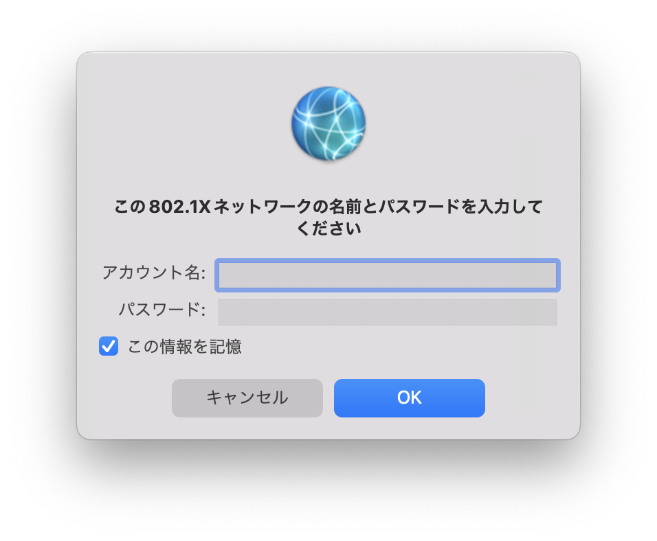

## Teams<!-- omit in toc -->
体調不良で出校できなかった時や、連絡用にTeamsも使えるようにしておきましょう。

1. コマンド+スペース で「Teams」。リターン
2. 学内ネットワーク用のID/Passでログイン
3. チームから「2023_夏期スクーリング_マルチメディア演習」があることを確認してください。
4. 一般チャンネルにて挨拶してみましょう。

ログイン時、
学籍番号が319以下の3桁で始まる人：学籍番号@thu.ac.jp
学籍番号が320以上の3桁で始まる人：学籍番号@edu.thu.ac.jp

## 資料置き場<!-- omit in toc -->
学外からも閲覧できるように、github上に資料を置いています。

https://sammyppr.github.io/

メモしておくと復習に役立ちます。

## 時間割について<!-- omit in toc -->
4限：14:20-15:30
5限：15:40-16:50
6限：17:00-18:10

1〜3限、「ネットワーク演習/情報通信」とっている方お疲れ様です。

閉館時間は18:30です。

## オープンキャンパスについて<!-- omit in toc -->
18,19日に関しては、オープンキャンパスが開催されています。

14:00までは506教室はオープンキャンパス用に利用していますので入室する場合にはそれ以降でお願いいたします。

## 熱中症対策<!-- omit in toc -->
本来506教室は飲食禁止ですが、熱中症対策も考えて、飲み物可とします。

ただし、机の上ではなく、下に置くようにしてください。

## 自己紹介<!-- omit in toc -->
小林　統(おさむ)

と申します。5日間と短いですがよろしくお願いいたします。

## 自己紹介<!-- omit in toc -->
- 大学ではバーチャルリアリティを研究
- その後、ギターを学びに渡米
- 大学院で人工知能を少しかじる。中退。
- インターネットビジネスで起業
- その後フリーランスとしてHP・映像・音楽・アプリ等の制作
- この大学で講師として11年目となります。

## 2日目の代打講師について
2日目にHPを扱いますが、私用によりどうしても外せない用事があるため、
- 山本暢(やまもと のぶる)

先生に代打でお願いしています。

## SA紹介<!-- omit in toc -->
授業のヘルプをしてくれるメディア文化コース3,4年の学生です。
日によって入れ替わりがありますが、よろしくお願いいたします。

- 仁平海斗
- 
- 岩室美咲(2日目のみ)

TODO:

です。
質問などがあれば、挙手をしてどんどん聞いてください。

## Macについて<!-- omit in toc -->
普段Windowsを利用しているので、Macはよくわからないと言う場合には、躊躇せずにどんどん質問してください。

- メニューバーがウィンドウではなく、画面一番上にある
- エクスプローラーに当たるものがFinder
- ファイルダイアログ(開く・保存)がちょっと異なる
- WindowsのCtrl は MacのCommand
- 日本語入力時に自動で漢字に変換される機能がある

## 事務連絡<!-- omit in toc -->
学生向け：掲示物必ず確認するようにしてください。
オフィスアワー：演習後(18:10以降)に質問などを受け付けていますので、自由に声がけしてください。
閉館時間について：18:30となっています。
授業評価アンケートの実施：最終日にmanabaから行っていただきます。

# 本演習について
## マルチメディア演習の位置付け
**マルチメディア演習**という科目は高等学校教員（情報）の免許資格を取得するのに必須です。

履修者が増えているため、昨年度から明確に「情報教員希望者対象」と位置付けました。

## マルチメディア
### ニューメディア・マルチメディア
1980年代にニューメディア、1990年代にマルチメディアという言葉が流行りましたが、中途半端に終わりました。

googleトレンドで「ニューメディア」「マルチメディア」を調べてみましょう。

[GoogleTrend ニューメディア・マルチメディア](https://bit.ly/3CcPmzF)

---
### マルチメディアの意味
「マルチメディア」という言葉が一般的かどうかはさておき、以下の意味で利用されています。

> マルチメディアとは、情報媒体（メディア）の様態の一種で、文字や画像、動画、音声など、様々な種類・形式の情報を組み合わせて複合的に扱うことができるもの。特に、コンピュータなどの情報機器を用いて、デジタル化されたそれら多様な種類の情報を統合したもの。

[e-words マルチメディア](https://e-words.jp/w/%E3%83%9E%E3%83%AB%E3%83%81%E3%83%A1%E3%83%87%E3%82%A3%E3%82%A2.html)

---
### より一般的になったマルチメディア
インターネット・通信の高速化、PCやスマホの高機能化により、誰でもいつでもマルチメディアに触れることができるようになりました。

このため、「マルチメディア」という言葉を使うことすら必要がないほど生活に浸透しているといえるでしょう。

## 「情報」について
### 【情報編】高等学校学習指導要領（平成30年告示）解説
これが最新ですね。
情報の先生になるのですから一通り読んでおいた方が良いと思います。

https://www.mext.go.jp/content/1407073_11_1_2.pdf

---
### P.17
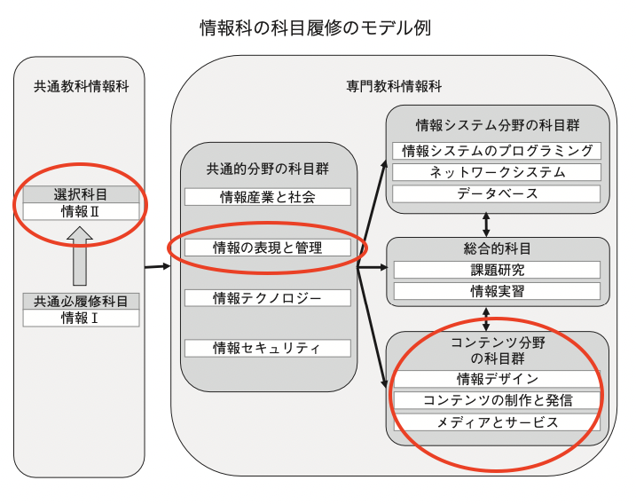

---
### P.18
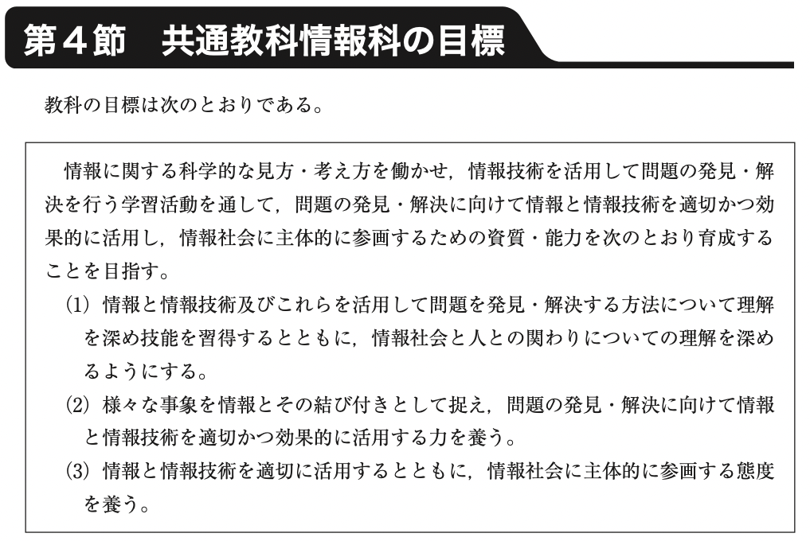

---
### P.20
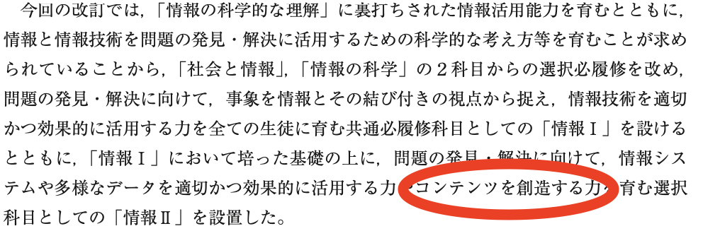

---
### P.21
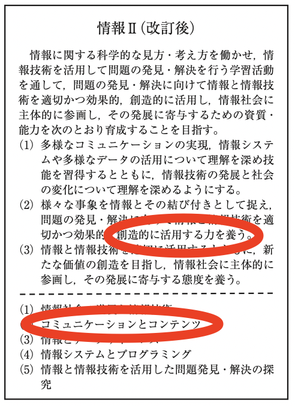

---
### P.44
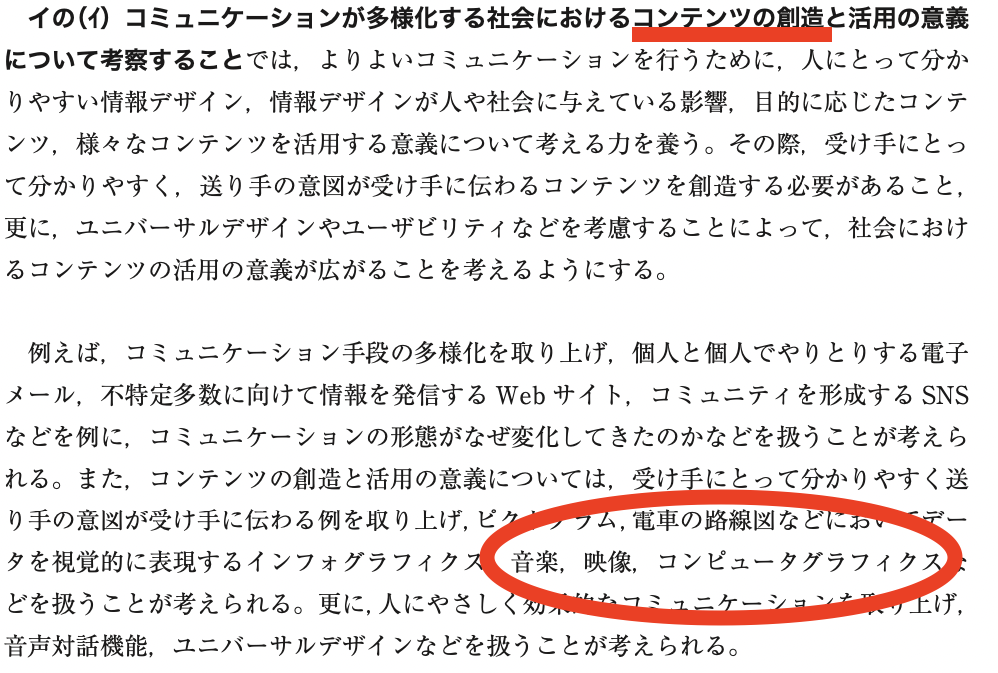

---
### P.45
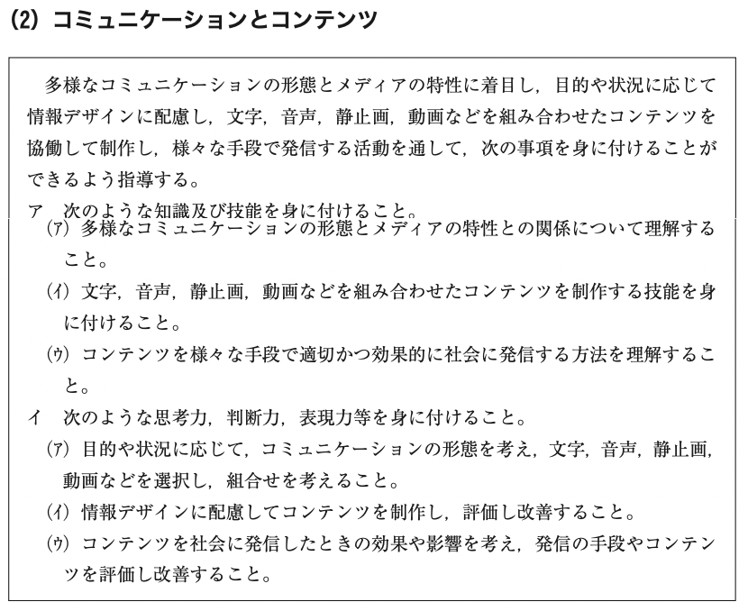

---
### 学習指導要領から読み取れる「マルチメディア演習」の位置付け

> 文字，音声，静止画，動画などを組み合わせたコンテンツを制作する技能を身に付けること。

これが、本演習に求められる内容となります。

## 進め方

---
第１回 オリエンテーション
第２回 デジタルコンテンツの基礎知識
第３回 デジタルカメラによる撮影及びポスター制作演習
第４回 HTML入門
第５回 CSS, JavaScript入門
第６回 テンプレートを利用したホームページ制作演習
第７回 Photoshop入門
第８回 Photoshop応用
第９回 Photoshopを用いた画像編集演習
第１０回 動画の基礎知識
第１１回 Premiere入門
第１２回 CM制作演習
第１３回 音楽制作入門
第１４回 インタラクティブメディア入門
第１５回 マルチメディア制作演習

---
### シラバス
ある程度これに沿ってやりますが、一コマ70分のため多少変更の可能性があります。

最終的な目標を以下のように設定します。
- AdobeのIllustrator, Photoshop, Premiere Proを使える
- ホームページの仕組みを理解できる

---
### もう画像編集・動画編集・HP作成できるという人
知っている内容を学んでもせっかくの夏休みを返上してきていただいているのに意味がないですから、申し出てください。

対応できる範囲で、他の内容にトライしてもらおうと思います。

---
### コンテンツの種類
制作するコンテンツとして大まかに
- 静止画
- Web制作
- 動画(ビデオ編集・モーショングラフィックス)

を想定しています。

---
### 1日ごとのお題
- 1日目 A3ポスターを作ろう(カメラ撮影・Photoshop, Illustrator)
- 2日目 ホームページの仕組みを学ぼう(Photoshop, Visual Studio Code)
- 3日目 Photoshopを使いこなそう(Photoshop)
- 4日目 PremiereでCMを作ろう(Premiere Pro)
- 5日目 PremiereでCMを作ろう2+講評会(可能であれば)

---
### ソフトウェアについて
本演習室のMacにはAdobe Creative Cloudがインストールされています。今回はAdobe CCを利用していきます。

実際に高校で指導するにあたり、Adobe製品がインストールされているとは限りません。

最近では同様の機能を持つオープンソースのソフトウェアも多く存在しています。とある条件の元では無料で良い、というものも数多くあります。スマホ用の無料ソフトウェアでもかなりのことができるようになっています。

---
### オープンソースソフトウェア
> ソフトウェアの設計図にあたるソースコードを、インターネットなどを通じて無償で公開し、誰でもそのソフトウェアの改良、再配布が行えるようにすること。また、そのようなソフトウェア。

平たく言えば、タダで利用できるソフトです。メリットとして購入の必要がないため導入しやすく、生徒の自宅での予習復習にも最適なソフトということになります。

---
### 有料無料ソフトウェアまとめ

||有料ソフト|無料ソフト|
|:---|:---|:---|
|画像編集|Photoshop|Gimp, Krita|
|グラフィック制作|Illustrator|Inkscape|
|映像編集|Premiere Pro, Final Cut Pro|Davinci Resolve, Lightworks,Shotcut|
|映像加工|AfterEffects|DaviniciResolve(Fusion)|
|音楽制作|Cubase, Logic, ProTools|Studio One Prime|
|Web制作|Dreamweaver|Visual Studio Code|
|ゲーム開発|Unity Pro|Unreal Engine, Unity|

---
### 無料ソフト探し方
「Photoshop alternative 2023」「Photoshop 代替 2023」などとググるとたくさんの記事がヒットします。

さまざまなアプリケーションを無料で利用する環境が整ってきている、ということを理解しましょう。

また、この流れを受けて生徒・教育機関向けには無料で利用できるライセンスが用意されていることも多くなってきています。

---
### Webサービス
インストールしなくても、Webにアクセスするだけ(会員登録は必要かも)のサービスがあることも忘れてはいけません。

例えば、アニメーションを作れるWebサービスにこんなものがあります。(日本語非対応のものも多いですが)

https://www.animatron.com/

---
### スマホのアプリ
一方、スマホでは画像編集・映像編集等に関して非常に優秀(一部は無料)なアプリが出てきているような気がします。

これらの動向についても目が離せません。

タイピングは苦手だけれども、フリック入力は得意なのでスマホでレポートを書いたり、Photoshopはよくわからないので、スマホで画像を編集している大学生も出てきています。

スマホを利用しても、かなりのことができるようにこれから世の中が変わっていく、ということは抑えておいていいでしょう。

---
### 生成系AI
昨年度から生成系AIの勢いが止まりません。
日々新しい何かがリリースされている気がします。

個人的見解ですが、ちょっとしたことをしたい時には圧倒的な速さでこなしてくれます。

「[いらすとや](https://www.irasutoya.com/)」が市民権を得たように、その程度でいい人には本当に便利だと思います。

---
### メジャーでないAIサービスの例
- [Skybox](https://skybox.blockadelabs.com/)
- [Magic ToDo](https://goblin.tools/)

---
### Photoshopにも...
PhotoshopもAI機能がどんどん追加されています。

便利なのですが、基本を飛ばしてしまうので、本演習では基本教えません。(調べて使ってくれても問題ありません。)

参考
- https://www.youtube.com/watch?v=SoSslHRtcvA
- https://www.itmedia.co.jp/news/articles/2307/27/news187.html

---
### ソフトウェアのまとめ
コンピュータをとりまく環境は日々変化しています。

これから、「情報」を教える方は、動向に注目するようにして下さい。

---
### アンケート
みなさんの状況を知りたいので、アンケートにお答えください。

1. manaba
2. 2022年度夏期_【通信】マルチメディア演習
3. アンケート
4. スキルアンケート

# デジタルコンテンツ基礎知識
## コンピュータへの取り組み方

### 学生の傾向
学生を見るとスマホは楽に使えるのに、Mac/PCとなると身構える子がたくさんいます。

スマホもコンピュータですよね。

スマホには24時間触れているのに、Mac/PCと接している機会が少ないのが問題だと思います。

---
### 習得への近道
昔に比べればコンピュータの扱い方はかなり簡単になっていますが、触れる時間が少なければ上達しません。

- ブラインドタッチの習得
- 検索能力の向上
- チュートリアル・スクリーンキャスト等を数多くこなす
- ある程度把握したところで体系的に網羅している本を参考にする

これがコンピュータ習得への近道だと考えます。

## デジタルデザインの基礎

---

1. デジタルとアナログ
2. ピクセルデータとベクトルデータ
3. 可逆圧縮と非可逆圧縮
4. 解像度
5. カラーモード
6. リンク

---
### 1. デジタルとアナログ
わたしたちが手にしたり目にしたり聞いたりするものは全て「アナログ」で連続した情報の形式を取っています。

それに対して「デジタル」は不連続な情報であり、情報を処理する時に利用されます。

コンピュータはデジタル、となんとなく考えられていますが、アナログ・デジタルの違いは本質的には**情報の処理方法の違い**であることに注意しましょう。

---
### デジタル処理のメリット
- 複製が容易
- 高速処理が可能
- ノイズに強い

---
### 2. ピクセルデータとベクトルデータ
画像を扱うときに2通りの方法があります。

- ベクトルデータ：座標を指定し、直線や曲線をひく方式
- ピクセルデータ：画像を方眼紙のようにスライスし、そのマス目の色情報を蓄える形式(ビットマップ・ラスター)

---
### ベクトルデータ・ピクセルデータ
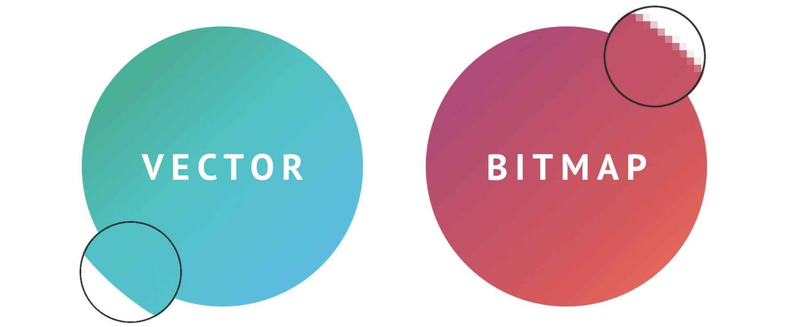

---
### 2つのデータの違い
ピクセルデータは写真等でよく利用されますが、拡大すると綺麗に表示されないのに対し、ベクトルデータはどれだけ拡大しても綺麗に表示されることが大きな違いとなります。

データ容量は一般的にピクセルデータの方が大きくなります。

---
### 3. 可逆圧縮と非可逆圧縮
データの保存方法はいくつもあるのですが、何もしないとファイルの容量が大きくなってしまうために、たいてい圧縮という技術がつかわれます。特に写真・映像データ等ではほとんど利用されています。２つの圧縮方法があるということは非常に大事ですので、必ず理解してください。

- 可逆圧縮：解凍するとオリジナルのデータになるもの
- 非可逆圧縮：解凍するとオリジナルデータにならないもの

---
### オリジナルデータにならない？
オリジナルデータにならない、とは**データが劣化している**ことを意味します。

制作においてはなるべく**可逆圧縮・非圧縮**の形式を利用し、配信するときに**非可逆圧縮**を用いるのが理想的となります。

劣化していると写真や動画などではブロックノイズと呼ばれるノイズが発生したり、グラデーションが綺麗に表現されなかったりします。

---
### 4. 解像度
技術の進歩により最近ではそれほど画像では問題がなくなっていますが、正しい大きさ(解像度)の写真を利用しないと、画面で見た時には綺麗でも印刷した時に荒くなってしまうことがあります。

解像度の理解が必要となります。

dpi,ppi(dot per inch/pixel per inch)が単位となりほぼ同じ意味で利用されます。1インチの中にドット(マス目)がいくつあるか、ということになります。

---
### 利用される画像の解像度
Web：72dpiと言われた時期があります。
印刷：350dpi以上

液晶ディスプレイの発達により画面の解像度自体が上がっています(MacBookAirでは227ppi)。レスポンシブデザインにより表示されるタイミングで画像サイズ変化します。

---
### 動画の解像度
動画での解像度はピクセル数であらわします。

||画素数|
|:---|:---|
|SD|720x480|
|HD|1280x720|
|FullHD|1920x1080|
|4K|3840x2160|
|8K|7680x4320|

各規格はだいたい1.5倍・2倍になっています。

最近ではスマホの普及により縦型動画の需要が増えていることも見逃せません。

---
### 解像度について試してみましょう。
1. Photoshopで新規に1000 x 1000ピクセル・72dpiの画像を作る
2. この時の実際の長さがいくつになるか確認してみましょう。
3. メニューバーの「イメージ」から「画像解像度...」
4. 「画像の再サンプル」のチェックボックスを外して、350dpiにしてみましょう
5. この時の実際の長さがいくつになるか確認してみましょう。

マス目の数は変化していません。正しく設定しておくと他のソフトで取り込んだ時に、正しい大きさで配置してくれたり、印刷が正しい大きさで出力されます。

---
### 5. カラーモード
コンピュータでは色を主に二通りの方法で表しています。ですが、これは、コンピュータのやり方というより、色がどう表現されるか、ということに基づいてそれを実装しているだけです。

ディスプレイを見る時、光が目に直接入る、という方法で人は色を認識しています。

印刷物を見るときは、光が紙にあたり、反射した光から色を認識しています。

---
### CMYKとRGB
この二つの方法に応じて

CMYK：印刷物用
RGB：ディスプレイ用

を使い分けることになります。実際には表現できる色空間が異なります。

また、特別な色(例えば金色)を印刷で利用したい場合には、特色というインキを使って表現したりします。

色は奥が深いのでこの辺で...

---
### 6. リンク
Wordなどでは、一つのファイル(docx)の中に画像データが含まれていますが、コンテンツ制作においては、素材となるファイルを参照する形で制作することが多いです。

参照することを**リンク**と呼び、適切にファイル管理しないと次回開いた時に「〜がありません」等とエラーを吐きます。

そのため、作業用フォルダを作成し、そのプロジェクトに必要なファイルは全てその中に収める癖をつけましょう。

ダウンロードして、ダウンロードフォルダの中にあるまま利用すると、次回に困ったことになります。

## カメラの基礎知識

---
カメラの撮影の基礎知識を学んでから実際に撮影に行ってもらいます。

2グループに分けて
- カメラによる撮影
- デザインの基礎講座

の時間に当てます。

スマホでは自動で高品質に撮影ができますが、一眼・ミラーレスカメラでは意図を持って撮影することが可能になります。

---
### カメラの原理
光がフィルム・撮像素子に届くことによって、写真が撮れます。

光の量が少なければ暗く、多ければ明るくなります。

- **絞り**が小さい
- **シャッタースピード**が短い

と光の量が少なくなります。

**絞り・シャッタースピード・ISO感度**この3つが分かれば基本は理解したことになります。

---
### シャッタースピード

長いと
- 光がたくさん入るので明るくなる
- しかし、被写体が動くとぶれてしまう。
 
短いと
- 光がたくさん入らないので暗くなる
- しかし、動きの速いものでもブレない

---
### ISO感度
カメラの受光部分がどのくらい弱い光まで記録できるかを指します。

数字が高ければ、暗くても撮影できますが、ノイズがのってしまいます。

必要以上に数字をあげないようにしましょう。

---
### 絞り
被写界深度(ピントのあっている範囲)をコントロールできます。
- F値が小さければ、ピントのあっている範囲が狭く(浅く)
- F値が大きければ、ピントのあっている範囲が広く(深く)
 
なります。これにより、様々な表現ができます。iPhoneでいうポートレートモードですね。

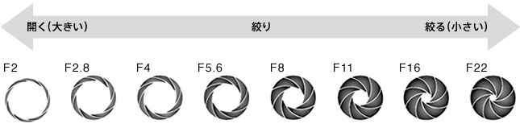

---
### 絞りの原理
https://domabest.com/copystand-shooting-depth-of-field/

F値大きい

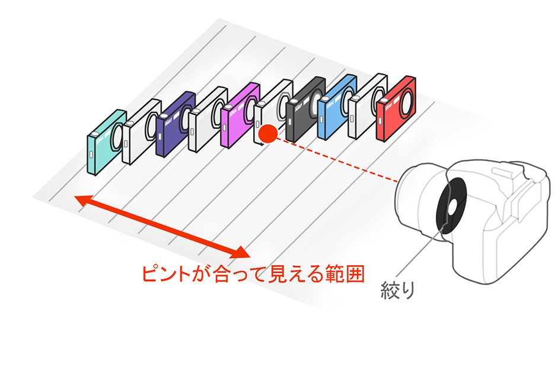

---
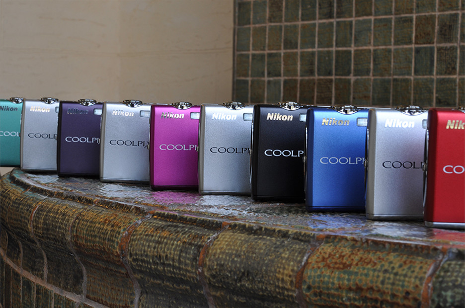

---
F値小さい

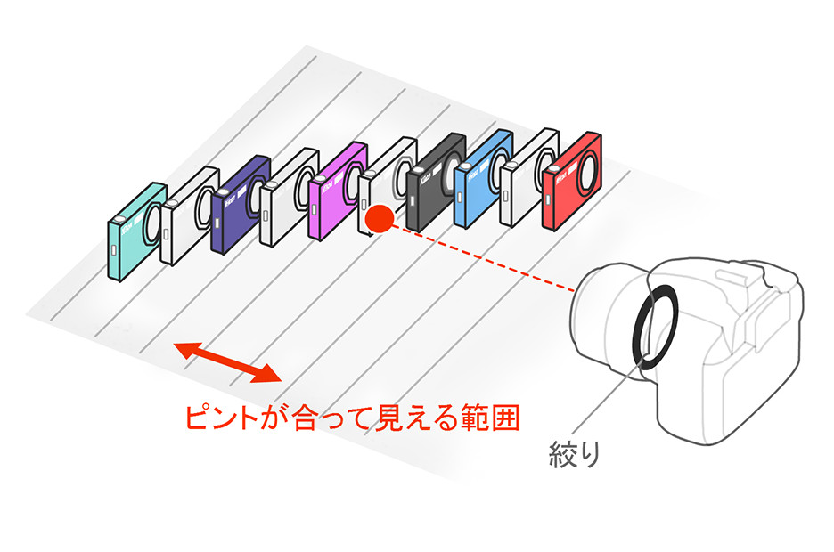

---
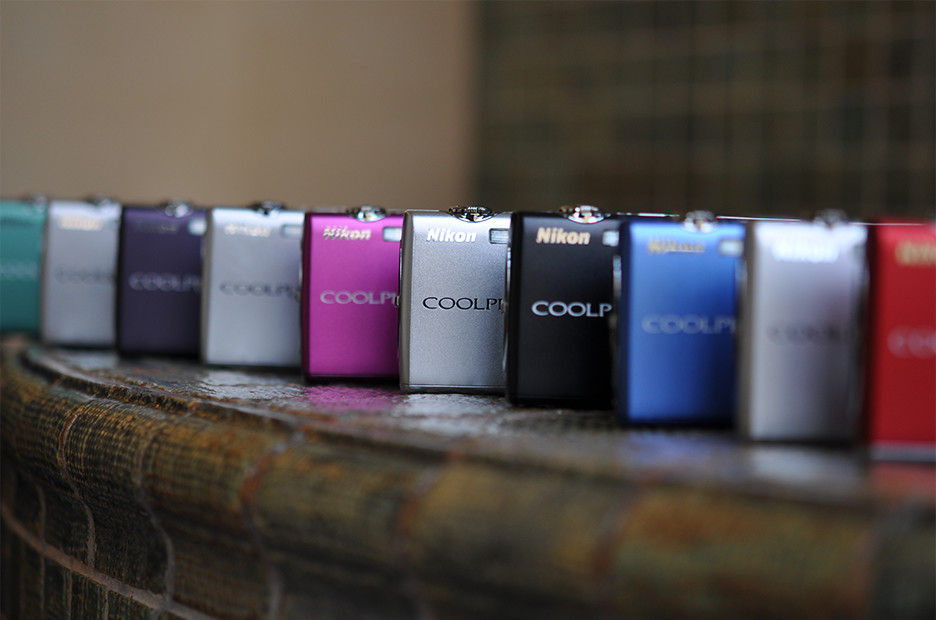

---
### 広角と望遠
ズーム機能を使うと広角と望遠を切り替えられますが、うまく使えているでしょうか？

引用
https://www.itmedia.co.jp/dc/articles/1406/04/news050.html
https://www.nikon-image.com/enjoy/phototech/lenslesson/lesson01.html

---
### 広角

---
### 望遠

---
### 
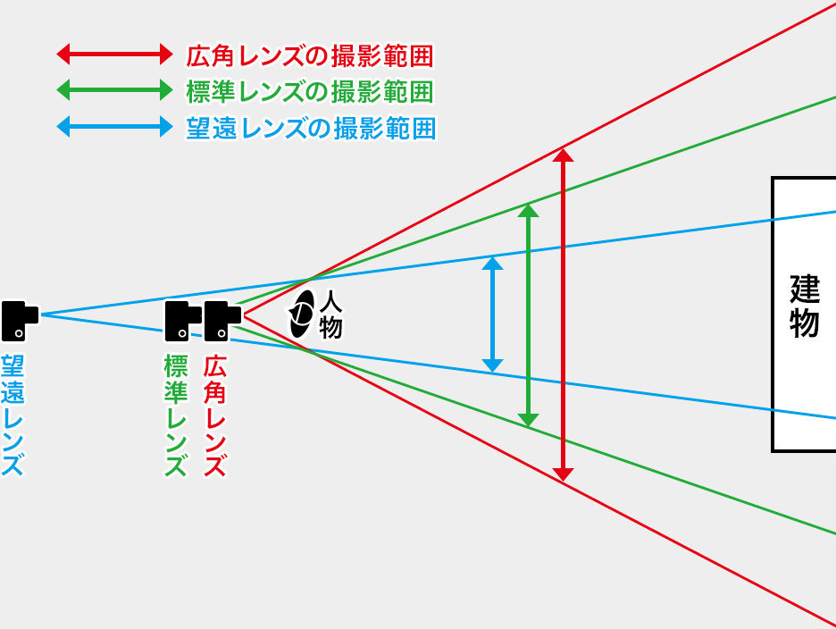

---
### カンガルーの撮影方法
多くの初心者は、自分の立ち位置を変えずに
- もう少し被写体を大きく撮りたい

と考え、ズーム機能を用いますが、

- 被写体の背景をどのくらいにするか
- どこに立って、どのレンズを使うか

を考えることで表現の幅が広がります。

## カメラの基本操作

---
### デジタルカメラに触ってみよう
- 2人に1台カメラが置いてあります。
- カメラの前の人をグループ1、グループ2

今回はCanonのEOS KissMというミラーレスカメラを使います。

---
### レンズ・バッテリー・SDカードの取り付け
#### レンズ
- レンズ二つ入ってる人は短い方で行きましょう
- キャップをそれぞれ外し、白い丸を合わせるようにしてはめて、レンズを右に回しましょう。
- レンズフードを逆に取り付けましょう(強い光による影響をおさえます)
- 外す時にはEOSマークの上の黒いボタンを押して、左に回しましょう。

#### バッテリー・SDカード
- 本体下部にスライドボタンがあります。
- SDカード・バッテリーとも向きがあります。無理しないように
- カバーを閉じましょう。

---
### SDカード初期化
SDカードの初期化を行いましょう。

- 電源ON(右上)
- 液晶見たい人は開く
- MENU(背面右下)
- 機能設定 OK
- 1 カード初期化 OK
- キャップ取り外し

キャップはなくさないでくださいね。

---
### ファインダー覗く派の人
- ファインダーの下部にスライダーがあり、ピントを合わせられます。
- ファインダーを塞ぐと液晶はOFFになります。

コロナ対策のため、終わった後はアルコール消毒よろしくお願いします。(SA呼んでください)

---
### ISO感度
今日はAUTOにしましょう。

- 上部右前のダイヤルを回して、画面右下にISO AUTOと表示されることを確認

なっていない人

- MENU
- 撮影設定 OK
- 2 (カメラマーク)ISO感度に関する設定

---
### ホワイトバランス
環境光によって、色は異なって見えます。
これもオートにしておきましょう。

- MENU
- 撮影設定 OK
- 4 AWB

---
### 撮影モード
Av：絞り優先(背景のぼかし具合を調整)
Tv：シャッタースピード優先(動きの表現を調整)

撮りたい写真によって切り替えましょう。
程度は上部右前のダイヤルで変更できます。

F値：小さい方が背景ボケる

---
### カメラの構え方
脇をしっかり締めて、ブレないようにしましょう。

---
### 広角・望遠
レンズを回すことで、広角・望遠を調整できます。

---
### オートフォーカス
背面の円の左をクリックで、マニュアルフォーカス・オートフォーカスを切り替えられます。

慣れていない人はオートフォーカスでいいでしょう。

オートフォーカスモードでは、液晶をタッチすることでそこにピントを合わせることができます。

---
### 画像の確認の仕方
- 背面の右下再生ボタンで確認できます。
- 円ボタンの左右で写真を切り替えられます。
- 撮影モードに戻るには再度再生ボタンを押しましょう。

---
### 今日の目標
写真を25枚使ったポスター制作です。

- テーマを決めましょう。
- 25枚より多く(後でセレクトできるように)撮ってきましょう。
- 配置も考えて撮れたら最高です。

---
### グループ1の方から撮影に入りましょう。

- 20分程度で戻ってきてください。
- カメラ詳しくない人はAv優先でボケを意識して取ってきてください。
- カメラわかってる人はお好きにどうぞ。

グループ2の方はデザインの基礎知識に入ります。

# デザインの基礎知識

## 4つの基本原則を意識しよう！
1. 近接
2. 整列
3. コントラスト(強弱)
4. 反復

この4つを意識すると、より良いデザインに近づきます。

参考
https://bulan.co/swings/design4principals/

---
### 近接
オブジェクト(絵や文字)を配置する上で**関係する情報を近づける**ことでより見やすくなります。

---
### どこが見づらい？
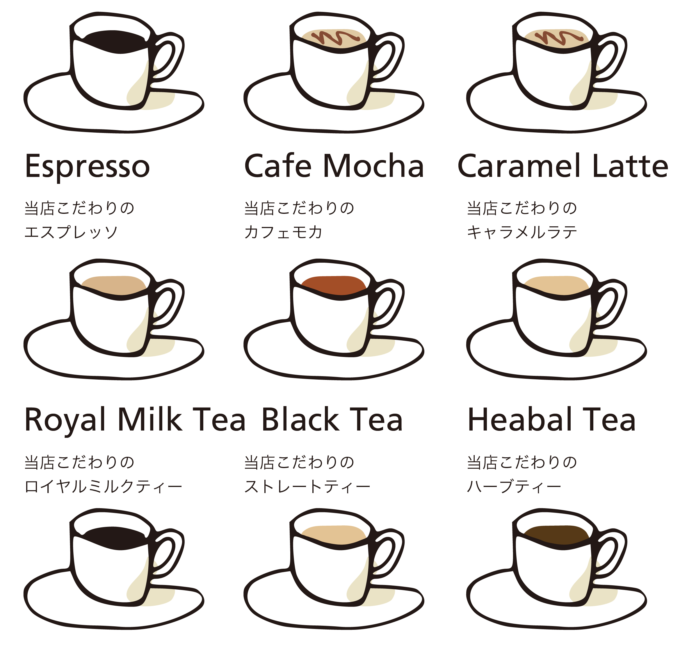

---
### どこが変わった？
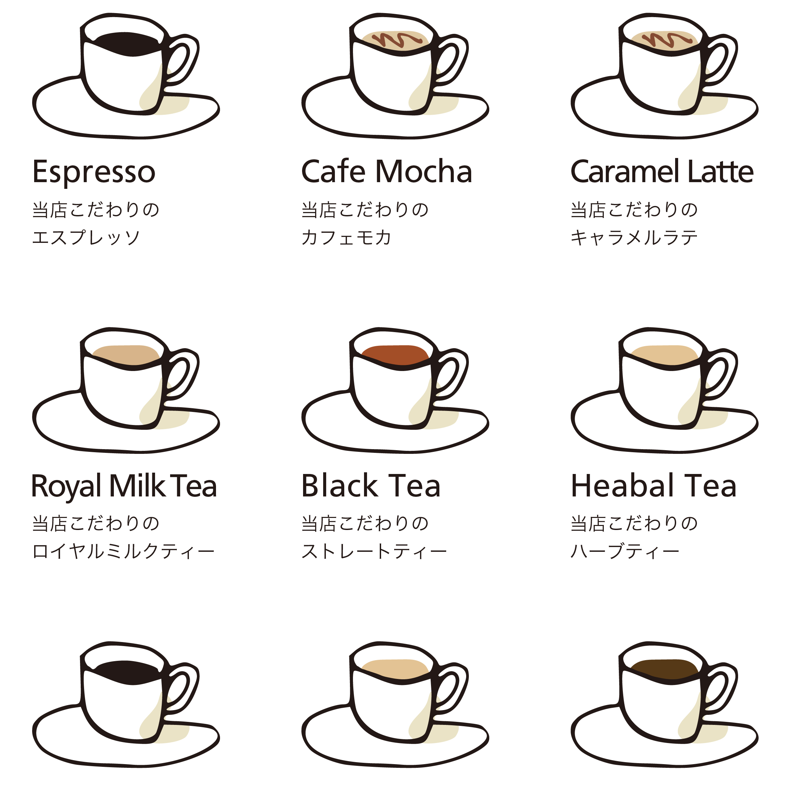

---
### 余白により整理
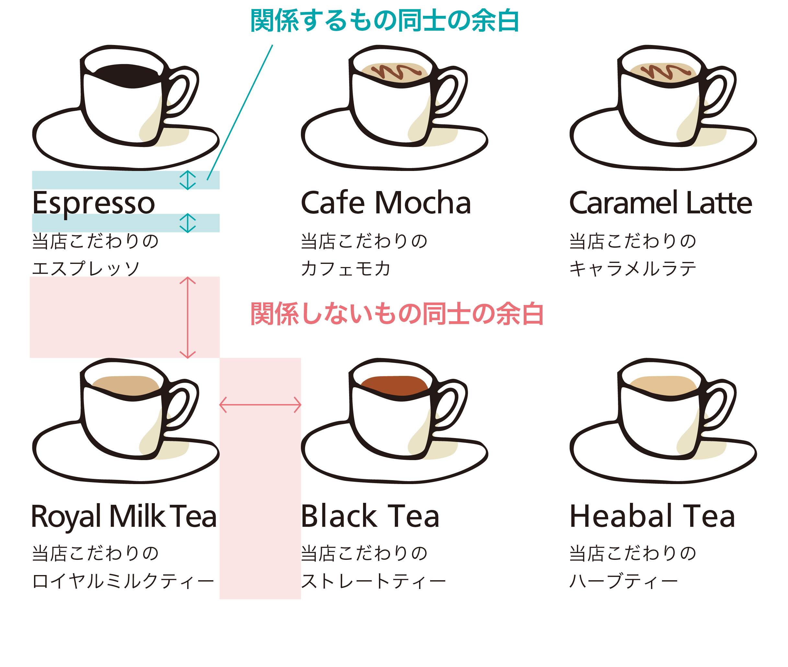

---
### 整列
**見えない線でつなげること**ですっきりと整理されます。

---
### 読みやすい？

---
### どこが変わった？

---
### 見えない線で整理
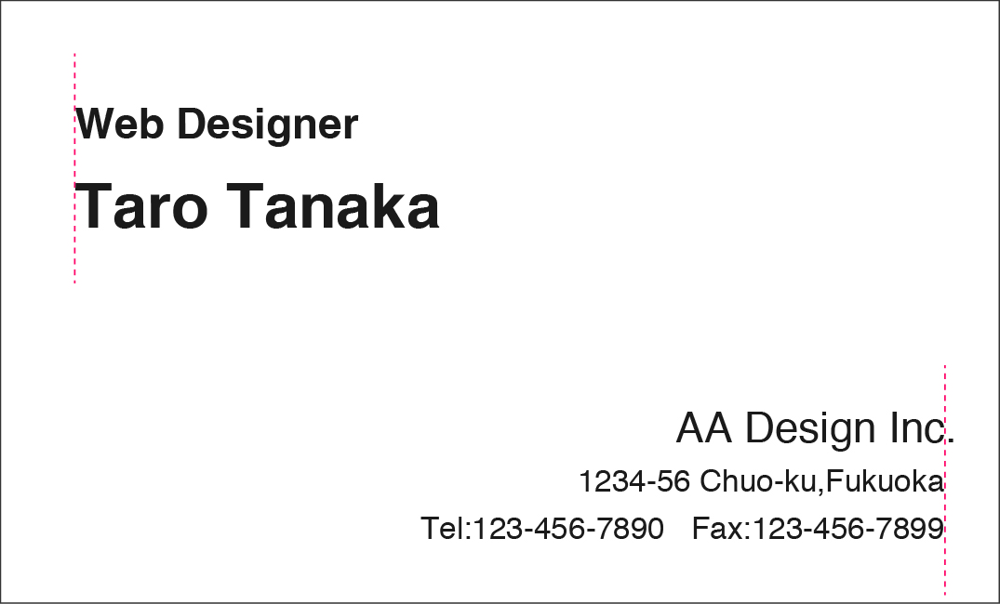

---
### コントラスト(強弱)
**情報の優先度を明確にする**ことで伝わりやすくなります。

---
### 読みやすい？
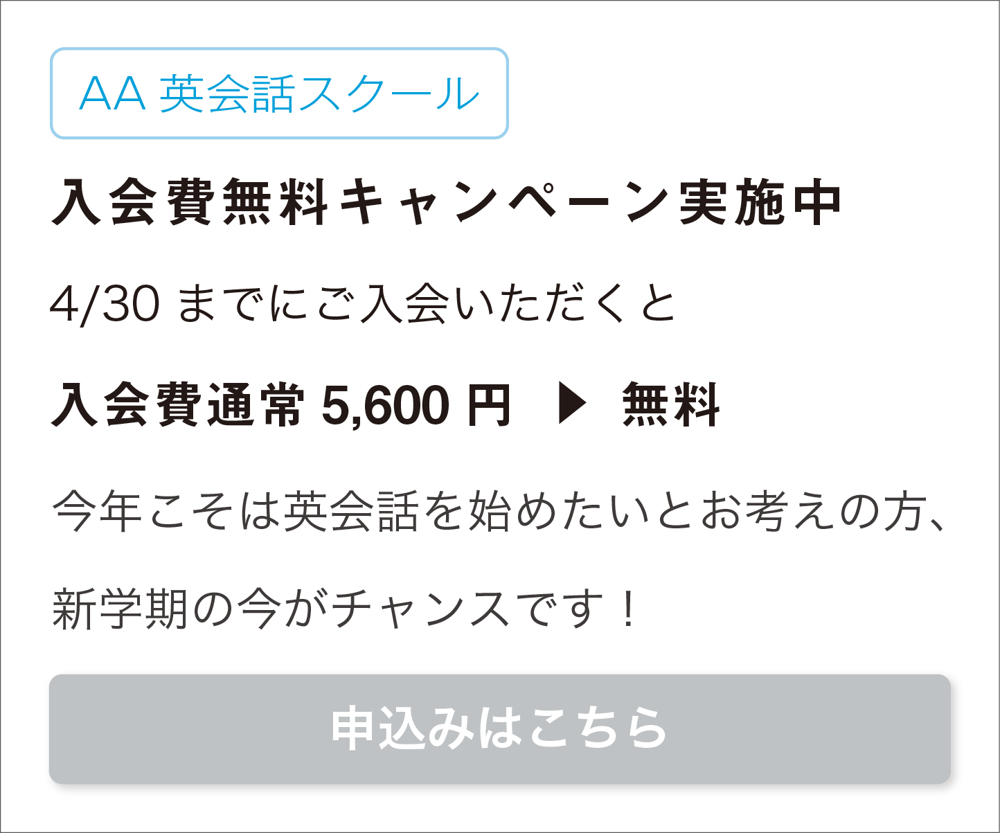

---
### どこが変わった？

---
### 情報の整理から優先順位が決まる

要素を分解して、優先順位をつけ、強弱をその情報に基づいてつけることにより、みる人はどこを見れば良いか迷うことがなくなります。

強弱は
- 文字の大きさ
- 色

等でつけることができます。

---
### 反復
**特徴的なものを意識的に繰り返し使う**ことで一貫性が生まれます。

---
### 
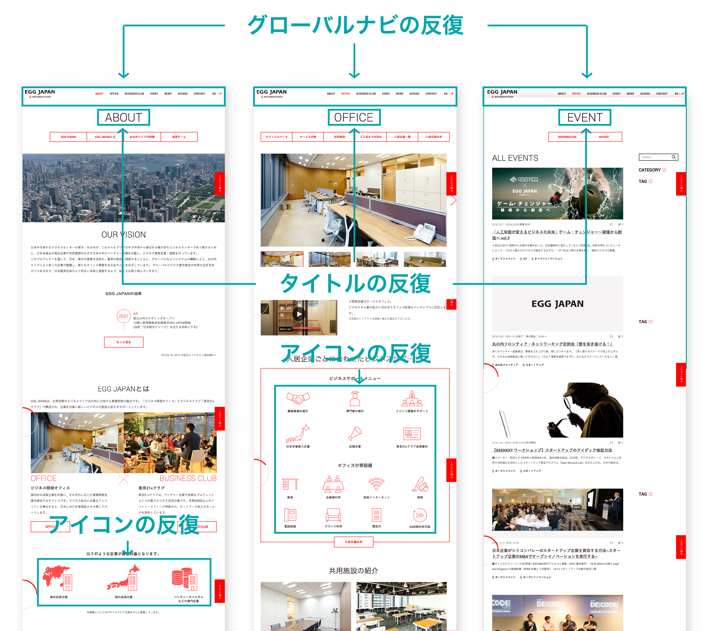

---
### Webページの例
特にWebページでは、スタイルシートというものを利用して、デザインの一貫性を保つ方法がとられています。

クリックするごとにデザインが変わると、同じサイトにいるかわからなくなるからです。

---
### まとめ：デザインとは？
デザインの語源には
- 思考・概念を組み立てる
- 問題を解決する

という意味があります。

---
### 伝えたい情報
まず、情報を構造的に考える癖をつけましょう。

**階層構造的に考える**ことで構造化しやすくなります。

---
### 構造化された情報をデザインで表現する
- 近接
- 整列
- コントラスト
- 反復

を意識して複数利用することで、整理されたデザインにつながります。

意図的にルールを破るのは構いませんが、特別な意図がないかぎり、このルールにのっとると良いと思います。

---
### 時間余ったら
文字のデザインには**文字詰め**という考え方があります。
バランスが良いと思うように、左右の端以外の文字を左右に動かしてみましょう。

https://type.method.ac/

これは、実際にIllustrator, Photoshopで利用できます。

# 演習

---
### A3のポスターを作ろう
IllustratorとPhotoshopを使ってA3のポスターを作ってみましょう。
今日することは
- カメラでの撮影(使える画像25枚以上)
- Photoshopでの画像補正・エフェクト
- Illustratorでの画像配置・クリッピングマスク・レイアウト・PDFの保存

となります。

---
### 準備
この演習期間中に利用できるフォルダを作成しましょう。
- Finderを開く
- 書類フォルダに移動
- ファイル - 新規フォルダ
- 名前を学籍番号に

---
### HPを見ながら進めてみよう
1. https://sammyppr.github.io/
2. 夏期スクーリング マルチメディア演習
3. 1日目
