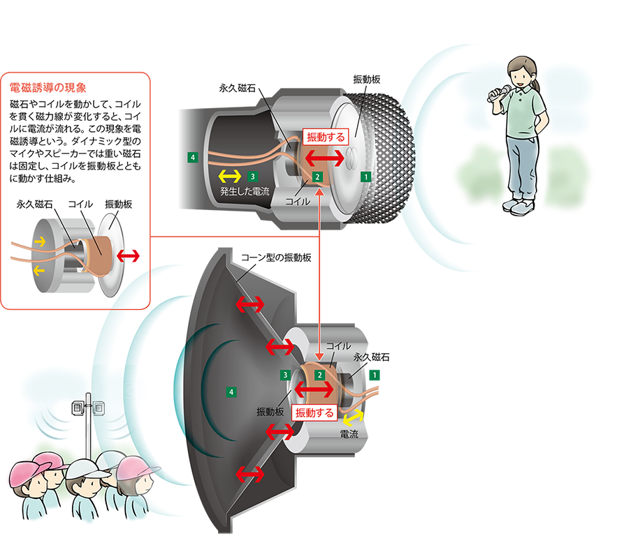

# サウンドデザイン演習 4.音響技術I マイク<!-- omit in toc -->

# 目次<!-- omit in toc -->

1. [前回のおさらい](#前回のおさらい)
2. [音響技術I マイク](#音響技術i-マイク)
   1. [マイクって何?](#マイクって何)
   2. [マイクの構造の種類](#マイクの構造の種類)
   3. [マイクの特性](#マイクの特性)
   4. [マイクの用途による種類](#マイクの用途による種類)
   5. [録音時のトラブル](#録音時のトラブル)
   6. [レベルについて](#レベルについて)
3. [参考動画](#参考動画)
4. [小レポート](#小レポート)

## はじめに

## HPの置き場所(再掲)

https://sammyppr.github.io/

に置きます。これは学外からも閲覧可能です。

# 前回のおさらい
- 音のデジタル化(サンプリングレート・量子化ビット数・サンプリング定理)
- ハイレゾ音源
- 圧縮
- 同期(ワードクロック)
- オーディオインターフェイス
- 周波数分析・スペクトログラム
- 32bit float

「撮影時に24bit48kHz WAVを利用する」「32bit-float対応だとレベル調整いらない」が一番知っておいてほしいことでした。

# 音響技術I マイク
## マイクって何?
- 音を拾うもの

厳密にいうと

- 音を電気信号に変換するもの

です。音は「外部の音源から空気を媒介として聴覚が刺激されること」でしたね。

---
### 言い換えると
1. 音源から発せられた音が
2. 空気を振動させ
3. その空気の振動を何らかの形で
4. 電気信号に変換するもの

と言えるでしょう。

---
### フレミングの法則って知ってる？
聞いたことある人？

- フレミング左手の法則
- フレミング右手の法則

の二つあったような気がする人？

---
### フレミングの右手の法則・フレミング左手の法則

https://detail-infomation.com/flemings-right-hand-rule-and-flemings-left-hand-rule/

---
### マイクとスピーカー
- 右手の法則:磁界の向きと力の向きが決まった時に、電流の向きを決める
- 左手の法則:磁界の向きと電流の向きが決まった時に、力の向きを決める

これを利用して次のような原理で動いています。
- ダイナミックマイク：音の波を振動板で受けて動きにして力を発生させ、電流を生じさせる
- スピーカー:電流の大きさから振動板を動かし、音の波を生じさせる

---

---
### 同じ仕組み
- 磁石があり
- 電線があり
- 振動板があり

という仕組みは全く同じため、ダイナミックマイク・スピーカーは基本的に同じものです。

- マイク:空気の振動を電気の信号に変換
- スピーカー:電気の信号を空気の振動に変換

---
### 取り扱いに注意
マイクの取り扱いに際しては
- 落とすな
- 叩くな
- 意図的に空気を吹きかけるな

を守りましょう。

---
### なぜ？
空気の振動をどれだけうまく電気の信号に変えられるか、がマイクには求められます。

そういった意味では精密な機械なのです。

衝撃が与えられると、それは直ぐに性能の劣化につながります。

## マイクの構造の種類

---
### ダイナミックマイク/コンデンサマイクの構造
大きく分けて構造の違いから
- ダイナミック型: 比較的丈夫で湿度に強い
- コンデンサ型: より精密で振動や湿気に弱い。電源が必要。

の2種類あります。

---
### 構造:ダイナミックマイク

---
### 構造:コンデンサマイク

---
### コンデンサマイク
ダイナミックマイクが
> 電磁誘導

を利用していたのに対して、コンデンサマイクは

> 静電容量の変化

を電気信号として取り出しています。

機械的な振動部分の質量が小さくできるので音を忠実に拾うことができますが、静電容量の変化が少ないため電気的な増幅が必要となります。

---

### ファントム電源
コンデンサマイクには電源が必要となり、この電源のことを
> ファントム電源 または ファンタム電源

と呼びます。

> Phantom: 幽霊・お化け

マイクのケーブルを利用して電源を送るので
> 見えない電源 = 幽霊・お化けの電源 = ファントム電源

と呼びます。

---
### マイクのケーブル

マイクのケーブルにはGND/HOT/COLDの3つの線がありますが、HOT/COLDで+48Vの直流電源を供給します。

(もちろん、マイクを接続される側がファントム電源に対応する必要があります)

---
### ファントム電源に対応する機器
- ミキサー
- オーディオインターフェイス
- レコーダー

対応している場合には、+48Vの表記があります。

---
### ファントム電源の使い方
利用する時
1. ゲイン・ボリュームはゼロに
2. ファントム電源をON
3. ゲイン・ボリュームを調整

しまう時
1. ゲイン・ボリュームはゼロに
2. ケーブルを抜く前にファントム電源をOFF
3. 電源を落としてから20秒位経ってからケーブルを抜く

静電容量を利用しているため、少し時間が経たないと放電されないからです。
- 基本的にはダイナミックマイクには使ってはいけません(仕方ない時もある)

---
### ケーブルの抜き差し時の注意
- ゲイン・ボリュームはゼロ

は基本中の基本となります。

いきなり電流が流れることにより機器にダメージを与えるからです。

---
### ダイナミックマイク/コンデンサマイクの使い分け
マイクの使用用途は大きく分けて
- ライブ
- レコーディング

の2種類に分けられます。

- ライブではハプニング続出するため頑丈なダイナミックマイクが利用されます。
- レコーディングでは高音質で録音したいためコンデンサマイクが利用されます。

## マイクの特性

---
### マイクの特性
- 指向性
- 周波数特性
- 近接効果

---
### 指向性
マイクがどの方向から音を収音できるかという特性のこと。

マイクの指向性の収音範囲角度を理解して、マイクが何を拾い、何を遮音するかを把握できれば、ハウリングを減らし、音源を分離することができます。

---
#### 指向性の比較
大まかには3種類あります。

---
#### もう少し詳しく

---
#### ガンマイクの仕組み
さらに遠くの音を拾うために、ガンマイクでは音響管という仕組みを使って超指向性を実現してい ます。

---
#### ナレーション録りでの注意
単一指向性のマイクで反対側から録音すると悲惨な音になります。ポッチを目印にして、向きを間違えないようにしましょう。

---
### 周波数特性

---
#### 周波数特性
マイクロフォンが聴き取れる周波数の範囲と、その感度を表すのが周波数特性です。

---
#### 周波数特性の与える影響

ありのままを録音したい場合、周波数によって忠実に電気信号に変換できれば良いですが、それは不可能です。

また、人の声を録音したいのに、超低音を拾っても仕方ありません。

用途に応じて適切な周波数特性を持つマイクを選ぶことが必要となります。

---
### 近接効果

---
#### 音源との距離による周波数特性
音源とマイクの距離によって周波数特性は変化します。

---
#### ナレーション録りで気をつけよう
低音豊かなナレーションを録りたい場合には、つまりポップノイズ・リップノイズ(後述)が起きないようにしながらなるべくマイクに近づいた方が良いことになります。

これは指向性マイクロフォンにて顕著に起こる現象となります。

- [Proximity Effect(近接効果) Explained - Sound Pure Gear Tip](https://www.youtube.com/watch?v=I58Il7yIerk&t=80s)

## マイクの用途による種類

---
### マイクの用途による種類
- ガンマイク
- ピンマイク
- ワイヤレスマイク
- ヘッドセットマイク

等があります。

---
### ガンマイク
細長いマイクで遠くの音を拾うのに適したマイク。超指向性。コンデンサマイク。

---
### ピンマイク
小さなマイクで、胸元などに付けることで音声を拾う

---
### ワイヤレスマイク
レコーダーから離れた人の声を、無線で飛ばすことのできるマイク

---
### ヘッドセットマイク
撮影にはほぼ使いません。リモートワークなどでは役立ちます。
<!---->

## 録音時のトラブル

---
### トラブルの種類
- ハウリング
- ポップノイズ
- リップノイズ
- 反響音
- 屋外のノイズ
- マイクスタンド

綺麗に録音するためには、様々なトラブルの原因、対処法を知っておく必要があります。

---
### ハウリング
たまに、マイクを使ってると
- キーン
- ボー

のような不快な音が発生することがあります。これをハウリングと言います。

---
#### ハウリングの原理
1. マイクの拾った音がアンプに送られて増幅
2. 増幅された音がスピーカーやヘッドフォンから出力
3. 出力された音をさらにマイクが拾う

このループでハウリングが起きます。

---
#### ハウリングによる被害
- 人間にとって不快
- 機材破損の恐れ

があります。

---
#### ハウリングの抑制方法
接続する時にはボリュームをゼロにした状態で、徐々に音量を上げるようにしましょう。

また、ナレーション録音時などは、密閉型のヘッドフォンを使って、ハウリングを避けましょう。

場合によってはグラフィックイコライザーという機械で該当する周波数を下げることもあります。

---
### ポップノイズ
言葉によってはマイクにふきかかる風の量が多くなることがあります。
例えば、口の前に手を当てて次の二つの言葉を話してみましょう。(あ、マスク...)
- ロック
- ポップ

明らかに「ポップ」の方が風を感じませんか？

この風がマイクにかかると「ボフッ」というノイズになってしまいます。

パ行以外でも、サ行・タ行・ハ行も風が多く出ます。

[【音響機材】SHURE SM57 の比較とポップノイズ対策！ロングセラーマイクを検証してみました！](https://www.youtube.com/watch?v=P3ZlNW3lE30&t=365s)

---
#### ポップガード
口とマイクの間にポップガードを取り付けることで、ポップノイズを守ることができます。

[ポップガード](https://www.soundhouse.co.jp/search/index?s_category_cd=1550&i_type=c)

---
### リップノイズ
口の中の状態が原因で、「ネチャ」「ペチャ」という音が録音されることがあります。
- 唾液の量が多い
- 粘り気のある唾液が出る
- 口の中が乾燥している
- 唇の乾燥・ベタつき

マイクと距離を近くすると特に拾いやすくなります。

---
#### リップノイズ対策
- 水分をとる
- 歯を磨く
- リップクリームを塗る

など状況に応じて対処しましょう。

なお、最近ではASMR(Autonomous SensoryMeridian Resoponse)というジャンルで意図的にリップノイズを録音する方法もあります。

---
### 反響音
反響音の多い場所で録音すると、編集時に困ることがよくあります。

後から反響音を付加することは簡単なのですが、除去するのは難しいです。

反響するものが多い場所で反響音は起きるため、その環境を変える必要があります。

---
#### 反響音チェック
場所に行って、「パン」と叩いて、反響音の長さを確認しましょう。
- ドライ：反響しない
- ウェット：反響する

という言葉を使います。

---
#### リフレクションフィルター
ナレーション等の場合には、リフレクションフィルターで反響音を遮りましょう。

---
#### 室内ロケでウェットな場所の場合
カメラに映らないように、布を貼ったりすると、反響音を抑えることができます。

反響しやすいものは
- 真っ平
- 素材の凹凸が少ない

という特性があるため、逆に布でひだを作ることで、反響を抑えることができます。

---
### 屋外ロケでのノイズ
そもそも、屋外では意図しないノイズがたくさんあります。気をつけましょう。
- 車・電車の音
- サイレンの音
- 強い風

風はある程度対策しようがあります。それ以外のノイズは偶発的に起こるため再撮しかないですね。

---
### 屋外ロケで風が強い場合
風が振動板に直接当たると「ボフボフ」いう音が録音されてしまいます。

---
#### ウィンドジャマー
ウィンドシールド・ウィンドスクリーンなどとも呼ばれますが、風防のことです。
大きく
- スポンジ型
- ファー型
- カゴ型
- カゴ+ファー型

があります。後ろに行くほど風に対して有効になりますが、少しずつ音質は悪くなっていきます。

---
#### スポンジ型

---
#### ファー型
<!---->

<!--
---
#### カゴ型
-->

---
#### カゴ+ファー型
<!---->

---
### マイクスタンドの立て方
マイクスタンドはしっかり支えると共に、床の振動からマイクを守る、という役割があります。しっかり広げて設置しましょう。

## レベルについて
電気信号には信号の大きさがあります。音の波形の振れ幅のことです。

---
### 様々なレベル
- マイクレベル -60〜-40dBu
- 民生用ラインレベル -10dBV
- 業務用ラインレベル +4dBu

単位が異なっていますが...同じと思っていいです。
https://nk-productions.net/column/db-decibel/

> マイクレベル < 民生用ラインレベル < 業務用ラインレベル

となっています。

---
#### レベルは合わせないといけない
レベルがバラバラだと、どうにもなりません。
そのため、マイクプリアンプ(略してマイクプリ)を使って増幅してラインレベルに合わせます。

オーディオインターフェイスなどには標準でマイクプリが搭載されていますが、
このマイクプリにもそれぞれ特性があるため、音にこだわる場合には、専用のプリアンプを使うこともあります。

このことにより
- 温かみが出る
- 音質が良くなる

ことがあることを知っておきましょう。

---
#### マイクプリの例

# 参考動画

- [マイクロホンの仕様を理解する Part１ 動作原理](https://www.youtube.com/watch?v=YZvjzcd4CTI)
- [マイクロホンの仕様 Part2 周波数特性](https://www.youtube.com/watch?v=K9hsgc-iei4)
- [マイクロホンの仕様 Part3 極性パターン](https://www.youtube.com/watch?v=WNdqIzSPqEE)
- [マイクロホンの仕様を理解する Part4 電気出力](https://www.youtube.com/watch?v=3Bg5uGDXtTY)
- [Proximity Effect(近接効果) Explained - Sound Pure Gear Tip](https://www.youtube.com/watch?v=I58Il7yIerk&t=80s)
- [撮影現場での適切な収音テクニック](https://www.youtube.com/watch?v=NFRRiME4WS8)

# 小レポート
「マイクの種類・特性・気をつけること」について400字程度でまとめてmanabaにて提出

