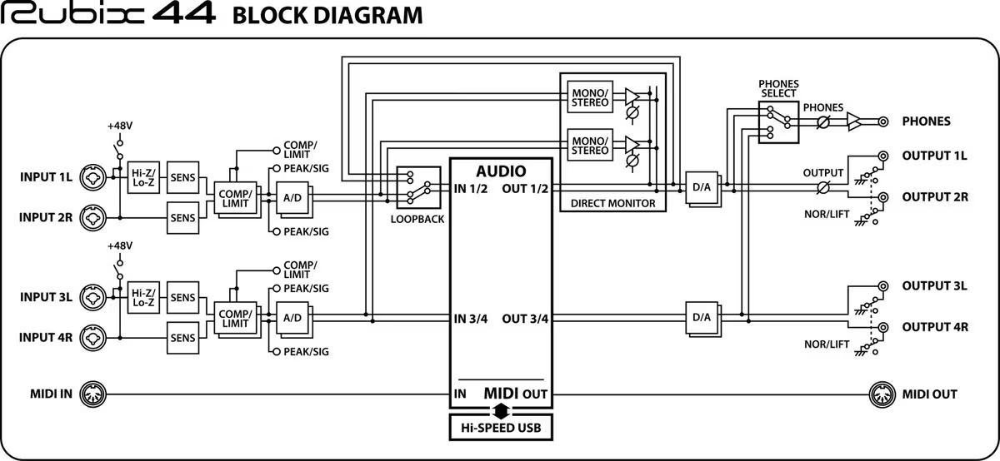

# サウンドデザイン演習  12. 映像音響 V：ナレーション<!-- omit in toc -->

# 目次<!-- omit in toc -->

1. [前回のおさらい](#前回のおさらい)
2. [ナレーション](#ナレーション)

## 事前準備
- 301　F3*10台, BOYA ピンマイク*6, ガンマイク*4, type-cケーブル、キャノン*4
- 324　SHUREコンデンサマイクセット*2, リフレクションフィルタ, ポップガード, TASCAM AUDIO I/F

## はじめに

## HPの置き場所(再掲)

https://sammyppr.github.io/

に置きます。これは学外からも閲覧可能です。

# 前回のおさらい
効果音について学びました。

- フォーリーサウンド
- Auditionによる音の加工

# ナレーション

---
### ナレーション録り
映像作品に関しては、ナレーションをつけることがあります。

今日はどのようなことに気をつけるべきか、及び、オーディオインターフェイスについて実際に接続して試してもらおうと思います。

---
### ナレーション録りのコツ
- ノイズをなるべく抑えること
- より良い品質で声を録音すること

この二つが必要です。

さらには後処理として音質を補正して聞きやすくする必要があります。

---
### 機材
- コンデンサマイクの利用(高品質で録音したいため)
- ポップガードの利用
- キャノンケーブル
- リフレクションフィルター(反響音を抑える...必要に応じて布も有効)
- オーディオインターフェイスの利用(マイク音をコンピュータに取り込むため)(Type-A,Type-C注意)
- ヘッドフォン(モニター用)

---
### 意識してほしいこと
音は、入力から出力までに様々な場所を通って録音されます。
この、音の流れがわかれば、うまく録音・モニターできない時にトラブルシュートできます。

---
### ブロックダイアグラム
信号の流れを説明した図を**ブロックダイアグラム**といいます。例えば...

---
### コンピュータで録音する場合
コンピュータまでの設定が上手くいっても、

- オーディオインターフェイスはOSで認識できているか
- ソフトウェアでオーディオインターフェイスを利用できる設定になっているか
- トラックが録音モードになっているか、正しいチャンネルを選んでいるか

を確認する必要があります。

Auditionの場合を見てみましょう。

---
### Auditionの場合
1. 新規 - 新規オーディオファイル
2. サンプルレートは映像なら48000以上にしましょう
3. モノラル(もちろんステレオマイクならステレオ)
4. ビットデプスは24か32(浮動小数)をインターフェイスに応じて設定(後述)

マルチトラックセッションの場合には録音前にトラックのRボタンを押す必要があります。Iを押すと録音しなくてもモニターできます。

---
### 機材の設定
- コンデンサマイクには正面と背面がある。正面から録音しなくてはいけない
- 近接効果を考慮しよう
- コンデンサマイクを覆うようにリフレクションフィルターを配置

- エアコンの音などが目立つ場合には、スイッチをオフ

- コンデンサマイクにはファントム電源が必要

---
### 接続
マイク - オーディオインターフェイス - Mac/PC - オーディオインターフェイス - ヘッドフォン

となるため、オーディオインターフェイスでの入力音量が重要.
- 大きいとアナログ信号の時点で歪んでしまう。
- 小さいとS/N比が悪くなってしまう。

---
### 録音するソフトウェアについて
- DAWと呼ばれるアプリならなんでもOK(Audition, GarageBand, StudioOnePrime...)
- 今回はAuditionを利用

ソフトによっては、映像を流しながら、録音できるものもある

---
### 気をつけること
- オーディオインターフェイスはドライバが必要なものがある
- OSの設定ではなく、アプリの設定でオーディオインターフェイスを選択するものがある
- DAW(レコーダー)の設定は映像用なので、48kHz, 16bit以上に設定しよう

---
### ナレーターへの気配り
- リップノイズに気をつけよう。ひどい様であれば、水分を飲むようにアドバイス
- 長いナレーションはNGテイクが増える可能性がある。その場合、不自然にならないように気をつけて短く録音していこう
- 近接効果をうまく利用しよう

---
### 32bit floatについて
現状では、F3という機械では32bit floatという録音形式があります。

これは、レベル設定がいらない、しなくても、後編集で綺麗に利用できる、というゲームチェンジャーです。

レコーダーとしては、32bit floatでしか動作しませんが、オーディオインターフェイスとしては
- 24bit
- 32bit-float

の二つの動作が可能なため、音が割れる、割れない、を体感しておきましょう。

---
### 実際に撮ってみよう
F3は10台あるので、3,4人に1台あるはずです。マイクは
- ラベリアマイク(6本)
- ガンマイク(4本)

で試しましょう。

---
### オーディオインターフェイスの設定
Windowsの人は
https://zoomcorp.com/ja/jp/field-recorders/field-recorders/f3/f3-support/
から、F3ドライバをダウンロードして、インストールの必要があります。

1. MENUボタン
2. 「USBオーディオI/F」ENTER
3. 「PC/Mac Enter」
4. 24ビットモードなら**Linear**, 32ビットフロートモードなら**Float**にしてEnter

Linear/Floatは、画面上に表示されます。

---
### 拡大・縮小 / ファントム電源設定
左から1,3番目のスイッチは
- Linearモードではゲインになります。
- Floatモードでは、ヘッドフォンの音量調整にはなりますが、データへの影響はありません。

左から2,4番目のスイッチはファントム電源の設定が行えます。

---
### Auditionの設定
新規ファイルで作成時に
- サンプルレート(48000)
- チャンネル(マイクならモノラル)
- ビットデプス
  - Linearなら24
  - Floatなら32(浮動小数)

で作成しましょう。

---
### やってみよう
1. Linear/Floatでそれぞれわざと音が割れる(レベルメータが赤くつく)様にして録音してみましょう。
2. ゲインを下げて、どのように表示が変わるか、音が変わるかを確認してください。

---
### 324には
- ポップガード
- リフレクションフィルター

を設定した

- US-2x2

が置いてあります。

実際に設定ができるか試してみましょう。

---
### 最終課題
https://sammyppr.github.io/2023/SoundDesign/sd_kadai.html

