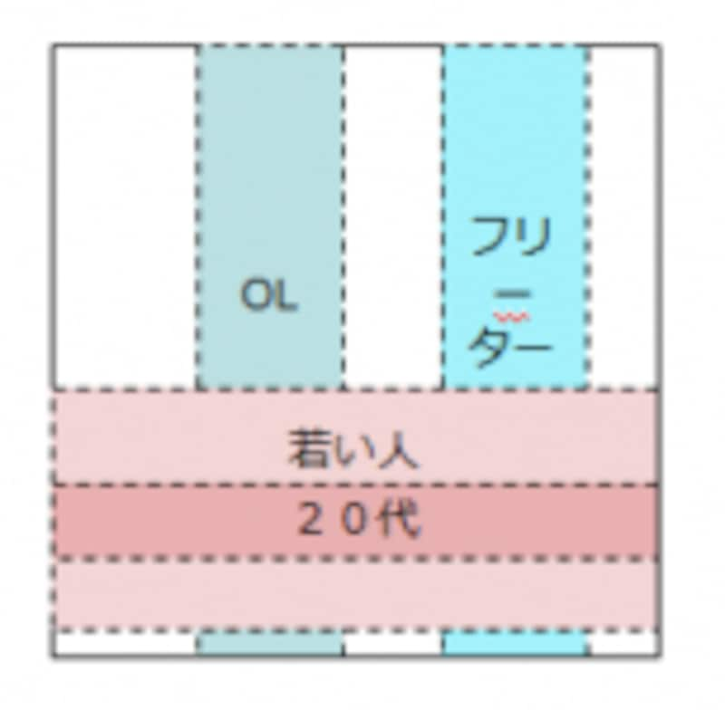
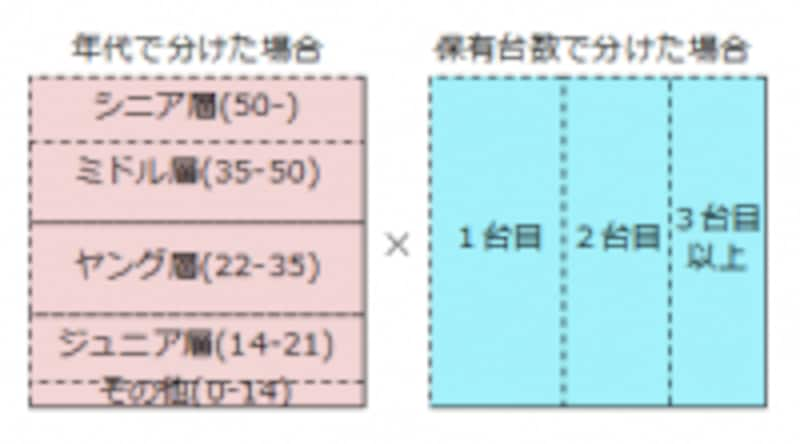
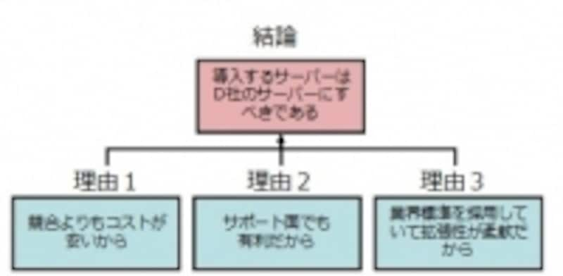
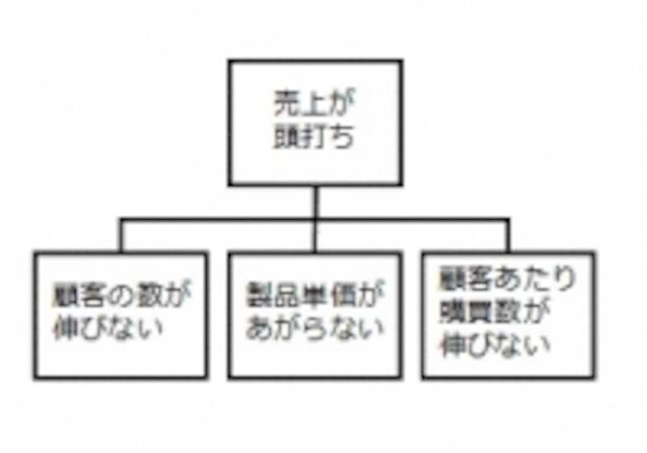

# 造形基礎演習II 第1ターム <!-- omit in toc -->
> 2. 情報・アイディアの整理(分類・階層化)

# 目次<!-- omit in toc -->

- [前回のおさらい](#前回のおさらい)
- [KJ法](#kj法)
    - [KJ法とは？](#kj法とは)
- [ロジカルシンキング](#ロジカルシンキング)
    - [ロジカルシンキングとは](#ロジカルシンキングとは)
    - [ロジカルシンキングの手法・フレームワーク](#ロジカルシンキングの手法フレームワーク)
- [本質的な問い](#本質的な問い)

# はじめに<!-- omit in toc -->

## クラス間違えてない？<!-- omit in toc -->
TODO:
クラス間違えていないか確認しましょう。

|            | 1-5回       | 6-10回      | 11-15回     | 
| ---------- | ----------- | ----------- | ----------- | 
| 1組+転科生 | 小林(618)   | 新井田(504) | 河内(506)   | 
| 2組        | 河内(506)   | 小林(618)   | 新井田(504) | 
| 3組        | 新井田(504) | 河内(506)   | 小林(618)   | 

転科生(2名)は1組の日程で動いてください。

# 前回のおさらい
>【第１回】アイディアのアウトプット(マインドマップ・ブレインストーミング)
として行いました。

頭に浮かぶことを
- 頭の外に吐き出す
- 人に伝える

のは結構慣れが必要となります。

---
### マインドマップ<!-- omit in toc -->
表現したい概念の中心となるキーワードやイメージを中央に置き、そこから放射状にキーワードやイメージを広げ、つなげていく。思考を整理し、発想を豊かにし、記憶力を高めるために、想像 (imagination) と連想 (association) を用いて思考を展開する。この方法によって複雑な概念もコンパクトに表現でき、非常に早く理解できるとされる。

- 吐き出す
- 整理する
- アイディアをまとめる

等に利用できると思いますので積極的に利用していきましょう。

---
### ブレインストーミング<!-- omit in toc -->
複数人でアイディア出しをする手法で
1. 判断遅延（批判禁止）：他人のアイディアの批判NG
2. 突飛さ歓迎(自由奔放)：制限はなく、どんなアイディアもOK
3. 便乗歓迎：アイディアにただ乗りしよう！
4. 質より量：量が質を生む

という手法を学びました。

---
### これからのさまざまな課題において<!-- omit in toc -->
- どうして良いかわからない

と、思考停止するのは非常に時間がもったいないです。

このような
- アイディアの整理
- アイディアの吐き出し

方法をしっかり使っていきましょう。

## 演習<!-- omit in toc -->

---
### マインドマップ 復習<!-- omit in toc -->
> 「メディア文化」を中心にA3横にマインドマップを作成せよ。

右上に学籍番号、氏名を記載してください。

# KJ法

---
### KJ法とは？
アイディアを出してそれを整理する方法についてやってみようと思います。

**KJ法**とは、断片的な情報やアイデアを効率よく整理する手法です。

KJ法では、付箋などカード状の紙に一つひとつ情報を書き込み、そのカードを並べ変えたりグループ化したりすることで情報整理します。

[参考：https://blog.nijibox.jp/article/kjmethod/](https://blog.nijibox.jp/article/kjmethod/)

---
### KJ法のメリット<!-- omit in toc -->
- **付箋などの紙とペンがあれば実施することが可能**
身近にあるものを用意するだけで気軽に作業に取り組むことができます。

- **情報共有しやすい**
アウトプットが視覚的にまとめられるため、チームやプロジェクト間での情報共有がスムーズです。

- **アイデアを可視化できる**
頭の中にあるアイデアを整理し、分かりやすい形に可視化することが可能です。

- **課題や論点の抽出ができる**
KJ法で整理するテーマに関して、今課題となっていることや論点とすべきことの抽出がしやすくなります。

- **ロジカルに整理できる**
KJ法の進め方自体がロジカルな視点に基づいて考案されているため、論理的に情報を整理することが可能です。

---
### KJ法のステップ<!-- omit in toc -->
考えるテーマについて
1. カードに記入する
2. カードを整理する
3. 図解する
4. 文章にまとめる

---
### STEP1 カードに記入する<!-- omit in toc -->
はじめのステップでは、設定したテーマでアイディアを考え、**出てきたアイデアをカード（付箋など）に書き込んで**いきます。

前回学んだ
- マインドマップ
- ブレインストーミング

の手法も必要に応じて利用していきましょう。

- **質より量を意識しましょう。**
- **重要なことは、一つのカードに対して、書き込むアイデアは一つだけにすることです。**

---
### STEP2 カードを整理する<!-- omit in toc -->
カードをカテゴリごとのグループにまとめていきます。

どのグループにも属さないアイデアがある場合は、無理にどこかのグループに入れる必要はありません。

グループ化ができたら、それぞれにグループ名をつけます。

さらに「グループ同士で似たもの」をグループ化して
- 大グループ
- 小グループ

を作成していきましょう。

---
### STEP3 図解する<!-- omit in toc -->
STEP2で整理したグループの関係性を図解化しましょう。

因果関係・対立関係・相互に影響を与え合う関係など、グループ間にどんな関係性があるのかを考えていきます。

> 関係あり・原因・結果・因果・類似・反対

線・矢印等を用いてグループ間を接続しましょう。

---
### STEP4 文章にまとめる<!-- omit in toc -->
STEP3で図解化した関係性から見えてきたことを文章化することです。

解決すべき優先順位が高いグループは何か、何に着手すればいいのかを論理立てて落とし込んでいきましょう。

単なる情報整理ではなく、そこから問題への解決策や新たなアイデアを導き出すことが重要です。

---
### KJ法の注意点<!-- omit in toc -->
1. **無理にグループ化しない**
少数意見として貴重な可能性があります。
2. **手順に沿って、最後の文章化までやりきる**
「なんとなく情報整理できた」ような気になってしまうと、その先の価値が生まれません。
3. **参加者全員の同意を取りながら進める**
グループ化や図解化の際、誰か一人の考えだけで進めてしまうと、先入観による偏りが生じてしまうので注意が必要です。

<!--
---
### テーマ案
アイディア浮かばないと、KJ法意味ないのでどれにするか非常に悩みました...
- 中野区におけるまちづくりの提案
- 子供と携帯電話
- レンガの変わった使い方
- 大学生活をもっと有意義にするには
- 将来の進路はどう決めるか
- 朝起きられず遅刻をしてしまうがどうしたら良いか
-->

---
### 今日のテーマ<!-- omit in toc -->

> 朝に弱い学生に対してどうすれば良いのかのアイディアを考えよ

具体的には
- 朝起きられず遅刻をしてしまう学生がいるがどうしたら良いか
- 1限大学には来るけど、起きてられなくて寝てしまう学生がいるがどうしたら良いか

---
### 方法<!-- omit in toc -->
1. まずは自分で付箋にアイディアを書いていこう(1枚にひとつ)
2. グループになろう
3. 模造紙にグループ分けしながら貼ってみよう。(試行錯誤もちろん可)
4. 途中で新しいアイディアが浮かんだら追加していこう
5. グループ分けできたら、関係性を図解してみよう(大グループ・小グループも)
6. 最後にアイディアを一つに文章化してみよう。

> アイデアを整理することができ、可視化することで新たなアイデアが生まれる可能性も出てくる

ができると意図に沿ったものとなります。

---
### 発表について<!-- omit in toc -->
「私たちの班は〇〇と△△を候補に挙げましたが、話し合った結果□□という理由で〇〇を最終案にすることに決めました」という形式で2分ほどで発表してもらいます。

# ロジカルシンキング

---
### ロジカルシンキングとは
演習形式としては行いませんが、簡単に説明しておきます。

- 考える技術を学ぶ
- ロジカルシンキングとは根拠ある結論に到達するための方法

直感や感覚的に物事を捉えるのではなく、筋道を立てて矛盾・破綻がないように論理的に考え、結論を出す思考法です。

人に説明するときにこれができていないと人に正しく伝わりません。

アイディアをまとめる段階ではこのロジカルシンキングの方法が役立つかもしれません。

[参考・引用：ロジカルシンキングとは？手法や鍛え方、フレームワークを解説](https://go.chatwork.com/ja/column/efficient/efficient-283.html)

---
### うまくアイディアを相手に伝えられていない場合<!-- omit in toc -->
- 論理的に整理できていない
- 論理的に説明できない

ということを意味します。

---
### ロジカルシンキングの手法・フレームワーク
- 帰納法
- 弁証法
- 演繹法
- MECE
- ピラミッドストラクチャー
- ロジックツリー
- ゼロベース思考

代表的なものを簡単に説明していきます。

---
### ロジカルシンキングの手法： 帰納法<!-- omit in toc -->
帰納法は、多くの観察事項（事実）から類似点をまとめ上げることで、結論を引き出すという論法です。

例えば、
- 「A社は新製品が出ていない」
- 「A社の従業員が多く辞めている」
- 「A社から支払いの先延ばしがあった」

といういくつかの事実から、

> 「A社は経営難に陥っている」

という結論を引き出す、というものです。

観察事項が適切でなかったり、少ない観察事項からむりやり結論を引き出そうとすると、「納得感に欠けてしまう」ことがあります。

---
### ロジカルシンキングの手法： 弁証法<!-- omit in toc -->
弁証法とは、肯定と否定などの対立するふたつの思考をあわせ持つことで、解決へと導く思考法です。

たとえば、
- ジョギングをしたい（肯定）
- しかし外に出るのが面倒（否定）

と思う人がいたとします。

この場合、肯定と否定の双方の思考をあわせ、
> 「家の中でジョギングができるようにジョギングマシンを買う」

という解決法が導き出されるという思考法です。

---
### ロジカルシンキングの手法： 演繹法<!-- omit in toc -->
演繹法は、「××だから、○○である」という論理を数珠つなぎにしていき、結論を引き出す方法です。代表的な例に、アリストテレスの3段論法があります。

- 大前提：すべての人間は死すべきものである
- 小前提：ソクラテスは人間である
- 結論: ゆえにソクラテスは死すべきものである

論理を作るのが簡単なため、一般に論理というとこの演繹法のことを指す場合が多いと言えます。身近な反面、落とし穴もあります。注意しないと論理の飛躍が起きたり、論理が長くなったりしがちで「屁理屈」のように聞こえる場合があります。

---
### ロジカルシンキングの手法： MECE<!-- omit in toc -->
MECEは、「ミーシー」もしくは「ミッシー」と読み、Mutually（互いに）Exclusive（重複せず）Collectively（全体に）Exhaustive（漏れがない）のそれぞれの頭文字をとった言葉です。

「重複も漏れもない状態」という意味を持ち、商品やサービスのターゲット層を決めるときなどに、性別や年齢などを網羅的に考え、重複や漏れがないように仕分けていくフレームワークのひとつです。

---
### MECEでない例<!-- omit in toc -->

携帯電話の利用者を「20代・若い人・OL・フリーター」の4つに分けて分類しています。これでは切り口がバラバラで（年齢の軸、職業の軸、性別の軸）抜け漏れやダブリが発生しています。

---
### MECEな分け方<!-- omit in toc -->

抜け漏れがないMECEな切り口

---
### 検討時に観点が間違えていないかを確認するのに便利<!-- omit in toc -->
検討事項に抜け漏れがないかどうかをMECEで常にチェックしています。プロジェクトが終盤になって「あの対象がモレていたのではないか？ もう一度検討してほしい」といった出戻りが発生しないようMECEを活用しています。

---
### ロジカルシンキングの手法： ピラミッドストラクチャー・ロジックツリー<!-- omit in toc -->

ピラミッドストラクチャーでは、下から上にツリーをさかのぼります。

ロジックツリーでは、ツリーの一番上にある論点を、ツリーの下にいくにしたがって細かい論点に分けていきながら、問題の構造を明らかにします。

---
### ロジカルシンキングの手法： ゼロベース思考<!-- omit in toc -->
ゼロベース思考とは、ロジカルシンキングの要素のひとつで、思い込みなどで物事を見ないようにする思考法のことです。

かたよった考えで物事を見てしまいそうになった場合、一度思考をクリアにし、ゼロベースであらためて思考するようにしましょう。

ゼロベース思考を意識することにより、世間の枠や既存概念にとらわれない斬新なアイデアを生み出せる可能性があります。

---
### ロジカルシンキングの例題<!-- omit in toc -->
- [ロジカルシンキングの例題10選](https://service.alue.co.jp/blog/examples-of-logical-thinking#63f2e467b74fb52dd9e29f35-1676862632321)

興味ある人はロジカルシンキングの例題をみてみてください。

---
### ロジカルシンキングワークショップ <!-- omit in toc -->
- [考える技術（ロジカルシンキング・ワークショップ）](https://www.slideshare.net/Management_CoLtd/ws-72625413)

こちらのスライドも有用ですので、興味ある人は見てみましょう。

# 本質的な問い

---
### 本質的な問い<!-- omit in toc -->
論理的に考えるためには、「本質的な問い」を押さえることも重要です。

前回の「ライト、ついてますか」を題材に少し考えてみましょう。

---
### 問題<!-- omit in toc -->
1. 長いトンネルがあり、照明もついていたが、停電時の事故を防ぐために車はライトをつけておく必要があった。
2.「注意 前方にトンネルがあります　ライトをつけて下さい」とトンネル入り口に看板をおいた。
3. トンネルの先にある展望台で「バッテリーが充電できるか？」という問い合わせやクレームが増えた

> どんな看板をトンネル出口に設置したら良いだろうか？

---
### 誰に取っての問題？<!-- omit in toc -->
- 運転手たち
- 同乗者たち(もしいれば)
- 苦情言われる売店の人たち
- 看板含めて設計した技師
- バッテリーあがりに対応する警官たち
- 展望台を設置した自治体の知事
- etc...

---
### ライト、ついてますか の章立て<!-- omit in toc -->
- 何が問題か
- 問題は何なのか
- 問題は本当のところ何か
- それは誰の問題か
- それはどこからきたか？
- 我々はそれを本当に解きたいか？

---
### 問題発見の人間学<!-- omit in toc -->
是非、興味を持った人は一度読んでみると良いでしょう。

メディアライブラリには池袋しか蔵書がないようなので、貸し出します。

---
### 難しかったかな？<!-- omit in toc -->
考え方にはいろいろありますが、
他の人とそれを共有して理解してもらうためには、
- ロジカルシンキングを利用しながらまとめていくこと
- 何が問題かよく考えること

が大事だと思います。

これらの手法の名前を覚えたり、というよりは、
> こういう考え方があるんだ

という引き出しが増えてくれれば幸いです。

---
### KJ法をもう一度...<!-- omit in toc -->
KJ法でのアイディア出しにもう一度慣れておきましょう。

- 「KJ法でどんなテーマを扱ったら良いかKJ法を使ってアイディアを出そう」

---
### 提出について<!-- omit in toc -->
- 参加したグループの模造紙の右下？に学籍番号と氏名記入してください。
- 写真を撮って記録したいと思います。

では終わります。

あ、来週、スマホの充電忘れずに(ノーパソでもいいけど)...
