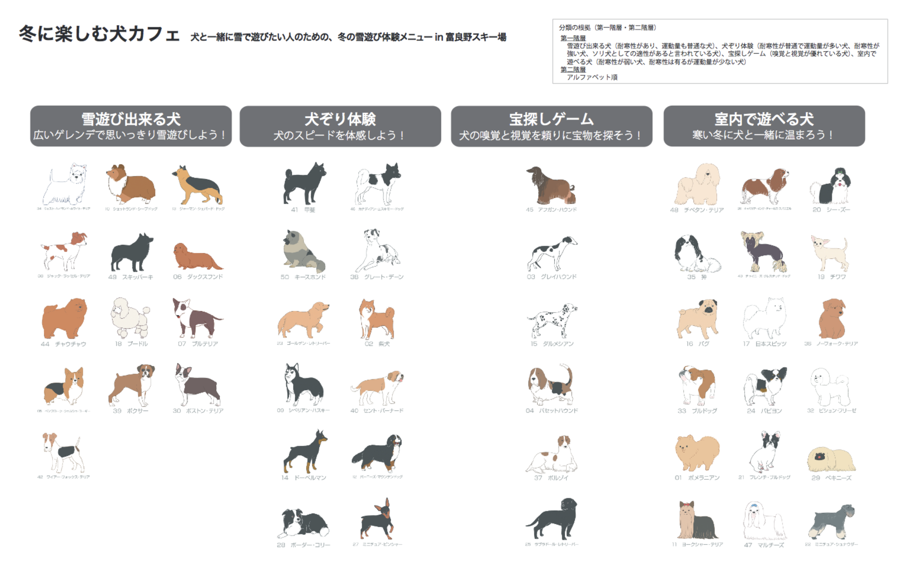

# 造形基礎演習II 第1ターム <!-- omit in toc -->
> 5. 情報設計...「プロトタイプの完成・発表・講評」から変更しました。

# 目次<!-- omit in toc -->

- [これまでのおさらい](#これまでのおさらい)
- [今日のテーマ](#今日のテーマ)
  - [情報設計のプロセス](#情報設計のプロセス)
  - [第一課題](#第一課題)
  - [第二課題](#第二課題)
- [まとめ](#まとめ)

# はじめに<!-- omit in toc -->

# これまでのおさらい
>【第１回】アイディアのアウトプット(マインドマップ・ブレインストーミング)
>【第２回】情報・アイディアの整理(分類・階層化)
>【第３回】既存の作品の分析
>【第４回】プロトタイプの制作
として行いました。

- アイディアを出し、それをまとめる方法
- 作品を分析する方法
- ストーリーを考える方法

についてやってきました。

---
### 前回の内容<!-- omit in toc -->
「最悪トラベル・ワークショップ」を行いました。
1. 最悪のシナリオを考えて
2. 他のグループが考えたシナリオを踏まえて最高のシナリオにしよう

というワークショップでした。

**最悪なアイディアでも最高なアイディアになる可能性がある**、ということに気づいてほしかったです。

---
### 「最悪の1日」の説明<!-- omit in toc -->

- [あたまやわらかワークショップ実施しましたーー！！](https://fablabdazaifu.com/archives/3271)

も興味ある人は見てみましょう。

# 今日のテーマ
情報設計としていますが、いわゆる情報デザインのワークショップとなります。

## 情報設計のプロセス
1. 情報を分解する
2. 情報を分類する
3. 情報を組織化する

---
### 情報をデザインするためには<!-- omit in toc -->
> - 「誰が」「どんな状況で」「何をする」ための情報なのか、を考えなくてはならない。
> - 逆に言えば、それを考慮してないものは「情報」ではない。

このことに気づきましょう。

## 第一課題
個人作業です。

ファミリーレストランのメニューを考えよう
1. 50ほどメニューを付箋に書き出し
2. メニューとして組み立てられるように分類
3. A4にわかりやすいように書き出しましょう

人にわかりやすく分類して提示することを考えましょう。

3.においては、レイアウトやデザインを考えられる人はそこまでやってくれていいです(A4で1枚のメニューはファミレスにはないですね...居酒屋メニュー的ですね)

時間、想定では1時間を想定しています。

---
### 狙い<!-- omit in toc -->
最近では、タブレットでメニューを選択する店も増えています。

そういう店に行った時に、「あれ、欲しいものが見つからない」とか思ったことありませんか？

このグルーピングが1階層であれば、それほどでもないですが、2階層とかなるとここの設計をしっかりしないと非常に使いづらいものになります。

- グルーピング
- 階層化

は情報デザインにとって非常に大事なものです。

## 第二課題
カードソーティングゲームと呼ばれるワークショップを行います。

- [(参考)カードソーティングゲームを再公開しました](https://kmhr.hatenablog.com/entry/2017/05/09/210420)

---
### 方法<!-- omit in toc -->
グループワークです。犬カフェをオープンするためのプランを考えてもらいます。

5グループに別れてください。
48枚の犬カード使います。

1. カードを見て分類を思いつく限り書き出しましょう。(個人)
2. 「犬カフェ」をオープンするプランを考えよう(個人->グループ)
   - 誰が利用するか(ターゲット)
   - どんな時に利用して欲しいか(シチュエーション)
   - 客からみた価値をどうするか(モチベーション)
   - 犬をどのように整理するか(分類の軸)
3. 具体的に次のフォーマットを参考にして整理してみよう

---
### フォーマット<!-- omit in toc -->

---
### 最終の例<!-- omit in toc -->

---
### 手順1(個人)<!-- omit in toc -->
カードを見て分類を思いつく限り書き出しましょう

カードを見て、共通する点・違う点を探して，それを元に犬の 「○○つながり」という分類軸を思い付く限り、書き出してみましょう。

カードのデータはTeamsの「小林ターム」からデータで閲覧することができます。

配布する紙の裏に書き出しましょう。

---
### 手順2-1(個人)<!-- omit in toc -->
配布した紙の表に犬カフェをオープンするプランを考えよう。
- 誰が利用するか(ターゲット)
- どんな時に利用して欲しいか(シチュエーション)
- 客からみた価値をどうするか(モチベーション)
- 犬をどのように整理するか(分類の軸)

---
### 手順2-2(グループワーク)<!-- omit in toc -->
5グループになります。

みんなの意見を聞きながら、1つにプランをまとめよう。

---
### 手順3(グループワーク)<!-- omit in toc -->
模造紙使いましょう。(今日は机の上かな...半分で足りそうかも...)

- サービス名
- コピー(〜な人のための犬カフェ)
- 切り口(大見出し・切り口)

を模造紙に書いて、カードを並べてみよう。

メンバーの学籍番号・氏名も記載をお願いします。

---
### フォーマット<!-- omit in toc -->

---
### PDFを用いての今日の課題の説明<!-- omit in toc -->

ワークショップについていたPDFについて解説します。

# まとめ

---
### 5回使ってやってきたこと<!-- omit in toc -->

- アイディアを出し、それをまとめる方法
- 作品を分析する方法
- ストーリーを考える方法
- 情報設計する方法

完全とは言えませんが、これらについて体験できたかと思います。

---
### キーワード<!-- omit in toc -->
- マインドマップ
- ブレインストーミング
- KJ法
- ロジカルシンキング(MECE・ロジックツリー....紹介のみ)
- 映像シナリオ(ログライン・起承転結/三幕構成)
- 最悪なアイディアというものは存在しない
- カードソーティングゲーム

---
### シラバス概要<!-- omit in toc -->
> デザインとは「特定の問題を解決するための計画」のことであり、そのためには様々な思考手段を身につけることがヒントとなる。情報・アイディアをどう言語化し、分析し、整理し、最終的なアウトプットにするか、そのための思考手段を体験する。アナログ・デジタルとも情報処理の違いだけであり、本演習ではアナログ処理の視点から映像・音楽・HPといった制作物を分析した上で、自身のアイディアの実際の設計に取り組む。

どうにか内容変わらずにできたかと思います。

---
### 今後にどう活かすか<!-- omit in toc -->
2年になると柱が
- 造形デザイン
- グラフィックデザイン
- 映像デザイン
- 情報デザイン

に分かれますが、今回やった「情報デザイン的思考」はどの柱でも重要だと考えています。うまく活用してくれればと思います。

---

**頭を柔らかくして多様なアイディアを発想し、**

**うまく分類し・組み立てて、**

**相手に伝えていきましょう。**

---
### 情報デザイン演習の簡単な説明
山本先生と自分で主に担当しています。
- 小林：技術
- 山本：企画・UI(ユーザインターフェース)

の二つの側面から伝えていきます。

今回この演習でやったことは、山本先生の方でかなり役立つでしょう(といいな)。

---
### 最後に<!-- omit in toc -->
内容についてアンケートを取りたいと思います。

manabaから回答お願いします。

---
### 終わりにしましょう。<!-- omit in toc -->

