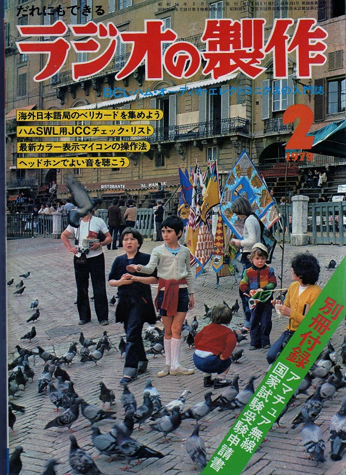
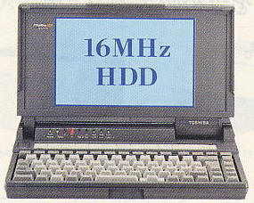
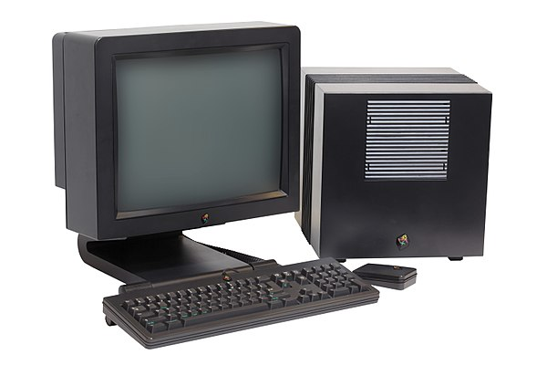
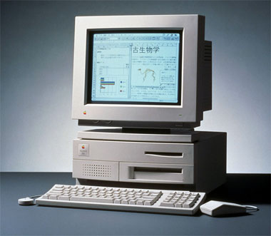
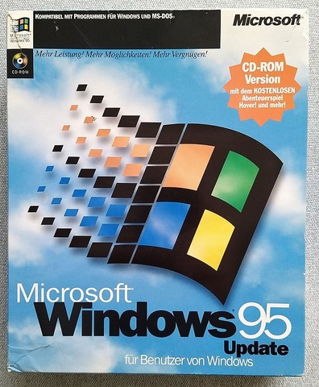
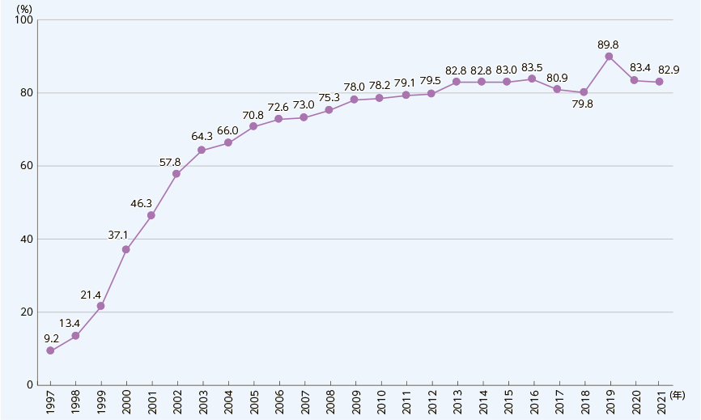
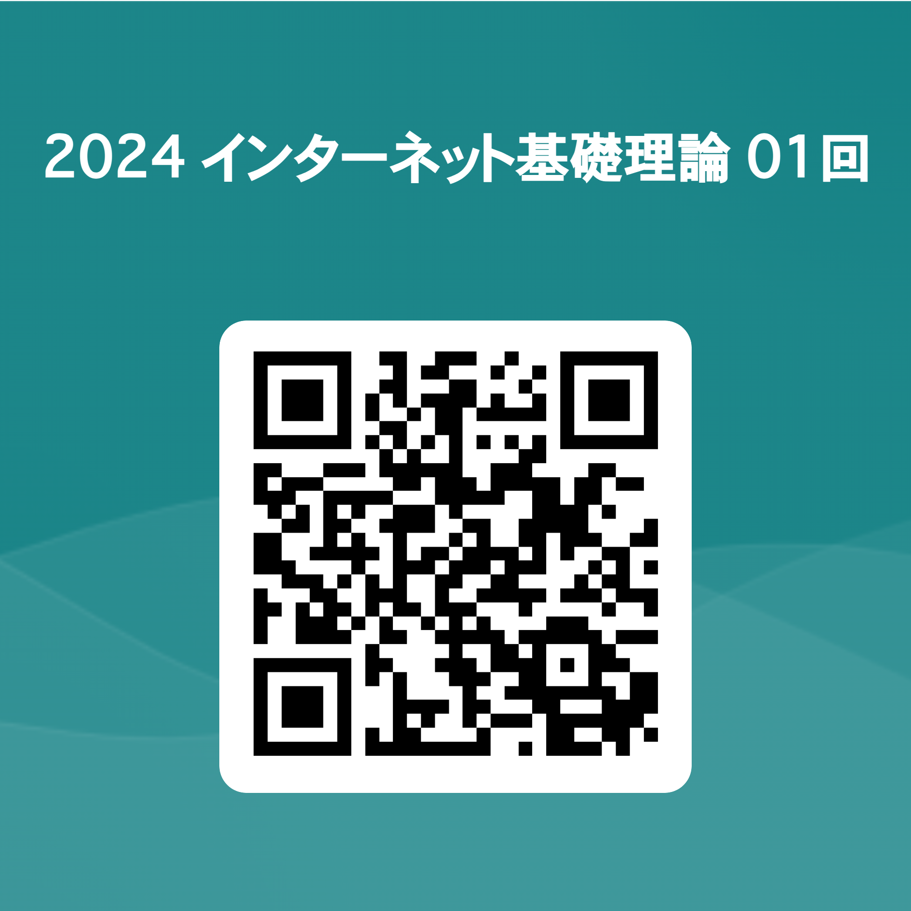

# インターネット基礎理論 01 オリエンテーション

## はじめに
### 今日の扱い
今日は、オリエンテーションですので、他の授業をチェックしたい人もいると思います。自由に出入りして構いません。

内容的にはシラバスの説明がメインになるので、本格的な授業は来週からとなります。

## 自己紹介
### 自己紹介

```
メディア文化コース 小林 統(おさむ)
```


です。2013から中野キャンパスで教えています。

皆さんは生まれた時からインターネットがある世代ですが、自分は20才になるまで周りにインターネットがありませんでした。

自分とインターネットとの関わりについて簡単？に紹介します


### 電気工作時代


小学校の頃からラジオ作るのとか好きでした。

その関係から「ラジオの製作」という雑誌を読んでいました。

1954年創刊で1999年に休刊しましたが、2008年から流れを汲む季刊誌「電子工作マガジン」として復活しているようです。

### コンピューターに興味を持つ


その雑誌の付録として「マイコンベーシックマガジン」が創刊され、その後独立した雑誌として発売されるようになります。

創刊号では「7つの言葉でマイコンは動かせる!?」との特集でした。ここからコンピュータに興味を持ち始めます。

家にコンピュータはありませんでしたので、電気屋さんにいって触っていました。

### 我が家にコンピュータがやってくる!


中1の時に89,800円定価のパーソナルコンピュータが我が家にやってきたので、ここからどっぷりハマります。

ですが、ちょっと不思議な友達が増えてしまったことから高校では一度コンピュータから離れます。

### 大学時代1

大学2年後期になって、コンピュータに触る授業ができました。(今考えると1年半なにやってるの？って感じですよね)

そして、大学3年になって自分では2代目となる初代Dynabookを使うようになりました。

### 大学時代2

3年以降になると今のMacの祖先に当たるNextというコンピュータを大学では扱っていました。(他にはSunとか)

大学にいる間はインターネットを利用することができ(この頃、一般の家庭ではインターネットの利用ができませんでした)、これがインターネットとの出会いとなります。

### ミュージシャンを目指して
大学4年の頃、スタジオミュージシャンに合格したことから、卒業後、本格的にミュージシャンを目指して1年間渡米します。

アメリカに行ったらインターネットはもう少し一般の人の手に届いてるのかな？とDynabookを持って行きましたが、まだそういう時代ではありませんでした。つまりメールさえ使えず、日本との連絡は
- 高い国際電話
- エアメール(郵便を飛行機で送る)

のどちらかに限られていました。

### 再度コンピュータに...

帰国後、音楽の世界では専用機からコンピュータを利用した音楽製作(DTM)が始まった頃でしたので、コンピュータ(Mac)と再度向き合うことになります。

カラオケデータの作成の仕事などでは
> **パソコン通信**

というインターネットの一つ前の仕組みでデータの納品などをしていた時期になります。

### 帰国後フリーターのはずが...
帰国して大学院に戻りましたが、今やりたいことではない、と中退します。

1. ひたすら多くのバンドに所属してバンド活動
2. 作曲できる人と会いたいという話がありあってみる
3. インターネットビジネスにも興味がある、と言われる
4. コンピュータにそこそこ強かったので企画を考える
5. 良い企画が持ち上がる
6. なぜかそのまま起業！

### 起業時に起きたこと
1. そもそも経営に関してはど素人
2. ベンチャーの走りでありエンジェル(投資家)から話はくるが全部断る(好きなことできなくなる...と思っていたから)
3. 企画を実行するだけの資金がなく、ただの請負会社になっていく
4. 会社にいる意味がなく、フリーランスに転向

経営の頭を持っていたら今とは全く異なる人生を歩いていたと思います。

### フリーランス時代
- HP制作(デザイン・ディレクション・コーダー・Flash/PHP/Javascript)
- オンラインゲーム制作
- iOSアプリ制作
- 映像制作(MV,VP,テレビ番組用)
- CD-ROM, DVD制作
- 音楽制作(CM,楽曲提供), スタジオ・ツアーミュージシャン
- その他(ライター・翻訳etc)

コンピュータ・インターネットの発展と共に様々なことを仕事としてする機会に恵まれました。が、ビジネス的な大きな成功とは言えなかったと思います。

そして2013から教員になぜかなりました。

## インターネット黎明期について
### 日本のインターネットの幕開け
研究・教育機関ではインターネットの利用が始まっていましたが、個人向けの利用は

```
ベッコアメ・インターネット
```
がサービスを始める1994年に開始されました。

それより前にはNIFTY-Serveと呼ばれるパソコン通信サービスは存在していましたが、次のようなものでした

- [懐かしのNIFTY-Serve （パソコン・ワープロ通信）25周年記念](https://www.youtube.com/watch?v=mwunp-uavU8)

### インターネットの普及


1995年にWindows95の発売を受けて、インターネットという言葉は急速に広がっていきますが、言葉だけ先行し、「インターネットって何がすごいの？」っていう人がほとんどでした。

実際に、コンピュータを持っていないのにWindows95を買いに並ぶ、なんて人が現れたりもしました。

### インターネットでできたこと
最初、研究・教育機関でインターネットが利用されていた時は
- メール
- ネットニュース(掲示板)

が主な利用のされ方でしたが、1994年あたりから
- ホームページ

の利用が普及し、これがインターネットのコアとなって行きます。

### 普及率推移


利用率が1割を超えたのは1998年になってからであり、3年ほどかけて徐々に普及していき、その後爆発的に伸びていくことがわかります。

### 起業の経緯
いろいろな企画を出しては没にし、を繰り返しましたが、
```
電車の中吊り広告をインターネット上で見れたら便利だよね
```
という一つのアイディアだけで起業することになります。

まだ当時はいろんな人がいろんなインターネットの使い方を模索している時期でした。
Yahooはありましたが、Googleありませんでした。

### 起業すると...
- 犬のCMで有名な会社の社長の弟を含む学生ベンチャー企業の人々と交流
- Apple, マガジンハウスといった大手と仕事
- 雑誌のライター、本の翻訳を頼まれる

など、様々なことが一気に起きました。本当に混沌としていたかと思います。

インターネットに先に触れて、インターネットの可能性を信じた人たちが「これは普及させなくてはいけない」という目的を持って自発的に動いていたような気がします。

その後、明確に「インターネットはお金になる」と思う人たちが現れます。

現在ではAIを中心に活発にその利用法が模索されていますが、非常に当時と似ている気がしています。

### 今はチャンス？？？
AIについて様々なことが言われていますが、AIは2022年の
- 画像生成AI(DALL-E, Stable Diffusion)
- チャットボット(ChatGPT)

の発表を受けて、今最も熱い分野となっています。

もちろん、昔から人工知能の専門家はいるのですが、それを
```
どのようにビジネスに活かすか
```

という視点から見ると、インターネット黎明期と同様に大きなチャンスが訪れているように感じます。


## シラバスの説明
### 授業の狙い及び到達目標
現代生活を支えるインターネットの基本的な理論について学ぶ。

1. インターネット利用に必要なデバイスであるコンピュータ・タブレット・スマートフォンをハードウェア・ソフトウェアの両面から説明できる。
2. インターネットの歴史について説明できる。
3. デバイスどうしの通信方法について説明できる。
4. HTML, CSS, JavaScript等のインターネット上の情報の記述法について説明できる。
5. サーバの仕組み・Webサービスについて説明できる。
6. インターネットを利用する上での注意点をセキュリティ・法律の観点から説明できる。

### 学修内容・方法
・インターネットを構成するデバイスであるコンピュータについて
・インターネットの歴史・仕組み・情報伝達方法について
・どのようにインターネットと接していくか、利用していくかについて
課題解決型学習を取り入れながらインターネット利用時の問題を自己解決できる能力を養う。

### 使用テキスト
不要。必要事項はプリント・PDF等で配布する。

### 成績評価方法・基準
定期試験（レポート）の成績 50％、平常点 (毎回のリアクションペーパーの内容)50％とし、総合的に評価する。

### 授業の形式・計画
- 【第１回】オリエンテーション
授業の目的と内容、授業の進め方について説明する。
---

- 【第２回】コンピュータ基礎理論１　ハードウェア
コンピュータをハードウェアの視点から学修する。

- 【第３回】コンピュータ基礎理論２　ソフトウェア
コンピュータをソフトウェアの視点から学修する。

- 【第４回】コンピュータ基礎理論３　基本的なロジック
コンピュータが動作する上での基本的なロジックについて学修する。

---
- 【第５回】インターネットの歴史
インターネットの誕生から現在に至るまでの歴史について学修する。

- 【第６回】インターネットの仕組み
DNS・IPアドレス・サーバ・クライアントといったインターネットの基本的な仕組みについて学修する。

- 【第７回】インターネットのプロトコル
インターネット上での情報伝達に利用されるプロトコルについて学修する。

---
- 【第８回】マークアップ言語（HTML・XML）
情報を構造化して記述するマークアップ言語について学修する。

- 【第９回】CSS・Javascript
ホームページの装飾・インタラクティブ機能の実装の仕組みについて学修する。

- 【第１０回】動的コンテンツ
動的コンテンツの仕組みについて学修する。

---
- 【第１１回】セキュリティ・法律（著作権・知的財産権）
情報を扱う上で必要なセキュリティ・法律について学修する。

- 【第１２回】情報発信ツール
CMS等の情報発信ツールについて学修する。

- 【第１３回】検索エンジン
検索エンジンの仕組みとその対策について学修する。

- 【第１４回】インターネットと生活
生活においてどのようにインターネットを利用していくかについて学修する。

---
- 【第１５回】まとめ
必要な知識を振り返り整理する。また、レポート課題について説明する。

### 授業計画変更の可能性
最後にやった2020年を参考にシラバスを設定しました。

AIというトピックについても触れたような方が良い気もします。
盛り込めるところは、そのまま盛り込もうと思いますが、14回目あたりを
```
【第１４回】インターネットとAI
```
に変更する可能性があります。

## 授業の進め方・テスト等について
### 資料置き場

https://sammyppr.github.io

に授業資料を置いていきます。復習に使ってください。

欠席した場合などはスライドを確認して追いつくようにしましょう。

> スライドあるなら授業受けなくていいや

なんてことは思わないようにお願いします。

### 授業の進め方
講義ですので、スライド・板書・映像等が多いですが、たまに
> コンピュータある人はこれを試してみよう

というようなこともあるかもしれません。

また毎回、感想・小テスト等の実施も行う予定です。
manabaを予定していますが、manabaが利用できるのは履修修正期間が終わってからとなるため、他のツールも使うかもです。

### 定期試験について
レポートの提出とします。

「インターネット基礎理論」という講義ですので、
- インターネットの
- 基礎の
- 理論

を問う内容となります。

## アンケート

https://forms.office.com/r/k3PvUKAhxC

出欠確認兼ねて
> 「インターネットと私」というテーマで400字程度でまとめよ

を提出してください。

## おまけ
- [TED アンドリュー・ブルーム「 インターネットって一体何？」(2012) 11:43](https://www.ted.com/talks/andrew_blum_discover_the_physical_side_of_the_internet?language=ja)
- [インターネットはどのように世界とつながっているのか](https://www.iij.ad.jp/news/iijnews/vol_163/detail_02.html)
- [Submarine Cable Map](https://www.submarinecablemap.com/)
- [【海底ケーブル】日本を支える重要インフラ…そこに潜むリスクとは【深層NEWS】 2022 48:22](https://www.youtube.com/watch?v=otr2_ZMs38A)