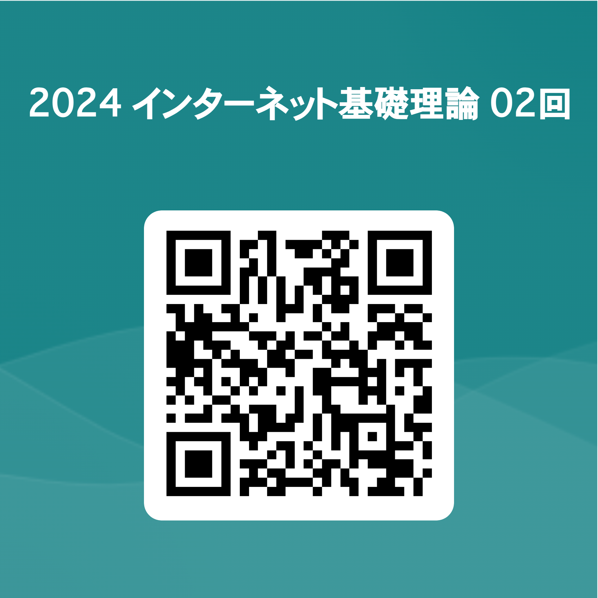
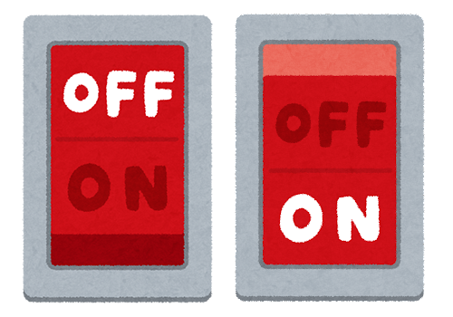
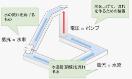
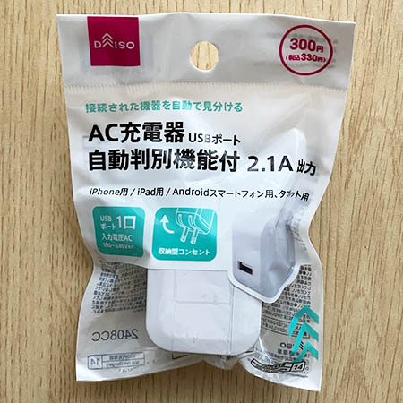
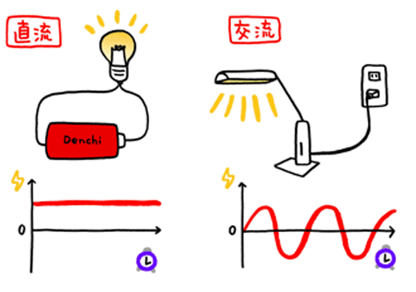
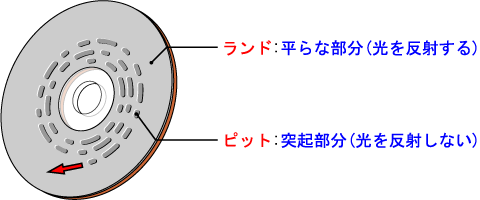
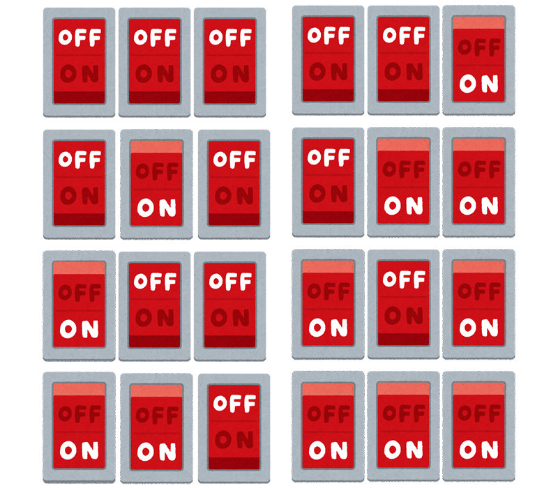
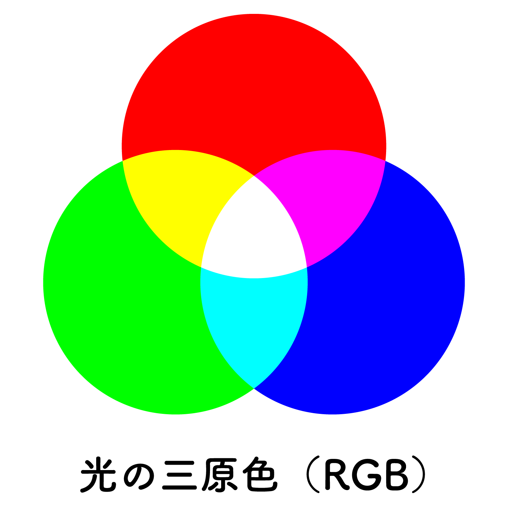
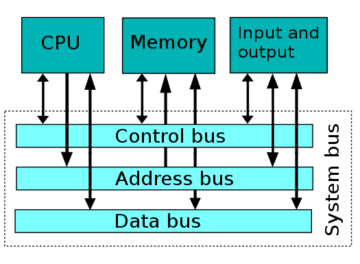

# インターネット基礎理論 02 コンピュータ基礎理論１　ハードウェア

## はじめに
### 資料置き場

https://sammyppr.github.io

に授業資料を置いていきます。復習に使ってください。

欠席した場合などはスライドを確認して追いつくようにしましょう。

> スライドあるなら授業受けなくていいや

なんてことは思わないようにお願いします。

### これから3回
この授業はインターネット基礎理論です。

インターネットは複数のコンピュータによって形成されています。
よって、まずコンピュータのことについて学びましょう。

- 【第２回】コンピュータ基礎理論１　ハードウェア
コンピュータをハードウェアの視点から学修する。

- 【第３回】コンピュータ基礎理論２　ソフトウェア
コンピュータをソフトウェアの視点から学修する。

- 【第４回】コンピュータ基礎理論３　基本的なロジック
コンピュータが動作する上での基本的なロジックについて学修する。


### まずはアンケート


あなたがスマホを選ぶときの基準について簡単に教えてください。

https://forms.office.com/r/9TPAgwTgnW

## ハードウェアとは
### 有名な川柳
```
コンピュータ、ソフトなければ、ただの箱
```

この箱に当たるものがハードウェアと呼ばれるものです。

この川柳でわかるように、
コンピュータはソフトウェアなしでは
動作することができません。

スマホでもアプリがなかったらただの時計ですね。

### ハードウェアのスペック
ハードウェアの性能が良ければいろいろなことができるようになります。

スマホも数世代前より今の方がはるかに性能が上がってますね。

あ！スマホもコンピュータなのは問題ないでしょうか？

### ハードウェアとソフトウェアの違い
- ハードウェア 目に見えるもの(物理的な設備・施設・車両など) 
- ソフトウェア 目には見えないもの(規則・運用・教育などの人間面)
などの意味で幅広く使われているものです。

この 2 つの用語は、 コンピュータ業界のみで利用される専門用語ではありません。


## 情報をどのように扱っているのか
### 情報の扱い方


ここで、ハードウェアを説明する前にコンピュータでどのように情報を扱うっているかについて説明します。
コンピュータの中ではほとんどの場合、
- ON
- OFF

によって、情報を扱います。単純ですね。

### なぜ単純にできているか
いくつか理由があると思いますが、
1. ノイズの影響を受けにくい
2. 単純なゆえに、高速化しやすい

が主な理由です。これについて説明していきましょう。

### ノイズの影響を受けにくいとは？
例えば
- **OFF** 0V
- **ON** 5V

としましょう。

ONかOFFの値しか取らないのに1Vという値だとしたら、
> 「うん？これ、0Vの意味だよな。だからOFFだよな」

と推測することができます。

### 少し脱線。電気の基礎
- 電圧
- 電流

という考え方がありましたね。

### 電圧・電流

#### 電圧
- 乾電池 1.5V
- USB充電器 5V

等というのが電圧です。VはVolt（ボルト）です。

#### 電流
どのくらいの電気が流れているかを表す単位でA(Amper・アンペア)と言います。

イメージとしては、水車をイメージしてみましょう。[画像引用元](https://jp.quora.com/%E9%9B%BB%E6%B0%97%E5%9B%9E%E8%B7%AF%E3%81%AE%E8%AA%AC%E6%98%8E%E3%81%AE%E6%AF%94%E5%96%A9%E3%81%A8%E3%81%97%E3%81%A6%E6%B0%B4%E6%B5%81%E3%83%A2%E3%83%87%E3%83%AB%E3%81%8C%E3%81%82%E3%82%8A%E3%81%BE%E3%81%99)

### USB充電器

USB充電器を使っていると思いますが、こんな経験はないでしょうか？
> 「あれ？なんか充電遅いな」「充電されなーい」


- スマホ 5V 1A 以上
- 大型スマホ 5V 1.5A 以上
- タブレット 5V 2A 以上

が必要です。電圧は一緒ですが、電流をたくさん供給できないと、充電できないということになります。[画像引用元](https://oggi.jp/6883982)

### 直流と交流

電気には
- 直流(DC)
- 交流(AC)

の2種類があります。コンピュータの中では直流が使われています。

ちなみに、コンセントは交流100Vで、一人暮らしの場合30Aくらいで契約していると思います。
[画像引用元](https://www.kepco.co.jp/sp/energy_supply/energy/kids/science/topic05.html)

### もう一度、ノイズの影響を受けにくいとは？
コンピュータの中では3.3Vや5V,12Vが利用されることが多いです。
スマホではリチウムイオン電池が利用されているので3.7Vが多いです。

ONかOFFの値しか取らないので、
中途半端な数字が出てきた場合には、どちらか判断できます。

そのため、ノイズの影響を受けにくくなります。

### ダメ押し...CDの例

CDには平らな部分と突起部分があります。

これをレーザーが読み取っているわけですが、多少の傷があっても
- 平らな部分
- 突起部分

のどちらかしかないはずなので、多少傷がついても正しく情報を取り出すことができます。[画像引用元](http://www.isl.ne.jp/it/dvd/cddvd_001.html)

### デジタル・アナログ

そして
- **デジタル** ON,OFFという状態を利用して情報を処理すること
- **アナログ** 連続した値で情報を処理すること

と呼びます。

### デジタルの語源
ラテン語の「指 (digitus)」を表す言葉が語源となります。

「指でかぞえる」といった意味から派生して、離散的な数、あるいは数字という意味で使われています

### 本当にON,OFFだけ？？？
これだけだと、
- ON
- OFF

の2種類の情報しか表すことができないですよね。

音楽や画像・映像などの情報はどのように扱っているのでしょうか？

### 複数のスイッチを使う


2つスイッチがあれば
4通りの状態を表すことができますね。

> $2^2=4$

と計算できます。

### スイッチが3つだと？

3つスイッチがあれば
8通りの状態を表すことができますね。

> $2^3=8$

と計算できます。

### ON,OFFって言いづらい...


状態を表すのに毎回
> ON,OFF,ON

とか言ってられないので
- **0** OFF
- **1** ON

と表すことにしました。

### 例えば
|sw1|sw2|sw3|2進数|10進数|
|:----|:----|:----|:----|:----|
|OFF|OFF|OFF|000|0|
|OFF|OFF|ON|001|1|
|OFF|ON|OFF|010|2|
|OFF|ON|ON|011|3|
|ON|OFF|OFF|100|4|
|ON|OFF|ON|101|5|
|ON|ON|OFF|110|6|
|ON|ON|ON|111|7|

### スイッチが4つの場合
|sw1|sw2|sw3|sw4|2進数|10進数|sw1|sw2|sw3|sw4|2進数|10進数|
|:----|:----|:----|:----|:----|:----|:----|:----|:----|:----|:----|:----|
|OFF|OFF|OFF|OFF|0000|0|ON|OFF|OFF|OFF|000|8|
|OFF|OFF|OFF|ON|0001|1|ON|OFF|OFF|ON|1001|9|
|OFF|OFF|ON|OFF|0010|2|ON|OFF|ON|OFF|1010|10|
|OFF|OFF|ON|ON|0011|3|ON|OFF|ON|ON|1011|11|
|OFF|ON|OFF|OFF|0100|4|ON|ON|OFF|OFF|1100|12|
|OFF|ON|OFF|ON|0101|5|ON|ON|OFF|ON|1101|13|
|OFF|ON|ON|OFF|0110|6|ON|ON|ON|OFF|1110|14|
|OFF|ON|ON|ON|0111|7|ON|ON|ON|ON|1111|15|

### 0100とかっていうの大変じゃない？？？
というわけで、4つ一まとめにして考えよう！ということにしたのですが前の表見ると、10進法で考えると11,12,13,14,15のところが扱いづらいですね。

というわけで0-9の数字10個とA,B,C,D,E,Fの6個の文字を利用して、**16進数**で考えるようになりました。

|10進数|0|1|2|3|4|5|6|7|8|9|10|11|12|13|14|15|
|:----|:----|:----|:----|:----|:----|:----|:----|:----|:----|:----|:----|:----|:----|:----|:----|:----|
|16進数|0|1|2|3|4|5|6|7|8|9|A|B|C|D|E|F|G|


例えば、
1011(2進数)=11(10進数)=B(16進数)

### スイッチが4つの場合

|sw1|sw2|sw3|sw4|2進数|10進|16進|sw1|sw2|sw3|sw4|2進|10進|16進|
|:----|:----|:----|:----|:----|:----|:----|:----|:----|:----|:----|:----|:----|:----|
|OFF|OFF|OFF|OFF|0000|0|0|ON|OFF|OFF|OFF|000|8|8|
|OFF|OFF|OFF|ON|0001|1|1|ON|OFF|OFF|ON|1001|9|9|
|OFF|OFF|ON|OFF|0010|2|2|ON|OFF|ON|OFF|1010|10|A|
|OFF|OFF|ON|ON|0011|3|3|ON|OFF|ON|ON|1011|11|B|
|OFF|ON|OFF|OFF|0100|4|4|ON|ON|OFF|OFF|1100|12|C|
|OFF|ON|OFF|ON|0101|5|5|ON|ON|OFF|ON|1101|13|D|
|OFF|ON|ON|OFF|0110|6|6|ON|ON|ON|OFF|1110|14|E|
|OFF|ON|ON|ON|0111|7|7|ON|ON|ON|ON|1111|15|F|


### X進法・X進数
詳しく説明はしませんが、
> **X 進法**とは X まで数を数えた時に一桁位が上がる数値の扱い方

を言います。
普段使っているのは 10 進法ですよね。 
それ以外にも、時間などでは 24 進法・60 進法が使われています。

> **X進法**で表された数を**X進数**

と呼びます。

- 2進数 binary(バイナリ)
- 16進数 Hexadecimal・略してHEX

とも呼ばれます。

### 16進法のおかげで
- スイッチが4つなら1文字
- スイッチが8つなら2文字
- スイッチが16なら4文字
- スイッチが32なら8文字
- スイッチが64なら16 文字

なので、スイッチが 64 個の場合でも、
> AEC03F20AF415B2F

くらいで済むようになりました。(2進法なら0と1が64桁ならぶことになります)

### デジタルの情報量を表す単位
デジタルの情報量を表す単位として次の用語が使われます。

- **1bit(ビット)** ON,OFF のどちらかで扱える情報量
- **1byte(バイト)** 8bit

### 1byte=8bitとは？
1bitがスイッチひとつだったので、8bitはスイッチが８つということです。
8つのスイッチで扱える情報量を1byteと呼んでいます。

スイッチが8つある場合
> $2^8=256$

となり、256の状態を表すことができます。

16bitであれば
> $2^{16}=65536$

となり、65536の状態を表すことができます。

### 色情報


色の三原色は「R(Red:赤) G(Green:緑) B(Blue:青)」です。

人間の目が判別できる色をデジタルで再現するには、それぞれ 256 段階 (8bit) にすれば十分で、
> $8bit × 3 = 24bit$

の情報があれば、一つの光の情報を表すことが出来ます。
また、どの程度透けているか、という「透明度」を追加しても 32bit で十分表すことが出来ます。


## ハードウェアを構成するもの
### 概要
コンピュータは
> プロセッサ＋メモリ+I/O

とそれをつなぐ**バス**からできていて、役割としてはざっくり

> 「計算するところ」+「記憶するところ」+「人とコミュニケーションするところ」

と考えることができます。

## プロセッサ

### プロセッサ 「計算するところ」
通常
- **CPU** Central Processing Unit

と呼ばれていて日本語では「中央処理装置」「中央円山処理装置」と呼ばれます。

### CPUの仕組み
CPU はプログラムと呼ばれる命令を順に読んで解釈・実行することで情 報の加工を行います。

人間でいえば、脳であるといえるでしょう。

### CPU が扱える情報
一度に扱えるデータの幅が 8bit であれば、8bitCPU と呼ばれ、 (ここを言いたかったので、延々と説明してきました)

- 16bitであれば、16bitCPU
- 32bitであれば、32bitCPU
- 64bitであれば、64bitCPU
と言います。

現在ですと、皆さんが持っているパソコンは大体64bitCPUだと思っていいでしょう。
Intel Core i3,i5,i7全て64bitとなります。

Macで現在利用しているM1,M2,M3等は多少面倒くさいので後で説明します。

### GPU
- **CGU** Graphics Processing Unit

元々はゲーマーの間で人気があったのですが、最近、人工知能のDeepLearning という技術と共に、GPU と呼ばれるプロセッサも注目を浴びています。CPU も GPU もどちらも計算することには変わりないのですが、何が違うかビデオをみてみましょう。

[Mythbusters デモ GPU と CPU](https://www.youtube.com/watch?v=-P28LKWTzrI)

## メモリ
### メモリ 「記憶するところ」
プログラムや演算結果を記憶するところが「メモリ」にあたります。
これには様々な種類があります。

### 人間はどうやって記憶している？
記憶する、というのはいろいろな性質があります。人間にとってもいろいろな記憶方法があります。
情報処理心理学的にいえば、

- SIS Sensory Information Storage (感覚情報貯蔵) 
- STM Short Term Memory (短期記憶)
- LTM Long Term Memory (長期記憶)
  
の 3 つに分かれ、初めのは数分の 1 秒、2 番目は数秒から数分、3 番目は 永久に保存されています。

他にも記憶の手段として、「メモをとる」「録音・録画する」などの記憶の方法もありますね。

### コンピュータにとっての記憶
コンピュータにとってもいろいろな記憶の手段があります。大きく分けると
- 電気がなくても情報を保持するもの
- 電気がないと情報を保持できないもの

に分かれます。 また、速度的に素早くアクセスできるもの、できないもの等があります。

### プロセッサ内の記憶装置
CPU の中に記憶できるものです。
演算するのに、少し覚えておかなくてはいけないものがあるので、素早くアクセスすることができます。

もちろん、電気がなければ消えてしまします。

### RAM
- **RAM** Random Access Memory

プロセッサの外にあるけれども、そこそこ素早くアクセスすることがで
きます。
通常コンピュータを選ぶ際に
> メモリ:4G

とか書いてあるのはこれのことです。電源がなくなれば消えてしまい
ます。

### ROM
通常意識することはありませんが、
- **ROM** Read Only Memory

というものがあります。これもそこそこ素早くアクセスすることができます。
文字通り、読み取り専用の記憶装置なので、書き換えることはできません。
主に、起動に必要なプログラムを格納したりするのに使われます。電源がなくなっても消えません。

### HDD(ハードディスクドライブ)
大規模な記憶装置です。
今では 4T の HDD でも 10000 円位から購入できます。

今は次に説明するSSDに座を譲り渡してるように見えます。

### SSD
大容量の記憶装置であり、スピードが速い!
電源を落としても内容が消えない!
けど、高い...

HDD は機械的に稼働する部分があり、壊れやすいという特徴がありますが、SSD はそれがないため、壊れにくいという特徴があります。
また、HDD に比べれば、同じ値段では SSD は容量が少ないです。 1T で 7,000 円位から購入できます。

### データ容量の単位
4TのTって何? これ、本当は 4Tbyte です。
T はテラの略です。

- k(キロ) 1000倍 
- M(メガ) 1000,000倍
- G(ギガ) 1000,000,000倍
- T(テラ) 1000,000,000,000倍

という意味です。

### データ容量の単位2
コンピュータの世界では 
- k(キロ) 1024倍
- M(メガ) 1024x1024倍
- G(ギガ) 1024x1024x1024倍
- T(テラ) 1024x1024x1024x1024倍

とすることもあります。
ま、どっちにしろ、「大きい」という意味では一緒ですが。

参考：[ 「1TBは何GB？」「1GBは何MB？」TB、GB、MBについて知ってみよう](https://haretoki.net/memorytips/)

### USB メモリ/SD メモリ
結構使っている人も多いでしょう。
そこそこスピードが早く、小さいので便利です。
- **USB** データの移動用
- **SD** カメラやレコーダー等のデータ保存用

### その他の記憶装置
- CD
- DVD
- MO
- ZIP
- Floppy Disk
- 紙テープ

インターネットの高速化により、廃れていく記憶装置も多いです。

## I/O

### I/O 「人とコミュニケーションするところ」
- **I/O** Input/Output

の略で、日本語でいえば、入出力の意味です。
人間とコンピュータが情報をやり取りするときには
- 人間がコンピュータに指示をする
- コンピュータが人間に結果を表現する

の機能がコンピュータには不可欠です。

### Inputの例
人間がコンピュータに指示をするには
  マウス
  トラックパッド
  キーボード
  タッチパネル
  マイク
等が利用できます。

これらが、I/O の I にあたります。

### Outputの例
人間がコンピュータから処理結果を得るには
- ディスプレイ
- プリンタ
- スピーカー

等を利用します。

これらが I/O の O にあたります。

I/O のことを、周辺機器と呼んだりもします。

## バス

### バス 「繋ぐところ」
今まで、プロセッサ・メモリ・I/O について説明してきましたが、 これらを繋ぐのが「バス」と呼ばれるものです。

データ転送の様子を、バスの様に、いろいろな人を拾って・運んで・降
ろす、というところからきてるという説があります。

### バスの幅
ここでも、このバスの幅が 8 本なのか、16 本なのか、32 本なのか、ということで処理速度が変わってきます。

基本的には、コンピュータはそういう作りになっている、ということをわかって頂ければ今日の授業としては理解していただけたことになります。

## ハードウェアまとめ


最近のコンピュータではもう少し複雑になっていますが、基本的にはこのような構造になっていると思って良いでしょう。

## 最新CPU動向
### ARMプロセッサ


iPhoneやMacに搭載されているA17, M2等やAndroidに搭載されているSnapdragon等は**ARMプロセッサ**と呼ばれ、少し仕組みが異なります。

先ほどの図を見ると、全ての情報はバスを経由しているため、そのスピードにコンピュータの性能が左右されることがわかります。

### M2の場合


[Mac Mini](https://www.apple.com/jp/mac-mini/)
の「M2とM2Proの中身を見る」をみてみましょう。

CPUの中にいろんなものを搭載することで、処理速度などを大幅に上げています。

ただし、その代わりに後からメモリを増やしたい、みたいなことができなくなっています。

## 自分に合ったコンピュータを選ぶ

最初のアンケート
> あなたがスマホを選ぶときの基準について簡単に教えてください

にも関係しますが、コンピュータやスマホを購入するときにどのように選んでいますか？

ハードウェアについて知ることで、自分に合ったものを選べるようになりますので、それぞれの意味をしっかり把握するようにしましょう。

よくわからなかったら、お財布と相談にはなりますが...

## 終わり
ここで授業終わりとします。

分解しやすいデスクトップコンピュータを持ってきたので、
中身を見てみたい人は、前の方に来てみてください。


