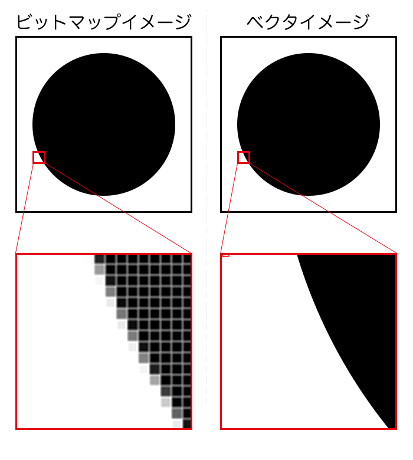

# インターネット基礎理論 04 コンピュータ基礎理論3　基本的なロジック

## はじめに
### 資料置き場

https://sammyppr.github.io

に授業資料を置いていきます。復習に使ってください。

欠席した場合などはスライドを確認して追いつくようにしましょう。

> スライドあるなら授業受けなくていいや

なんてことは思わないようにお願いします。

### コンピュータ基礎理論
インターネットは複数のコンピュータによって形成されています。
よって、まずコンピュータのことについて学びましょう。

本日はその3回目です。

- 【第２回】コンピュータ基礎理論１　ハードウェア
コンピュータをハードウェアの視点から学修する。

- 【第３回】コンピュータ基礎理論２　ソフトウェア
コンピュータをソフトウェアの視点から学修する。

- 【第４回】コンピュータ基礎理論３　基本的なロジック
コンピュータが動作する上での基本的なロジックについて学修する。

## 前々回のおさらい
- コンピュータには「ハードウェア」「ソフトウェア」の 2つの側面がある
- 情報は ON/OFF にて扱っていること。この情報量を 1bit と呼ぶ
- 1byte=8bit であること
- 2 進法・16 進法
- ハードウェアは「プロセッサ+メモリ+I/O」とそれを繋ぐ「バス」 からできている
- プロセッサは人間でいえば脳・メモリは記憶するところ・I/O は入出力装置

## 前回のおさらい
- ソフトウェアとは「CPU を動かす命令」のこと
- OS とアプリケーションに分けられる
- PC 用 OS(Windows, macOS, Linux), スマホ用 OS(iOS, Android) 等
- OS の目的:ハードウェア抽象化・リソースの管理・コンピュータの利用効率の向上
- アプリケーションとは「コンピュータの利用者がコンピュータ上で実行したい作業を実施する機能を直接的に実現するソフトウェア」
- 事務系・企業系・出版系・コンテンツアクセス系・エンターテイメント系・コンテンツ開発系・エンジニアリング系・コミュニケーション系
- ソースの公開されているオープンソースソフトウェアを活用しよう
- Web 上で利用できるアプリケーションも多数開発されている

## ファイルとディレクトリ
### ファイル
- **ファイル** ハードディスク,SSD等に保存されたデータやプログラムのこと

ファイルはデータとしては0,1の組み合わせで出来ていますが、書いてある内容が文字として認識できるかどうかによって
- **テキストファイル** 文字として認識できる
- **バイナリファイル** 文字として認識できない

に分かれます。

### エディタ
ファイルを編集するためのエディタと呼ばれるソフトウェアがあります。
- **テキストエディタ** テキストファイルを編集するもの
- **バイナリエディタ** バイナリファイルを編集するもの

一般的にはエディタ、というとテキストエディタを指すことが多いかと思いますが、バイナリエディタを試してみます。

- [Hex Fiend(Mac)](https://apps.apple.com/jp/app/hex-fiend/id1342896380?mt=12)
- [Stirling(Win)](https://qiita.com/mmake/items/33898a2bda5f44b4101b)

### ディレクトリ・フォルダ
- **ディレクトリ・フォルダ** ファイルを保管しておく入れ物という意味です。

「Aディレクトリの中のBディレクトリの中のCというファイル」みたいに利用されます。

#### Mac Linuxの場合
/Users/ユーザ名 の様に「/」を使います。

#### Winの場合
C:\Users\ユーザ名 の様に「\」後述する文字コードの関係で「¥」を使ったりもします。

### ファイル名・拡張子について
ファイル名は歴史的背景から古くは
> 8文字+"."+3文字

が利用されてきました。

8文字・3文字のどちらも縛りがなくなってきています。また、日本語も利用可能にはなってきています。

ピリオド"."の後の3文字(以上)を拡張子、とよびます。
これによりファイルの種類を表すことができます。
つまり、ダブルクリックしたときに、どのアプリで開くか定義されている、ということになります。

### 拡張子
- **txt** Text file テキストファイル
- **exe** Executable file 実行可能なプログラム
- **ini** Initial file 初期設定用ファイル
- **bak** Backup file バックアップされたファイル
- **doc,docx** Document file Microsoft Word で作られたファイル
- **xls,xlsx** Microsoft Excel で作られたファイル
- **ppt,pptx** Microsoft PowerPoint で作られたファイル
- **pdf** Portable Document File 環境に依存しないで閲覧できる ファイル
- **psd** Adobe Photoshop 用ファイル
- **ai** Adobe Illustrator 用ファイル

### 拡張子の取り扱いについて
拡張子はファイルをどのように開くか、ということを表しているため、勝手に変更してはいけません。

OSの設定では、拡張子を見えなくしていることもあります。

## 文字コードについて
### 英語圏を中心に開発が始まった
テキストファイルでは「文字コード」というものに注意する必要があり
ます。

コンピュータは英語圏を中心に発展した経緯があります。そのため、最
初は日本語を扱うことができませんでした。

当初は**ASCII**と呼ばれるアルファベットを中心とした文字コードが使われていました。 当初はカナだけなら、ASCII を日本独自に拡張して利用していました。

### ASCIIコード表

### 文字コードについて
日本語・中国語・韓国語などは文字の数も多いため、独自にコンピュータ
で言語を扱うことができるように様々な文字コードの体系が開発されました。
日本語で代表的なものは
- EUC-JP
- Shift-JIS
- ISO-2022-JP

ただし、これはコンピュータやプログラムによってバラバラに使われていたので、「文字化け」という問題を抱えていました。

### Unicode
日本語だけでなく、多言語でのインターネットでの発信が増えたことから
- Unicode

が普及しています。

2023.8月には普及率が98%に到達したため、文字化けに悩まされることはある程度なくなった模様です。

[全ての開発者が知っておくべきUnicodeについての最低限の知識](https://gigazine.net/news/20231005-unicode/)

### 機種依存文字
UTF-8であれば解消された様ですが、古いシステムなどを利用していると

> メールでの文字化け

の可能性がまだあります。文字が化けていると感じたときには、文字コードを確認しましょう。

## 圧縮・伸張
### 圧縮・伸張について
データを保存する場所としては、ハードディスク・SSD等がありましたが、最近ではたくさんの容量があるからといっても、有限であることに変わりはありません。
ですので、同じデータであれば、なるべく容量を小さくできれば、と考えるわけです。
ちなみに、容量が大きいことを「重い」、小さいことを「軽い」と呼んだ りします。
容量を軽くするために「圧縮」という技術が利用されています。また、それを元に戻すために「伸張」という技術が利用されています。

### 圧縮技術
- 可逆圧縮
- 非可逆圧縮(不可逆圧縮とも)

の2通りに分けられます。

これは、文字通り
- 元に戻せる圧縮方式
- 元に戻せない圧縮方式

を意味します。

### 可逆圧縮
10kb のデータが 1kb に圧縮されても、伸張した時に全く同じデータが取り出せるというのが「可逆圧縮」です。

実際に試してみましょう。

### 非可逆圧縮
一方、圧縮したものを伸張しても元と同じデータが取り出せない、というのが「非可逆圧縮」です。
元にもどせない圧縮って、意味無いじゃん!とか思うかもしれませんが、身近によく使われています。

> 身近な非可逆圧縮の例を考えてみよう。

### 非可逆圧縮の例
- 画像
- 音声
- 映像データ

これらが非可逆圧縮の例です。
厳密に元のデータと同じでなくても、
> 内容がわかれば良い

との考え方から非可逆圧縮がよく使われています。

jpg,mp3,mp4...皆さんが日常的に利用しているものです。

Photoshopを使って、圧縮される様子を見てみましょう。

### 圧縮の仕組み
圧縮は、どのような方法をとっているのでしょうか。今回は、簡単な「ランレングス」という方式について説明します。

> abccddeeeeffffgggggggghhhhhhhh

というデータがあった時に、

> a1b1c2d2e4f4g8h8

とかけば、30文字のデータが約半分の16文字のデータに変換されます。
これが圧縮の仕組みです。

### 伸張の仕組み
逆に
> a3b2c1d2e3f4g5h6

がランレングスで圧縮しているとわかっていれば

> aaabbcddeeeffffggggghhhhhh

と元データを取り出すことができますね。

### 圧縮・伸長について
圧縮ファイル形式は以下のものがよく使われています。
- zip
- 7-zip
- rar
- cab
- lha(lzh)
- gzip(GNU zip)

## ファイルの断片化・最適化
### ファイルの断片化・最適化
先ほどファイル・ディレクトリについて説明しました。

ハードディスクの中に人の目には一つのファイルが 1 箇所に存在しているように見えますが、実は OS が高度な管理をしています。
保存・削除を繰り返していくと、一つのファイルが分散されて書き込まれていきます。
すると、読み込むときにハードディスクのいろいろな場所を読みに行かなくてはならなくなります。

よって、動作が遅くなっていきますが...最近のOSではこの断片化されたファイルの最適化を自動で行う様になっています。

### 断片化・最適化

### デフラグ
この最適化することを
> デフラグ

と呼びます。自動で最適化を行うはずですが、おかしいな？と思った時には設定を確認しましょう。

## 画像ファイル
### 画像ファイルの2つの種類

### 代表的な画像ファイル形式
Web上で利用できる形式は以下の通りで、それぞれ特性があるため使い分けられていますが、webpとsvgに集約されるかな...
- [画像ファイル形式10種類の違いを徹底解説！特徴や最適な使い方](https://www.best-hp.jp/univ/koza-category/course/62/)

#### ビットマップ画像
- gif
- jpg
- png
- webp

#### ベクター画像
- svg

## 音声ファイル
### 様々な圧縮形式の音声ファイル
#### 非圧縮
- wav
- aif

#### 可逆圧縮
- flac

#### 非可逆圧縮
- mp3
- aac(m4a)

### 補足：きちんと音を聞けてる？
デジタル化にあたり
- サンプリングレート
- 量子化ビット数
- 圧縮方式

が音質にからんできます。いい音で聞けているか意識してほしいものです。

## 映像ファイル
### ファイルフォーマット・コーデック
ちょっと面倒くさいのですが、
- **ファイルフォーマット** どのような形式で保存するか
- **コーデック** 実際にどのような圧縮形式が利用されているか

の二つを意識する必要があります。

### H.264, H.265
iPhone等で撮影をする時に最近ではh.265というコーデックを利用します。

これは1世代前のh.264より、効率よくデータを扱うことができます。

- mp4(ファイルフォーマット)形式
- H.264,H.265のどちらを選ぶか選択可能

このことは逆に、
> 同じmp4形式でも対応していない場合にはH.265は再生できない

ということを意味します。

### 映像の再生で困ったら...
- [VLC](https://www.videolan.org/vlc/index.ja.html)

が様々なファイルフォーマット・コーデックに対応しています。

再生できないな...と思ったらVLCを試してみましょう。

## ファイル形式まとめ
### ファイル形式まとめ
- 制作中はデータの劣化が少ない方が良いため、なるべく非圧縮・可逆圧縮を利用
- インターネット等で共有する場合には、データ量を少なくできる非可逆圧縮の形式を積極的に使う

となります。
この二つのことを明確に意識しましょう。

### とはいえ...
最近ではあまり意識せずとも、Webサービスが勝手に形式を変更していたりします。

うまく使いこなすためには、このへんのことも理解しておきましょう。

## 時間余ったら
- docx,xlsxってファイル？？？
- ファイルの整理の仕方 (Mac の基本 etc...)
- コンピュータのトラブルシューティング (問題箇所の切り分け)
- 様々なボトルネック (転送速度に気をつけろ)
- ユーザ・アクセス権限
- etc...

## 小レポート

ファイルにおける
- 拡張子の重要性
- 文字コードの重要性
- 圧縮・伸張

について簡単に述べよ
[提出先](https://forms.office.com/r/RWzMjCUM1H)

