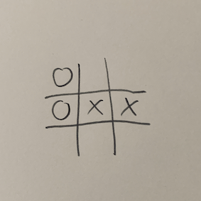
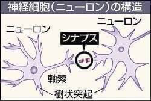

# 情報デザイン応用演習I 7. AI入門<!-- omit in toc -->

# 目次<!-- omit in toc -->

1. [初めに](#初めに)
2. [AI入門](#ai入門)
   1. [AIとは？](#aiとは)
   2. [顔認識](#顔認識)

# 初めに

- ECMAScript入門
- Canvas入門
- Canvas応用
- ThreeJS入門
- アプリ開発入門

とやってきました。今日でほぼ新技術を体験しようの回は終わりとなります。

---
### ElectronFirstStepの説明<!-- omit in toc -->

軽くおさらいしてみましょう。

# AI入門

## AIとは？
人工知能と訳され
> Artificial Intelligence

の略になります。

---
### そもそも知能とは?
知能とはなんでしょうか？自由に意見ください。

---
### Wikiでは
> 知能（ちのう、英: Intelligence[1]）は、論理的に考える、計画を立てる、問題解決する、抽象的に考える、考えを把握する、言語機能、学習機能などさまざまな知的活動を含む心の特性のことである。知能は、しばしば幅広い概念も含めて捉えられるが、心理学領域では一般に、創造性、性格、知恵などとは分けて考えられている。

複数の問題あり
- 出典が全く示されていないか不十分です。
- 独自研究が含まれている恐れがあります。

とも表示されています。

---
### 知能の定義
定義することが非常に難しく、哲学的な話にもなってきます。

---
### では？人工知能とは？
○×ゲーム(三目並べ・Tic Tac Toe)ご存じですか？

何通りのパターンがあるでしょうか？

---
### ちょっと計算
> 最初に書く場所は9通り、次に書ける場所は8通り、その次に書ける場所は7通り...

となるので9!=362880通りあります。このくらいは今のコンピュータでは簡単にシミュレーションすることができ、どの場合に、勝ち・引き分け・負け、になるかもわかります。

そもそもこのゲーム、先攻・後攻問わず、必ず引き分けに持ち込めますね。

---
### これを使った映画
1983年の映画で「WAR GAME」というものがありました。

あらすじ
> 全面戦争を仕掛けそうになったコンピュータに対し、3目並べをやってみるように促し、かつゲームは存在しないんだと認識させることで、核戦争を止める

[WAR GAME ending](https://www.youtube.com/watch?v=s93KC4AGKnY)

---
### “a strange game. the only winning move is not to play.” 
○×ゲームでは、コンピュータは全てを計算し尽くして、負けない選択肢を選べば、決して負けることはありません。

> 変なゲームだ。勝つためには遊ばないことだ

---
### Deep Blue
1997 年には Deep Blue と呼ばれるコンピュータが人間のチェスのチャンピオンに勝ってしまう、ということが起こりました。

これって知能としてコンピュータは人間を超えたと呼べるでしょうか?

---
### Deep Blueが勝った理由
DeepBlue は 1 秒間に 2 億手の先読みを行い。勝つことができたのです。 言ってしまえば、○×ゲームの延長上にあります。これって知能でしょうか?

---
### 人の脳に近い思考回路をコンピュータにさせられないか?
計算をすることのスピードは非常に速くなっていたのですが、もう少し 「知能」と呼ばれることをコンピュータにさせられないか、との試みがされました。

人間の脳は ニューロンと呼ばれるものがシナプスで繋がることで、学習していくことが医学的にわかっていました。これをコンピュータ上でできないか?ということを試したのが「ニューラルネットワーク」と呼ばれるものです。

---
### ニューロン

---
### ニューラルネットワーク
これは1982年に提唱され始めた考え方で、歴史が長いのですがなかなか結果が出ませんでした。

---
### ディープラーニング
ニューラルネットワークを発展させた形で「ディープラーニング」と呼ばれる手法が確立され、音声・画像・自然言語などの分野で非常に高い性能を示したため、これが 2010 年代頃から普及し始めました。
これは、計算し尽くすのではなく、脳に近い形で学ぶことをし始めています。

---
### 囲碁・将棋
囲碁や将棋はチェスに比べてその複雑さからコンピュータが人に勝つまでには時間がかかりましたが、最近ではこのディープラーニング、という手法を使うことで、かなり良い成績を収めるようになっています。

---
### 生成系AI
Stable Diffusion, Dall-E, Midjourneyの画像生成に続き、chatGPTを始めとする生成系AIが大きな進化を遂げたのが2022年でした。

これらを使いこなすために、プロンプトエンジニアリングという分野が現れました。

また、現在進行形で進化しています。

---
### 結局AIって？
まだ多分結論は出ていないのですが、人に似た、あるいは優れた行動に見えるものを AI と呼ぶと思っていれば良いでしょうか。

実際に「コンピュータが考えている」かどうかはそれほど問題ではありません。

そして、うまく利用できるのであれば、それをどんどん利用していくべきです。

---
### ターミネーター
一部には、あまりに AI が進みすぎると、ターミネーターの様に人を滅ぼしたり、そうでなくても人の仕事を奪ってしまう、ということが言われていますが、
- コンピュータができることはコンピュータに、
- そして人が得意なことは人が

という役割分担をやっていけば良いでしょう。

## 顔認識

---
### 顔認識
AIの一分野である画像認識を手軽に扱っていこうと思います。

簡単に利用できるようにライブラリ化してあります。

---
### clmtrackr.js
基本は顔認識用のライブラリなのですが、感情を取り出したりする js ファイルも付いてきます。

---
### clmtrackr.jsの使い方
https://github.com/auduno/clmtrackr

ここが本家です。ちょっと見てみましょう。

---
### 配布
本家から必要なものだけまとめたのでこれを今日は使いましょう。
[07.zip](data/07.zip)

---
### 今日やること
1. まずは、コンピュータのカメラ情報を、JavaScript で呼び出して表示してみよう
2. 顔認識ライブラリを使って、顔の特徴とする点を呼び出そう
3. 特徴とする点をデータで見てみよう
4. 特徴とする点に耳や鼻・ヒゲをつけてみよう。(自分で画像作りたい人は、背景を透明にした png ファイルを作ろう)
5. 顔の表情から感情を取り出してみよう
6. 感情に応じて表現を変えてみよう

簡単にいうとSNOWを作ってみよう、ということです。

---
### FaceReognition FirstStepへ
1. 今日の作業用フォルダ「IDA_07」を作成
2. [07.zip](data/07.zip) をダウンロード・解凍して、js,img フォルダをAID_07 に移動
3. VSCode で「IDA_07」を開く
4. FaceRecognitionFirstStepをやってみよう。

---
### 参考
今日の課題はこのページを参考にしています。
[表情認識で SNOW 的なアプリ](https://kkblab.com/make/javascript/face.html)
