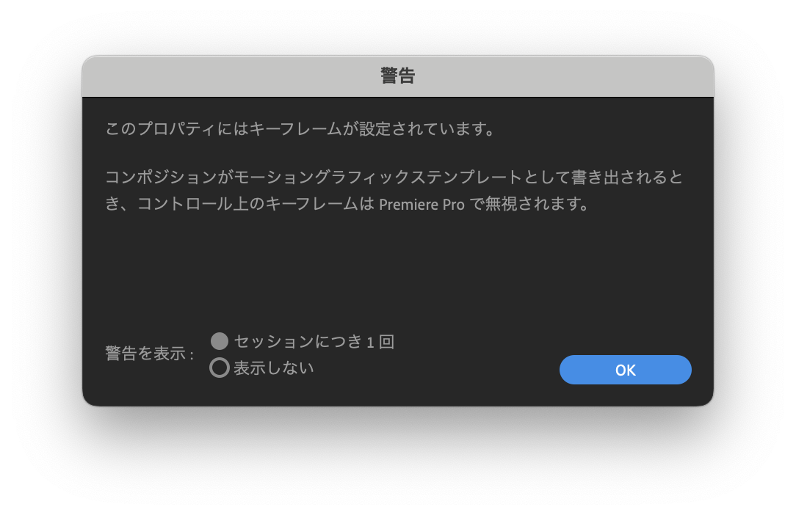

# メディア表現 III 07.モーショングラフィックステンプレートの制作

[メディア表現III TOP に戻る](./index.md)

---

## 目次

- [メディア表現 III 07.モーショングラフィックステンプレートの制作](#メディア表現-iii-07モーショングラフィックステンプレートの制作)
  - [目次](#目次)
  - [スライド](#スライド)
  - [追記(2023/7/13)](#追記2023713)
  - [動画](#動画)
  - [リンク](#リンク)

---

## スライド

[スライド資料](./mr3_07slide.pdf){:target="_blank"}

## 追記(2023/7/13)
キーフレームを設定しているパラメータを、MOGRTのパラメータに設定をすると、キーフレームは無視されるので気をつけましょう。
ヌルオブジェクトや、他のコンポジションを入れ子にして使いましょう。

## 動画
- [MOGRTを使ってみる](https://www.youtube.com/watch?v=hjpnfrba070){:target="_blank"}
- [モーションを作成](https://www.youtube.com/watch?v=ESscOboNjA8){:target="_blank"}
- [MOGRTとして書き出し](https://www.youtube.com/watch?v=5kCxEM_A_fQ){:target="_blank"}

## リンク
- [Mixkit](https://mixkit.co/){:target="_blank"}