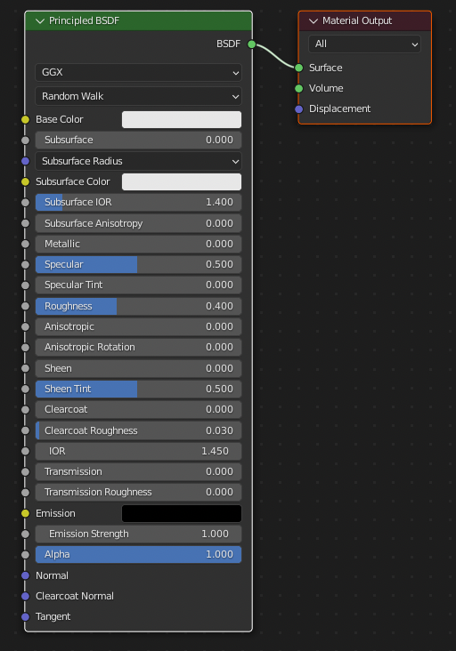

# メディア表現V 12. シェーダーエディター

[メディア表現V TOPに戻る](./index.md)

---
## 目次

- [メディア表現V 12. シェーダーエディター](#メディア表現v-12-シェーダーエディター)
  - [目次](#目次)
  - [追加(2023/5/21)](#追加2023521)
  - [注意！](#注意)
  - [ノードベースエディター](#ノードベースエディター)
    - [ノードベースエディターとは？](#ノードベースエディターとは)
    - [Node Wrangler(必須Add On!)](#node-wrangler必須add-on)
  - [やってみようPart1](#やってみようpart1)
    - [準備](#準備)
    - [Roughnessの値をループさせよう](#roughnessの値をループさせよう)
    - [連動して、色も変えてみよう。](#連動して色も変えてみよう)
    - [白黒？数値？](#白黒数値)
    - [ColorRamp大事！](#colorramp大事)
  - [テキスチャ・シェーダー・マテリアル](#テキスチャシェーダーマテリアル)
  - [PBRマテリアル](#pbrマテリアル)
  - [やってみようPart2](#やってみようpart2)
  - [サイトからダウンロードしてあててみよう](#サイトからダウンロードしてあててみよう)
  - [マテリアル便利ツール(参考)](#マテリアル便利ツール参考)
  - [やってみようPart3](#やってみようpart3)
    - [下準備](#下準備)
    - [MixShaderを使ってみよう](#mixshaderを使ってみよう)
    - [部分でバランスを変えてみよう](#部分でバランスを変えてみよう)
    - [楽しもう](#楽しもう)
  - [セルルック(応用編)](#セルルック応用編)
  - [やってみようPart4](#やってみようpart4)
    - [セルルック](#セルルック)
    - [輪郭](#輪郭)
  - [シェーダーエディターを理解する上で大事なこと](#シェーダーエディターを理解する上で大事なこと)
  - [お疲れ様ー](#お疲れ様ー)

---
## 追加(2023/5/21)
[【初心者必見】仕組みもわかるblenderノード解説【木目編】](https://www.youtube.com/watch?v=zIpMjHux-yo)

## 注意！
「CombineRGB」ノードが最近のバージョンでは「Combine Color」に変更されている様です。

## ノードベースエディター
{:target="_blank"}

### ノードベースエディターとは？
- ノードと呼ばれる機能を持つブロックを線で繋ぐことによって、処理の指示を与えることができる
- 根底にはプログラミングの考え方が採用されているが、テキストではなくグラフィカルに表現されるのが特徴
- 信号の流れは左から右
- 線を通る情報は数字・色だけでなく配列(情報の塊)等も通過していく
- Blenderではシェーダーエディター・ジオメトリーノードエディター・コンポジターで、現状ノードベースの編集ができ、Add onsで[Animation Node](https://animation-nodes.com/){:target="_blank"}も存在している

### Node Wrangler(必須Add On!)
- ノードベースのエディタを使いやすくするAdd On
- Edit - PreferencesのAded Onから検索してチェックを入れることで有効になる
- Shift+A, Shift+D, G, X等はViewportの操作と変わらない
- 線の上にノードを持って行くと、間に接続される
- 線の削除 Ctrl+右ドラッグ
- テキスチャセットアップ Ctrl+T
- プリンシプルセットアップ Ctrl+Shift+T
- ビューアー Ctrl+Shift+クリック
- 複数のノードをグループにすることができる
- 数値のところに「#frame」とすることで、フレームを反映させることができる
- 他も便利なのがあるけど、無理はせずに、使うものから身につけていこう

[参考：Node Wranglerの使い方解説 シェーダーエディター向け必須アドオン！](https://vook.vc/n/2610){:target="_blank"}

---
---
## やってみようPart1
ノードエディターに触ってみよう。

{:target="_blank"}

### 準備
- File - New - General
- 立方体のマテリアルが存在することを確認して
- ViewPortの画面分割して、シェーダーエディターに
- Principled BSDFとMaterial Outputの二つのノードがあることを確認
- Metalicを1にしておこう
- マテリアルプレビューモードにして、World Opacityを1にしておこう

### Roughnessの値をループさせよう
- Roughnessの数値を変えると、映り込み方が変わることを確認
- Shift+Aで、SearchからValueを探して追加
- Roughnessに接続
- Valueの値を変えると、映り込み方が変わることを確認
- Valueに#frameと入力。ドライバといって、フレーム数が数字にはいるよ。紫色になるね。
- １以上だと変わらないので、Shift+AでMathを追加して、Divide(割り算), 10にしよう
- ノードのタイトルがMathじゃなくて、Divideになってくることに注意
- フレーム1-10に動かして、映り込み方を確認しよう(10以降バグ？？)
- Value, Divideの間にMathを追加してModulo(余りを求める)にして10。これでRoughnessが0から0.9のリピートになってることを確認しよう。
- スピードを変えたい時にはValue,Moduloの間にMathを追加して、Divide,5とかしてみよう。

### 連動して、色も変えてみよう。
- Shift+AでCombineRGBを追加して、BSDFのBaseColorに接続
- RoughnessにつないだDivideのValueからRに接続
- 再生してみよう

### 白黒？数値？
- 一旦、最初の状態に戻そう(選択してXで削除)
- Shift+AでRGBを追加
- Roughnessに接続
- グレーの度合いを変更すると、0から1に対応していることがわかる。

### ColorRamp大事！
- RGBとRoughnessの間に、ColorRampいれてみよう。
- 黒のスライダーを真ん中まで持ってくる。
- RGBのスライダーを動かすと挙動がかわるね。
- ColorRampの入力が、0.5以下の時には、出力は0。それより大きい時に徐々に1になっていくね。

難しかったかな...

---
---
## テキスチャ・シェーダー・マテリアル
マテリアル・テキスチャ・シェーダー厳密には違うけど、
- 「物体の色とか模様とか質感を定義するもの」
- 「シェーダー」＋「テクスチャ」＝「マテリアル」
- テキスチャとは3Dグラフィックスにおいて物体の質感を表現するために使われる画像のこと
  
くらいに理解しておこう

## PBRマテリアル
- PBR(Physically-Based Rendering)マテリアルとは物理ベースのレンダリングマテリアルであり、 鏡面反射光/光沢等を画像で指定することができる。これにより、よりリアルな質感を再現することが可能
- これらは、ネット上にて配布されている

1. https://www.textures.com/
2. https://3dtextures.me/
3. https://freepbr.com/
4. https://texturehaven.com/
5. https://www.poliigon.com/
6. https://cc0textures.com/

[参考: Top 6 Websites for FREE Textures and Materials (PBR)](https://www.youtube.com/watch?v=Fi1UG-g1II4){:target="_bank"}

[参考:Blenderのシェーダーエディタを使ってみよう](http://kutodatabase.com/kuto1970.shop/Works_BlenderMaterial.html){:target="_blank"}

---
---
## やってみようPart2 
PBRマテリアルを使ってみよう

{:target="_blank"}

## サイトからダウンロードしてあててみよう
- [3D Textures](https://3dtextures.me/2022/02/25/fabric-lace-018/){:target="_blank"}の「Download All The Maps」をクリック
- 全部選択してダウンロード
- Blenderフォルダに「PBR」を作成して「Fabric_Lace_018_SD」フォルダを作成。その中に移動しよう。
- Plane追加、Scale5に
- もうひとつPlane追加、Scale2。GZでCubeの上に
- MaterialでNew, ShaderEditorにしてPrincipledBSDFを選択
- Ctrl+Shift+TでMaterial_2038.jpg以外全部選択
- 自動で設定してくれたのはroughness, normal, height(ファイル名を見て自動で繋いでくれる)
- 他は手動でやってみよう
- 一つ複製して、左のベクターに接続、右からBaseColorに接続、ファイルをbasecolorに
- 一つ複製して、左のベクターに接続、ColorSpaceはNonColor, ColorからAlphaへ、ファイルをopacityに
- SettingsのBlendModeをAlphaBlendへShadowModeはAlphaHashedへ
- Displacementをノードからできるのは、現状Cyclesだけ
- Eeveeの場合には、モディファイアーを使おう
- Displacementモデイファイアーを当てて、テキスチャをheightに
- PlaneをEditモードにして、subdivide 100
- Objectモードにすると、凸凹になってるかな？
- AmbientOcculusionもCyclesなので今回割愛
- Cloth, Collisionをあてて、再生してみよう。

[参考：Blenderのマテリアルのブレンドモードと影モードについてご紹介](https://www.tomog-storage.com/entry/Blender-Beginner-HowBlendModeAndShadowMode#%E3%82%A2%E3%83%AB%E3%83%95%E3%82%A1%E3%83%8F%E3%83%83%E3%82%B7%E3%83%A5){:target="_blank"}

[参考：How to use Displacement map in Blender](https://www.youtube.com/watch?v=3Yfp4WbqO9A){:target="_blank"}

---
---

## マテリアル便利ツール(参考)
- [B3DMatPack](https://www.youtube.com/watch?v=Zni54zJMnJY){:target="_blank"}
- [Lily Surface Scrapper](https://indiegamesjp.dev/?p=1864){:target="_blank"}

---
---

## やってみようPart3
シェーダーエディターを使ってみよう

{:target="_blank"}

### 下準備
- Cube削除
- Plane, Monkey追加して、同じマテリアルをあてておこう(Shade Smooth, SubdivisionSurface)
- 色は青にしておこう

### MixShaderを使ってみよう
- Emission BSDF(赤・Strength適当に)を追加して、MixShaderでBSDFをまとめよう。
- Emissionはシーン設定のBloomにチェックを入れないときかない
- Facは二つの入力のバランスを表すよ。0で上の入力、１で下の入力になる。
- RGBを追加して、MixShaderのFacに繋ぎ、白から黒に変えてみよう。

### 部分でバランスを変えてみよう
- RGBを外す
- ColorRampをFacに追加
- Ctrl+Shift+クリックで、その出力がどうなっているかわかるよ
- BrickTextureをColorRampの前へ(FacからFacへ)
- BrickTextureを選択してCtrl+T
- ColorRampを選択してCtrl+Shift+クリックで出力をみてみよう
- ColorRampの色の位置を変えてみよう。
- Mappingのscaleをかえるとサイズかわるね
- MixShaderを選択してCtrl+Shift+クリックで元に戻そう

### 楽しもう
- BrickTextureをVoronoiTexutureに変更しよう
- Volonoiは白黒じゃなくて、グレーがあり、ランダムなのが特徴的
- ColorRampの白を左にずらし、Constantにしよう
- ColorRampは白黒で入ってきた情報を、違う色に変化することができるね。
- VolonoiのScale50くらいにして、斑点を作ろう
- ColorRampの白の位置を変えると、表示のされ方が変わるね。

- PrincipledBSDFのBaseColorを黒に
- EmissionのカラーをVolonoi使って、さまざまにするよ
- TextureCordinateからColorRampを選択してShift+D(複製)
- 出力をEmissionのカラーに
- ColorRampに+をいくつか押して、いろんな色を設定しよう
- Volonoidのscaleを#frameにすると、自動で変わるよ

[参考:ノードの仕組みを理解するシリーズ【第1回】](https://www.youtube.com/watch?v=0IaxvXUcQgA){:target="_blank"}

---
---

## セルルック(応用編)
セルルックは、セル画（2D）で制作されたアニメ（セルアニメ）のような表現を実現する3DCGの手法。

ついでに、輪郭線(アウトライン)も学んでみよう。

今回は、背面法（Inverted Hull） という方法でやってみよう。

背面法はモディフィアでメッシュの法線を反転させたポリゴンを生成し、裏面を描画しないマテリアルをそのポリゴンに設定することで、輪郭を描画する。 メッシュの生成にソリッド化モディフィアとディスプレイスモディフィアとが使える。

---
---
## やってみようPart4

{:target="_blank"}

### セルルック
- 新しく作って、Susann追加
- BSDFの出力にシェーダーtoRGBで白黒にして
- ColorRampで色光あたってる、あたってないとこの色を指定する。

[参考:アニメ・セルルックシェーダー作り方 -How to make the anime shader【徹底解説】](https://www.youtube.com/watch?v=Q2hYuCgBYlM]){:target="_blank"}

### 輪郭
- アウトライン用のマテリアルを追加(Outline)
- SettingからBackface Cullingにチェック, Shadow ModeをNone
- Soldifyモディファイアを追加
- OutlineがSlot2のため、Material Index Offsetを2に
- Flip Normalsにチェック
- Thicknessをマイナスの値にする(太さ)
- BaseColorを黒にし、EmissionのColorでアウトラインの色を決める

[参考：３Ｄキャラモデルにアウトラインをつける方法](https://www.youtube.com/watch?v=DmX2s6mFE1I){:target="_blank"}

---
---

## シェーダーエディターを理解する上で大事なこと
- 線を通過している情報が、色情報だったり影情報だったりなんなのかを知ることは大事
- 情報っていっても、2次元のデータで配列としてもっていることもある

---
---

## お疲れ様ー
次回は、ノードベースのジオメトリーノードを使って、モデリング・アニメーションをしていくよ。

