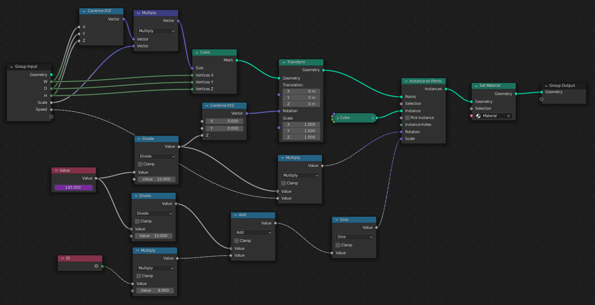

# メディア表現V 13. ジオメトリーノード

[メディア表現V TOPに戻る](./index.md)

---
## 目次

- [メディア表現V 13. ジオメトリーノード](#メディア表現v-13-ジオメトリーノード)
  - [目次](#目次)
  - [ジオメトリーノードって何？](#ジオメトリーノードって何)
  - [シミュレーションノード](#シミュレーションノード)
  - [BagaPie(紹介)](#bagapie紹介)
  - [やってみようPart1](#やってみようpart1)
    - [ひとつの立方体から多くの立方体を作ってみよう](#ひとつの立方体から多くの立方体を作ってみよう)
    - [回転させてみよう](#回転させてみよう)
    - [大きさをずらして変えてみよう](#大きさをずらして変えてみよう)
    - [最終調整](#最終調整)
  - [やってみようPart2](#やってみようpart2)
    - [下準備](#下準備)
    - [カーブを電線の様に垂れ下がらせよう](#カーブを電線の様に垂れ下がらせよう)
    - [グループ化しよう](#グループ化しよう)
    - [カーブのメッシュ化](#カーブのメッシュ化)
    - [電球を作ろう](#電球を作ろう)
    - [電球を増やそう](#電球を増やそう)
    - [マテリアルの設定](#マテリアルの設定)
  - [参考](#参考)
  - [お疲れ様](#お疲れ様)
  - [追加(2023/08/20)](#追加20230820)

---

## ジオメトリーノードって何？
ジオメトリノードは、ノード（特定の処理を実行するブロックのこと。 複数のノードを繋げながら複雑な処理を表現する）インターフェイスを介してジオメトリ（オブジェクトの形状などに関する情報）を操作できるカスタムモディファイア。

現在開発が進行形なので、可能性は無限大。

自分で作るには数学とか強い方がいいかも。プログラミングに似ている。

## シミュレーションノード
ジオメトリーノードの中で使える機能で、3.6で正式リリース。やれることが大幅に増えているが、今回は扱わない。
大きな違いは、これまでのジオメトリーノードが、1フレーム目を基準に計算するのに対して、シミュレーションノードでは、一つ前のフレームのデータを利用して計算することができることだ。
- [無料の高機能3Dモデリングツールの最新場「Blender 3.6」の「シミュレーションノード」を解説](https://forest.watch.impress.co.jp/docs/serial/blenderwthing/1512319.html)

## BagaPie(紹介)
- ジオメトリーノードを使ったAddOn紹介

[BagaPie](https://abaga.gumroad.com/l/BbGVh){:target="_blank"}

{:target="_blank"}

---
---

## やってみようPart1
立方体を分割してたくさんの立方体のアニメーションを作ろう

{:target="_blank"}

### ひとつの立方体から多くの立方体を作ってみよう
- Geometry Node Editorを開こう
- 立方体を選択してNew
- Nを押してサイドバーを開いて、GroupタブからW,D,HをInteger(整数)デフォルトを1にして作成。GroupでScale,SpeedをFloatでデフォルトを1にして作成
- Group InputのGeometryは選択したCube。それが、このノードを通過して変更されて、Outputから出力される。
- 線をCtrl+右ドラッグで切ってみよう
- 新たにCubeノードを追加して、Outputと接続しよう
- Instance on Pointsを追加して、間にいれよう
- Cubeノードをもうひとつ追加して、Instanceにつなげよう
- Combine XYZを追加して、GroupInputのW,D,Hから繋ぐ
- CubeのSizeにつなぐ
- モディファイアからパラメータを変更してみよう
- Combine XYZとCubeの間にVector Mathノードを追加してMultiplyに
- Group InputのScaleをMultiplyにつなごう
- CubeのVerticesを変更すると、頂点の数が増えることがわかるね
- GroupInputのW,D,HからCubeのVertices X,Y,Zにつなごう

### 回転させてみよう
- Valueを追加して#frameと入力しょう
- Instance on PointsのRotationに接続して再生。早いね
- Mathを追加してDivideにして、10と入力
- もうひとつMathを追加してMultiplyにしてGroupInputのSpeedからつなごう

### 大きさをずらして変えてみよう
- Mathを追加して[Sine](https://rikeilabo.com/trigonometric-function-graph){:target="_blank"}にして、Instance on PointsのScaleに接続
- Value(#frame) から繋ごう
- Sineとの間にMath(Divide)を追加して10としてスピード調整
- IDを追加しよう。IDは生成されたInstanceの番号がわかる
- Sineの前にMath(Add)を追加して、IDを接続しよう

### 最終調整
- Materialを適当に設定しておいて
- Group Outputの前にSet Materialで設定しよう
- Cube とInstance on Pointsの間にTransform入れて、全体もRotationで回してみよう。

---
---
## やってみようPart2
カーブに電球をつけていこう

{:target="_blank"}

[元ネタ：Blender 3.0 Geometry Nodes Lighting a Pavillion](https://www.youtube.com/watch?v=VoxYbGMtXRE){:target="_blank"}

### 下準備
- 適当な小屋を作ろう(余裕ない人は[ダウンロード](20220401t_day13_Part2.blend)してね)
- 電球をつける線をCurveで描こう

### カーブを電線の様に垂れ下がらせよう
- Curveを選択してGeometryNodeEditorででNew
- Set Handle Typeを間にいれて、L,RでVectorに
- その後に、Set Handle PositionをL,Rにして二つ追加
- Curve Handle Positionを追加して、L,Rの先にVector Math(Subtract)をそれぞれ追加して、Set Handle PositionのPositionへ接続
- Vectorを追加してVector Math(Subtract)に接続
- VectorのZの値を増やしてみる

### グループ化しよう
- Group Input, Output, Vector以外を選択
- Ctrl+Gでグループ化
- Group Inputの1番目のVectorをSubtract両方に接続して、2番目のVectorを消去
- Vectorの名前を「Droopiness(垂れ下がり度)」とする
- 上に戻って、名前を「Droop」とする
- Vectorは削除して、パラメータで操作できるようにしておく

### カーブのメッシュ化
- Curve to MeshをOutputの前に追加
- Curve Circleを追加し、Curve to MeshのProfile Curveに接続
- 二つを選んでグループ化して、「Curve Soldify」と名前をしておこう

### 電球を作ろう
- Instance on Pointsを追加してDroopのCurveからつなぐ
- Join GeometryをGroup Outputの前に追加
- Instance on PointsをJoin Geometryにつなぐ
- Ico Sphereを追加して、Instance on PointsのInstanceに
- Ico Sphereのサイズを調整しよう
- Ico Sphereの後にTransformを追加して、少し下にずらしておこう
- Ico Sphere, Transform, Instance on Poinstsを選択してグループ化。名前を「Light Instances」 に

### 電球を増やそう
- Light Instancesの前にCurve to Pointsを追加,100とかにしてみよう
- Lengthにして設定してもOK

### マテリアルの設定
- マテリアルをWire, Light二つ作成して、それぞれset Materialであてよう

---
---

## 参考
さまざまなことができるので、気になるものをトライしてみよう

{:target="_blank"}

{:target="_blank"}

{:target="_blank"}

{:target="_blank"}

{:target="_blank"}

{:target="_blank"}

{:target="_blank"}

{:target="_blank"}

---
---
## お疲れ様
- Geometryノードは最近追加された機能で、バージョンアップとともにノードが増えるし、できることが増えていくよ
- 向き不向きはあるかと思うけど、興味ある人はまず、いろんな人のノードの作り方を真似ると、「こんなノードあるのか」「こんなコントロールができるのか」とわかってくるはず

---
## 追加(2023/08/20)
- [Blender ジオメトリノード仕様まとめ 日本語で200Pにわたる解説](https://drive.google.com/file/d/1i1WQ1BrnNliQMuozV4yzkSB0UeAp7qa7/view)