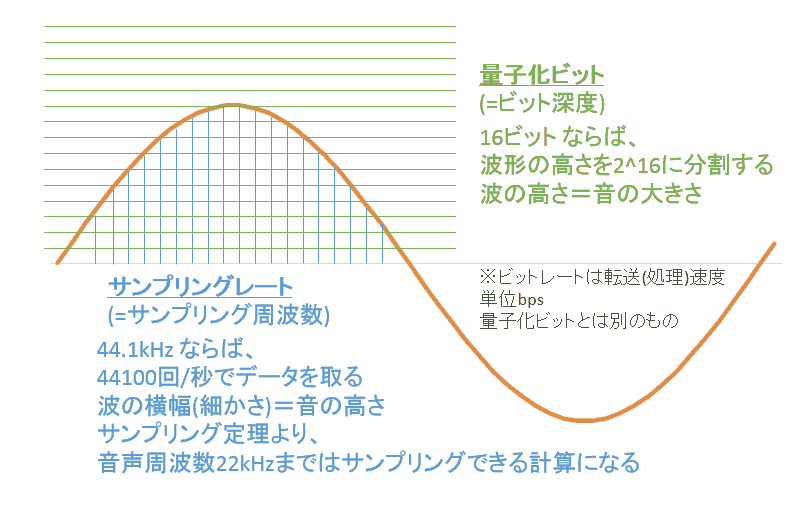

# サウンドデザイン演習 3.音のデジタル化<!-- omit in toc -->

# 目次<!-- omit in toc -->

1. [音のデジタル化](#音のデジタル化)
   1. [導入](#導入)
   2. [デジタル化(サンプリングレート・量子化ビット数)](#デジタル化サンプリングレート量子化ビット数)
   3. [圧縮](#圧縮)
   4. [同期](#同期)
   5. [オーディオインターフェイス](#オーディオインターフェイス)
   6. [周波数分析・スペクトログラム](#周波数分析スペクトログラム)
   7. [32bit float!](#32bit-float)
2. [小レポート](#小レポート)

## はじめに

## HPの置き場所(再掲)

https://sammyppr.github.io/

に置きます。これは学外からも閲覧可能です。

# 音のデジタル化

## 導入

---
ハイレゾ音源って知ってますか?
高音質で音楽が楽しめるらしいとは知っているけど...みたいな人が多いかな?

[ハイレゾ音源って何だろう](https://www3.jvckenwood.com/audio_w/high-resolution/guidance.html)

クイズをまずしてみよう。

---
### 聴き比べ
「聴き比べ」からダウンロードして、3つのファイルをAuditionで開きましょう。
- まずは聴き比べてみましょう。
- 「ウィンドウ」 - 「周波数分析」を開けて、周波数の分布を確認しましょう。

- ハイレゾ音源(WAV/192kHz/24bit) サイズ50,593KB
- CDレベル(WAV/44.1kHz/16bit) サイズ7,747KB
- MP3(圧縮音源/128kbps) サイズ760KB

---
### 実は...
- みんなのMac/PCではハイレゾ音源/CDレベルの違いわからないはず
- なぜなら、コンピュータが通常では44.1/48kHzに設定されているから
- MacではAudio MIDI設定で96kHzまで(機種による)挙げることはできる
- 192kHzはオーディオインターフェイスを利用しないと実感できない
- さらには、スピーカーが96kHzの音源まで再生できないと聞くことはできない

<!--
[AV42](http://m-audio.jp/av42/)
- 周波数特性：75Hz〜20kHz
-->
[Eris 3.5BT](https://www.mi7.co.jp/products/presonus/eris/compare.php)

- 周波数特性：80Hz〜20kHz

今日はこの辺のことを学んでいきます。

## デジタル化(サンプリングレート・量子化ビット数)

---
### デジタル化の方法
音は波形ですが、デジタル化はこのように行われています。

---
### サンプリングレート(サンプリング周波数)

1 秒間に何回データをひろうか (横軸)、を決めます。
CD では 44.1kHz となっています。ですので、1 秒間を 44100 分割して データを拾っています。

---
### サンプリング定理
サンプリングレートの半分の周波数までしか音声情報を記録できないこ
とがわかっています。
ので、44.1kHz というのは人の可聴周波数といわれている 20kHz まで は聞こえる、ということで CD の規格が決定されました。

---
### 量子化ビット
縦軸を何分割にするか決めます。
CD では 16bit ですので、65536 分割しています。

---
### サンプルレートを下げて、音質の変化を確認しよう
- レベルメーターの下に「44100Hz/16bit/ステレオ」との記載があることを確認
- Auditionで先ほどのwavファイルを開く
- 編集 - サンプルタイプを変換...
- サンプルレートの変換で、6000まで徐々に落として聞いてみよう。

---
### ハイレゾ音源
さて、話題のハイレゾ音源ですが、定義としては 
> CD を超える高音質のこと

と定義します。

---
### ハイレゾを数値で定義すると

- CD 16bit / 44.1kHz
- ハイレゾ 24bit, 32bit / 48kHz, 96kHz, 192kHz

等となります(場合によっては48kHzを含まない).
CD より、縦軸か横軸かどっちかが細分化されていれば ハイレゾ音源ということになります。さっきのファイル名も

- CD音源：Keep_your_side_16bit441kHz_short.wav
- ハイレゾ音源Keep_your_side_24bit192kHz_short.wav

となっていますね。

---
### ハイレゾ音源は本当に超高音質なのか？
ハイレゾって色々な問題があります。正しく理解しましょう。
-[【悲報】YouTubeハイレゾ動画の闇を暴く！ なにが"超高音質"だよ](https://www.youtube.com/watch?v=mY2enBamo7I)

興味を持った人はこのシリーズ見ると思います
【解説】ハイレゾ動画シリーズ
- [その1](https://www.youtube.com/watch?v=knZEkzGAhYs)
- [その2](https://www.youtube.com/watch?v=SrUhPog521s)
- [その3](https://www.youtube.com/watch?v=IL26RDAQsPo)
- [その4](https://www.youtube.com/watch?v=5yFI4DmXJCQ)
- [その5](https://www.youtube.com/watch?v=KVZDoJ05hFM)
- [その6](https://www.youtube.com/watch?v=KVZDoJ05hFM)

---
### ハイレゾ動画シリーズ まとめ
- bitが大きくなれば小さな音量まで録音できる
- 記録できる音量の幅をダイナミックレンジ
- CDは耳寄りダイナミックレンジが狭い
- サンプリングレートが大きければ高い音まで録音できる
- ハイレゾはイヤホン・ヘッドホンで聴くのは意味ない
- ハイレゾはスピーカーで聴くのは意味がある
- ハイレゾマークは日本の規格
- スピーカーは周波数特性に関わらず高周波も鳴ってる
- **bitは解像度に関係ない(!!!!)**
- 制作時にはハイレゾは大きな影響を与える

---
### A/D D/Aコンバータ
- A/Dコンバータ：アナログ信号をデジタル信号に変換するもの
- D/Aコンバータ：デジタル信号をアナログ信号に変換するもの

この言葉も知っておきましょう。

## 圧縮

---
### ファイルの容量
インターネットの初期、回線スピードが遅かったため、音声のファイル容量が大きいことが問題となりました。

また、ファイル容量が多いと、iPod(もう使ってる人いないな),iPhoneに入れる曲数に直結します。

---
### mp3
そのため、圧縮という技術が用いられるようになります。

> Mpeg-1 Audio Layer 3

が正式名称となります。
インターネットを意識した規格のため、ビットレート(1秒間にどのくらいのデータ量か)という考え方を持っています。

192kbps, 256kbps, 384kbpsだと相当高音質に圧縮することができます。

先ほどのmp3ファイルは128kbpsだったので、高音質ではなかったわけですね。ただ、ファイルサイズはかなり小さくなっています。

---
### 圧縮の方法
圧縮の方法には二通りあります。
- 可逆圧縮
- 非可逆圧縮

文字通り、「元に戻せるものと元に戻せないもの」という意味になります。

音声ファイルの可逆圧縮なものにはFLACがありますが、そんなに普及していません。

---
### 映像で音声を編集する時
劣化しないように、音声の非圧縮形式
- WAV
- AIFF(最近は少ないかな...)

を使いましょう。

---
### 再生目的の時
容量は小さくして、たくさんの曲数持ち運びたいですね。
- mp3
- AAC

などで多少の劣化があっても、そこそこ良い音の形式を利用しましょう。
AACの方が後から出たファイル形式なので、圧縮率が高いですが...

> AACやWMAはMP3より圧縮率が高く、同じビットレートでも容量が小さくなる。 低ビットレートにも強いため、128kbps以下ならAACやWMAの方が「いい音」に聴こえるかもしれない。 逆に160kbpsを超えると、理論上はMP3の方が高音質に。

[参考：MP3やAAC、WMAなどの圧縮音源は、どう使い分けるのがベスト？](https://koneta.nifty.com/koneta_detail/170721000334_1.htm#:~:text=AAC%E3%82%84WMA%E3%81%AFMP3,%E6%96%B9%E3%81%8C%E9%AB%98%E9%9F%B3%E8%B3%AA%E3%81%AB%E3%80%82)

---
### 映像の収録
時代によって変わる可能性がありますが、
- 24bit
- 48kHz
- 非圧縮

が現状では推奨されています。

## 同期

---
### デジタル機器を複数つなげたときの問題点

サンプリングレートを思い出しましょう。

1 秒間に 44100 回データを取っていました。複数の機器がきちんと、こ のタイミングで同じように挙動しないと、エラーが出てしまい、正しく 録音・再生することが出来ません。

そのため、ワードクロックという規格を使って、みんな一斉に同じよう
に行動しようね、という仕組みがあります。

---

## オーディオインターフェイス

---
音を録音・再生したりする時に、コンピュータにマイク端子・ヘッドフォ ン端子がついていれば、そこにつないで一応機能させることはできます。

しかし、音が気になり始めると、専用のオーディオインターフェイスと
いうものを利用することになります。

コンピュータ標準のものは、とりあえずの音を録音・再生する機能しかないため、ノイズがのってしまいます。

---
### 多種多様なオーディオインターフェイス

- 入出力チャンネル
- 音質
- ワードクロック対応/非対応

等によって様々なオーディオインターフェイスが売られています。

[USB接続オーディオインターフェイス 一覧](https://www.soundhouse.co.jp/search/index?s_maker_cd=&s_category_cd=191&s_mid_category_cd=&s_large_category_cd=&s_product_cd=&search_all=&sSeriesCd=&sPriceFrom=0&sPriceTo=9999999&s_spec=&s_zaiko=&i_type=c&i_sub_type=&i_page=1&i_sort=Price_DESC&i_page_size=32&i_ListType=type2&tag=)

<!--
今日利用しているのは
[PRESONUS ( プレソナス ) / Studio 26c](https://www.soundhouse.co.jp/products/detail/item/261283/)
-->
---
### 購入を考えている人へ
昔に比べればどれも性能は優れていると思いますが、
- 独自のドライバが必須でないこと
- 普及しているインターフェイス(USB)を使っていること

に注意すると長く使えると思います。

## 周波数分析・スペクトログラム

---
波形を見ただけでは、どの辺の周波数が出ているかよくわかりません。
そのため、
- 周波数分析
- スペクトログラム

というツールを使って周波数の動向を確認します。

---
### 周波数分析

先ほど利用しましたね。
表示方法が
- リニア
- 対数

があります。個人的には対数の方がわかりやすいと思います。

---
### スペクトログラム
「ビュー」- 「周波数をスペクトル表示」
としてみましょう。
- 横軸に時間軸
- 縦軸に周波数分布

の図が出てきました。

音色によってどのように変わるのかみてみましょう
- [Spectrogram](https://musiclab.chromeexperiments.com/Spectrogram/)

## 32bit float!
録音に際して、最近32bit floatという規格が話題になっています。
これまで、レベルを適切に合わせないと
- ノイズが気になる
- 音がわれる

などの問題がありましたが...

> 今後の録音は、レベル調整から解放され、マイクワークに専念することが可能だ。これまでのような、音が割れてしまった、音が小さすぎるという失敗は考える必要がほぼなくなり、音質アップのためのマイクワークに専念することができる。

[驚異の録音性能32bitフロートレコーダーZOOM F6＆F2の開発者に聞く「32bitフロート録音の技術とは」](https://www.pronews.jp/column/202012071100176250.html)

---
### 詳しく知りたい人は
YouTubeで「32bit float 録音」とすると色々な解説動画が出ているので調べてみましょう。

音声のデジタル化が始まって以来の革命と言って良いかと思います。

[ZOOM F3は32bitフロートの録音も凄いが、それ以外もいろいろ凄い。機能・使い方レビュー【動チェク！】](https://www.youtube.com/watch?v=N_y_-X-xsLo&t=180s)

# 小レポート
「音のデジタル化」について400字程度でまとめてmanabaにて提出

