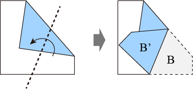
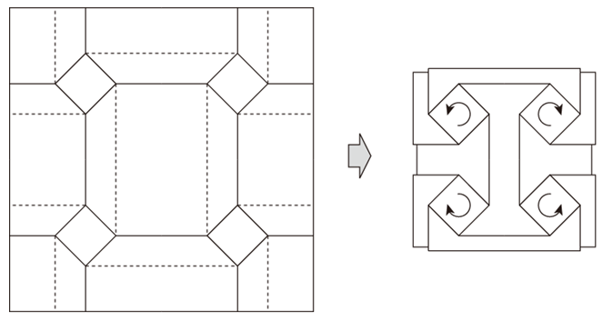

# 造形基礎演習I(小林ターム) 1. 折り紙・直線折<!-- omit in toc -->

<!--
https://mitani.cs.tsukuba.ac.jp/origami/main.html
-->

# はじめに
## クラス間違えてない？

学生証はカードリーダーにかざしてください。

新1年生以外の転科生・編入生は3クラスに所属してください。

Teams「2025_造形基礎演習」に所属していることを確認しましょう。所属していない場合には**0f0z80a**(0は全て数字のゼロです。)で入りましょう。

## 教員紹介
小林　統(こばやし　おさむ)

と申します。本コースでは4つの柱のうち「情報デザイン」を担当していますが、自分の専門は

- コンピュータ全般(プログラミング・映像etc)
- 音楽

となっています。そのため、2年になると映像系の演習も担当しています。

## SA紹介
授業準備や質問対応を手伝ってくれるSA(Student Assistant)を紹介します。

- 上原 蓮(3年)
- 若松 俊人(3年)

です。よろしくお願いいたします。

## HPについて
自分は、授業の資料をHPにて公開しています。(学外からも参照可能)

https://sammyppr.github.io/

2,3年次の内容なども公開しているので、興味ある人は自由にみて構いません。
特に、3Dに興味ある人は、3年次まで授業がありませんので「メディア表現V」を参考にしてください。

## 造形基礎演習Iについて
新入生ガイダンスにて説明があったかと思います。簡単にまとめます。

1年次には
- 造形基礎演習：アナログ手法
- デジタルデザイン基礎演習：デジタル手法

を学びます。前期後期合わせて6教員にて指導していきます。
この基本を元に2年次から4つの柱(造形・グラフィック・映像・情報)に分かれていきます。
自分が何に興味を持っているのかを意識しましょう。

## 小林ターム
第3ターム：ペーパーエンジニアリング

概要：紙を加工して作品やデザインを作る技術や手法であるペーパーエンジニアリング。平面である紙を立体の世界へ展開する経験を通して、材質・構造などについて学ぶ。デジタル表現においても、アナログ表現での手作業や素材の扱いを理解していることで、より創造的な作業が可能となる。

## 小林ターム（補足）
としましたが、昨年度までは後期に情報デザインの内容でやっていました。

本年度初めての内容となるため、うまくいくかわかりませんが、よろしくお願いいたします。

自分は工学系ですが、ペーパーエンジニアリングに強いというわけではないので、一緒に学んでいきましょう。

後期に全く情報デザインについて触れなくなってしまったので、アイディア出しの方法など可能であれば、内容に盛り込んでいきたいと考えています。

## 1限2限
朝苦手な人、大変だと思います。

1限で重要な授業は1年次だけになるべくなるように時間割を組んでいます。
1年生の間だけ頑張って起きましょう。

また、眠い時に30分・1時間と「作業時間です、どうぞ」とやるとなかなか効率が上がらないと思いますので、短い時間で多くの課題をこなしてもらう方向で考えています。

## 出席
1年生90人近くいるのですが、なるべく名前覚えたいので、出席とります。
(呼ばれていない人も確認・多分転科生・編入生)

# 折り紙
## 鶴
一度はこれまでに折り紙をみなさん経験しているでしょう。
まずは、鶴を追ってもらおうかと思います。すぐできたっていう人は、2羽おってみましょう。「忘れたー」っていう人は、動画用意したので、参考にしてください。(15分予定)

https://www.youtube.com/watch?v=_ZD6yCRNK1U

## 鶴を平面に戻してみましょう
1. 鶴を平面に戻しましょう
2. 折り目がわかりやすいように、ボールペン・鉛筆で線を書いてみましょう。
(山折りを実線・谷折りを破線で)
3. 折線で囲まれた多角形がいくつあるか数えてみましょう。

(10分予定)

## 鶴の展開図

右上が頭ですね。思ったよりたくさんの折り目がついていると思うのではないでしょうか？

## 鶴の展開図 色つき

色をつけた方がわかりやすいですね。多角形は52個もあります。

こんな風に折り紙をとらえたことないんじゃないでしょうか？折り紙は奥が深いです。

## 点と辺と面
ちょっと脱線します。

多角形ということは、
- 点
- 辺
- 面

からできていますね。
これは、3Dでも同じ原理で考えています。

## 辺
- 山折り
- 谷折り

の2種類で折ったかと思います。折り紙を作る工程をよく考えてみると
- 基準となる折り目をとりあえず作る
- 山折り・谷折りどちらでも折りやすくなる
- 形にしていく

と言う作業をしていることになります。

## Blender monkeyの例
データとしては、**ポリゴン**と呼ばれる多角形にて造形物をデータ化しています。
ちょっと、Blenderというソフトでその様子を見てみましょう。

なめらかな曲面も、ポリゴンを滑らかなカーブと考えることで表現しています。

## 折り紙と3Dの違い
3Dでは立体モデルを作るためにモデリングしますが、折り紙では**平坦折り**と呼ばれる手法があります。

> 平坦折りとは、山折りや谷折りの折れ目に沿って紙が平らに折れる折り紙です。平らに折りたたまれた状態は折り紙の一般的な状態なので古くから研究の対象としてきました。

## 折るとは？
折り線は必ず直線になり、折る操作は180度の角度で折ることになります。
折り返す前のカドの形Aと、折り返した後の形A'は鏡映の関係にあります。

## もう一回折ると？
180度の回転ですので、紙の重なり順が上下逆になりますが、2次元平面でのカタチだけに注目すると、折る前の形Bと折った後の形B'は、やはり鏡映の関係になります。

## 折り目入りの展開図から折った後の形はわかる？

## わかるんです...
折り線を介して接続する多角形を順番に折りたたんでいくことで最終的に折った後の形を求めることができます。折りたたむ順番は任意です。（紙の重なり方、つまり多角形の重なり順は、これだけでは決定できません）。

## これ以上すると難しくなるので...
ここで止めておきます。

折り紙詳しい人は、先ほどの展開図を見たタイミングで「鶴」とわかるようです。

折り紙は立派な学問体系にもなっていて、

- [日本応用数理学会 「折紙工学」研究部会](https://jsiam.org/online_magazine/news_presentations/3300/)

と言うものも存在しています。
「折紙工学」は社会の様々なところで活かされています。

## 1限残りがあれば...
鶴以外の折り紙をしてみて、
- 平面に展開
- 線を引く(山折り・谷折り)

知っている折り紙がどんな展開図になるのかみてみましょう。

「折り紙なんて全然覚えてない！」と言う人用に、リンクを貼っておきます。

- [簡単な折り紙！おすすめ30選](https://nukumore.jp/articles/360)

## 休憩...

# 正方形を基本としたねじり折り
2限は、ねじりながら折って、平坦に折り畳まれる

> **正方形を基本としたねじり折り**

に挑戦してもらおうと思います。

## 後から来た人出席
最初の出席でいなかった人で遅れてきた人いますか？

## 配布物
- カッター(2人に1つ)
- 定規
- カッティングマット
- A4(ad01_01)

## ねじり折を繰り返すと...
こんな模様を作ることができます。

が、今日は、少ない数から試してみましょう。

## まずは、3つを切り離しましょう。
カッター気をつけて利用してください。
カッター久しぶり、と言う人は本当に気をつけてくださいね。
使い方分からなければSAさんに聞きましょう。

怪我したらすぐに報告してください。

用紙はたくさんあります。失敗しても平気です。

## 得意な人と得意でない人...
多分ですが、自分で試してみて、得意な人とそうでない人がいると思います。
うまくいかなくてイライラする人は、1分間休憩しましょう。

## 一つ
まずは、正方形一つのねじり折りからやってみましょう。

## 二つ
小さいと、難易度上がります。
最初、大きいのでやってコツを掴んでから、小さいのでトライしましょう。

## 四つ
できてしまった人はもう1枚用紙用意してます。A4(ad01_02)

## 逆さ二つ
できてしまった人は、表裏バージョン用意してます。A4(ad01_03)

## それでもできた人向け
一応、用意してます。
簡単すぎた人は取りにきてください。

というわけで、作用に入りましょう。

「むずかしー」と言う人は、本当に短い休憩を入れながらにしましょう。

## 提出
manabaのレポートから以下の内容で提出してください。

> 今日作業した内容をスマホで撮影して、
> ファイル送信してください。
>
> 複数枚になっても構いません。

## お疲れ様ー

