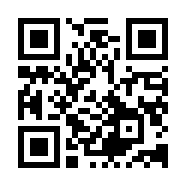

# 造形基礎演習I(小林ターム) <!-- omit in toc -->
> 2. 平坦折り 2
<!--
https://mitani.cs.tsukuba.ac.jp/origami/main.html
-->

# はじめに
## クラス間違えてない？

学生証はカードリーダーにかざしてください。

新1年生以外の転科生・編入生は3クラスに所属してください。

Teams「2025_造形基礎演習」に所属していることを確認しましょう。所属していない場合には**0f0z80a**(0は全て数字のゼロです。)で入りましょう。

## HPについて
自分は、授業の資料をHPにて公開しています。(学外からも参照可能)

https://sammyppr.github.io/

2,3年次の内容なども公開しているので、興味ある人は自由にみて構いません。
特に、3Dに興味ある人は、3年次まで授業がありませんので「メディア表現V」を参考にしてください。

## 前回の内容
### 折り紙・展開図
折り紙と展開図の関係について学んでみました。
### 平坦折り(ねじり折り)
折ると平面になる折り方ですが、
1. 正方形1個
2. 正方形2個
3. 正方形4個
4. 正方形が表裏になる
5. 難しいパターン...

にトライしてもらいました。

## 感想
想定を上回るスピードで完成させていく人が想像以上にいました。
(想定外なことが起きることを予想して想定しておいてよかった...)

不器用な人で、なかなかうまくいかなかった人もいるでしょう。

やれる範囲で、しっかり取り組みましょう。

# 道具の使い方
## カッターの使い方
前回やればよかったのですが、一応おさらいしておきましょう。

- [カッターナイフの正しい使い方](https://www.youtube.com/watch?v=6dL4tNi-Y9w)

## 折り筋をつける時
固めの紙にカッターを使って折り筋をつける場合には
- カッターの刃でなでる
- カッターの裏で筋をつける
- 次で説明する「目打ち」でなぞる

のいくつかの流派があるようです。刃でなでるやりかただと、切ってしまう可能性もあるため、自分は2番目の方法を使います。

**折ったときに内側になる方に傷つけましょう。**

**筋をつけすぎると、折っているうちに切れてしまう、なんてこともあります。
力加減に注意しましょう。**

## 目打ち

キリみたいなもので、印をつける等に利用されます。

# 紙の種類
## 紙の種類
前回はコピー用紙を用いましたが、紙には色々な種類があります。

- [ペーパークラフト](https://www.kamitsuuhan.jp/product/use_list.php?id=32)

> デザインを印刷するのに適したマルチプリンター用紙から、紙の風合いを活かせるマーメイド紙まで、ペーパークラフトを作成するのに適した厚手の紙をご紹介。印刷するならインクジェットでのプリントアウトをおすすめします。一般的に、0.2mmほどの厚さのものがよく使われていますが、小さな作品を作るときは薄い紙を、大きな作品を作るときは厚い紙を使うと綺麗な仕上がりになります。

## 本演習で利用する紙
- **コピー用紙** 大学で大量に購入してくれているので、使いたい放題(厚さ0.09mm)
- **タント紙** 特徴を端的に表現するなら、「上品」「上質」「上等」(厚さ0.16mm)
表面には控えめな凹凸のあるエンボス加工が施されており、ちょっと特別な外観と手触り。それでいながらしなやかで柔らかく、高級感がただよう。

なお、タントはイタリア語で「tanto」であり「たくさん」という意味を持つ言葉で、色の種類がとても豊富だったことからつけられた名前ですが、白しか買ってません(ごめんなさい)。

# 出席
1年生90人近くいるのですが、なるべく名前覚えたいので、出席とります。
(呼ばれていない人も確認・多分転科生・編入生)

# 材質による違いの体験

1限は、材質による加工方法の違いなどを体験しよう。

## お題：ねじり折り
前回は、コピー用紙にて体験してもらいました。
今日は、タント紙にて実際に制作してもらいます。

前回、みなさん頑張ってやってもらいましたが、
> 綺麗に折れた！

という人は少ないと思います。

今回は、
- 如何に綺麗に折るか
- 精度を上げるか

ということに挑戦して欲しいです。折ってはいけないところはなるべくおらずに制作しましょう。

## 用具等の注意点
座る席は最低ひとつあけましょう。

使うのは
- カッターマット(一人一つ)
- 定規(一人一つ)
- カッター(2,3人に一つ)
- 目打ち(2,3人に一つ)
- タント紙(A4)

となります。

## 配布する型紙

タント紙もA4のものを配ります。効率よく利用しましょう。

## 精度を上げることを目標にしよう
前回、課題たくさん用意していたので、レベルクリアーを目指して次に次に、とやっていきましたが、今回は
> より綺麗に精度良く作ること

を目標とします。
それぞれよく考えてトライしましょう。型紙をみてわかるように

- ねじり正方形1つ
- ねじり正方形2つ
- ねじり正方形4つ

のバージョンは用意しましたが、それ以降はありません。(時間余った人いたら、前回の逆バージョンも使いますが...)
時間より、丁寧な作業を心がけましょう。それでは初めてください。

# 立体を意識した平坦折り

# 出席
一応、遅れて来た人いたらここでとります。

## 平坦折り
平坦折り（flat fold）とは、
> 山折りや谷折りで紙を折って平らにする折り紙の技法

でしたね。
2時限目は立体を意識した折り方についてやってみましょう。

## ミウラ折り
一つ有名な折り方を紹介しておきましょう。
これは、「miura-ori, miura-fold」と英語圏では呼ばれています。

> ミウラ折りとは、宇宙構造物研究の第一人者、三浦公亮博士 (Dr.Koryo Miura  東京大学誉教授、JAXA名誉教授) が、NASAの研究員であった1970年ごろ、墜落してクラッシュしたロケットの胴体に生じた皺(しわ)にインスパイアを受け、円筒に丸めた紙を縦に潰したときに現れる皺や造山運動によって生まれた地形など、あらゆる皺に見られるパターンを徹底的に分析した結果、それらに共通して見られる特徴を整理し、数理的に定義づけた「折りの法則」で、最大の特徴は、折り畳まれた状態から最小のエネルギーで展開状態に変化できるという点にあります。
> 
> その特徴を生かし人工衛星の太陽電池パネルの展開構造や携帯地図の折り畳み方として実用化されており、今後も建築構造物などへの応用が期待されています。

## 動画を見てみましょう
- [【物理エンジン】ミウラ折りの太陽光パネル人工衛星CG(4:30)](https://www.youtube.com/watch?v=7Y_SSDckBEg)

ついでに、この後の内容とは異なりますが、折り紙が実社会にどう活かされてるかの動画も続けてみてみましょう。
- [Origami in Space: BYU-designed solar arrays inspired by origami(3:20)](https://www.youtube.com/watch?v=3E12uju1vgQ)
- [How NASA Engineers Use Origami To Design Future Spacecraft(4:20)](https://www.youtube.com/watch?v=Ly3hMBD4h5E)

## 今日の課題1
「デザイナーのための折りのテクニック - 平面から立体へ」の
シンメトリー的反復から
- 並進対称
- 鏡映対称
- 回転対称
- 映進対称

と順にやっていきましょう。用紙の数字でいくと、

- 1.2.1, 1.2.1_2, 1.2.2, 1.2.3, 1.2.4, 1.2.4_2(6枚)

11:30まで予定です。

## 今日の課題2
ミウラ折りをやってみましょう。

- [ミウラ折りの折り方](https://www.youtube.com/watch?v=U36xlf1Ty9Q)

早く終わった人は、課題1の残り、終わってたら課題3準備してます。

## 今日の課題3(予備)
- [6×6 基本のマジックボール Magic ball](https://www.youtube.com/watch?v=Q2tRAMjOs5M)

- [12×12 基本のマジックボール　Magic ball](https://www.youtube.com/watch?v=TdxWVLyiuvU)

## 提出
manabaのレポートから以下の内容で提出してください。

> 今日作業した内容をスマホで撮影して、
> ファイル送信してください。
>
> 複数枚になっても構いません。

成績に反映させるので忘れずに！

## 片付け
カッターはしっかり刃を納めましょう。
目打ちは、キャップをしましょう。

指定された場所に戻してください。

作品は持って帰ってくれてもいいですし、
前のゴミ袋に捨てても構いません。

## お疲れ様ー

