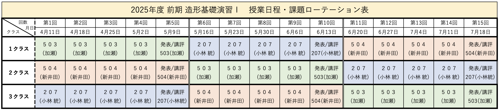
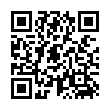

# 造形基礎演習I(小林ターム) <!-- omit in toc -->
> 4. 切り込みを入れた立体制作
<!--
1コマ目
https://www.youtube.com/watch?v=QZoEAdLu5jw
2コマ目
ポップアップカード
-->

# はじめに
## クラス間違えてない？

学生証はカードリーダーにかざしてください。

新1年生以外の転科生・編入生は3クラスに所属してください。

Teams「2025_造形基礎演習」に所属していることを確認しましょう。所属していない場合には**0f0z80a**(0は全て数字のゼロです。)で入りましょう。

## HPについて
自分は、授業の資料をHPにて公開しています。(学外からも参照可能)

https://sammyppr.github.io/

2,3年次の内容なども公開しているので、興味ある人は自由にみて構いません。
特に、3Dに興味ある人は、3年次まで授業がありませんので「メディア表現V」を参考にしてください。

## 前々々回の内容
### 折り紙・展開図
折り紙と展開図の関係について学んでみました。
### 平坦折り(ねじり折り)
折ると平面になる折り方ですが、
1. 正方形1個
2. 正方形2個
3. 正方形4個
4. 正方形が表裏になる
5. 難しいパターン...

にトライしてもらいました。

## 前々回の内容
### 道具の利用法・紙の種類
- カッター/目打ち/タント紙

### タント紙を用いたねじり折
材質が変わると加工が変わることを体験しました。

### 立体を意識した平坦折り
シンメトリー的反復から
- 並進対称・鏡映対称・回転対称・映進対称

そして、ミウラ折りに挑戦してもらいました。

## 前回の内容
### トンボ(トリムマーク)・中綴じ
- **トンボ(トリムマーク)** 主に印刷の分野で使用される目印
- **中綴じ** 印刷した用紙を重ねて二つ折りにして、折り目をホチキスまたは糸で留める製本方法

### 曲線折り
曲線で折ると紙が違う表情を見せます。
前回はレリーフにしてもらいました。

### 雲形定規
曲線を描くのに特化した定規でした。

# 曲線で切り込みを入れて立体を作ってみよう。

## 曲線で切り込みを入れる
これまで、直線・曲線で折ることで平坦折りや立体を表現してきました。

今日は、紙に切り込みを入れた表現をトライしようと思います。

## 課題１：切り込みを入れて、立体を作ろう
紙に直線・曲線どちらでも構いません。
切り込みを入れて、1箇所、ないしは複数箇所留めることで立体を作ろう。
綺麗な曲面表現を目指そう。

## 参考動画
この動画に影響を受けました。

- [Simple quick Abstract 3D paper folding sketching idea generating(6:33)](https://www.youtube.com/watch?v=QZoEAdLu5jw)

## デザインカッター
> ペンタイプのナイフで、細かい作業に適しているカッターナイフのことです。切り絵やクラフト、消しゴムハンコなど、精密な作業に用いられます。

使ってみればわかりますが、ペンや鉛筆を扱うように自由に曲線で切ることができます。

直線であれば普通のカッターで切っても良いです。

- [僕のデザインカッターナイフの使い方。パステルアートで使う型紙をこんな感じで切っています。(0:00-4:38)](https://www.youtube.com/watch?v=fdEZSufhHOM)

紙以外の例もありますがこれもみてみましょう。
- [デザインナイフをでやってはいけない事5選！初心者向け使い方解説(3:36)](https://www.youtube.com/watch?v=PaFNnUMaHHg)

## ホッチキス...
うちのコース、人数分のホッチキスがありません。
また、ホッチキス留めをすると、保管場所に困る、という大人の事情もあります(汗)。

そこで、ちょっと考えました。
> マジックテープで貼り付ければいいじゃん！

これなら
- 平面にして保管可能
- 展示する時だけ立体にできる

素晴らしい！

## マジックテープ
とはいえ、制作時の状態に戻すために悩まないようにする必要があります。

- 他の紙より上になるように留めるのか、下になるように留めるのか

です。と言うわけで、

- 2箇所以上止める時は、1,2と対応するマジックテープと順番を明記。
- 「1上」と書いたときは、止めた時に一番上になるように留める

と言うルールを設定しようと思います。これである程度再現できると思います。

## 課題1のまとめ
- A4サイズの紙にカッターで直線/曲線の切り込みを入れて、マジックテープで止めることで立体を表現しよう。
- 切り抜くのは禁止とします。
- アイディア出しはコピー用紙でたくさん出そう。
- 作品はタント紙で制作
- 後で再現できるように、マジックテープのところに「1上」等とマーキングをするすること
- 裏に当たるところには、学籍番号・氏名記入

## 出欠1限
出欠取ります。

## 持っていくもの
- カッターマット
- カッター
- デザインカッター
- 定規
- コピー用紙(最初10枚くらい持っていけば？)
- タント紙(最初1枚)

必要であれば
- 雲形定規
- 目打ち

雲形定規はアイディア出しの時のみ利用しましょう。フリーハンドでもいいです。
プラスチックのため、カッターは使ってはいけません。

## 方針
- コピー用紙でアイディア出し(たくさん失敗しよう)
- タント紙で作品制作(〜10:10予定)

2つ作りたい人は作ってくれても構いません。

どぞ！黒幕机にできたのは置いていきましょう。(写真撮ってから)

平面で回収は諦めます...
※ 終わった人はやること用意してます。
(動画ループ再生)

# ポップアップカード

## 出欠2限
遅れてきた人確認取ります。

## 課題1
> ad1_04_popup_box

を切って、折りたたんでみましょう。
90度にたてた時に、立体になります。完全に折り畳むこともできます。

- **細実線** ガイド
- **実線** 切る
- **点線** 折る(山・谷は自分で考えましょう)

左から右へ、基本->応用と作成してあります。
後で自分で設計してもらいますので、仕組みをよく観察しながら制作しましょう。

## 課題2
> 自由な発想でポップアップカードを作ろう

- アイディア出し・設計は、コピー用紙 or グリッド入りの用紙を使いましょう。
- タント紙で作品制作
- ぺたっと180度に折りたためること・切って折る(切り抜きは禁止)を条件とします。

自由な発想なので
- 直線でなくて曲線使って構いません。
- このやり方以外に「V-Fold」と言う方法もあります。興味ある人はググってみましょう。

11:55予定

## 提出
1. manabaのレポートから以下の内容で提出してください。

> 今日作業した内容をスマホで撮影して、ファイル送信してください。
>
> 複数枚になっても構いません。

2. タント紙作品は回収します。

成績に反映させるので忘れずに！

## 作品鑑賞(11:5５〜)
みんなが作ったのを適宜みてみましょう。

## アプリ
こんなの作ってる人がいたので紹介します。

- [ポップアップカード設計アプリ    Pop Up Block Card Designer](https://mitani.cs.tsukuba.ac.jp/ja/software/popup_card/)

## 今日のまとめ
造形の時間ですが、アイディアを出すのに
- ひらめき
- 設計

二つの異なる頭の使い方をやってみました。
クリエイティブな作業にはこの二つの側面があることを意識してみましょう。

## 片付け
カッターはしっかり刃を納めましょう。
目打ち・デザインカッターは、キャップをしましょう。
雲形定規は3枚で1セットになってますか？

指定された場所に戻してください。

タント紙以外の作品は持って帰ってくれてもいいですし、
前のゴミ袋に捨てても構いません。

## お疲れ様ー

