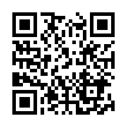

# 造形基礎演習I(小林ターム) <!-- omit in toc -->
> 5. エンドレスカード
<!--
1コマ目
情報デザイン
2コマ目
エンドレスカード
折り紙にするか、コピー用紙にするか...
両面テープにするか、ノリにするか...
-->

# はじめに
## クラス間違えてない？

学生証はカードリーダーにかざしてください。

新1年生以外の転科生・編入生は3クラスに所属してください。

Teams「2025_造形基礎演習」に所属していることを確認しましょう。所属していない場合には**0f0z80a**(0は全て数字のゼロです。)で入りましょう。

## 前々々々回の内容
### 折り紙・展開図
折り紙と展開図の関係について学んでみました。
### 平坦折り(ねじり折り)
折ると平面になる折り方ですが、
1. 正方形1個
2. 正方形2個
3. 正方形4個
4. 正方形が表裏になる
5. 難しいパターン...

にトライしてもらいました。

## 前々々回の内容
### 道具の利用法・紙の種類
- カッター/目打ち/タント紙

### タント紙を用いたねじり折
材質が変わると加工が変わることを体験しました。

### 立体を意識した平坦折り
シンメトリー的反復から
- 並進対称・鏡映対称・回転対称・映進対称

そして、ミウラ折りに挑戦してもらいました。

## 前々回の内容
### トンボ(トリムマーク)・中綴じ
- **トンボ(トリムマーク)** 主に印刷の分野で使用される目印
- **中綴じ** 印刷した用紙を重ねて二つ折りにして、折り目をホチキスまたは糸で留める製本方法

### 曲線折り
曲線で折ると紙が違う表情を見せます。
前回はレリーフにしてもらいました。

### 雲形定規
曲線を描くのに特化した定規でした。

## 前回の内容
### 切り込みを入れた立体表現
デザインカッターの使い方を学び、
自由に立体表現を行ってみました。

### ポップアップカード
よく考えないと「折りたためるポップアップカード」という仕様を満たしません。
設計という概念を学んでもらいました。

# 情報デザイン
> 昨年までは後期にやっていたのですが、なくなったので
> 少しだけ情報デザインのアプローチを紹介します。

## デザインとは
イラストなどグラフィックのことを思い浮かべるかもしれませんが、デザインの本質は

- 目的を持った行動であり、特定の問題を解決するための計画の事。
- 受け手に価値を提供することを意図した一連の意図的な行動の事。
- 単なる企画機能ではなく、何かに意味を与えること。

だからこそ、デザインのコンセプトは単一の分野を超え、ウェブ、モバイル、ソフトウェア、ファッション、インダストリアル、インテリアなどに多用・適用できるのです。
[参考：「デザイン」の本当の意味とは？](https://www.uxpin.com/studio/jp/blog-jp/%E3%80%8C%E7%9F%A5%E3%81%A3%E3%81%A6%E3%81%84%E3%81%9D%E3%81%86%E3%81%A7%E3%80%81%E7%9F%A5%E3%82%89%E3%81%AA%E3%81%84%E3%80%8D%E5%AE%9F%E9%9A%9B%E3%81%AE%E3%83%87%E3%82%B6%E3%82%A4%E3%83%B3%E3%81%AE/)

## 簡単にいうと？
**アート**は作者が思うように好きに作ればいいんだと思います。

**デザイン**は何らかの問題を解決するための計画、となります。

本コースの2年次以降の演習名に「デザイン」が多い理由は、このことが理由となります。
> 何かを解決するためにデザインする

この視点を養いたいと思います。

## 情報デザイン
情報デザイン演習ではHP,アプリなどいわゆるコンピュータをバリバリ使うトピックを扱っていますが、それは、手段です。

元々**情報デザイン**という分野は、コンピュータが発達する前の1800年代から始まっています。

コンピュータと親和性が高いために、コンピュータと一体に見えているだけということになります。

## 東京オリンピック1964 ピクトグラム
- [1964年をきっかけに世界へ広がった「ピクトグラム」](https://www.ssf.or.jp/ssf_eyes/history/interview/068.html?tab=sStory2)

東京オリンピックでは90カ国以上の人々が一気に押し寄せてくる。この時にわかりやすい案内とは？と考えられたのが「競技シンボル」「施設シンボル」のピクトグラムです。

これにより、言葉の問題を解決しました。
これも情報デザインといえます。

## マインドマップ
**マインドマップ**と呼ばれる手法があり、
> 頭の中で考えていることを脳内に近い形に描き出すことで、記憶の整理や発想をしやすくするもの

とされます。

これにトライしてみましょう。

## マインドマップの概要
表現したい概念の中心となるキーワードやイメージを中央に置き、そこから放射状にキーワードやイメージを広げ、つなげていく。思考を整理し、発想を豊かにし、記憶力を高めるために、想像 (imagination) と連想 (association) を用いて思考を展開する。この方法によって複雑な概念もコンパクトに表現でき、非常に早く理解できるとされる。

## マインドマップの例
どんなものか参考を見てみましょう。

- [マインドマップ サンプル 画像](https://www.google.com/search?sca_esv=563310982&rlz=1C5CHFA_enJP868JP868&sxsrf=AB5stBghAcxEDOiLAwQf89OUzxuz4Aq74A:1694066561114&q=%E3%83%9E%E3%82%A4%E3%83%B3%E3%83%89%E3%83%9E%E3%83%83%E3%83%97+%E3%82%B5%E3%83%B3%E3%83%97%E3%83%AB&tbm=isch&source=univ&fir=FZfvGUPdJE-cHM%252Cp0ZzLNjN17HaFM%252C_%253Be-MCmYaxrS1T5M%252Cp0ZzLNjN17HaFM%252C_%253BeoRahLjDdL7tfM%252C2IE_AAPxLgjLeM%252C_%253B7snedB7krYyC1M%252C2mfBtfsrKoTLfM%252C_%253BgxS4z3a_r-XjgM%252C6F8F1WDLl9IbkM%252C_%253Ba7rKnWM5tTh2JM%252CbY6iLkpKbybrzM%252C_%253B43oox1wKiQAftM%252CPO-8MoGPgSiBeM%252C_%253BCt_wedW4zsPg3M%252C2mfBtfsrKoTLfM%252C_%253B74QpkJf9dbAlWM%252CRhOwtWeusQAhCM%252C_%253ByHorrw2JZAiLVM%252CHGenBmp93_0P4M%252C_&usg=AI4_-kRHnuFJf-rQlgCW6WH1Fe87oZTirw&sa=X&ved=2ahUKEwjWh-fc6ZeBAxVpklYBHagyAFQQjJkEegQIGhAC&biw=1254&bih=938&dpr=2)

## マインドマップの書き方
- 無地の用紙を利用する
- 用紙は横長で利用する
- 用紙の中心にキーワード・メインテーマを書く
- メインテーマから関連するキーワードを木の枝が分岐するように線でつなげて追加
- さらに連想されるキーワードを繋げていく

マインドマップを提唱したトニー・ブザン氏は12のルールを設定していますが、今日はルールは厳密にせず、上記した点を考えながらやっていきましょう。

(元々の定義に沿わないものもマインドマップと一般的に呼ばれています)

## 課題1
> あなたの「紙」の概念をマインドマップに整理しよう。(9:50まで予定)

A3コピー用紙/サインペンを持っていこう

- A3は横長で利用
- 中心に「紙」をメインテーマとして書く
- メインテーマから関連するキーワードを木の枝が分岐するように線でつなげて追加
- さらに連想されるキーワードを繋げていく

演習で取り上げた内容にとらわれず
> あなたの頭の中にある「紙」に関連すること

を自由な発想で書き出してみましょう。

## 出欠1限
出欠取ります。

# ストーリー
## ストーリーの構成<!-- omit in toc -->
- 起承転結
- 三幕構成

などと呼ばれるフォーマットがあります。

物語の盛り上がり具合を時間軸に沿ってどう作るかを表します。

##  起承転結<!-- omit in toc -->

- 起：物語のスタート
- 承：事件が起きて物語が展開
- 転：クライマックス
- 結：物語の締めくくり

## 三幕構成<!-- omit in toc -->

- 第一幕(状況設定)
- 第二幕(葛藤)
- 第三幕(解決)

比率は1:2:1で、真ん中にミッドポイント(事件)が存在する。

## ビートシート<!-- omit in toc -->
三幕構成をもっと細分化したビートシート、というものもあります。

シナリオ演習(2年)で扱うと思いますが、興味ある人は

- [Save The Cat](http://filmart.co.jp/books/playbook_tech/2010-10-4mon/)

を読んでみるといいと思います。

## 課題2 エンドレスカード
> ループする起承転結の構成をエンドレスカードを用いて表現してみよう

1. マインドマップを使ってアイディア出し(10:30予定)
2. エンドレスカードの制作(11:10予定)

エンドレスカードの制作自体は難しくありません。
アイディアを出して、記号・文章・絵などを用いて自由に表現してみましょう。

## エンドレスカードとは?
- [DIY Endless Card](https://www.youtube.com/watch?v=NVXzxUyZDEc)

無限に開くことができる、折り紙を使ったカードです。
4つの状態をループさせることができます。

## 持っていくもの
TODO:折り紙/コピー用紙?, のり/両面テープ?
- カッターマット
- カッター
- 定規
- 折り紙
- 両面テープ
- 必要であればコピー用紙・サインペン

## 課題2 エンドレスカード
> ループする起承転結の構成をエンドレスカードを用いて表現してみよう

1. マインドマップを使ってアイディア出し(10:30予定)
2. エンドレスカードの制作(11:10予定)

エンドレスカードの制作自体は難しくありません。
アイディアを出して、記号・文章・絵などを用いて自由に表現してみましょう。

## 出欠2限
遅れてきた人確認取ります。
SAさんは、展示の準備お願いします。

## 提出
1. manabaのレポートから以下の内容で提出してください。

> 今日作業した内容をスマホで撮影して、ファイル送信してください。
>
> 複数枚になっても構いません。

2. エンドレスカードは回収します。

## 片付け
カッターはしっかり刃を納めましょう。
目打ち・デザインカッターは、キャップをしましょう。

指定された場所に戻してください。

## まとめ
自分は「造形デザイン」の先生ではなく、非常にこの課題作るの悩みました。
ですが、紙の世界を知るとともに、自分でも面白い！奥が深い！と感じました。

紙を利用した工学系の課題も考えたのですが、「造形基礎演習」なので、
あきらめました。造形の課題にしてわりとうまくいったかな、と思っています。

最後の回では「情報デザイン」の導入も入れてみました。

## アイディア出し
これから、様々な課題に取り組む時に
- アイディア出し

の時間があります。

苦手な人は思考停止しがちなのですが、今日使った「マインドマップ」を利用して、
頭の中からアイディアを出す、ということにも慣れていきましょう。

## どう生きてく？
高校生までは
> 正解があることを正しく答えられること
 
が主に求められてきたかと思います。
ですが、今後は

> 正解がないことに対して、どう考え、どう整理し、どう形にするか

がより多く求められていきます。
(もちろん、基礎知識・基礎技術は必要です)

## HPについて
自分は、授業の資料をHPにて公開しています。(学外からも参照可能)

https://sammyppr.github.io/

2,3年次の内容なども公開しているので、興味ある人は自由にみて構いません。
特に、3Dに興味ある人は、3年次まで授業がありませんので「メディア表現V」を参考にしてください。

## 上原(ワークショップ宣伝)

## 他クラス鑑賞
503の奥側にレリーフ・切り込みを入れた立体表現を展示してます。
気になる人は、自分の作品の向きなど直してください。

これから5階に移動します。

- 11:35〜 503の加瀬先生クラスの作品鑑賞
- 11:45〜 504の新田先生クラスの作品鑑賞等

現場解散となります。荷物を持っていきましょう。
お疲れ様でした。

