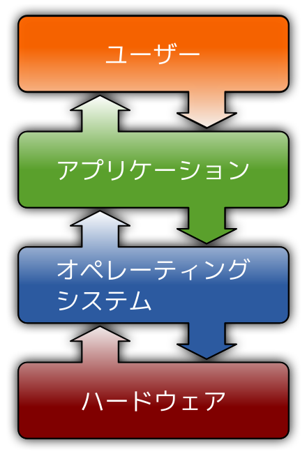

# インターネット基礎理論 03<br>コンピュータ基礎理論2　ソフトウェア

## はじめに
### 資料置き場

https://sammyppr.github.io

に授業資料を置いていきます。復習に使ってください。

欠席した場合などはスライドを確認して追いつくようにしましょう。

> スライドあるなら授業受けなくていいや

なんてことは思わないようにお願いします。

### コンピュータ基礎理論
インターネットは複数のコンピュータによって形成されています。
よって、まずコンピュータのことについて学びましょう。

本日はその2回目です。

- 【第２回】コンピュータ基礎理論１　ハードウェア
コンピュータをハードウェアの視点から学修する。

- 【第３回】コンピュータ基礎理論２　ソフトウェア
コンピュータをソフトウェアの視点から学修する。

- 【第４回】コンピュータ基礎理論３　基本的なロジック
コンピュータが動作する上での基本的なロジックについて学修する。


## 前回のおさらい
- コンピュータには「ハードウェア」「ソフトウェア」の 2つの側面がある
- 情報は ON/OFF にて扱っていること。この情報量を 1bit と呼ぶ
- 1byte=8bit であること
- 2 進法・16 進法
- ハードウェアは「プロセッサ+メモリ+I/O」とそれを繋ぐ「バス」 からできている
- プロセッサは人間でいえば脳・メモリは記憶するところ・I/O は入出力装置


## ソフトウェアとは
### 有名な川柳
前回紹介した
```
コンピュータ、ソフトなければ、ただの箱
```

この「ソフト」に当たるものがソフトウェアと呼ばれるものです。

### 「コンピュータ」「ただの箱」
- コンピュータ
- ただの箱

この違いは何でしょうか

### ソフトウェアの位置付け
前回
> CPU はプログラムと呼ばれる命令を順に読んで解釈・実行することで情報の加工を行います。

と説明しました。逆に言うと**命令**がないと何もできません。

この「CPUを動かす命令」のことが**ソフトウェア**と呼ばれるものになります。

### 簡単に言うと
- ゲーム機器はソフトがなければただの箱ですね
- CD/DVDプレイヤーはソフトがなければただの箱ですね

ちょっと紛らわしいですが
- CD,DVD 等に入っている音楽・映像などの情報自体

のことを「コンテンツ」とも言います。

### ハードウェア・ソフトウェア・コンテンツ
- ハードウェアはソフトウェアがなければ動作しない
- プログラム (ハードウェアを動かす命令) はデータがなければ動作しない
- データ自体がコンテンツであり、その意味でソフトウェアといわれる

これらの切り分けは厳密にされているものではなく、何となく異なる、くらいの理解でいいと思います。

## ソフトウェアの分類
### ソフトウェアの分類
ソフトウェアは大きく分けると次の二つに分かれます。
- OS(オペレーティングシステム)
- アプリケーション

### ソフトウェアの階層図


図の「アプリケーション」「オペレーティングシステム」がソフトウェアであり、一般的に次のことが言われています。

- OS は直接ハードウェアと相互に作用する
- アプリケーションは OS と相互に作用する
- ユーザはアプリケーションと相互に作用する

[画像引用元](https://ja.wikipedia.org/wiki/%E3%82%BD%E3%83%95%E3%83%88%E3%82%A6%E3%82%A7%E3%82%A2)

### 本当？


ユーザはマウス・タッチパッド・キーボード等の入力装置に情報を出して、ディスプレイ・スピーカ等の出力装置から情報を得ていますよね？

黒板で図解してみます。

あまりに複雑になるためこのように概念的に整理されているだけです。

## OS
### OSとは？
>  **OS** Operating System

- **operate** 操作する
- **system** システム(日本語では系ともいう)

操作するシステムとは何でしょう？

### OSは司令塔
> OS は直接ハードウェアと相互に作用する

と言いましたが、

- キーボード入力や画面出力といった入出力機能
- ディスク・メモリの管理
- 何をどの順番で処理すべきかなどのコントロール

これらをつかさどる司令塔の役割を持っています。

OSのおかげで後述するアプリケーションは、その独自機能に特化して開発することが可能になります。

### OSの種類
一般の人によく知られているOSには
- Windows
- macOS

があり、インターネットの世界では
- Linux

も非常によく利用されています。

### スマートフォン・タブレットのOSの種類
スマートフォンでは
- iOS
- Android

が利用され、タブレットでは
- iPadOS
- Android
- Windows

が利用されています。

### OSのシェア率
- [OSのシェア率ランキング](https://www.qbook.jp/column/1593.html)

- [日本とグローバルのスマホOSシェア](https://shiftasia.com/ja/column/2023%E5%B9%B48%E6%9C%88%E3%82%B9%E3%83%9E%E3%83%BC%E3%83%88%E3%83%95%E3%82%A9%E3%83%B3os%E3%82%B7%E3%82%A7%E3%82%A2/)

スマートフォンOSのシェアは日本と海外で大きく変わることは興味深いですね。

## OSの役割
### OSの役割
少し踏み込みます。OSの主な役割として

- ハードウェアの抽象化
- リソースの管理
- コンピュータの利用効率の向上

があげられます。

### OSの役割：ハードウェアの抽象化
いろいろなメーカーがコンピュータを開発しています。
部品は多種多様に存在し、それらのことを考えて全てに対応するようにプログラムを開発するのは非常に困難なことです。
そのため、どのような部品が存在しても、その違いを意識しないで利用できるようなことが求められます。

これが
> ハードウェアの抽象化

ということになります。

### ハードウェアの抽象化がされていなかった場合
アプリケーション開発者は、
- キーボードから入力する
- 入力された文字を表示する

という基本的な動作についても、キーボードの数だけ莫大な量のプログラムを書かなくてはいけません。

ですが、OSがハードウェアの抽象化をしているために
- キーボードから何か入力されたら教えて

とOSに頼めば良くなります。

### OSの役割：リソースの管理
**リソース**とは、コンピュータで利用できる「資源」であり、
- メモリ容量
- ハードディスク
- プリンタ

などのことを指します。

例えば、プリンタに対して、A というアプリケーションと B というアプリケーションが同時に印刷したい、という命令を発行した時に、どちらか片方の印刷が終了するのを待ってから、次の印刷を開始する必要があります。

これが
> リソースの管理

となります。


### OSの役割：コンピュータの利用効率の向上
複数のタスク (CPU にとっての仕事) を同時に実行する際に、資源割り 当ての順番や処理の割り当て時間を工夫することで、全体の効率をあげることができます。

### 利用効率の向上の例
A,B という 2 つの仕事があるとします。通常は、順番に A,B と仕事をこなせばその仕事を終了することが可能となります。

今16:00だとして
- A:18:00に配達される荷物を受取る
- B:夕飯の支度をする

というタスクがあった時に、B,Aと仕事をしたほうが良いですよね？

OS もどのようにすればより効率的にタスクを終了できるか、ということを管理しているのです。

### OSのその他の機能
キーワードとしては、
- API(アプリケーション・プログラミング・インターフェイス) の 提供
- 仮想記憶
- マルチタスク
- ディスクアクセスとファイルシステム
- ネットワーク
- セキュリティ
- ユーザーインターフェース

等が挙げられます。簡単に口頭で説明するにとどめます。

## アプリケーション
### アプリケーションとは
> コンピュータの利用者がコンピュータ上で実行したい作業を実施する機能を直接的に実現するソフトウェア

と定義できます。

「アプリ」などと略されて呼ばれることも多いです。

### アプリケーションの種類
- 事務系：ワードプロセッサ・表計算ソフト・データベース
- 企業系：財務管理・顧客管理
- 出版系：DTP(Desktop Publishing)
- コンテンツアクセス系：ウェブブラウザ・メディアプレーヤー
- エンターテイメント系：ゲーム
- コンテンツ開発系：3DCG・アニメーション・画像編集 (ペイント・ドロー)・映像編集・音楽編集
- エンジニアリング系：CAD・エディタ・コンパイラ・IDE
- コミュニケーション系：メール・チャット

色々ありすぎて網羅は不可能だったりします。

### アプリケーションはなぜ開発される？
> 人がコンピュータにやらせたい

という欲求があるだけアプリケーションは増えていくので、ここで挙げなかったたくさんの種類のアプリケーションが存在します。

最近ではAIのキーワードは外せませんね。

### アプリケーション操作の習得について
様々なアプリケーションを利用することで、いろいろなことができますが、

> 人間がやりたいことをアシストするためにさまざまなアプリケーションが存在する

と捉えて欲しいです。
使えるアプリケーションが増えれば、いわば、使える魔法が増えるようなものです。

魔法は増やすことが目的でなく、使えるようになることが目的です。

### コンピュータの得意なこと
コンピュータにとって単純作業は非常に得意な処理です。
人間と異なり、ミスもおこしません。

ですから、コンピュータが得意な作業はコンピュータにやらせるべきです。

### どのアプリケーションが良いか？
> 自分のしたいことをするのに、
本当にこのアプリケーションで作業するのが適切か?

ということを、常に意識してコンピュータと接しましょう。

写真を撮るスマホのアプリはいろいろあります。
ですが、加工目的で他のアプリを使っている人も多いのではないでしょうか。

### 本当にOfficeがいいの？
社会に出るとMicrosoft Officeを多く使っているのは確かです。

ですが、同じようなことをできるアプリケーション・サービスは
- [ONLYOFFICE](https://www.onlyoffice.com/ja/desktop.aspx?utm_source=note&utm_medium=article&utm_campaign=ms_alt_students)
- [Google Docs](https://www.google.com/intl/ja_jp/docs/about/)
- [LibreOffice](https://ja.libreoffice.org/)
- [iWork](https://www.apple.com/jp/iwork/)

などいくらでも存在しています。無料のものもあります。

## オープンソース
### オープンソースソフトウェア
オープンソース(Open Source)とは、ソースコードを無償で公開、再使用、改変、再配布することが可能なソフトウェアを示しています。

特にインターネットの世界では広く利用されています。

[OSS (オープンソース）とは？メリットやデメリット、特徴、意味や基本知識等をわかりやすく解説](https://circleci.com/ja/blog/what-is-oss/)

### オープンソースソフトウェアの探し方
例えばPhotoshopのような画像編集ソフトのオープンソースを探したい場合には

> photoshop オープンソース

でググってみましょう。
簡単に以下のようなサイトが見つかります。

- [無料オープンソースの画像編集ソフトウェア おすすめ11選を徹底解説！](https://notepm.jp/blog/21318)

### オープンソースでなくても...
無料で利用できるアプリケーションもたくさんあります。

色々調べて、便利に使いこなしましょう。

## Webアプリケーション
### Webアプリケーション
アプリケーションの利用には基本的にはコンピュータへのインストールが必須でしたが、最近では「Webアプリケーション」と呼ばれるものもたくさんあります。

ブラウザ上で様々な機能を利用できます。

逆に言えば、どのコンピュータからでも同じ環境を利用できる、と言うことも意味します。

色々調べてみましょう。

## AI
### AIの簡単な歴史
2022から続々とリリースされてきている生成系AI。
日々進化が止まりません。

アプリケーションの利用方法が大きく変化してきています。

ここでは、簡単にAIの歴史についても触れておこうと思います。

### チェス
IBM が 1989 年から開発した 
> Deep Blue

というコンピュータが、1996 年にチェスの世界チャンピオンを破りました。

この頃は
> 1秒間に2億手の先読みを行い、効果があると思われる手筋全てを洗い出す

と言う手法で、人間の能力を超えていました。

### 将棋
将棋はチェスト比較すると、取った駒をもう一度利用できるため、洗い出すのは非常に難しいとされていました。

2005年頃から将棋にもAIが登場し、
> 2016〜17年には、初のタイトルホルダー対AIの対決が実現。佐藤天彦名人（当時）が2連敗を喫したことで、「人類に将棋で勝つAIを開発する」という目標は現実のものとなり、コンピューターと人間の対戦の歴史は幕を閉じた。
[“人知を超えた将棋AI“ 将棋界に学ぶ人とAIの共存の未来](https://www.tryeting.jp/column/6580/)

### Deep Learning


「Googleの猫」と呼ばれる技術が2012年に
> Googleの研究開発によってコンピュータが猫を認識できるようになった

と大きなニュースとなりました。
人間が猫がどういうものであるか教えることなくAIが自力で理解した、というのです。

[Using large-scale brain simulations for machine learning and A.I.](https://blog.google/technology/ai/using-large-scale-brain-simulations-for/)

### 生成系AI
2022になると、生成系AIが大きなインパクトを社会に与えます。

[生成AI（ジェネレーティブAI）とは？](https://www.youtube.com/watch?v=ucsQ0PNN6xI)

### AIの進化
個人的な感想ですが、
- インターネットによる社会変革
- AIによる社会変革

どちらも大きなものですが、後者の進歩が本当に早いと思っています。

これらの進化により、アプリケーションの操作方法なども変わってきています。

時代に追いついていきましょう。

### 小レポート


ハードウェアとソフトウェアの違いについて簡単に述べよ。
[提出先](https://forms.office.com/r/ENsXBAXEE3)

