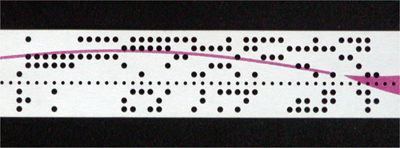
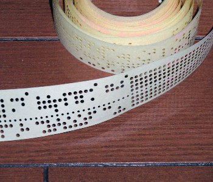
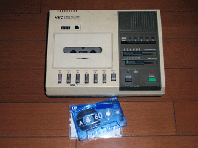
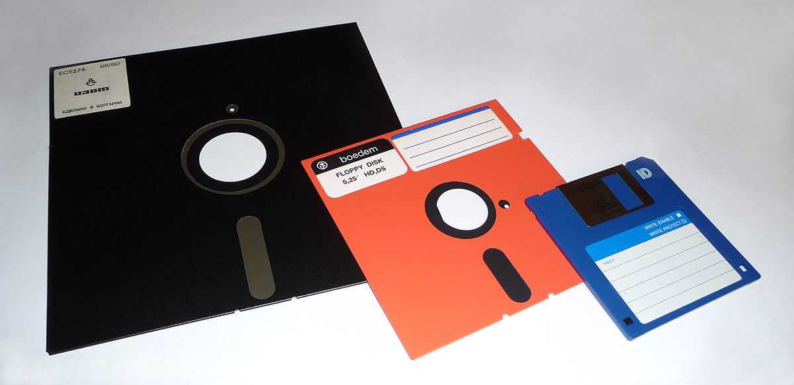
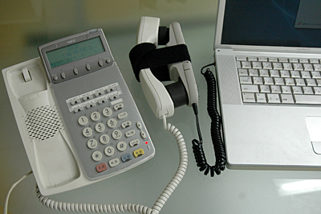
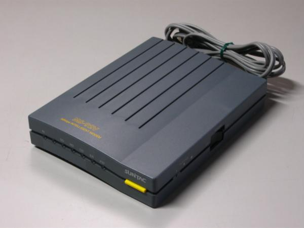

# インターネット基礎理論 05<br>インターネットの歴史

## はじめに
### 資料置き場

https://sammyppr.github.io

に授業資料を置いていきます。復習に使ってください。

欠席した場合などはスライドを確認して追いつくようにしましょう。

> スライドあるなら授業受けなくていいや

なんてことは思わないようにお願いします。

### コンピュータ基礎理論
これまで３回コンピュータの基礎(ハードウェア・ソフトウェア・仕組み)について話をしてきましたが、

これから、ようやくインターネットをトピックとして扱っていきます。

今日はインターネットの歴史について学んでいきましょう。

## ネットワーク
### ネットワーク
ネットワークとは、

```
通信・放送・輸送などに関し、連絡を保って網状になっている構成
```
という定義になります。

これらについてどのように発展してきたかみてみましょう。

### コンピュータどうしのコミュニケーション 1対1
コンピュータが発達するにつれ、コンピュータと周辺機器のコミュニケーションはとれるようになりました。

そして、その環境が充実してくると、次にはコンピュータどうしでデータのやり取りをできたらいいよね！という話になります。

記録媒体(紙テープ、フロッピーディスク等)によるデータのやり取りはできたのですが、直接記録媒体を介せずにやり取りする方法が模索されるようになりました。

### 記録媒体：紙テープ



### 記録媒体：テープレコーダー(磁気テープ)


### 記録媒体：フロッピーディスク


### コンピュータどうしのコミュニケーション 複数台
これがうまくいくと、次は、複数台を接続することについて研究されるようになりました。

3台、4台……と増えていくうちに、いろいろなタイプが開発されました。

### ネットワーク
ネットワークとは
```
複数のコンピューターを接続して、相互に通信できるようにした状態
```
ということができます。

### どのようにつなげるべきか？
接続・通信を研究するうちに、
- どのようにつなげるか？
- どうやりとりするか？

ということが模索されていきます。

### ネットワーク・トポロジー
ネットワーク・トポロジーとは
```
コンピュータネットワークの接続形態
```
のことを指します。

### トポロジー？
トポロジーとは「やわらかい幾何学」と知られる新しい幾何学の分野で、直訳すれば「位置の研究・学問」となります。

その中でネットワーク・トポロジーとはコンピュータ・ネットワークのトポロジーをさし、具体的にはコンピュータやネットワーク機器をさす「頂点」とネットワークの経路である「枝」との相関をダイアグラムで抽象化した概念のことです。

**全く意味わかりませんよね。**

平たく言えば、コンピュータをどう繋ぐか、ということです。

### ネットワーク・トポロジー　タイプ
基本的なものとしては
- リング型
- スター型
- バス型

の３種があり、そのほかに

- メッシュ型
- フルコネクト形
- ツリー型
- ライン型

と呼ばれるもの等があります。

### ネットワーク・トポロジー　タイプ


### ネットワーク・トポロジー　違い
様々な種類が開発された理由はなんでしょうか？

- より効率的な手段の模索
- トラブルに耐えられる手段の模索

が主な理由かと思われます。

この２つはある意味相反する立場にあります。

そのため、利用される場所等によって、どのタイプを使うか、ということが使い分けされたりもしました。

### 冗長化・冗長性とは？
コンピュータの世界ではしばし、
```
冗長化・冗長性
```
という言葉が利用されます。

- **冗長化** 必要な情報以上に情報を付加すること
- **冗長性** 冗長化によって得られる安全性

キーワード：チェックサム・RAID等

### 冗長化の例：RAID


### ネットワーク・トポロジにおける冗長性
ネットワークに関しては、効率だけではなく、安全性が必要とされるために冗長化による安全性も重要な要素となってきます。

### 大規模なネットワーク
これまで説明したトポロジーは基本的なものであり、
より大規模になった場合には、これらを組み合わせて利用します。

その規模が人類史上最高に大きくなったのが

```
インターネット
```
といえます。

## インターネット

### インターネットとは？
インターネットとは、
```
複数のネットワークを組み合わせた地球規模のネットワーク
```
といえるでしょう。


### どのように開発が進んだか
当初、いろいろな大学、企業などがネットワークの技術について開発を競っていました。

そして、

```
「うちの技術が素晴らしいから是非使ってください」
```

とやっている間に何がおこったでしょうか。

### どのように開発が進んだか
コンピュータどうしが、いろいろな技術によってコネクトされたネットワークが様々なところにでき、それらは相互に互換性がないため、お互いにコミュニケーションができない、という問題が起きたのです。


人間どうしでも、言語が違う人どうしはコミュニケーションをとることができません。
そこで、世界中のあらゆる人が簡単に学ぶことができる、というエスペラント語が開発されたりしました。

これは、結局失敗に終わり、たかだか全世界で100万人程度にしか普及しませんでしたが、コンピュータ・ネットワークの世界では違いました。

### そもそもインターネットの語源は？
インターネットという言葉が定着していますが、

- **インター** 間
- **ネットワーク** 通信網

の言葉を付けて作られた言葉です。すなわち

```
ネットワークの間
```

という意味です。

### インターネットとは？
話をもとに戻すと、いろいろなネットワークが乱立した中で、その内部ではどのように会話をしても構わないが、外のネットワークと話をするときには

```
みんなが話せる言葉を使おう
```


ということが決められ、インターネットが始まります。

### インターネット・プロトコル
そして、この「ネットワークでの共通の言葉」のことを

```
インターネット・プロトコル
```

と呼びます。英語では

```
Internet Protocol (IP)
```

と呼びます。

### インターネットの概念の提唱
そして、IPを補完するTCPとともに、1982年TCP/IPが標準化されたことでインターネットが本格始動したといっていいでしょう。

- **IP** 目的地までデータを運ぶ
- **TCP** データが正しく揃っているか確認する

の２つによって、うまくデータのやりとりができるようになります。(次回以降詳しくみていきます。)

### ちょっと前後しますが
インターネットの標準化されるまでには、様々な試みがありました。

1969年初めてインターネットの母体となるネットワークが稼働し始めます。

アメリカの大学や研究所4箇所を結んだARPANETというのものが存在しました。

これを母体に様々なネットワークが接続されていくことになります。

### ARPAとは？
ARPAは米国防総省の研究・開発部門でした。

そこが母体となってARPANETは開発されましたが、十分に研究状態から、稼動状態にあると判断されたことから、1975年にアメリカ国防情報システム局が運営を引き継ぎます。


### 営利目的に利用できるまで
つまり、当初は軍での利用目的のために開発が行われたということになります（研究者の意図は別かもしれない...）。

それが、まず教育機関に門戸が開かれ、その後1980年代末になると営利目的のインターネットサービスプロバイダ(ISP)が登場し始め、1995年にはインターネットの商業化が完了しました。

### 自分の体験
自分は、1988年に大学に入学し、1992年に大学を卒業しました。

当時、大学ではインターネットを利用できましたが、学外では基本的に利用できませんでした。

### パソコン通信サービス
パソコン通信サービス

日本ではパソコン通信サービスと呼ばれるNIFTY-Serveが1987年にスタートし、今日のようなインターネットとはかけ離れた状態で通信をしている状態でした。

この間も見せたような...
[懐かしのNIFTY-Serve （パソコン・ワープロ通信）25周年記念](https://www.youtube.com/watch?v=mwunp-uavU8)

### NIFTY-Serveの仕組み
基本的には
1. 大きなコンピュータが中心にあり
2. そこにモデムと呼ばれる電話回線とコンピュータを接続される機器があり
3. 家のコンピュータから電話回線を使ってモデムを介してネットワークに接続する

という仕組みでした。

### 音響カプラ


### アナログモデム1


### アナログモデム2

USBもまだない時代...接続にはごついRS-232Cというケーブルを利用していました...

### 自分の体験
大学に家から接続することは一応可能でしたが、NIFTY-Serverの仕組みと同じように
```
電話回線を利用して接続する
```
ということで、電話代が非常にかかるため、実用的とはまるで言えないものでした。14400bps...(今、wifiでも30Mbpsとか...)

### 自分の体験
その後、1993年にアメリカに留学した時もアメリカでインターネットを利用している人はいなく、寂しい思いをしたのを覚えています。

日本に帰ってきて少したった頃、1994年12月、日本でも個人としてインターネットに参加できるサービスが開始されました。

[ベッコアメ wiki](https://ja.wikipedia.org/wiki/%E3%83%99%E3%83%83%E3%82%B3%E3%82%A2%E3%83%A1%E3%83%BB%E3%82%A4%E3%83%B3%E3%82%BF%E3%83%BC%E3%83%8D%E3%83%83%E3%83%88)


## インターネット上のサービス
### インターネットといえば？
インターネットといえば、真っ先にみなさん何を思い浮かべますか？たぶん

```
web(homepage)
```
だと思います。

信じられないでしょうが、大学にいた頃にはwebは産まれたてほやほやで、まだまるで普及していなかったのです。

## じゃ、何に使ってたの？
大学生の当時、インターネットを利用するといえば、
- **mail** これは今でも利用されてますね。
- **news(usenet)** これは、現在でも一応存在しますが、ほぼ利用されていません。

[SNSの元祖「Usenet」--その隆盛と衰退を振り返る](https://japan.cnet.com/article/35213054/)

nntpというプロトコルにより実装されていたusenetは巨大な掲示板として存在していました。

その内容は、教育的なものから、趣味に至るまで多岐に渡っていましたが、時代柄、特に日本では教育機関関係者しかいない、というものでした。

当時１回だけオフ会というものに参加したことがありますが、Rock関係のスレッドのオフ会にも関わらず、外見は皆様とっても固い人が多く、もう二度とオフ会に行くものか、と思ったのを思い出します。

### 他にも…
他にもgopherという情報検索システムが存在しましたが、自分はあまり使ってなかったですし、今はほぼ消え去ったといえるでしょう。
[Gopher wiki](https://ja.wikipedia.org/wiki/Gopher)

FTPは今でも利用しています。
```
FTP: File Transfer Protocol
```
の略でファイルの転送に利用されています。

みなさんは宅ふぁいる便等を利用しているかもしれませんが、インターネットを支える技術として現在でもしっかり利用されています。

### インターネット上での情報のやりとりについて
このように、「便利かな？」と思っても、その後新しい方法ができると淘汰されていく、ということが普通に行われてきました。これは、基本技術についてもいえるでしょう。

### インターネットで利用できる技術的な方法
まとめておきます。
- **web** ハイパーリンクを利用して情報を共有するもの
- **mail** メール送受信用のもの
- **ftp** ファイル転送用のもの

定義はアバウトにしておきます。詳しくは次回以降

ほぼほぼ、全てのサービスがweb上に集約されているのが実態といえるでしょう。技術的には異なりますが、メールやファイル転送もwebを利用すると可能ですよね。

### というと…
これらの事実から考えると、インターネットの短い歴史の中でも、webの技術はどれだけのインパクトを持ったものかがお分かりいただけるかと思います。

webの何が素晴らしかったのでしょうか？

### Webが革新的だったこと
それまでの技術として
- ハイパーテキスト
- インターネット

という技術は存在していました。このふたつの技術の結合こそがWorld Wide Webだったのです。

- 誰でも自由にサーバやクライアントを拡張できること
- 双方向でなく、単方向のリンクを利用すること

がそれまでの技術と異なる重要なポイントとなります。

### HyperCard
ハイパーテキストという技術を広く広めたHyperCardというアプリケーションがあります。

[https://hypercard.org/](http://hypercard.org/)

少し覗いてみましょう。

### 情報と情報をつなぐハイパーテキスト
HyperCardは一つのコンピュータ内で情報と情報をつなぐことが衝撃的な技術でした。

これが、インターネットにwebとして展開されると、コンピュータをまたいで情報をつなぐことができるようになします。

### さらに…
さらに、文字や画像、映像を扱える以外に javascriptというクライアント側で動作する言語を利用することができるようなりました。

さらに、プラグインを利用し、様々なことに対応することができるようになりました。

さらに、DOM(Document Object Model)とjavascriptを組み合わせることで、様々なことができるようになりました。

### 今日では
Webの他にも(という言い方は一部語弊がありますが…)ビデオチャットや、SNS等で多くインターネットが活用されているのはご存知のとおりです。

Webを支えるHTMLも「HTML5」という仕様が確定したために、ただの情報を表示するものから
```
Webアプリケーション
```
としての利用が加速しています。

詳細は別で紹介しますが、現在使われているのはHTML Living Standardと呼ぶのが正しいです。

### History Of Internet
英語なのですが、8分ほどの映像に歴史がまとまっています。ちょっとみてみましょう。

[History of Internet](https://www.youtube.com/watch?v=9hIQjrMHTv4)

### インターネットの歴史--50の主要な出来事
CNET Japanに「インターネットの歴史--50の主要な出来事」という記事がまとまっています。覗いてみましょう。

[インターネットの歴史--50の主要な出来事](http://japan.cnet.com/sp/internet-history/)

### Yahoo! JAPANによるインターネットの歴史
https://history-of-the-internet.yahoo.co.jp/

これは、細かすぎて全部は説明できない....ちょっとみてみましょう。

### 時間が余ったら
- 電話回線 モデム,ADSL,ISDN,テレホーダイ
- IPv6 $2^{128}$ IPv4 $2^{32}$
- ブラウザの歴史 mosaic nn ie firefox safari chrome
- コンテンツの変遷 web2.0
- LAN, WAN

### 小レポート
あなたがこれまで使ってきた記録メディアを列挙し、特徴を述べよ。
また、人とデータを共有する時に今はどのようにしているか述べよ。

例. MD, USB, SD-Card, CD-ROM
