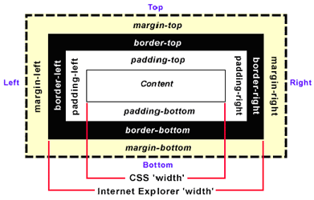

# インターネット基礎理論 09<br>CSS・JavaScript

## はじめに
### 資料置き場

https://sammyppr.github.io

に授業資料を置いていきます。復習に使ってください。

欠席した場合などはスライドを確認して追いつくようにしましょう。

> スライドあるなら授業受けなくていいや

なんてことは思わないようにお願いします。

### 今日すること

前回XML,HTMLについて説明しました。
第9回目の今日は、HTMLで作られたホームページを装飾するためのCSSについて説明します。

なお、シラバスではJavascriptも記載されていますが、次回とします。

### HTMLのおさらい

HTMLでは **文章を構造として記述する** ということを学びました。

しかし、今日のホームページを実装するには欠けている機能が2つあります。

- 装飾機能(CSS)
- インタラクティブな機能(JavaScript)

今日は装飾機能について説明します。

### 今日の流れ
- CSSの書き方
- ボックスモデル
- 段組レイアウト
- CSSの記載箇所
- ブラウザによる差異etc

## CSS

### 今日の講義

今日は、「知識を学ぶ」というより、「こういう風につくられているんだ」ということを理解してくれればOKです。

### CSSとは

CSSとは、 **Cascading Style Sheet** のことで、日本語では

- **Cascading** 連鎖した
- **Style Sheet** 表示や印刷の書式を指定したファイル

となります。

例えば、bodyタグでフォントの種類を設定した場合、そのフォントが指定し直さない限り全てのタグで有効になります。
また、読み込みの最後で定義されたものが有効になります。

### 装飾箇所の指定の仕方1

前回HTMLにはタグがあることを学びました。
ですから、そのタグ全てに装飾するやり方があります。

例えばh2の全てについて装飾するというやり方です。

```css
h2 {
  font-size: 12px;
}
```

これで、全てのh2について、フォントサイズが12pxとなります。

### 装飾箇所の指定の仕方2

それでは、タグの一部分について装飾する場合は、どうしたらよいでしょうか？

```html
<h1>中野キャンパス</h1>
<h2>学部紹介</h2>
<h2>教員紹介</h2>

<h1>池袋キャンパス</h1>
<h2>学部紹介</h2>
<h2>教員紹介</h2>
```

という文書構造があった時に、中野と池袋でそれぞれテーマカラーを変えたいとします。

### 装飾箇所の指定の仕方3

そのような場合には、

```html
<h1 class="nakano">中野キャンパス</h1>
<h2 class="nakano">学部紹介</h2>
<h2 class="nakano">教員紹介</h2>

<h1 class="ikebukuro">池袋キャンパス</h1>
<h2 class="ikebukuro">学部紹介</h2>
<h2 class="ikebukuro">教員紹介</h2>
```

として、html側で「class」を定義しておきます。

### 装飾箇所の指定の仕方4

これに応じるようにCSSとして、

```css
.nakano {
    color: red;
}
.ikebukuro {
    color: blue;
}
```

と記述すると、該当箇所の色が変更されます。

### 装飾箇所の指定の仕方5

特定の1箇所に指定したいときもあります。  
その場合はhtml側で「id」を定義しておきます。

```html
<h1 id="nakanoheader">中野キャンパス</h1>
```

となります。そして、cssは

```css
#nakanoheader {
    color: yellow;
}
```

の様になります。

### 装飾箇所の指定の仕方6

ん？何が違うんだ？と思った人いますか？
まとめると

- **class**: 種別名を割り当てる
- **id**: 固有の名前を割り当てる

ということになり、もう少し違いを明確にすると

- **class**: 同じclass名を1ページ中に何度でも使える
- **id**: 同じid名は1ページ中に一度しか使えない

ということになります。

### CSSの書き方

これまで少しcssの実例をあげて来ましたが、汎用的な書き方は

```css
    セレクタ{プロパティ:値;}
```

という形式になります。  
プロパティと値のセットは以下のように複数持てます。

```css
セレクタ{
    プロパティ:値;
    プロパティ:値;
    …
}
```

### プロパティ

プロパティはたくさんありますが、ざっと紹介します。  
「CSS プロパティ」でググってみましょう。

ちなみに、全部覚えていられるわけもなく、エディタの支援機能に頼ったり、調べながら作成することが多いです。

覚えるのではなく、何ができるか、を理解することが重要です。

## ボックスモデル

### ボックスモデル
CSSでレイアウトする上において、余白の扱いについてボックスモデルという考え方を取ります。

Webブラウザで見てみましょう。たいていどのブラウザにもついていますが、Webインスペクタ・デベロッパーツール等と呼ばれるものを利用してみましょう。
- **Chrome** 表示-開発/管理-デベロッパーツール

Safariの人は、「Safari - 設定 - 詳細」にて、「Webデベロッパ用の機能を表示」にチェックをしてから、「開発-Webインスペクタを表示」としましょう。

CSSの連鎖が起きている様子も確認できます。

### レイアウトをする上で非常に重要

HTMLを記述しただけでは、Illustratorのように自由にレイアウトをすることはできません。

HTML要素を固まりとして、どのように配置するかを決めるのも、ホームページを利用する上でCSSの非常に重要な役割となっています。

### Illustratorでの考え方

Illustratorでは
1. オブジェクトを作る(パス・文字・図)
2. グループ化
3. グループ化されたオブジェクトをドラッグにより配置

という流れになります。

### HTML, CSSでの考え方

1. HTML要素を作る
2. グループ化(divタグ等)
3. グループ化されたHTML要素をCSSにより配置

という流れになります。

### それぞれのメリット・デメリット

直感的なマウス操作を利用しないため、少しハードルが高いかもしれませんが、明確なメリットがあります。

Illustratorで10ページ同じフォーマットで文書を作成するには、コピーして内容を変更すればよいですが、後からフォーマットを変えたくなったらどうしますか？

全部作り直しです。これがHTMLではCSSを修正すれば全てのページが同じフォーマットに瞬時に反映されます。


あ、嘘言った...文字スタイル・段落スタイルってのがここ数年で使えるらしいけど...
- [ベテランほど知らずに損してるIllustratorの新常識（9）3つの「スタイル」を使い分けて効率アップ。修正時の更新もラクラク](https://blog.adobe.com/jp/publish/2018/03/26/dtp-illustrator-kihon-tips-09)

### ボックスモデル

CSSにおいては、すべての要素はその周囲を取り囲む長方形のボックスを持つと考えます。  
その枠や様々なプロパティを与えているいろいろなスタイルを実現します。
- **margin** ボックスのまわりの余白
- **padding** ボックスの中の余白
- **border** 枠

という概念は非常に重要です。実際にみてみましょう。

### ボックスモデルの図解

- [【CSS】box-sizingの意味は？スマホ対応に必須の理由を解説](https://zero-plus.io/media/box-sizing/)
<!--

-->


## 段組レイアウト
### レイアウト
これまで、HTMLで記述すると全て縦に並んでしまいました。
レイアウトには2段組・3段組などあります。

これまで歴史的にはtable,floatと呼ばれる方法を使ってレイアウトしてきましたが、最近では
- Flexbox：縦方向・横方向に並べるレイアウト方法
- CSS Grid：行と列を指定するレイアウト方法

と呼ばれる方法が利用されています。

- [CSS GridとFlexboxの違いと使い分け](https://www.bring-flower.com/blog/css-grid-vs-flexbox/)


これらにより、Web制作者の手間は非常に軽減されました。
なお、ブラウザの幅を変更しても綺麗に見えるレスポンシブデザインに対しても非常に簡単に実装することができます。

### レスポンシブデザイン
画面の幅に応じてメディアクエリという機能を用いて、CSSを設定することができます。このことにより、PC・タブレット・スマホ全てにおいて綺麗に見えるレイアウトが実現できます。

```css
/* スマホ用のCSSはメディアクエリの外に記述する */
@media screen and (min-width: 481px) {
	/* 481px以上に適用されるCSS（タブレット用） */
}
@media screen and (min-width: 960px) {
	/* 960px以上に適用されるCSS（PC用） */
}
```

PCから作り始める「デスクトップファースト」、モバイルから作り始める「モバイルファースト」という言葉があることは知っておいて良いでしょう。

- [モバイルファーストに特化したデザインで押さえるべき4つのポイント](https://coosy.co.jp/blog/about-mobilefirst-design/)

### メディアクエリからコンテナクエリへ？
- [コンテナクエリ @container が全ブラウザ対応。新時代のレスポンシブ対応を完全理解する](https://zenn.dev/tonkotsuboy_com/articles/css-container-query)

画面の幅ではなく、要素(コンテナ)の幅を基準にCSSを指定することができるようになりました。こちらの書き方が主流になるかどうかは、Web開発者に受け入れられるかどうかによります。...多分受け入れられる気がする...

## CSSの記載場所

### デザインを統一するためのCSS
CSSは以下の3箇所に記載することができますが、
- **インラインスタイル** HTMLのタグのところに直接書く
- **内部スタイルシート** HTMLのHEADタグ内にstyleタグを用いて書く
- **外部スタイルシート** 外部にcssファイルを別途用意し、リンクする

結論から言えば、外部スタイルシートを使うべきです。
なぜなら、複数ページに渡るホームページを利用する場合でも、CSSを一箇所に記載しておけば、すべてのデザインを一括変更することが可能になるからです。


## ブラウザによる差異
### レンダリングエンジン
実際にHTML・CSSを表示するためにブラウザの裏で基本となる機能を提供しているものを
> レンダリングエンジン

と呼びます。
- [ブラウザレンダリングの仕組みを理解し、Webサイトのパフォーマンス向上を目指す](https://noveltyinc.jp/media/browser-rendering)

種類があるということは、見え方に差がある可能性があります。
実際の仕事では、検証ブラウザをどれにするか、を明示しておく必要があります。

なお、JavaScriptの機能を提供するものを
> JavaScriptエンジン

と呼びます。

### 実際の開発
- [【2024年2月版】世界・日本におけるブラウザシェア率ランキング｜Chromeに人気が集約している状況](https://www.qbook.jp/column/1630.html)

現在、Chromeが一人勝ちであり、また、EdgeはChromeと同じレンダリングエンジンを採用しているため、
- Chromeにて開発
- その他のブラウザにて検証

という流れが一般的ではないかと思います。

### CSSのバージョン
CSS3というものが現在利用されていますが、これ進化し続けています。

- [CSSは日々進化している！知ったら使いたくなる「モダンCSS」機能紹介](https://levtech.jp/media/article/column/detail_429/)

最新のCSSというものが定義できないため、「今、これ対象となるブラウザで使えるかな？」と確認する必要があります。

- [Can I use… Support tables for HTML5, CSS3, etc](https://caniuse.com/)

### Web開発に対する心構え
> どんどん新しい技術が出てきて大変

こんなことを感じるでしょう。確かにそうなのですが、

> どんどん便利にするための技術が開発・実装されている

こんな風に思うと良いと思います。

また、逆にググる時には期間を最近1年などと指定することによって、古い情報に惑わされないようにしましょう。

### CSSフレームワーク
CSSを1から全部書いてもいいのですが、ある程度まとまった機能を提供する
> CSSフレームワーク

と呼ばれるものも実際の開発ではよく利用されています。
- [【2024年最新版】CSSのおすすめフレームワーク10選｜メリット・デメリットも解説](https://freelance.bizlink.io/tips/css-framework)

まだまだ
- [Bootstrap](https://getbootstrap.jp/)

が人気があるようですが、凝った開発者は全く異なる設計思想を持つTailwind CSSにも注目しています。


###  小レポート
CSSのホームページにおける役割・最近の動向について述べよ。(manaba)