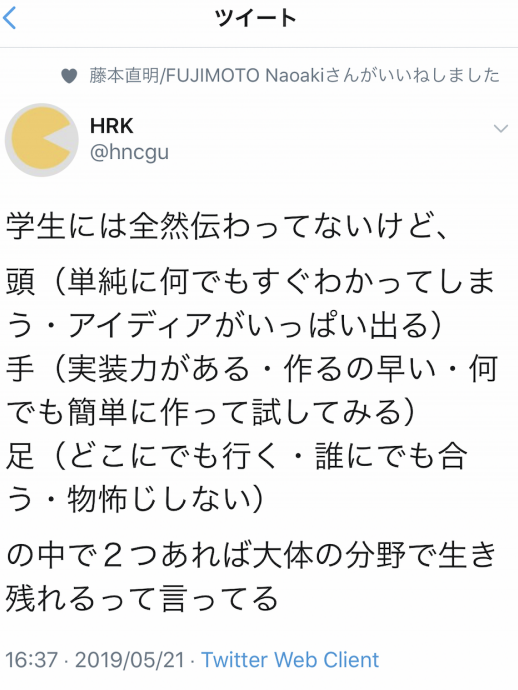

# 情報デザイン演習I 6.Webの構造化<!-- omit in toc -->
> 構造化言語としてのHTML、セマンティックコーディングについて学修する。

---
- [これまで学んだこと](#これまで学んだこと)
- [改めて学んでほしいこと](#改めて学んでほしいこと)
- [IT系で働くための心構え](#it系で働くための心構え)
- [2-13 ブロック要素でグループ分けをしよう](#2-13-ブロック要素でグループ分けをしよう)
    - [HTML アウトライン](#html-アウトライン)
    - [セマンティックコーディング](#セマンティックコーディング)
- [やってみよう](#やってみよう)


# 前回のおさらい<!-- omit in toc -->
- CSSの実践
   - ボックスモデル(超重要!)
   - IDとクラス(超重要!)
   - リセットCSS
   - animate.css(おまけ)

# これまで学んだこと
- 基本的な HTML,HEAD,BODY の役割などを学んだ (最小限の HTML ファイル)
- HTML というタグについて学んだ
- CSS の概念について学んだ
- CSS におけるボックスモデルについて学んだ
- ブラウザの差異をなくすリセットCSS について学んだ
- 画像の利用方法・作成方法について学んだ

# 改めて学んでほしいこと
---
### この演習は<!-- omit in toc -->
- この演習はタイピング練習ではない
- 一つ一つについて覚えろとは言ってない
- 考え方を学んでほしい

ということです。


最初は言われた通りに入力したら、言われた通りに表示された、でいいです。

でも、なぜそのように表示されたか、という理屈、考え方を身につけてほしいです。

---
### 終わっていないところ<!-- omit in toc -->
- 2-13 ブロック要素でグループ分けをしよう
- 3-16 レイアウトを組もう
- 3-17 CSSグリッドでタイル型に並べよう

がまだ終わっていませんでしたね。見た目に楽しいく、実用的な内容で、来週となりますが、それの下準備が今回となります。

---
### あらためて、Webデザインとは?<!-- omit in toc -->
Webは、「素敵に見えてれば良い」というものではなく、SEO(サーチエンジン最適化)として、主にGoogleさんが巡回させているロボットに正しく情報を与える必要があります。

そのためには構造をしっかり作成するという考え方が必要となってきます。

> SEOとは、“Search Engine Optimization” の略であり、検索エンジン最適化を意味します。
> 
> 具体的には、検索ユーザーが求める有益なコンテンツを提供し、検索エンジンに正しくページ内容を評価されるよう技術的にWebページを最適化することを指します。

# IT系で働くための心構え

---
### Webの進化は早い<!-- omit in toc -->
Webの仕様はニーズ(要求)に応じてどんどん進化していきます。
CSSについても書き方が変わってきたりしています。

既存の技術を覚えるだけでなく、考え方を学んでいき、新技術にも対応できる適応力が求められます。

---


---
### 実際のWeb仕事<!-- omit in toc -->
ざっくりですが
#### Webディレクター<!-- omit in toc -->
クライアントと話し合いながら方向性考える人

#### Webデザイナー<!-- omit in toc -->
デザイン考える人

#### エンジニア・プログラマー・コーダー<!-- omit in toc -->
ディレクターとデザイナーと共有しながら実際に制作する人

となります。

---
### Webディレクター<!-- omit in toc -->
- インターネット・Webの仕組みが理解できる
- クライアントの要求が理解できる
- どう形にすればよいかアイディアを出しながらまとめられる

頭と足が必要ですね。

---
### Webデザイナー<!-- omit in toc -->
- インターネット・Webの仕組みが理解できる
- クライアントの要求が理解できる
- デザインのアイディアが出る
- 形にするのが得意

頭と手が必要ですね。

---
### エンジニア・プログラマー・コーダー<!-- omit in toc -->
- インターネット・Webの仕組みが理解できる
- とりあえずトライすることに躊躇しない
- わからないことがあればネットを調べたり、誰かに聞いたりとかしながら解決していく

手と足が必要ですね。

---
### いずれにせよ<!-- omit in toc -->
- インターネット・Webの仕組みが理解できる
の部分が必要ですので、この演習で身につけてほしいと思います。

この辺の素地となる資格がWebリテラシー試験(宣伝www)


# 2-13 ブロック要素でグループ分けをしよう

情報をかたまりにするdivタグを前回学びました。
HTML5から塊にするだけでなく、その意味を可能な限り明示しよう、ということで
タグが拡張されています。

---
### グループ分けとは<!-- omit in toc -->
- 見出しと本文(と図)

など、ひとかたまりにすることで、文章の構造が見えやすくなります。
デザインを考える上でのかたまりにはdivを利用しますが、以下のようなタグがHTML5で導入されました。
- header
- nav
- article
- section
- main
- aside
- footer

---
### headerタグ(P.83)<!-- omit in toc -->
ページ上部にある要素を囲みます。
- ロゴ画像
- ページタイトル
- ナビゲーションメニュー
- 検索窓

などが含まれることが多いです。

- <header>要素は<body>要素内でのみ使用することができる。
- <header>要素はページの上部に表示されるものとして想定されており、それ以外の目的で使用することはできない。
- <header>要素内には主にページ全体に関する情報が含まれることが推奨されている。

---
### footerタグ(P.85)<!-- omit in toc -->
ページ下部にある部分を囲みます。
- コピーライト
- SNSリンク

などが含まれることが多いです。

- <footer>要素はWebページのフッターを表すために使用される。
- <footer>要素内には、著作権情報、リンク、連絡先情報などが含まる。
- <footer>要素は、ページ全体の最下部に配置することが推奨される。

---
### mainタグ(P.84)<!-- omit in toc -->
ページの核となるコンテンツ全体を囲むタグです。

- <main>要素は、ページ内で1回だけ使用することを推奨。
- <main>要素内には、主にページの主要なコンテンツが含まれることが推奨される。
- <main>要素は、ページ全体を覆うコンテナーの中に配置することが推奨される。

---
### header,main,footerのサンプル<!-- omit in toc -->
```html
<body>
   <header>
      <!-- ページの上部部分 -->
   </header>
   <main>
      <!-- メインコンテンツ部分 -->
   </main>
   <footer>
      <!-- ページの下部部分 -->
   </footer>
</body>
```


---
### asideタグ(P.85)<!-- omit in toc -->
本文ではない補足情報はasideタグで囲みます。
例えば、本文とは関係ないサイドバーなどです。

- [【HTML】aside要素の正しい使い方を分かりやすく解説!](https://shu-naka-blog.com/html/aside/)


- <aside>要素はWebページのメインコンテンツから独立したコンテンツを表すために使用される。
- <aside>要素内には、サイドバー、広告、関連記事などが含まる。
- <aside>要素は、通常<main>要素内に配置されますが、<body>要素の中のどこでも使用することが可能。

---
### header,main,aside,footerのサンプル<!-- omit in toc -->
```html
<body>
   <header>
      <!-- ページの上部部分 -->
   </header>
   <main>
      <!-- メインコンテンツ部分 -->
   </main>
   <aside>
      <!-- 補足情報 部分 -->
   </aside>
   <footer>
      <!-- ページの下部部分 -->
   </footer>
</body>
```

---
### navタグ(P.83)<!-- omit in toc -->
メインのナビゲーションメニューを囲みます。
```html
<nav>
   <ul>
      <li><a href="">メニュー1</a></li>
      <li><a href="">メニュー2</a></li>
      <li><a href="">メニュー3</a></li>
      <li><a href="">メニュー4</a></li>
   </ul>
</nav>
```
とulでリストで記述します。

navタグはサイト内で複数回使えますが、「このページで重要なナビゲーションがここだよ！」というのを表すために利用されるタグですので、SNSや利用規約などへのメニューには使いません。

---
### navタグ(P.83)<!-- omit in toc -->
- <nav>要素はナビゲーションメニューを表すためのものとして想定されており、それ以外の目的で使用することはできない。
- <nav>要素内には、主にページのリンクが含まれることが推奨されている。
- <nav>要素は、<header>、<footer>、またはサイドバーなどのセクション内で使用することができる。

一番最後のところは人によって判断揺れてる気がします。

---
### header,main,nav,aside,footerのサンプル<!-- omit in toc -->
```html
<body>
   <header>
      <!-- ページの上部部分 -->
      <nav>
         <ul>
            <li><a href="">メニュー1</a></li>
            <li><a href="">メニュー2</a></li>
         </ul>
      </nav>
   </header>
   <main>
      <!-- メインコンテンツ部分 -->
   </main>
   <aside>
      <!-- 補足情報 部分 -->
   </aside>
   <footer>
      <!-- ページの下部部分 -->
   </footer>
</body>
```

---
### articleタグ(P.84)<!-- omit in toc -->
articleは記事を意味し、
- ページ内の記事となる部分
- そこだけをみても独立したページとして成り立つような内容

に使われます。

- <article>要素はWebページ内の独立したセクションに対して使用される。
- <article>要素内には、独立しているコンテンツが含まれることが推奨される。
- <article>要素は、通常<main>要素内に配置される。

---
### sectionタグ(P.84)<!-- omit in toc -->
sectionはarticleと似ていますが、その部分だけをみても完結はしていないかたまりに使います。

- <section>要素は、Webページ内のセクションに対して使用される。
- <section>要素内には、通常、一連の関連するコンテンツが含まれる。
- <section>要素は、<main>要素内に配置することが推奨されているが、独立したコンテンツを表す場合は<article>要素を使用することが推奨される。


---
### articleとsection<!-- omit in toc -->
よくわかりませんね。
ちょっと説明ページを見てみましょう。

- [
【HTML】コンテンツを区切るタグ、sectionとarticleの違いについて解説](https://zero-plus.io/media/html-section-article/)
- [articleとsectionの違いと使い分け【HTML】](https://pecopla.net/web-column/section-article-difference)

完結しているかしていないか、が大きな違いとなりそうですね。

ここ、どう使うか結構悩ましい問題となります。

---
### divタグ(P.85)<!-- omit in toc -->
- どの用途にも当てはまらない
- デザインのためだけにグループ化する場合

に使います。ひとまとめにしたいが、どれが適切かわからない場合に使えます。

---
### 教科書まとめ<!-- omit in toc -->
グループ化するためには
- header,main,aside,footer
- nav
- article, section
- div

をうまく使い分ける必要があります。

これと、「2-5 見出しをつけよう」では
- h1,h2,h3,h4,h5,h6

の見出しタグがあり、h1は基本的には1つのWebページにつき一度の利用が良い、というルールもありました。

---
# うまくHTMLを書くには？<!-- omit in toc -->
うまく書かなくても表示されますが、ロボットに適切に内容を伝えるためには
うまくHTMLを書く必要があります。

- コンテンツモデル
- HTML アウトライン
- セクショニング コンテンツ

という考え方を知っておきましょう。

---
### コンテンツモデル
> ある要素がどの要素を内容として持つことができるか、つまり子要素とできるかというルール

- [コンテンツ・モデルのおはなし](https://speakerdeck.com/atsuco/kontentumoderufalseohanasi)

---
### HTML アウトライン
長大な文章は章や節、項といった見出しを付けることによって階層構造になっていますが、この文章の階層構造のことを“アウトライン(Outline)”と呼びます。

HTMLではこの階層構造の作り方が現状混乱しています。(策定された考え方(セクショニング・ルート)が廃止など)
現時点では
- [Living Standard — Last Updated 1 October 2025](https://momdo.github.io/html/sections.html#exposing-outlines-to-users)

が一番最新の様ですが、とりあえずは、見出しタグでアウトラインを作ることを徹底しましょう。


---
### アウトラインアルゴリズムの削除

ぐちゃぐちゃな経緯は
- [HTML のアウトラインアルゴリズムが見出しレベルをベースとしたものに刷新されそう](https://blog.w0s.jp/671)
- [【HTML5】標準規格というものに失望した話](https://qiita.com/silane1001/items/7126d33340120ff972fe)

とりあえず、見出しタグでアウトライン作っておけば良さそうですね。

---
### アウトラインの確認の準備<!-- omit in toc -->
みなさんのOSでのデフォルトブラウザがSafariだったりChromeだったりするので、LiveServerの出力をChromeに統一しましょう。(Chormeの人はそのままでOKです。)
- Code - 基本設定 - 設定
- 検索窓で「Live Server」
- 「Live Server > Settings: Custom Browser」をchromeに

次に、アウトラインを確認する機能拡張を入れましょう。
- Chromeで
- ~~[HTML5 Outliner](https://chrome.google.com/webstore/detail/html5-outliner/afoibpobokebhgfnknfndkgemglggomo?hl=ja)にアクセス~~
- [HTML Outline](https://chromewebstore.google.com/detail/html-outline/bbdofojliblplnpnjjckgbbobblppipj)にアクセス
- 「Chromeに追加」

古くなったようなので、入れ替えました。

---
### アウトラインの確認<!-- omit in toc -->
1. Googleで適当に検索
2. ページを右クリックして「HTML Outline」で表示されます。

いろんなページで確認してみよう。

---
### 見えないところのデザイン<!-- omit in toc -->
いろんなページを見てみると、
このアウトラインが綺麗に見えるページとそうでないページがあると思います。

Googleの様に綺麗に書くのは大変だと思いますが、仕事では本当は必要だ、ということを確認しておきましょう。

(仕様が混乱していることも事実です。最新の情報を確認しましょう)

<!--
- [(参考)文書のアウトラインとセクショニング](https://web.havincoffee.com/html/html5/html5_a_sectioning.html)
-->
- [Living Standard：セクション](https://momdo.github.io/html/sections.html)

---
### セマンティックコーディング
セマンティック（セマンティクス）は「意味的な」などと訳される形容詞で、セマンティックコーディング（または、セマンティックHTML）とは、HTMLタグが持つ意味と役割を正しく使ってマークアップするという考え方です。

セマンティックコーディングでは、例えば見出しタグは装飾目的で使うのではなく、見出しタグが持つ本来の意味である「文章構造の最適化」のために使います。

---
### セマンティックコーディングの必要性<!-- omit in toc -->
- 検索エンジン最適化（SEO）
- アクセシビリティ向上
- ソースコードの可読性向上

---
### セマンティックコーディングで利用されるタグ<!-- omit in toc -->
- header	ヘッダー要素であることを示します。
- footer	フッター要素であることを示します。
- nav	ナビゲーション要素であることを示します。
- aside	本文とは関係のない要素を示します。
- article	単独で完結する記事など要素であることを示します。
- section	章や節ということを示します。article内でのセクショニングなどに用いるイメージです。

グループ化するためのタグとセマンティックにセクショニングすることは似ています。
- 見た目のデザイン
- 意味的なデザイン

両方考えてコーディングしていきいましょう。

# やってみよう


## やってみよう<!-- omit in toc -->
1. ID_ROOTにID_06フォルダを作成
2. その中にID_06_01フォルダを作成
3. index.html, style.cssを作成


---
### ID_06_01<!-- omit in toc -->
1. bodyタグにheader,main,footerを作成しよう(それぞれにダミーテキスト入れておこう)
2. header, main,footerの背景色を適当に作成
3. header, main, footerの高さをそれぞれ100px, 100vh, 50pxとしよう
4. 周りの白い縁が気になる人、消してみよう。

---
### ID_06_01 index.html<!-- omit in toc -->
```html
<!DOCTYPE html>
<html lang="ja">
<head>
    <meta charset="UTF-8">
    <meta name="viewport" content="width=device-width, initial-scale=1.0">
    <title>Document</title>
    <link rel="stylesheet" href="./style.css">
</head>
<body>
    <header>
        ヘッダー
    </header>
    <main>
        メイン
    </main>
    <footer>
        フッター
    </footer>
</body>
</html>
```

---
### ID_06_01 style.css<!-- omit in toc -->
```css
body {
    margin: 0px;
}
header {
    background-color: red;
    height: 100px;
}
main {
    background-color: blue;
    height: 100vh;
}
footer {
    background-color: green;
    height: 50px;
}
```

---
### ID_06_02<!-- omit in toc -->
1. ID_06_02を作成しましょう。
2. index.html, style.cssはコピーしてきてから作業でも構いません。
3. headerタグの中に、4項目のメニューをnavタグを使って実装しましょう。
4. navを右寄せにしましょう。
5. liのlist-styleをnone, displayをinlineにしてマージンを適当につけましょう。
6. footerにコピーライト表記をして、センタリングしましょう。


- [Copyright(コピーライト：著作権表示)の正しい書き方を知っていますか？：webサイト制作](https://serinaishii.hatenablog.com/entry/2015/09/30/Copyright%28%E3%82%B3%E3%83%94%E3%83%BC%E3%83%A9%E3%82%A4%E3%83%88%EF%BC%9A%E8%91%97%E4%BD%9C%E6%A8%A9%E8%A1%A8%E7%A4%BA%29%E3%81%AE%E6%AD%A3%E3%81%97%E3%81%84%E6%9B%B8%E3%81%8D%E6%96%B9%E3%82%92)

「\&copy;」とすることで、「&copy;」と表記できます。

- [HTMLの記号・特殊文字の文字コード表（文字実体参照、数値文字参照）](https://gray-code.com/html_css/list-of-symbols-and-special-characters/)


---
### ID_06_02 index.html<!-- omit in toc -->
```html
<!DOCTYPE html>
<html lang="en">
<head>
    <meta charset="UTF-8">
    <meta name="viewport" content="width=device-width, initial-scale=1.0">
    <title>Document</title>
    <link rel="stylesheet" href="./style.css">
</head>
<body>
    <header>
        ヘッダー
        <nav>
            <ul>
                <li>メニュー1</li>
                <li>メニュー2</li>
                <li>メニュー3</li>
                <li>メニュー4</li>
            </ul>
        </nav>
    </header>
    <main>
        メイン
    </main>
    <footer>
        フッター
        <p class="copyright">(c) コピーライト</p>
    </footer>
</body>
</html>
```

---
### ID_06_02 style.css<!-- omit in toc -->
```css
body {
    margin: 0px;
}
header {
    background-color: red;
    height: 100px;
}
main {
    background-color: blue;
    height: 100vh;
}
footer {
    background-color: green;
    height: 50px;
}
header, main, footer {
    padding: 20px;
 }
 
nav {
    text-align: right;
}
li {
    list-style: none;
    display: inline;
    margin-left: 40px;
}
.copyright {
    text-align: center;
}
```

---
### navの位置<!-- omit in toc -->
今回はheaderの中にnavを入れましたが、入れなくても問題ありません。
```html
<body>
    <header>
    </header>
    <nav>
    </nav>
    <main>
    </main>
    <footer>
    </footer>
</body>
```
こういう作りのものもあります。

---
### float(P.168)<!-- omit in toc -->
画像の右寄せ・左寄せについてどう記述するかを学んでおきましょう。

1. mainの中にpタグ,imgタグ,pタグ,pタグの順に適当に挿入
2. imgにfloat: right
3. 回り込みを解除するために次ををpタグの前に追加
```html
<br class="clear">
```

4. clearクラスに clear:bothを追加

画像の右寄せ・左寄せ、以外ではもう使うことがないと思います。教科書のような使い方はしなくなります。(来週説明)

---
### 答え html<!-- omit in toc -->
```html
    <main>
        メイン
        <p>Lorem ipsum ...</p>
        
        <p>Lorem ipsum ...</p>
        <br class="clear">
        <p>Lorem ipsum ...</p>
    </main>
```
pタグの中はlorem20等使って適当に長くしておいてください。
画像は、loremの画像版です。デモを作成する時に非常に便利かと

- [ Lorem Picsum](https://picsum.photos/)

日本語のダミー文章が欲しい時はこちら
- [Lorem JPsum ](https://lorem.sabigara.com/)

---
### 答え css<!-- omit in toc -->
```css
img {
    float: right;
}
.clear {
    clear: both;
}
```

---
### floatとは<!-- omit in toc -->
通常、HTMLでタグを記述すると
- 改行が自動でつくもの
- 改行が自動でつかないもの

があります。どちらも、HTMLの記述の順番に
> 上から下・左から右

に並びますが、これをfloatではルールを変更して、
> 右寄せ・左寄せ

にすることができます。

float: right;をfloat: leftにすると左寄せができます。
clear: both; が回り込みの解除を意味します。

---
### floatとレイアウト<!-- omit in toc -->
過去にはこの機能を利用してレイアウトをしていました。

floatはclearとセットにしないと高さをうまく計算してくれなかったので非常に面倒でした。

今後は
- CSS Grid
- Flexbox

を使ってレイアウトしていくことになります。(来週)

---
### やってみよう<!-- omit in toc -->
1. id_06_kadaiフォルダを作ろう
2. index.html, style.cssをコピーしてこよう
3. headerタグにh1で「自己紹介」
4. mainタグの中を削除
5. sectionタグを3つ作成。その中にh2で「経歴・趣味・座右の銘」を作ろう
6. 最後にarticleタグを追加しよう。記事名をh2, それ以下の見出しはh3を使おう(完結するような内容を記載しよう)
7. cssを整えよう

HTML Outlineでアウトラインを確認しながらやってみよう。
アウトラインを綺麗にまとめるのはかなり難しいです。

---
### 終わり<!-- omit in toc -->

NASにID_06_kadaiを圧縮したものを提出して終わりにしましょう。


<!--
---
### 教科書ベース
教科書に沿ってこれから数回すすめていきます。(4,5章)
- 文書をHTMLで構造化する
- HTMLアウトラインを確認する
- セマンティックコーディングをしていこう
- ページ全体のレイアウトとナビゲーションを配置する
- Webレイアウトの基本「フロート処理」...これ以外にもFlexBox, CSS Gridにも触れます。

これまで触ってきたことをより体系的に利用し、学んでいきます。

P.244以降は小数点の嵐になるので、新しい方法で実装していこうと思います。

## 文書をHTMLで構造化する

---
### Webレイアウトと印刷物のレイアウトは何が違うのか？(P.138〜)

---
### セクションとアウトライン(p.140〜145)
P.40のコンテンツモデルを確認しましょう。

---
### 難しいですね...
うまいスライドがあったので見てみましょう。
[コンテンツ・モデルのおはなし](https://speakerdeck.com/atsuco/kontentumoderufalseohanasi)

## HTML アウトラインを確認する

---
### Chromeを使っているはずだけど...
VSCでLiveServer使うとSafariの人いますか？
そういう人は次を試してください。

1. VSCode の左から拡張機能を選ぶ
2. live で検索して Live Server を選ぶ
3. アンインストールの横の歯車を押す-拡張機能の設定
4. 「Live Server > Settings: Custom Browser」を「chrome」に

これでChromeが立ち上がるはずです。うまくいかなかったら呼んでください。

---
### HTML5文書のアウトライン(階層構造を確認する方法)(P.146)
「Chrome HTML5 Outliner」で検索してChromeに追加しましょう。
[HTML5 Outliner](https://chrome.google.com/webstore/detail/html5-outliner/afoibpobokebhgfnknfndkgemglggomo?hl=ja)

HTML5 Outlinerはサーバ上のファイルでないとうまく動作しないので、LiveServerとセットで利用しましょう。

---
### 今日利用するデータ
- ID_06フォルダを作成
- ダウンロードしたフォルダのChapter4の4-02から4-06をコピーしておこう

---
### ソースとアウトラインを確認しよう
P.147-P.159までLiveServerで
- Part4-02-HTML4-Sample-1.html
- Part4-02-HTML4-Sample-2.html
- Part4-02-HTML5-Sample-1.html
- Part4-02-HTML5-Sample-2.html
- Part4-02-HTML5-Sample-3.html
- Part4-02-HTML5-Sample-4.html

を開いて、なぜそのようになるか確認・考えてみよう。

---
### 考え方
HTML5.1ではH1,H2といった見出しでの階層構造も気にすることが推奨されています。が、HTML Living Standardではまだその記述がありません。

- 暗黙的なアウトライン
- 明示的なアウトライン

の双方をうまく利用するといいのかな、という状況ですが、正式な仕様決定が待たれるところです。

[HTML のアウトラインアルゴリズムが見出しレベルをベースとしたものに刷新されそう](https://blog.w0s.jp/671)

## セマンティックコーディングをしていこう

---
### 文章の構造化をやってみよう
ここからは実際にVSCodeを利用して教科書に沿って記述していきましょう。
- 今日のフォルダ「ID_06」の中に
- chapter04.htmlを作成

P.154-P.159までやってみましょう。

アウトラインに意識して入力してみましょう。


## ページ全体のレイアウトとナビゲーションを配置する

---
### CSSスタイリングのための準備
レイアウトとナビゲーションをやっていきましょう。

P.160-165やってみましょう。

「〜レベルのコンテンツ」「関連コラム」「参考サイトのリンク集」とかわざわざ変更する必要ないからね。

コーディングをしていきましょう。

## Webのレイアウトの基本「フロート処理」

---
### 水平に並べる方法
P.169の下に小さく
「※CSS3には段組みなどを表現できるプロパティがあります」
と書いてあり、このテキストの執筆時点ではフロート処理が基本だったのですが、現在では異なる方法がスタンダードになりつつありますが、とりあえずテキストどおりにやっていきましょう。

P.169-P.176

## ページのマージンとパディングを調整する

---
### マージンとパディング
ボックスモデルで
- マージン：ボーダーの外の余白
- パディング：ボーダーの中の余白

と学びました。これらを使って調整していきましょう。

P.178-183

## まとめ
時間がある人は、実習課題No.12-13もやってみましょう。

前回に引き続き、
第4章の流れがわかると、基本的なコーディングをマスターしたことになります。

1. HTMLで文章の構造化
2. CSSにてレイアウト

来週は5章のP.243あたりまでやります。そこからあとは新しい方法を学んでいきます。


-->


