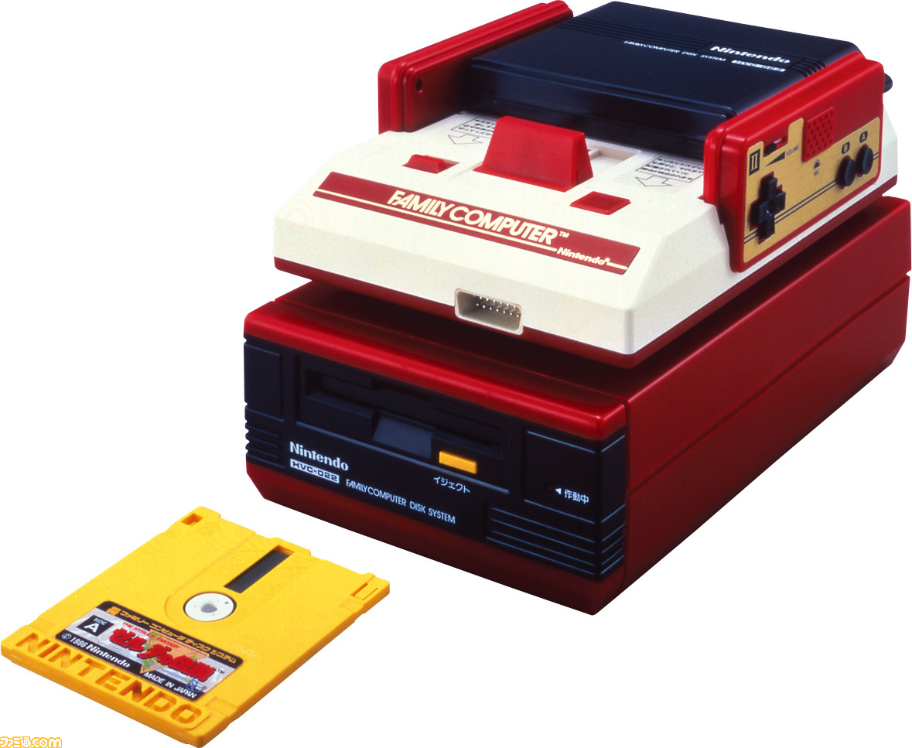

# メディア文化論V 1. オリエンテーション<!-- omit in toc -->

# 目次<!-- omit in toc -->

- [はじめに](#はじめに)
- [シラバス説明](#シラバス説明)
- [授業の形式・計画](#授業の形式計画)
- [ゲームとメディア](#ゲームとメディア)
- [終わりに](#終わりに)

# はじめに
## メディア文化論Vについて
メディア文化論I-VIは様々な先生が**メディア文化**について論じる講義科目です。

2024年度まで**メディア文化論V**は高橋先生が宗教をテーマに講義をしていました。

2025年度より担当が自分になったため、引き続き宗教でするか悩みましたが、90分x15回も論じることは自分には相当難しい、と思い、テーマを色々考えました。

## メディア文化
コースの名前でもある「メディア文化」ですが、よく考えたことあるでしょうか？

- メディア
- 文化

とも、割と幅の広い言葉でいかようにも捉えることができるかと思います。
ちなみに、「メディア文化論」のことを
> メディアと社会の関係性、メディアの全体像を考察する学問です

としているところもあります。

## メディア(wiki)
> メディア（media）は、情報の記録・伝達・保管などに用いられる物や装置のことである。媒体（ばいたい）などと訳されることもある。
>
> 記録・保管のための媒体（記録媒体、記憶装置）と伝達・コミュニケーションのための媒体に大別することができる。
>
> また不特定多数の受け手を対象に情報を発信する報道機関の「マスメディア」や「マスコミ」を指すこともある。

## 文化(wiki)
> 文化（ぶんか、ラテン語: cultura）には、いくつかの定義が存在するが、総じていうと人間が社会の構成員として獲得する多数の振る舞いの全体のことである。社会組織（年齢別グループ、地域社会、血縁組織などを含む）ごとに固有の文化があるとされ、組織の成員になるということは、その文化を身につける（身体化）ということでもある。人は同時に複数の組織に所属することが可能であり、異なる組織に共通する文化が存在することもある。もっとも文化は、次の意味で使われることも多い。
>
> 1. ハイカルチャーのように洗練された生活様式
> 2. ポップカルチャーのような大衆的な生活様式
> 3. 伝統的な行為

## いずれにしても...
メディア・文化とも定義は色々できそうです。

## 自分にとって、論じられるメディア文化とは...
自分は1969年生まれで、音楽、及びコンピュータの発展とともに生きてきました。

ふと振り返ると、自分は様々なメディア(記録媒体・記憶装置の意味)を使ってきたことに気づきました。そして、その多くは既にロストテクノロジーとなり、世の中では存在しなくなっていることに気づきました。

また、そのメディアがあったからこそ、世の中に影響を与えてた状況があったなぁ、と思いました。

お、これなら15回分論じられるかも！

## キーワード探し...
> 紙・レコード・オープンリール・カセットテープ・フィルム(写真・映像)・VHS・ベータ・フロッピーディスク・HDD・DV・レーザーディスク・CD・DVD・Blu-ray・MO・Zip・USBメモリ・SDカード・SSD etc...

自分が使ってきた記録媒体をあげてみると、それにより社会に変革を与えたことを色々思い出しました。

そこで、この**記録媒体**というメディアを中心に論じようと思います。

また、中には**情報のフォーマット**が世の中に大きな影響を与えているものがあります。...といっても、**MIDI**というものなのですが...

## 方針決定！
そこで、主には
> 記録・保管のための媒体（記録媒体、記憶装置）

を取り上げ、
- 仕組み
- その文化に与えた影響

について論じていこうと思います。

いわゆるマスメディア(新聞・雑誌・ラジオ・テレビ)という視点では論じない、という方針です。

# シラバス説明
## 授業のねらい及び到達目標
有史以来、様々なコンテンツは記録媒体・フォーマットに記録されることで文化を引き継ぎ発展してきている。
様々な記録媒体の特徴を学ぶとともに、記録媒体が文化に与えた影響について読み解く。

到達目標：
1. 記録媒体・フォーマットの変遷について理解できる。
2. 記録媒体・フォーマットによりコンテンツのあり方が変わったことについて理解できる。
3. 記録媒体・フォーマットにより新たな文化が生まれたことについて理解できる。

## 学修内容・方法
現在では多くの情報がデジタル化され、クラウドに保存され、それを自由にいつでも24時間扱うことが可能となってきている。USBメモリ・SDカード・SSD/HDDといった記録媒体がまだ利用されているものの、インターネットの高速化・大容量化・クラウド化に伴い今後記録媒体の利用機会はさらに減っていくかもしれない。これまで、カセットテープ・フロッピーディスク等様々な記録媒体が開発され、消えていった。記録媒体は機能的には記録に特化しているものの、その特性から新たな文化が生まれた事実がある。記録媒体、及びそこに書かれるデータのフォーマットを中心に、仕組み・文化への影響を学び、今後のメディアコンテンツのあり方について理解を深める。

## 授業内容のレベル、関連科目
本授業では履修に際して必須となる知識は設定しないが、メディア文化について多様な視点での理解のため、「メディア文化論I〜VI」等を合わせて履修することが望ましい。

## 授業外学修（予習・復習）
- 各授業で取り扱う記録媒体・フォーマットの特徴について、現在の技術と比較して理解を深めること。
- 各授業で取り扱う記録媒体・フォーマットが文化に与えた影響について、興味のあることについて理解を深めること。
- 記録媒体・フォーマットという視点を意識して、日常生活において適切な利用に努めること。

## 授業外学修に必要な時間
開講期間内において、約60時間の授業外学修が必要になる。

## 使用テキスト・参考書、その他教材
不要。必要事項はPDF・HP等で配布する。

## 成績評価方法・基準
定期試験（レポート）の成績 50％、平常点 (毎回のリアクションペーパーの内容)50％とし、総合的に評価する。

# 授業の形式・計画
- [第01回]　オリエンテーション
- [第02回]　紙
- [第03回]　レコード
- [第04回]　磁気テープ(オープンリール・カセットテープ)
- [第05回]　フィルム(写真・映像)
- [第06回]　磁気テープ(VHS・ベータ)
- [第07回]　磁気ディスク(フロッピーディスク)

## 授業の形式・計画
- [第08回]　MIDI
- [第09回]　磁気ディスク(HDD)
- [第10回]　磁気テープ(DV)
- [第11回]　光ディスク(CD・DVD・Blu-ray)
- [第12回]　磁気ディスク(MO,Zip)
- [第13回]　半導体メモリ(USBメモリ・SDカード・SSD)
- [第14回]　クラウド化
- [第15回]　まとめ

# ゲームとメディア
## 小さい頃はやっていたのだけれども...
ゲーム機器とメディアだけで1回分作ろうと思えば作れるはずですが、自分があまりそんなにゲームをたくさんやっていないので、中途半端になるので、一回分には盛り込みませんでした。

その代わり、オリエンテーションで簡単に触れて、どんな感じで論じたいのかを感じてくれればと思います。

ざっくりいきます。

## ゲームの歴史年表
- [ゲーム機の歴史年表](https://honkinonki.com/chronology-of-console-game-hard)

- [ニッポンゲーセン変遷史](https://shiruto.jp/culture/4787/)

よくまとめてくれています。こちらを参考に重要そうなところ(異論は認めます)を中心に説明していきます。

## ブロック崩し・スペースインベーダー

1970年代、家庭で電子ゲームをすることは一般的ではなく、ホテルや喫茶店にあるアーケード機で遊べるようになりました。

そして「ゲーム喫茶」「インベーダー喫茶」「インベーダーハウス」と呼ばれる、テーブルをインベーダーゲームにした店が出てきます。今のゲームセンターの走りでした(メダルゲームの影響も大きい)。

## 参考
- https://plaza.rakuten.co.jp/jyoudankeri/diary/201511110000/
- https://greendeepforest.com/?p=1272
- https://shiruto.jp/culture/4787/

## 1970年代の家庭用ゲーム機
- [TV FUN(トミー)](https://ja.wikipedia.org/wiki/TV_FUN)
- [TV JACK(バンダイ)](https://ja.wikipedia.org/wiki/TV_JACK)
- [システム10(エポック)](https://ja.wikipedia.org/wiki/%E3%82%B7%E3%82%B9%E3%83%86%E3%83%A010_(%E3%82%B2%E3%83%BC%E3%83%A0%E6%A9%9F))
- [カラーテレビゲーム(任天堂)](https://ja.wikipedia.org/wiki/%E3%82%AB%E3%83%A9%E3%83%BC%E3%83%86%E3%83%AC%E3%83%93%E3%82%B2%E3%83%BC%E3%83%A0)

1977年頃から家庭用ゲーム機が発売されています。1または数種類のゲームを遊べるゲーム機であり、テレビに接続して遊んでいました。現在は当たり前のようにソフトを交換して様々なゲームを遊ぶことができますが、当時はハードウェアで遊ぶことのできるゲームが決まっていました。

## カセット交換式ゲーム
- [ビデオカセッティ・ロック](https://ja.wikipedia.org/wiki/%E3%83%93%E3%83%87%E3%82%AA%E3%82%AB%E3%82%BB%E3%83%83%E3%83%86%E3%82%A3%E3%83%BB%E3%83%AD%E3%83%83%E3%82%AF)
- [ビジコン](https://ja.wikipedia.org/wiki/%E3%83%93%E3%82%B8%E3%82%B3%E3%83%B3_(%E3%83%86%E3%83%AC%E3%83%93%E3%82%B2%E3%83%BC%E3%83%A0))

それぞれ、1977,78年に発売されていますが、1981年に発売された

- [カセットビジョン](https://ja.wikipedia.org/wiki/%E3%82%AB%E3%82%BB%E3%83%83%E3%83%88%E3%83%93%E3%82%B8%E3%83%A7%E3%83%B3)

により、カセットを取り替えることで別のゲームを遊ぶことができる、という**記録媒体**としてのゲームが初めて一般的に普及したものとなる(売上台数45万台)。

## ロストテクノロジー
さて、では今このカセットビジョン用のカセットを持っていたとして、本体がなければ遊ぶことができませんね。

ロストテクノロジーとは
> 過去に存在した優れた技術が何らかの理由で失われてしまったこと

を指します。

## エミュレータ
文化としてのゲームが、ゲーム本体がなくなることにより遊べなくなると困る、ということで、特にゲーム関連ではエミュレータと呼ばれるソフトにより保存する動きがあります。

- [エミュポータル](https://emu-portal.com/)

著作権的にはグレーのために、利用はお勧めしません。
自分でデータを抽出して、データ化して利用すれば問題はないのですが、他人が吸い出したデータをダウンロードして利用することは違法となります。

## マイコン時代
家庭にマイコン(現在で言うパソコン)が普及し始めたのは1979年あたりからで、NECからPC-8001(25万台),6001,8801といったシリーズが発表されます。

この頃はソフトはカセットテープに録音されて販売されていて、実用ソフトだけではなく、ゲームソフトもリリースされるようになります。

- [ASCII PC-8001 プログラムライブラリ No.1](https://yummac.hatenablog.jp/entry/20190903)

## ファミコン
1983年に発売され、日本だけで1935万台、全世界では6191万台が販売された家庭用ビデオゲームの代表格として誰でも耳にしたことがあるでしょう。

アーケードで稼働しているゲームを遜色なく遊べるよう設計されました。

ゲームソフトを販売する店は「ファミコンショップ」とも呼ばれ、中古の買取・販売だけではなく、ゲームの情報交換の場所としても利用されました。当時はインターネットはなく、レビュー・評判などを知るには雑誌(発行部数100万部)もありましたが、口コミ情報も貴重だったのです。

- [ファミコン年表](https://www.nintendo.com/jp/famicom/history/index.html)

## ファミコン ディスクシステム
当初、[カートリッジ形式](https://www.4gamer.net/games/999/G999903/20230712064/)でソフトは販売されていましたが、
1986年になると、磁気ディスクメディア「ディスクカード」で遊べるようになります。これは、[クイックディスク](https://ja.wikipedia.org/wiki/%E3%82%AF%E3%82%A4%E3%83%83%E3%82%AF%E3%83%87%E3%82%A3%E3%82%B9%E3%82%AF)の技術を利用しています。

- [ファミコン ディスクシステム](https://www.nintendo.com/jp/famicom/hardware/disksystem.html)

別のソフトに書き換えができるようになったり、**セーブ機能**が使えるようになりました。初めて利用できるようになったのは**ゼルダの伝説**だと言われています。

## ディスクシステムの衰退
1. データ容量がカセットよりもかなり大きい、
2. ゲームを記録 (セーブ) できる
3. お店のディスクライターで書き換えでゲームを購入できる、

というメリットがありましたが、少しすると半導体の性能が上がり、大容量チップの値段も低下します。バッテリーバックアップの機能をつけたカートリッジも出てきたため衰退していくこととなります。

- [ディスクシステムのはじまりからおわり、そしてふっかつ](https://pony.velvet.jp/fcdisk/fmcmdskw32_rks.html)

## スーパーファミコン
1990年代には第4世代のスーパーファミコンが登場します。
こちらも日本で1717万台、全世界で4910万台を売り上げます。

ソフトは基本的にはロムカセットで供給されましたが、フラッシュメモリを搭載した**SFメモリカセット**を利用すると、ローソンのLoppiのNINTENDO POWERというサービスを利用してゲームを購入することができるようになります。

## マジコン
この頃になると家庭用ゲーム機の普及とともに、違法コピーができる商品が発売されます。

マジコンとはマジックコンピューターの略で
> テレビゲームのゲームソフトをコピー（複製・バックアップ）したり、またそのコピーやイメージファイルをゲーム機で起動させるための機械（コンピュータ）の総称である

名前の由来はスーファミ用の「スーパーマジコン」とされています。

インターネットの普及に伴いニンテンドーDS(2004年発売)のマジコン、R4は社会問題にまでなりました。2012年にはマジコンの輸入が禁止となります。

- [ニューススクランブル 「追跡屋　ゲーム業界を震かんさせるモノ（マジコン）」(10:01)](https://www.youtube.com/watch?v=ssbHTeEHWNk)

## DVDプレーヤーの普及
DVDプレーヤーは1996年11月に発売されましたが、6-8万円と高価だったこともあり、普及が進みませんでした。

DVDプレーヤーを普及させたのは、意外なことにPlayStation2(2000年3月4日発売、39800円)です。日本で2198万台、全世界では1億6000万台も売れました。

## (参考)ゲーム機の世代...紹介のみ
第1世代：オデッセイ、ホームポンなど（1970年代）
第2世代：Atari 2600、カセットビジョンなど（1970年代後半～1980年代前半）
第3世代：ファミコン、セガマーク3、Commodore 64など（1980年代前半～中盤）
第4世代：スーパーファミコン、PCエンジン、メガドライブなど（1980年代後半～1990年代前半）
第5世代：Play Station、セガサターン、NINTENDO 64（1990年代中盤～後半）
第6世代：Play Station 2、ドリームキャスト、ゲームキューブ、Xbox（2000年代はじめごろ）
第7世代：Play Station 3、Wii、Xbox 360など（2000年代中盤～後半）
第8世代：Play Station 4、Wii U、Xbox One（2010年代前半）
第9世代：Nintendo Switch、Oculus Questなど（2010年代後半～）

- [(参考)ゲーム機の世代とは？](https://marui.hatenablog.com/entry/2020/09/06/092055)

## (おまけ) Pippin@
世界で最も売れなかったゲーム機を紹介しておきましょう。

1996年にAppleとバンダイが発売されたPippin@というゲーム機がありました。

- Mac用のゲームも遊べる
- インターネットに接続でできる

という触れ込みでしたが、50万台製造して4万2千台しか売れませんでした。

インターネットもまだそこまで普及しておらず、立ち位置がコンピュータなのかゲーム機なのかコンセプトが微妙だったことが原因だと思われます。

## (追加)Switch2
6/5に発売が決定したSwitch2。これについても触れておきましょう。

転売ヤー対策でさまざまなことが行われているようですね。

---
### 日本語・国内専用/他言語対応

---
### microSD Expressカード
- [microSD Expressカードについて](https://www.nintendo.com/jp/games/microsd-express/index.html)
- [任天堂スイッチ2登場で「転売ヤーの餌食」に--microSD Expressカードは本当に今必要なのか](https://news.yahoo.co.jp/articles/246c30f74ed5e6dee37cb5c902500718ecc86c7e)

これに関しても、任天堂対応してましたね。
- [転売屋から購入不要。Switch 2向け「microSD Expressカード」公式から“マリオデザイン”で登場](https://news.yahoo.co.jp/articles/15d37ac4d41dcf076a0373373dbedca8038f09f6)

# 終わりに
## ゲームをサンプルとして
どんな感じでこの講義が進んでいくかなんとなく理解できたでしょうか？

記録媒体だけでなく、本体についても触れましたが、基本的には、記録媒体を中心に論じていこうと考えています。

## 小レポート
あなたは、どんなゲーム機をこれまで使ってきましたか？マジコン使ってましたか？

