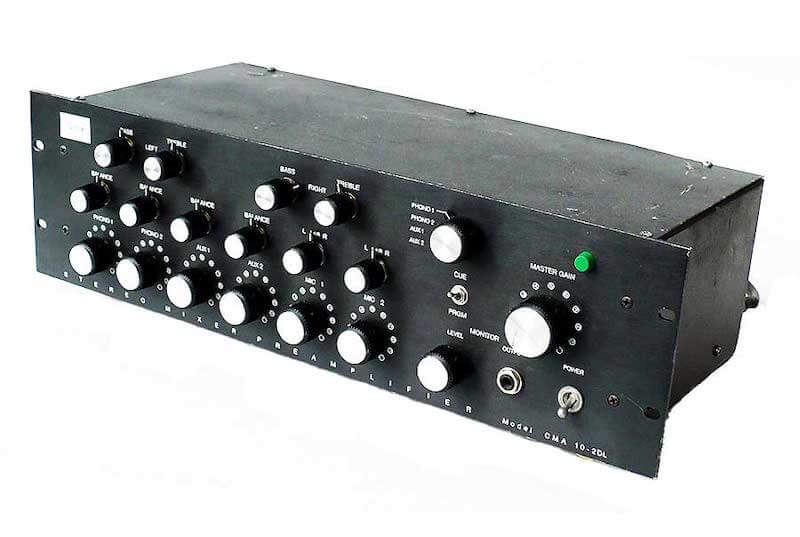
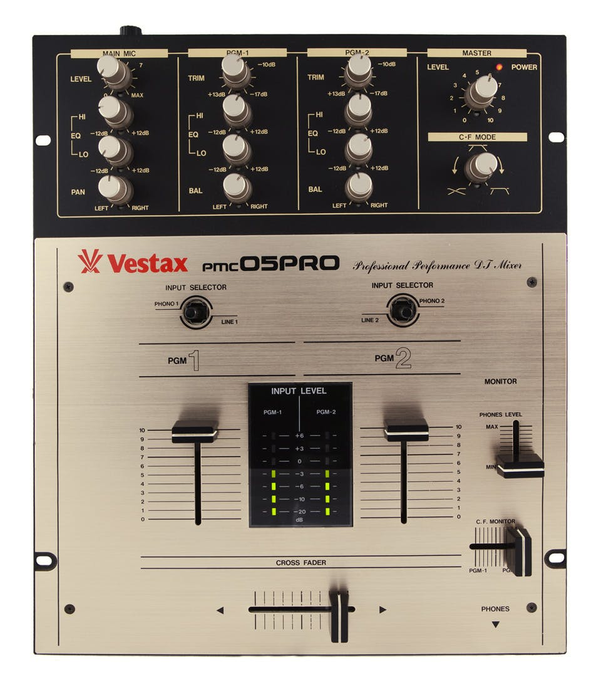
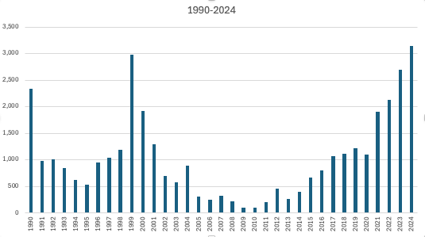

# メディア文化論V<!-- omit in toc -->
> 3. レコード

<!--
# ChatGPT
レコードが文化に与えた影響を20個あげて

レコード（アナログレコード、LP、EP、シングルなど）は20世紀の音楽文化を大きく形作り、多方面に影響を与えてきました。以下に、レコードが文化に与えた影響を20個挙げます：

---

### 🎶 音楽・アート面での影響
1. **アルバムアートの誕生と発展**  
   → レコードジャケットがアート表現の場となり、多くのアーティストやデザイナーが活躍するきっかけに。

2. **アルバムというコンセプトの確立**  
   → 単曲ではなく、ストーリー性のある「アルバム作品」として音楽が制作されるようになった。

3. **音楽ジャンルの普及と発展**  
   → ジャズ、ブルース、ロックンロール、レゲエなど、レコードによって世界中に広まった。

4. **クラブ文化とDJカルチャーの誕生**  
   → ターンテーブルとレコードを使ったDJプレイが音楽シーンを一変させた。

5. **ヒップホップ文化の起源**  
   → ブレイクビーツのループ、スクラッチなど、レコード操作を元に新しい音楽が生まれた。

6. **リスニング体験の変化**  
   → 音楽を「聴く」ための特別な儀式（プレーヤーに針を置く、B面をひっくり返す）が生まれた。

---

### 🌍 社会・文化への影響
7. **音楽のマス・メディア化**  
   → 音楽がラジオと並んで一般家庭に浸透するメディアとなった。

8. **サブカルチャーの形成**  
   → レコード収集やジャンルごとのファン文化が、サブカルチャーを生み出した。

9. **黒人音楽の広がりと公民権運動との関係**  
   → ジャズ、ブルース、ソウルなどを通じて黒人文化が可視化され、社会的な意識にも影響を与えた。

10. **国境を越えた文化の輸出入**  
    → 海外の音楽やスタイルが国内に入り込み、逆に日本の音楽も世界に広がった。

11. **レコード店という文化的な場の誕生**  
    → コミュニティや発見の場としてレコードショップが機能した。

---

### 🏷️ 産業・商業的影響
12. **音楽ビジネスの確立**  
    → レコード販売を軸にした音楽業界が急成長した。

13. **チャートシステムの誕生**  
    → Billboardなど、売上を基にしたランキングが音楽人気の指標に。

14. **音楽評論とメディアの発展**  
    → レコードを対象とした批評、レビュー文化が根付いた。

15. **インディーズレーベルの誕生**  
    → メジャーに頼らず、個人や小規模レーベルがレコード制作・販売を始めた。

---

### 📼 その他の文化・ノスタルジー的要素
16. **ヴィンテージ文化の象徴に**  
    → レトロブームの中で、レコードは懐かしさと価値の象徴に。

17. **コレクターズカルチャーの醸成**  
    → 初回盤、限定盤、レア盤など、収集の対象としての魅力が高まった。

18. **ハイファイ文化（高音質志向）の育成**  
    → オーディオマニアや高級機器の需要が生まれた。

19. **音の温かみや「アナログ感」の再評価**  
    → デジタル時代になってからも、レコード特有の音質が再評価される。

20. **レコードを使った現代アートやパフォーマンス**  
    → メディアとしてだけでなく、素材やモチーフとしても使われるように。

---

必要なら、これらの項目を深掘りして説明したり、図解したりもできるよ！どの辺に興味ある？

---
---
レコードが文化に与えた影響を100個あげて

いいですね！レコードは音楽だけじゃなくて、ファッション、思想、社会運動にまで波及してきた超重要な文化的存在なので、100個挙げる価値めっちゃあります。  
以下にカテゴリー分けして100個の影響をリストアップしていきます👇

---

## 🎵 **音楽表現と制作の進化（1〜20）**
1. アルバムという長編作品のフォーマットを確立  
2. B面曲の文化を創出（名曲も多数）  
3. 曲順に意味を持たせる文化の誕生  
4. 「コンセプト・アルバム」という新しい作品形態の発展  
5. 録音技術の進化を牽引  
6. ミキシングとマスタリングの技術発展  
7. ハイファイ志向（高音質文化）の確立  
8. モノラルからステレオへの進化を推進  
9. 音のダイナミクス表現が重視されるように  
10. 限られた時間制限（片面約20分）が構成力を高めた  
11. 曲の「イントロ」が重要になった（針を落とした瞬間に掴む必要性）  
12. ライブ音源や即興演奏の記録が可能に  
13. 「セルフプロデュース」の概念の広まり  
14. 音楽ジャンル（ジャズ、ロック、レゲエなど）の世界的拡大  
15. 民族音楽の記録と保存に貢献  
16. 音楽アーカイブの価値を高めた  
17. 宗教音楽やスピリチュアルな音楽の拡散  
18. ラジオと連動したヒット曲戦略の確立  
19. スタジオワークのクリエイティビティが高まる  
20. 音楽教育の教材として活用されるように  

---

## 🧑‍🎤 **アーティスト・表現者への影響（21〜40）**
21. シンガーソングライターの登場と普及  
22. 自主制作レコードでのデビューの道が開かれる  
23. アルバムを自己表現の手段として活用  
24. ジャケットアートによるビジュアル表現の拡大  
25. アーティストの世界観のパッケージ化  
26. レコードで初めて「スター」化されたミュージシャンの誕生  
27. グループ／バンド文化の確立と人気化  
28. 若者文化をリードする存在としての地位確立  
29. 才能あるプロデューサーやエンジニアの評価が上がる  
30. 音楽とファッションが結びつく  
31. 特定ジャンルの象徴的アーティストの誕生  
32. フィジカルメディアによりファンとの絆が深まる  
33. 「ライブ・アルバム」で現場の臨場感を伝える  
34. 女性アーティストの活躍の場が広がる  
35. 国際的な音楽フェスティバルの発展  
36. カバー文化（他アーティストの曲を演奏）が拡大  
37. ソロアーティストの台頭  
38. 引退や死後の再評価がレコードで可能に  
39. リイシュー（再発）文化の活性化  
40. 無名アーティストの「掘り出し物」価値が生まれる  

---

## 📀 **リスナーと消費文化への影響（41〜60）**
41. 音楽を家庭で楽しむ文化の普及  
42. 「レコードを聴く」という儀式的体験の形成  
43. コレクター文化の誕生  
44. レコード棚（収納）のインテリア化  
45. 曲を「所有する」感覚の形成  
46. リスニング環境（プレーヤー、スピーカーなど）にこだわる文化  
47. 音楽ジャンルごとのファンコミュニティの誕生  
48. 趣味としての「針飛び修理」やメンテナンス文化  
49. ジャケットからの情報収集（クレジット、歌詞など）  
50. 試聴文化の始まり（レコード店で針を落とす）  
51. ライナー・ノーツの読み物文化  
52. 自分だけの「プレイリスト」＝レコード並べ替え体験  
53. レコードを囲んでの会話・交流の文化  
54. 音楽趣味がステータスになった  
55. ミュージックマガジンや評論文化との相互作用  
56. レコードと共にある「喫茶店文化」や「バー文化」  
57. フリーマーケットや中古レコード文化の浸透  
58. サブカル系ファッションとの融合  
59. 親から子へ伝わる「音楽遺産」文化  
60. レコード収集＝「自分の人生のサウンドトラック」的意味づけ  

---

## 🌍 **社会・思想・教育・技術への影響（61〜80）**
61. 公民権運動と黒人音楽の広まり  
62. 反戦・プロテストソングの拡散  
63. 学生運動やカウンターカルチャーとの結びつき  
64. 政治的メッセージの可視化（フォーク、レゲエなど）  
65. 戦後の欧米文化受容の主役としての役割  
66. 冷戦時代の西側文化の象徴  
67. 音楽と言語教育の連携（英語のリスニング教材）  
68. 音楽による地域アイデンティティの形成（ソウル、シカゴ・ブルースなど）  
69. 音楽アーカイブとしての歴史的価値  
70. アナログ技術の教育素材としての価値  
71. 音の物理的保存メディアとしての重要性  
72. 音楽とデザイン（グラフィック、写真）の融合学習  
73. クラブカルチャーによる夜間経済の活性化  
74. 音楽を介した異文化理解の促進  
75. 宗教・精神世界の音楽の世界的共有  
76. 地域レーベルの登場と地方活性化  
77. 国際音楽市場（ワールドミュージック）の開拓  
78. 海賊盤・ブートレグ文化の誕生  
79. レコードプレーヤー製造産業の発展  
80. メディアアートと音響芸術の融合基盤  

---

## 💿 **DJ・クラブ・現代カルチャーへの影響（81〜100）**
81. ターンテーブル文化の誕生  
82. DJという職業の確立  
83. クラブシーンの発展とサウンドシステム文化  
84. ブレイクビーツの発見とヒップホップ誕生  
85. スクラッチ技術の発明  
86. サンプリング文化の原点  
87. 「レコードバッグ」という文化アイテム  
88. レコードの重さ・物理性が選曲や移動に影響  
89. フロアの空気を読む力（DJのリアルタイム感）  
90. ハウス、テクノ、ダブなどの発展に貢献  
91. DJバトルやターンテーブリズムの文化形成  
92. アンダーグラウンド音楽の温床に  
93. セレクター文化（選曲のセンスが評価される）  
94. トレジャーハント的なレコードディグの楽しみ  
95. ジャンル横断的なプレイスタイルの誕生  
96. ミックステープ文化の下地  
97. 音楽フェスでのアナログセットの回帰傾向  
98. 映画・ドラマ・広告での「レコード演出」増加  
99. ストリートカルチャーと密接に連動  
100. レコードそのものがカルチャーアイコンとして定着  

---

必要であれば、どこかの項目をさらに深掘りできます！  
気になるジャンルある？音楽史やアートとの関係を掘るのも楽しいよ🎧

 -->

# 目次<!-- omit in toc -->

- [はじめに](#はじめに)
- [レコードの発明](#レコードの発明)
- [音楽ビジネス・著作権](#音楽ビジネス著作権)
- [レコードの与えた文化的影響](#レコードの与えた文化的影響)
- [DJ・クラブ文化](#djクラブ文化)
- [レコードの再評価](#レコードの再評価)

# はじめに
## スライド資料について

https://sammyppr.github.io/

資料はここに置いていきます。復習にご利用ください。

## メディア表現V
この講義では
> 記録・保管のための媒体（記録媒体、記憶装置）

を取り上げ、
- 仕組み
- その文化に与えた影響

について論じていこうと思います。

いわゆるマスメディア(新聞・雑誌・ラジオ・テレビ)という視点では論じません。

(経緯については１回目参照のこと)

## 2回目のアンケート結果
大きく次のような意見に分かれました。
- 電子化して残っていない
- 限定された用途で残る
- 今と同じ状態で残っている

面白い意見として
- 重要なものほど紙 
- 紙という形が人の感覚的にもすごくフィットするからずっと使われる
- 包装用として残る

## 2回目のアンケート結果
デジタル化のかなり進んだ現在においても、
- ノートを使う人/iPad使う人
- 本・漫画を買う人/電子書籍で読む人
- 紙幣使う人/キャッシュレス決済使う人

など、紙に対する感覚が分かれている気がします。

自分が現在、「紙」とどのような関わり方をしているのか、それは他の人と異なるかもしれない、ということはちょっと意識しておいても良いかもしれませんね。

## 3回目の内容について
音を記録する「レコード」をトピックに扱っていこうと思います。

<!-- asdfjkl;asdjfkl;ajsdkfl;jaskld;f -->

# レコードの発明
## レコードの発明
1877年、トーマス・アルバ・エジソンが最初の錫箔(しきはく)円筒式蓄音機を開発しました。錫箔とは錫(スズ)を主成分とする薄くて柔らかな金属箔のことです。

その後1888年、ベルは錫箔にかわり、蝋を塗布したボール紙円筒を考案し実用化に成功します。

さらに、ほぼ同時期、エミール・ベルリナーが針の縦揺れを横揺れに変えて円盤のレコードが開発されました。

円盤にしたことで、安価に大量生産が可能となりました。

## 大人の科学
偉大な発明や発見を体感できる商品が売られていました。
完売になっていますが、まだ在庫残っているところには残っているようです。

- [エジソン式コップ蓄音機](https://otonanokagaku.net/products/others/edison/detail.html)
- [新エジソン式コップ蓄音機](https://otonanokagaku.net/products/invent/edison_new/detail.html)
- [ベルリナー式円盤蓄音機](https://otonanokagaku.net/products/invent/berliner/detail.html)

録音も再生も一つの機械でできます。

## エジソン蓄音機／The Edison Phonograph
- [エジソン蓄音機／The Edison Phonograph(3:00)](https://www.youtube.com/watch?v=r7EzvGP-g0Q)

&nbsp;

音楽が刻まれた円筒式レコード と 当時の販売用ポスター

## 電気化・ステレオ化
1920年代に入ると、ピックアップや真空管アンプ（増幅器）などを備えた電気式蓄音機が実用化され、レコードの音質は大幅に改善され、再生できる音域も広がりました。

1958年に世界初の市販のステレオ盤が発売されます。

[参考](https://buysell-kaitori.com/column/record-history/)

BeatlesではPlease Please Me(1963)からYellow Submarine(1969)まではモノラル盤/ステレオ盤の両方がリリースされていました。が、まだあまりステレオが普及していなかったため、モノラル盤で聴いていたようです。

<!--
Beatles
https://turntokyo.com/features/the-beatles-red-album/
ビートルズのほとんどの音源もリリース当初からステレオ／モノラル両盤発売されていたものの、1967年ごろまではメンバー自身もモノラル盤を重視していたようだ。

[ビートルズ【MONO VS STEREO】どっちの勝ち！？【徹底聞き比べ】](https://www.youtube.com/watch?v=YxzF0XZB0uc)

[The Beatles - Stereo vs. Mono: What's the Difference, and Who Cares!?](https://www.youtube.com/watch?v=4dchCB-2TPY)
-->

## レコード盤の仕組み
レコード盤にはその振動を記録した、音溝と呼ばれる溝が掘られています。この溝にレコード針が触れると溝の形状に合わせてレコード針が小さく動きます（振動します）。この小さな振動をカートリッジで電気信号に変換、アンプで増幅することで音を再生することができます。
レコードの音溝は左右45°のV字形状に掘られており、右側にRチャンネル、左側にLチャンネルの音の信号が記録されています。

- [レコードの仕組み](https://www.audio-technica.co.jp/cartridge/navi/whatis/index.php)

## レコード盤の作り方
- [原盤は日本製、高音質なレコードを作るプロの技 | WIRED Japan(7:45)](https://www.youtube.com/watch?v=3oWrD-nl1uM)

## レコードの種類
- **SP** Standard Play
初期のタイプで直径12インチ(30cm),78回転。収録時間 4-5分
- **EP,シングル** Extended Play
直径7インチ(17cm),45回転。収録時間 -30分(シングルだと5-8分)
- **LP** Long Play
直径12インチ(30cm),33回転で収録時間 30分
- **12インチシングル**
直径12インチ(30cm),33回転で収録時間 片面に1曲

[参考：レコードの種類](https://www.audio-technica.co.jp/cartridge/navi/whatis/02.php)

## レコードの外周と内周
レコードは現存しているのはほとんど33,45回転/分となっています。
rpm(Round Per Minute)と呼びます。

レコード盤は一定のスピードで回転しているわけですから、回転数が早い方が音質が良くなります。

> 円周 = 直径 x 3.14

ですから、外周と内周で記録できる距離が変わるわけで、外側の方が音が良いことになります。

そのため、12インチシングルというレコード盤があるわけです。

# 音楽ビジネス・著作権
[参考](https://www.bunka.go.jp/tokei_hakusho_shuppan/tokeichosa/chosakuken/pdf/94035501_02.pdf)

## 音楽ビジネスの始まり
レコードが開発されるまでは「楽譜」が音楽メディアでした。
楽譜を出版することが音楽ビジネスであったわけです。

- 作曲家から「曲」を預かって楽譜として出版する
- それを貴族や演奏家にレンタルし、その収益から曲の預かり賃を作曲家に還元する

これが著作権ビジネスの始まりです。
現在の著作管理会社は本など出していないのに「音楽出版社」というのもここからきています。

[参考:ストリーミングを聴きながら音楽ビジネスの歴史と未来を考えてみた](https://m-upholdings.co.jp/staffdiary/?id=2000001552)

## 音楽メディア：楽譜からレコードへ
1902年にナポリ出身の無名なテノール歌手、エンリコ・カルーソーのレコードを発売し、このレコードが大ヒットを記録することによって、状況は一変しました。カルーソーが吹き込んだレオンカヴァッロのオペラ『道化師』の中のアリア「衣装をつけろ」が収録されたレコードは、100 万枚以上の売上げを記録しました(世界初)。
- [レオンカヴァッロ《道化師》「衣装をつけろ」カルーソー(3:29)](https://www.youtube.com/watch?v=9jebe-xSN-U)

このことは、蓄音機とレコードの普及に大きく貢献し、
- 蓄音機というハードを売るために
- 優れたソフトが必要であり
- 優れたソフトはアーティストをプロモートする

として次々とレコーディングが行われるようになります。

## 著作権制度の不備
楽曲をレコードに複製する権利(機械的録音権、メカニカル・ライツ)に関して規定がなかったため、誰もが自由かつ無償で楽曲をレコードに複製することができました。

つまり、楽曲の権利者にはお金が全く入りませんでした。

作曲家の粘り強い陳情活動により1909年メカニカル・ライツが認められるようになりました。

## レコードの無断複製
レコードの無断複製が自由に行われていたため、今度はレコード制作者が著作権を主張するようになりました。

1934年に
- 著作権には著作物をレコードに録音する権利が含まれていること
- レコード製作者がそのレコードについて著作者とみなされ、著作権が与えられること

が明記され、レコードの無断複製が禁止できるようになりました。

## 国際条約

- [実演家、レコード製作者及び放送機関の保護に関する国際条約](https://www.cric.or.jp/db/treaty/jr_index.html)
- [許諾を得ないレコードの複製からのレコード製作者の保護に関する条約](https://www.cric.or.jp/db/treaty/kyo_index.html)

## 現在でも
新しいメディアが出てくると著作権上グレーになる時期があります。
法律も時代と共にアップデートする必要がありますね。

# レコードの与えた文化的影響
## アルバム・アートワーク
LPサイズのアナログレコードジャケットは(315mm x 315mm)とかなり大きく、
アーティストの実験の場となりました。デザイナーたちのクリエイティヴィティやオリジナリティを世界に向けて発信する手段でもありました。
アンディ・ウォーホールもその輝かしいキャリアをアルバムカヴァーのデザインからスタートしています。

- [Top 50 Most Iconic Album Covers Of All Time(2:51)](https://www.youtube.com/watch?v=BxiENBPYvfc)

[参考：アルバム・アートワークの歴史：ジャズからロック、プログレを彩るデザイナーとアーティスト達](https://www.udiscovermusic.jp/features/history-album-artwork)

## ジャケットや盤をメディアとしたアート
ジャケットだけでなく、ビニール盤自体が表現の場として利用されました。
- [The Art of the Vinyl Record(9:08)](https://www.youtube.com/watch?v=TSOwBgINGZo)

## 長編作品のフォーマット、コンセプトアルバム
コンセプト・アルバム（Concept Album）は、ある一定のテーマまたは物語に沿った楽曲によって構成されたアルバム。アルバム全体でひとつの作品になっている作品をさしています。

通常、ロックのアルバムに収録されている曲は、互いに無関係な単独の楽曲から構成されているのに対し、コンセプト・アルバムとは、それぞれの楽曲が関連を持ち、アルバム全体で一つのストーリを持っているようなアルバムです。

BeatlesのSgt. Pepper's Lonely Hearts Club Bandが史上初のコンセプトアルバムと言われています。曲同士の間隔を短くし、最後にはアンコールに応えるように曲を流すなど、レコードタイトルと同じ名称の架空バンドのコンサートを聴いているような構成に仕上げています。

<!--
## B面文化
レコードは円盤のため、両面に異なる音楽を収録することができ、A面・B面と呼びました。

特に、シングルの場合には
- A面：メインの曲(商業的な成功が目的)
- B面：補完的な楽曲やテーマを補強する曲

と異なる側面を持っていました。
-->

<!--
## 視聴文化
レコード屋では
- **ジャケ買い** 商品のジャケット（パッケージ）のデザインに惹かれて、中身の内容を全く知らない状態で商品を購入すること

もありましたが、
-->
## 輸入レコード
世界中で様々なレコードが販売されていましたが、日本のレコード屋では主に日本で販売されているものしか扱っていませんでした。

そんな中輸入盤を扱うレコード屋さんが渋谷・宇田川町にありました。現在も「シスコ坂」という地名に残っている?「CISCO」です。

> 1970年代からアナログレコード販売の最大手として名を馳せた「シスコ・インターナショナル」が柳光ビルを拠点として展開し、全盛の頃はレコードを買い求める人たちの行列が大通りまで続く光景が見られました。当時、ほど近いところにタワーレコードがあり、今も宇田川にあるマンハッタンの店舗など、音楽の街・宇田川文化を発信していたのです

## 柳光ビル&シスコ坂のモニュメント

<!--
https://nextrecordsjapan.tokyo/archives/15709901.html
-->

## 貸しレコード屋
1980年6月、東京都三鷹市に「黎紅堂」と呼ばれる貸しレコード屋が誕生しました。
1枚250-300円と1/10程度でレンタルできました。

レンタルレコード店は急速に拡大していきます。
30店(1980),約1000店(1981), 約1700店(1982)

借りて聞くだけだったら問題なかったものの、多くの人が家でカセットテープに録音していたため、レコード店の売り上げが減少、若い世代から圧倒的な支持を受けたレコードレンタルですが、裁判を起こされます。

「貸与権」という考え方が明文化されていなかったのですが、この後著作権法改定に反映されていきます。

このレンタル、という考え方はこの後CD,ビデオ,DVDへと引き継がれていきます。

<!--
## 海賊版・ブートレグ文化
現在ではライブの音声・動画がYouTubeで配信されているのが当たり前ですが、当時はカメラ・録音機器の持ち込みは禁止されていました。

そうした中で、著作権者に無断で販売される海賊版商品が存在しました。
のうち、レコード、CD等の音楽商品を指す日本語の呼称。レコード盤のイメージから来る日本の音楽業界固有の表現である
-->

<!--
## 喫茶店・バー文化
-->

## ソノシート
「ソノシート」（英語名：flexi disc）とは、塩化ビニールなどで作られた薄手のやわらかいレコードのことです。フランスのS.A.I.P.というメーカーが開発し、1958年にSonopresse（出版社であるHachetteとS.A.I.P.が設立）がソノシート付き雑誌（「Sonorama」）の形態で刊行したのがソノシートの始まりです。

ソノシートは非常に安価で大量生産しやすいことが特徴で、1960年代の音楽雑誌や、1970年代の子ども向け雑誌などの付録として広く使用されていました。

ソノシートには、レコードやCD等の他媒体では発売されていない音源も多く、また、音楽以外にニュース等の音源もあり、当時の音の文化を知る上で貴重な資料となっています。

## ガンダム効果音
アニメージュという雑誌ではこんなものがついてました。
昔持ってたんですけど...

- [[1981] 機動戦士ガンダム 効果音集 (Gundam 0079 Special Sound Effects Collection) - Full Flexi Disc/Vinyl Rip(4:59)](https://www.youtube.com/watch?v=5kTH6QROw6Q)
- [MOBILE SUIT GUNDAM SPECIAL SOUND EFFECT DISK](https://vgmdb.net/album/46479)

# DJ・クラブ文化
## DJという職業
DJ(disc jockey)とはかつて
> ラジオDJ 主にラジオ放送局のラジオ番組で本人の選曲やリクエスト曲を流す人物・司会者を指す

の意味で利用されていましたが
> 演奏会場やクラブ、ソフトなどで再生機器で客に聴かせる人物

の意味でみなさん馴染みがあるかと思います。

## DJミキサーの始まり
<!-- 
ロータリーミキサー
https://rondomixer.jp/
https://rondomixer.jp/rotarymixer-history/
-->
曲を繋げるのではなく、１曲終わったら音が止まり、次の曲をかけるスタイルでした。そして、PAミキサーではなくDJミキサーと呼ばれる商品が開発されるようになります。

- [The Note Episode 1 | Alex Rosner: Shaping the Sound of New York(4:27-5:39)](https://youtu.be/Nv8mju2-gHI?si=ru0WuthRDBKe_yIB&t=267)

## DJスタイルの発展

- １曲終わったら音が止まり、次の曲をかけるスタイル
- ２台のレコードプレーヤーを使って曲が終わる前に２台目の曲を流して途切れることなく曲を流すスタイル

[参考:DJの歴史](https://www.studionoah.jp/book/2018/11/dj_14/index.html)

## ブレイクビーツの発見とヒップホップ誕生
客が盛り上がり楽しそうに踊っている「ブレイク」部分がずっと続けばいいのにと思ったDJクール・ハークは、同じレコードを２枚、レコードプレイヤーを２つ用意し、１枚目と２枚目で曲のおなじ部分を切り替えながら繰り返し流し続けました。

これがブレイクビーツと呼ばれるようになりました。

- [Kool Herc "Merry-Go-Round" technique(3:55)](https://www.youtube.com/watch?v=7qwml-F7zKQ)

> ブレイクビーツ・ラップ・ブレイクダンス・グラフィックアート

これらの要素があわさり、1970年代後半〜1980年代初頭のNYのストリートからヒップホップは育ってきたカルチャーといえます。

## DJミキサーの発展
DJミキサーはその後発展していき、だいたいこんなUIをしています。

- [プロのDJでも知らない人がいるかも？　DJミキサーについて(6:31)](https://www.youtube.com/watch?v=b6F1N5zEDUk)

## スクラッチ
レコードを楽器にしてしまったのがスクラッチという奏法です。
- [DJ DELightfull // Scratch Freestyle Jazzy Boom Bap Beat // Vinyl Djing(0:56)](https://www.youtube.com/watch?v=2YW7hg2bbYM)

# レコードの再評価
## レコード売上枚数
- [アナログディスク 生産数量・金額推移](https://www.riaj.or.jp/f/data/annual/anlg.html)

1980年頃の最盛期には2億枚ほど売れていました。CDは1982年に発売。近年明らかに再評価されていることがわかるでしょうか？(単位：千枚)

## ブーム？
2023年の特集番組を見てみましょう。
- [レコード人気いま再び復活支える日本の技術(12:36)](https://www.youtube.com/watch?v=Wh6wkVS3Nm8)
- [【オカネのヒミツ】再熱「レコード」の魅力！超高級プレイヤーも登場　中古買取も高値で　ノスタルジーだけじゃない若者もハマるワケ 【報道ランナー】(9:03)](https://www.youtube.com/watch?v=HScmCJmxX3E)

ブームと呼ばれる状況ではなく、再評価として良い状況ですね。

## まとめ
「レコードの発明」「音楽ビジネス・著作権」「レコードの与えた文化的影響」「DJ・クラブ文化」「レコードの再評価」と話をしてきました。

録音ができるレコードという記録媒体により、様々な影響を与えたことがわかってくれればと思います。

## おまけ
自分は小学校の頃からたまにレコード買ってましたが、一番聴いたレコードはきっとこれです。

## 小レポート
manabaより以下の内容で提出してください。

> なぜ現代においてレコードが再評価されているのか

