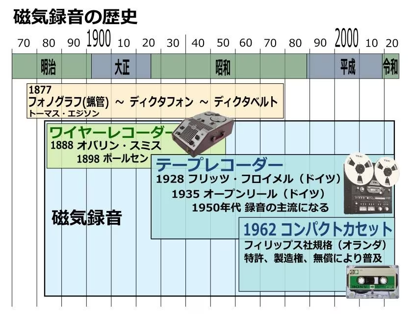
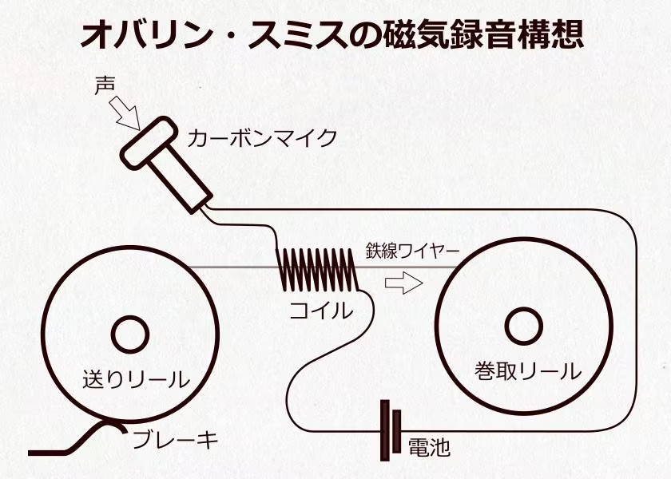
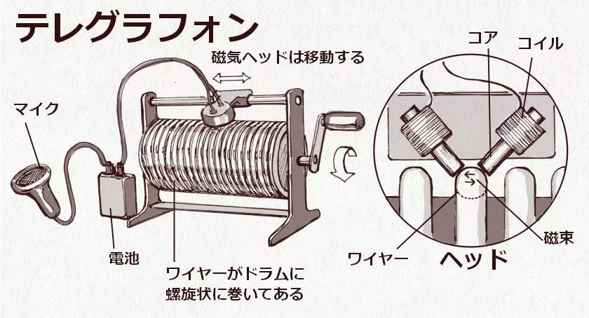
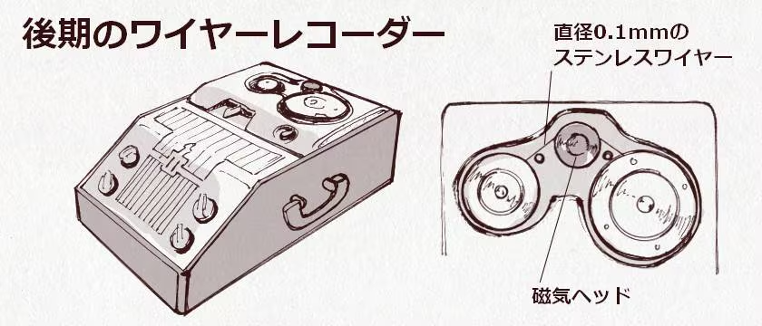
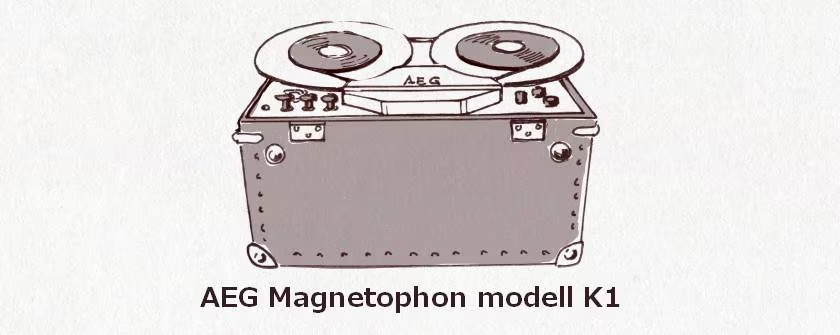
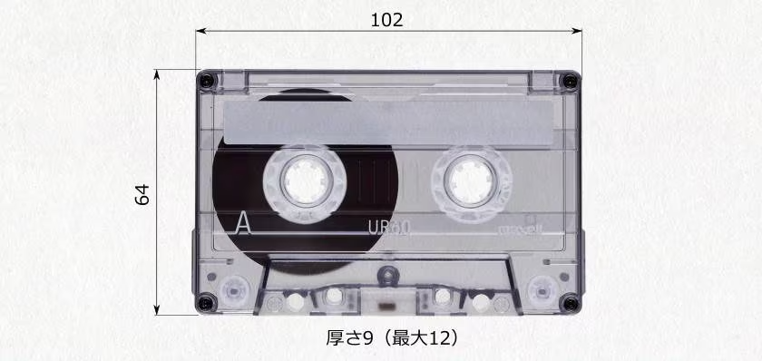
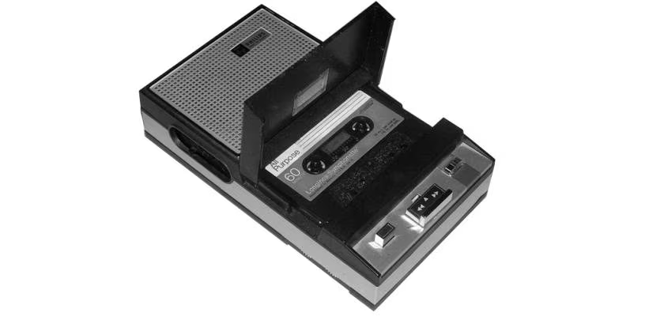
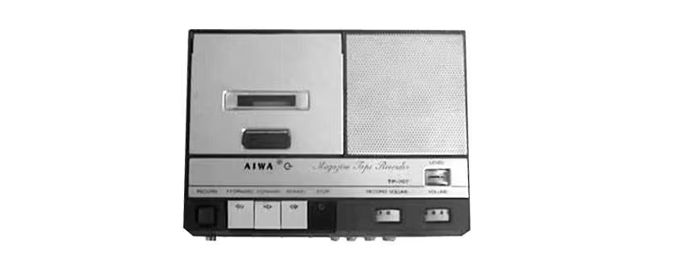
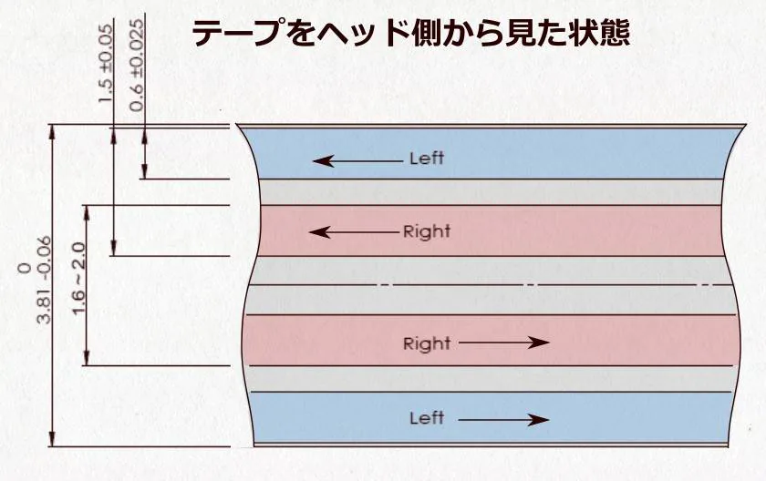
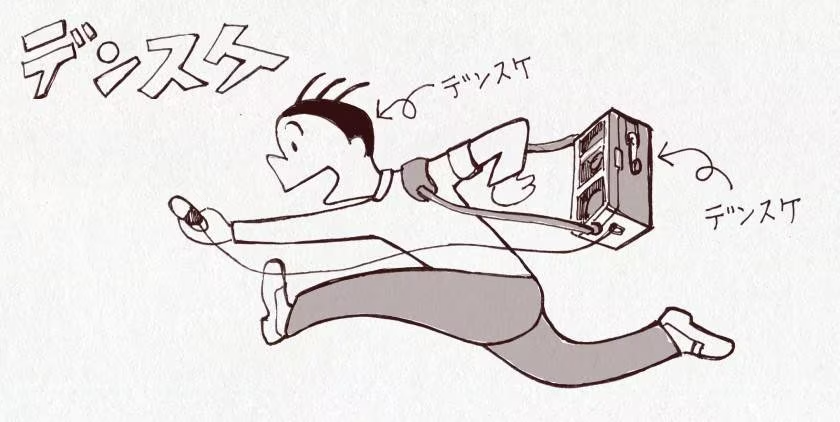

# メディア文化論V<!-- omit in toc -->
>  4.磁気テープ(カセットテープ・オープンリール)

<!--
# 最初の想定
[第04回]　磁気テープ(オープンリール・カセットテープ)
- 録音技術：ビートルズ(https://note.com/marble5050/n/n35393ab08da1)
- https://33man.jp/article/005259.html
- https://blog.goo.ne.jp/rubber_soul_jp/e/8d36589d89319abebdb4f35f97464ec4
- スプライシング編集(https://www.youtube.com/watch?v=AGZ10_ZaoJ4)
- A,B面あるよ
- 業務用・家庭用アナログMTR(https://ja.wikipedia.org/wiki/%E3%83%9E%E3%83%AB%E3%83%81%E3%83%88%E3%83%A9%E3%83%83%E3%82%AF%E3%83%BB%E3%83%AC%E3%82%B3%E3%83%BC%E3%83%80%E3%83%BC)
- コンポ 家で楽しむ https://ja.wikipedia.org/wiki/%E3%83%9F%E3%83%8B%E3%82%B3%E3%83%B3%E3%83%9D
- ラジカセ 高音質化 1970 https://ja.wikipedia.org/wiki/%E3%83%A9%E3%82%B8%E3%82%AA%E3%82%AB%E3%82%BB%E3%83%83%E3%83%88%E3%83%AC%E3%82%B3%E3%83%BC%E3%83%80%E3%83%BC
- https://www.amazon.co.jp/-/en/Lutra-lutra-Boombox-Large-%E5%9B%B3%E9%91%91/dp/4866360674?asin=B0753ZJZT5&revisionId=&format=4&depth=1
- Boombox/ghettoblaster-ヒップホップ https://www.tokyoartbeat.com/events/-/2015%2F3273
- 1979 ウォークマン->持ち歩いて聞けるように(https://joshinweb.jp/sound/wmh.html)https://www.nippon.com/ja/japan-topics/g00726/
- ミュージシャンに与えた影響 カセットMTR...DTMの走りか？シーケンサと同期
- https://matsudananda.wordpress.com/2013/09/10/93%E5%B9%B4%E3%80%80%E9%8C%B2%E9%9F%B3%E6%A9%9F%E6%9D%90%E4%BA%8B%E6%83%85/

- デジタルマルチトラックレコーダー(https://www.sony.co.jp/Products/proaudio/story/story03.html)

# ChatGPT
## オープンリールが文化に与えた影響を20個あげて

オープンリール（オープンリールテープ）は、特に音楽、映画、放送業界において重要な影響を与えた技術ですが、それが文化に与えた影響は多岐にわたります。以下に、その影響を20個挙げます：

1. **録音技術の進化**: オープンリールテープは、初期の録音技術を飛躍的に進化させ、音質の向上を実現しました。
   
2. **アナログ音源の録音**: 音楽や会話を高品質なアナログ音源として録音でき、後にデジタル録音の基礎を築きました。

3. **音楽の制作・ミキシング技術**: 多重録音やミキシングが可能となり、音楽制作の自由度が大幅に向上しました。

4. **録音の保存性向上**: オープンリールは当時の最良の保存手段として長期的な録音保存が可能でした。

5. **放送業界の発展**: ラジオやテレビの放送においてオープンリールテープは重要な役割を果たし、内容の録音と編集が効率化されました。

6. **ジャズの録音技術革新**: ジャズミュージシャンたちはオープンリールテープを使って即興演奏を録音し、後にそれを編集・再構築することができました。

7. **録音の複製と分配**: 音楽業界では、オープンリールを用いた録音物の複製が容易になり、音楽作品の配布が加速しました。

8. **アーティストの創造性の向上**: オープンリールは、アーティストが自宅スタジオで高品質な音源を作ることを可能にし、創造性を大いに促進しました。

9. **音楽のデモ制作**: アーティストがオープンリールテープでデモ音源を制作し、それを音楽業界関係者に送ることが一般的になりました。

10. **映画音響制作の発展**: 映画の音響効果やサウンドトラックがオープンリールを使用して録音され、映画の音響が革新されました。

11. **フィールドレコーディングの普及**: 自然音や街の音、インタビューなどを現場で録音するフィールドレコーディングがオープンリールにより広まりました。

12. **カセットテープの普及への布石**: オープンリールの技術が小型化され、カセットテープの登場と普及を助けました。

13. **音楽コレクター文化の形成**: オープンリールテープは音楽愛好家やコレクターによって価値あるオリジナル録音として保存され、コレクション文化が形成されました。

14. **アーティストとリスナーの距離感の縮小**: アーティストがオープンリールを使って自分の音楽を直接ファンに届ける手段として使ったことで、距離感が縮まりました。

15. **ラジオ番組の録音とアーカイブ**: ラジオ番組の録音において、オープンリールは番組のアーカイブとして使われ、後に再放送や歴史的資料となりました。

16. **音響機器の発展**: オープンリールを使った録音機器が発展し、特にオーディオファイル向けの高品質な再生機器が登場しました。

17. **音楽ジャンルの多様化**: 録音技術の進化により、異なる音楽ジャンルがより高い技術で制作され、多様化が進みました。

18. **DIY音楽制作の普及**: オープンリールの普及により、音楽のDIY制作が広がり、特にインディーズシーンでの制作活動が盛んになりました。

19. **ポッドキャストやラジオの先駆け**: オープンリールで録音された内容を後にポッドキャストやインターネットラジオで使用する形となり、音声メディアが普及する礎となりました。

20. **文化的記録としての役割**: オープンリールは音楽や文化的なイベント、ドキュメンタリーなどを録音・保存する手段として使われ、後の世代に対する文化的な遺産の一部として残りました。

これらの影響により、オープンリールは音楽や放送業界だけでなく、広範な文化的側面にも深い影響を与えました。

## カセットテープが文化に与えた影響を20個あげて

カセットテープは、オープンリールと並び、音楽や録音技術に革命をもたらし、文化に大きな影響を与えました。以下はその影響を20個挙げたものです：

1. **ポータブル音楽の普及**: カセットテープは携帯性に優れ、持ち運びが簡単なため、ポータブル音楽の時代を切り開きました。ウォークマンの登場はこの変化を象徴的に示しました。

2. **個人の音楽ライブラリーの形成**: カセットテープを使うことで、個人が自分だけの音楽コレクションを作り、独自の音楽ライブラリーを楽しむ文化が生まれました。

3. **ミックステープ文化の誕生**: カセットテープを使って自分好みの曲を集めた「ミックステープ」を作ることが流行し、友達や恋人へのプレゼントとしても利用されました。これが後の「プレイリスト文化」へと繋がりました。

4. **低コストでの音楽制作**: アーティストやバンドがカセットテープを使って低コストでデモテープを作成し、音楽業界に送ることが一般的になりました。これによりインディーズシーンが成長しました。

5. **音楽の共有の簡便化**: カセットテープは音楽の録音と再生が簡単で、多くの人々に音楽をシェアする手段として利用されました。

6. **音楽の個人化とパーソナライズ**: 自分の好みで曲を選んでカセットテープに録音することができ、リスナーにとって音楽をパーソナライズする手段となりました。

7. **ラジオ番組やエアチェックの録音**: リスナーはお気に入りのラジオ番組や音楽をカセットテープに録音することができ、後で再生して楽しむことができました。

8. **音楽テープのレンタルと貸し借り文化**: カセットテープはレンタルビデオと同様に、音楽テープをレンタルして借りる文化を形成し、特に1980年代には音楽店でのレンタルが盛況でした。

9. **ドライブや移動時の音楽体験**: 車にカセットテープを装着することで、ドライブ中に音楽を楽しむ文化が生まれ、ドライブミュージックの定番が形成されました。

10. **家庭用音楽録音機器の普及**: カセットデッキやポータブルカセットプレイヤーの普及により、家庭で簡単に音楽の録音・再生ができる環境が整いました。

11. **日本の音楽業界の成長**: カセットテープの普及により、特に日本では音楽産業が大きく発展しました。多くのアーティストがカセットテープを用いて広範なファン層にアプローチしました。

12. **DIY音楽制作と自宅録音**: カセットテープはアーティストが自宅で録音した音楽を制作し、友人やファンと共有するための手段として活用されました。これによりDIY音楽文化が広まりました。

13. **音楽ジャンルの普及**: カセットテープは、特にパンク、ヒップホップ、インディーズロックなど、主流メディアに乗らない音楽ジャンルが広まる重要な手段となりました。

14. **カセットテープを用いたアーティストとの距離感の縮小**: カセットテープの制作は非常に手軽で、アーティストとファンとの間に新たな親密さを生み出しました。インディーズアーティストの作品がファンの手に届きやすくなりました。

15. **音楽テープとファッションの関係**: カセットテープのデザインやパッケージが個性的で、アートとしても楽しめる側面があり、音楽とファッションの関係が強化されました。

16. **音楽メディアのライブラリー化**: カセットテープは、音楽を長期間保存するためのメディアとして利用され、家庭や公共施設で音楽ライブラリーの管理や整理が行われました。

17. **カセットテープとポップカルチャー**: 1980年代には、カセットテープがポップカルチャーの象徴となり、映画やテレビドラマにも頻繁に登場するようになりました。

18. **言葉と音楽を組み合わせた文化**: カセットテープに音楽とともに語りや朗読、ポエトリーを録音する文化が広まりました。音楽と文学が融合した形式の表現が増えました。

19. **録音技術の革命と普及**: カセットテープは録音機器の操作を一般の人々にも理解できるレベルにしたため、録音技術が広範に普及しました。

20. **音楽の保存と収集**: カセットテープは、時にはそのアーティストの貴重な「オリジナル音源」として収集され、ファンにとって大切なアイテムとなることが多かったです。

カセットテープはその普及によって音楽業界だけでなく、個人の音楽文化や社会全体の音楽の楽しみ方に大きな影響を与え、時代を象徴するメディアとなりました。

## 2020年代においてのオープンリール・カセットテープの置かれた立場について教えて

2020年代において、オープンリールとカセットテープは、かつての全盛期に比べて商業的な主流からは外れたものの、それぞれ独自の文化的、音楽的な役割を果たし続けています。以下に、両者の現在の立場を詳しく説明します。

### 1. **オープンリールテープの現状**
オープンリールテープは、主にプロフェッショナルな音楽制作やアーカイブ、そしてオーディオ愛好家の間で使用されており、商業音楽の主流メディアとしてはほとんど存在しませんが、その魅力を維持しています。

- **アナログ音質の評価**: オープンリールはそのアナログ特有の温かみや豊かな音質が評価されており、特にオーディオマニアやレコードコレクター、スタジオ音響エンジニアの間で一定の需要があります。デジタル音源に対してアナログ音源の優位性を主張する層があり、オープンリールはその「純粋な音質」を求める人々に愛されています。
  
- **アーカイブや歴史的保存**: 映画、音楽、放送などのアーカイブ保存において、オープンリールは今でも重要な媒体として使われています。特に古い録音や映像の保存にはオープンリールが使われ、デジタル化される際の重要な過渡的メディアとされます。

- **クラシック音楽やジャズの録音**: 特にジャズやクラシック音楽の録音で、オープンリールは「本物の音」の象徴とされ、これらのジャンルでアナログ音質を求めるアーティストやファンに利用されています。

- **趣味的使用**: 一部のアナログ愛好者やリスナーは、オープンリールを自分の音楽コレクションに使うことを楽しんでいます。オープンリールの機材は高価で扱いも難しいため、趣味的なニッチな市場となっています。

### 2. **カセットテープの現状**
カセットテープは、2020年代においてはかつてのような広範なメディアとしての役割はなくなりましたが、復興の兆しを見せています。特にインディーズ音楽やノスタルジア文化、若者文化との関わりで注目されています。

- **インディーズ音楽シーンでの人気**: カセットテープは、特にインディーズやDIYアーティストの間で人気を集めています。低コストで音楽を製造・販売できるため、インディーズアーティストにとっては手軽で実現可能な媒体です。特に、手作り感や「アナログ感」を好むファン層に支持されています。

- **ノスタルジアとレトロブーム**: 2020年代には、80年代や90年代の「レトロ」文化が再び流行しており、カセットテープもその一部として復活を遂げています。カセットテープの外見や音質が「古き良き時代」の象徴として、特に若者を中心に人気を博しています。音質や利便性よりも、ノスタルジア的価値が重視されています。

- **音楽の限定版やアートアイテム**: 一部のアーティストやレコードレーベルは、カセットテープを限定版やアートアイテムとしてリリースし、コレクターズアイテムとしての価値を高めています。アーティストはカセットテープを使って、独特の物理的なパッケージやアートワークを提供し、ファンとのつながりを強めています。

- **ストリーミング音楽とカセットの対比**: ストリーミング音楽が主流となった現在でも、カセットテープは「物理的な所有感」を重視するファン層に支持されています。ストリーミングで音楽を聴くことに対する反動として、物理メディアへの関心が高まっているとも言えます。

- **カセットテープの音楽的役割**: カセットテープは音質がデジタルに劣るとされる一方で、その特有の「歪み」や「ノイズ」がアートの一部として意図的に使われることがあります。これにより、特にエクスペリメンタル音楽やノイズミュージック、シンセポップなどのジャンルでカセットテープが重要なメディアとなっています。

### 3. **未来における展望**
オープンリールとカセットテープが未来にどう位置づけられるかは、音楽や音響文化のトレンドによって決まります。

- **アナログとデジタルの融合**: 2020年代の音楽制作では、アナログとデジタルの融合が進んでおり、オープンリールやカセットテープは音楽制作の一部として使われ続ける可能性があります。例えば、オープンリールを使って録音した音源をデジタル化し、その後にさらに加工するというプロセスが一般的です。

- **文化的な価値の保存**: 両者のメディアは、音楽の歴史的遺産としての価値を持つため、今後もアーカイブや保存の重要なツールとなるでしょう。

- **サステナビリティとメディアの再評価**: 現代のデジタル社会において、カセットテープやオープンリールは、音楽ファンが「物理メディア」を所有することで音楽の持続可能性を感じる手段として再評価されることがあります。

結論として、オープンリールとカセットテープは、主流メディアとしては現在あまり使われていませんが、アナログ音質やノスタルジア、アートとしての価値などを重視する人々にとって、依然として重要な役割を果たしています。

https://www.youtube.com/watch?v=xHyuXWB_f2E

TOPIC
- 磁気テープ(アナログ信号の記録に限る)
- 歴史
  - ワイヤーレコード(1888)
  - オープンリール(1928)
    - 編集のしやすさ->デジタルでもこれを基本的に真似ている
  - テープレコーダー(1962)
  - https://www.soundhouse.co.jp/contents/column/index?post=2342
- 磁気テープの仕組み
  - テープの幅・速度
  - オープンリールの編集
- デンスケ
  - 由来：漫画から
    - https://note.com/field_archive/n/nc2cf277b0a5f
  - 商標が普通名称化した
  - 生録ブーム https://www.sony.com/ja/SonyInfo/CorporateInfo/History/capsule/16/
- 小型化・巨大化
  - ステレオ・コンポ
  - ウォークマン
    - https://www.youtube.com/watch?v=jKJKR6CFrrM
    - https://www.nicovideo.jp/watch/sm7902786?redirected=1
    - https://www.youtube.com/watch?v=5NfugW-Uq0E
    - https://www.youtube.com/watch?v=ykMB6IC9fks
    - https://www.hummingheads.co.jp/reports/d-history/140714.html
  - ラジカセ
  - https://www.sony.com/ja/SonyInfo/CorporateInfo/History/capsule/24/
- 音楽制作
  - MTR(オープンリール) 16,24トラック
  - ピンポン録音
  - カセットMTR
    - 4/8Track
- 再注目される磁気テープ
-->

# 目次<!-- omit in toc -->

- [はじめに](#はじめに)
- [アナログ磁気録音の歴史](#アナログ磁気録音の歴史)
- [磁気テープの仕組み](#磁気テープの仕組み)
- [デンスケ](#デンスケ)
- [ウォークマン](#ウォークマン)
- [ラジカセ](#ラジカセ)
- [音楽制作](#音楽制作)
- [データレコーダー](#データレコーダー)
- [録音用磁気テープの終焉?](#録音用磁気テープの終焉)
- [まとめ](#まとめ)

# はじめに
## スライド資料について

https://sammyppr.github.io/

資料はここに置いていきます。復習にご利用ください。

## 3回目のアンケート結果
「なぜ現代においてレコードが再評価されているのか」

- ノスタルジー
- 音楽の楽しみ方として定着
- アナログで聴くことが新鮮
- 音楽を聴く時間を楽しめる
- レアな音楽がレコードしか聴けない
- 「モノ」として所有できる

## 3回目のアンケート結果
全ての人がレコードを持ってるわけではないでしょうが、
レポートを見ると、非常に好意的にレコードのことを捉えている人が
多く、本当に一過性のブームじゃなく、再度定着してきてるんだな、
と感じました。

## 磁気テープ
> 第04回　磁気テープ(オープンリール・カセットテープ)
> 第06回　磁気テープ(VHS・ベータ)
> 第10回　磁気テープ(DV)

3回に分けて論じていこうと思います。

# アナログ磁気録音の歴史
- [参考：音楽と電気の歴史10　ワイヤーレコーダー](https://www.soundhouse.co.jp/contents/column/index?post=2338)
- [参考：音楽と電気の歴史11　テープレコーダー](https://www.soundhouse.co.jp/contents/column/index?post=2342)
- [参考：音楽と電気の歴史12　コンパクトカセットテープ](https://www.soundhouse.co.jp/contents/column/index?post=2357)
- [参考：音楽と電気の歴史13　カセットテープレコーダー](https://www.soundhouse.co.jp/contents/column/index?post=2358)

## アナログ磁気録音の歴史
> アナログ磁気録音の歴史は大きく分けて、第2次大戦中までの**ワイヤーレコーダー**と、その後の**テープレコーダー**に大別できます。ワイヤーレコーダーは名前の通り、直径0.1mmほどの細い金属線に録音するレコーダーです。テープレコーダーが飛躍的に向上するまで、主にアメリカで通信記録用として使われていました。

## 1888年　磁気録音構想発表　オバリン・スミス（アメリカ）

> 磁気録音の歴史は、オバリン・スミスが特許を取らずに磁気録音原理を誌上にて発表したのが最初とされています。鉄線ワイヤーを包むようにコイルがが磁気ヘッドで、カーボンマイクと接続され、電池もつながっています。リール部の構想は巻取リールを手動等で回し、送りリールに軽くブレーキをかけておくことで、鉄線ワイヤーをピンと張るような構造になっています。

## 1898年　磁気記録の誕生　テレグラフォン　ポールセン（デンマーク）
> オバリン・スミスの発表から10年後、実際に機能するワイヤーレコーダーをヴォルデマール・ポールセンが発明しています。下は初期の試作品模式図になります。鋼鉄ワイヤーをドラムに巻いていたり、移動ヘッドなどの構造に、エジソンの蝋管の影響が伺えますが、数年後にはワイヤーの利点である巻き取り構造、固定ヘッドに変わっています。

## 大人の科学
- [ポールセンの針金録音機](https://otonanokagaku.net/magazine/vol23/index.html)

原理的には身近な金属に録音できるようです。

## ワイヤーレコーダー全盛期
> ワイヤーレコーダーが本格的に使われた期間は1940～1950年ぐらいで、それほど長くはありません。小型コンパクトで環境振動に影響を受けないため、軍用の無線録音用や航空機用として重宝されています。また振動に強ことや、長時間利用できるから鉄道での音楽プレーヤーとしてのニーズもありました。音質はそれほどよくありませんが、人の声を記録するには充分でした。

## 60年前のワイヤーレコーダー
- [60年前のワイヤーレコーダー(1:16)](https://www.youtube.com/watch?v=Qolyyx0srgU)

<!------------->
## オープンリール
カセットテープが普及する前は、大型のテープレコーダーが利用されていました。

## 1928年　テープレコーダー　フリッツ・フロイメル（ドイツ）
> テープレコーダーは1928年にドイツ人技術者フリッツ・フロイメルが初めとされています。
> フロイメルは、ワイヤーレコーダーの欠点を克服し、メディアが軽く、加工もしやすいテープレコーダーを考案します。磁性粉末をフィルムや紙に定着させるという、現在の磁気テープ技術の基礎を固めて行きます。

## 1931～1935年　AEG社、BASF社（ドイツ）マグネトフォンK1型
> AEG社（ドイツ）がフロイメルの特許を買い、本格的に磁気録音の開発を推し進めます。テープレコーダーに必要な基本技術はAEG社によって確立されます。
> 
> テープの開発は化学メーカーのI. G. ファーベン社（後のBASF社）（ドイツ）が担当し、実用的な磁気テープを完成させています。酢酸セルロースベースに酸化鉄という組み合わせです。

<!------------->
## カセットテープレコーダー
> 磁気録音機器において、もっとも多目的に使われたのがカセットテープです。そして録音再生するレコーダーも用途に応じて様々なタイプが存在しました。

## 1962年　カセットテープレコーダー1号機　Philips EL-3300
> 最初のテープレコーダーは、当然ですが規格を作ったフィリップス社です。小型のカセットテープを生かしたお手本のようなプロダクトになっています。

## 1967年　国産初カセットテープレコーダー　AIWA　TP-707P
> 初期の国産レコーダーは、水平にカセットをセットするタイプが主流でフィリップス社のお手本に忠実な感じがしますが、70年代に入ると国産レコーダーが世界のカセットテープ市場を引っ張っていく印象があります。性能面だけでなく、アイデアなども国内メーカーから出たものが多いように感じます。

## その後の歴史
- 1967～68年　各社からラジカセ登場 松下電器　RQ-231
- 1968年　初のカセットデッキ　TEAC　A-20
- 1968年　カーステレオにカセットテープを導入　クラリオン
- 1976年　Wカセット　クラリオン　MD-8080A
- 1978年　オートリバース登場　AKAI GXC-735D
- 1979年　再生専用ポータブルカセットプレーヤー　ソニー　ウォークマン
- 1979年　初のWラジカセ　シャープ　GF-808
- 1979年　初のマルチトラックレコーダー　TEAC 144 Portastudio
- 1970年代後半～80年代前半　データレコーダの登場
- 1986年～　CDラジカセの登場

## 用語説明
- **ラジカセ** ラジオとカセットテープが一体となっている機器
- **Wカセット** 録音/再生ができるため、編集が可能となる
- **オートリバース** カセットはA面/B面があったが自動で再生を続ける
- **マルチトラックレコーダー** ステレオ(2tr)録音以上に4,8tr利用可能
- **データレコーダ** コンピュータのデータ保存用

# 磁気テープの仕組み
[参考：「テープレコーダの磁気ヘッドと磁性粉」の巻](https://www.tdk.com/ja/tech-mag/ninja/029)

## 磁気テープ
> 磁気テープはベースフィルム（当初は紙、のちにプラスチック）の上に、酸化鉄 の磁性粉を塗布することで製造されました。一方のリング形ヘッドというのは、コ イルを巻いたドーナツ状の鉄製リングの一箇所にギャップを設けた一種の電磁石で す。ギャップを狭くすることで、強力な磁界が得られます。
> 
> 電磁石である磁気ヘッドに信号電流を流して、磁気テープをなぞると、塗布され た磁性粉の磁極が信号電流に応じて次々と反転し磁化されていきます。

## 磁性体が揃う仕組み
- [音声を磁気信号に変えて記録](https://www.asahi.com/articles/photo/AS20200826002653.html)

## 高音質にするには？
情報を記録する磁性体の数を大きくすればするほど高音質になります。
それには、
- テープの幅を広くする
- 送りスピードを上げる

の方法がありました。

## テープ幅・送りスピード
> 各国、各メーカーがテープレコーダーをバラバラで開発していては、市場拡大の妨げになるため統一されていきます。

### オープンリール
- **テープ幅** 1/4,1/2,1,2インチ
- **送りスピード** 3.75, 7.5, 15, 30インチ/秒
### カセットテープ
- **テープ幅** 0.15インチ
- **送りスピード** 1.875インチ/秒

## トラック数
ステレオ信号を記録するには、2トラック必要となります。
カセットテープでは、A面/B面(表裏)で違う音楽を録音できるように4トラックが採用されていました。

## オープンリールでの編集
１方向に2トラックで利用しているオープンリールの場合には、
- テープに切る印をつける
- テープをハサミで切る
- 専用のテープで貼り付ける

として編集を行っていました。
Premiere,DAW等でカット編集するための「ハサミ」のアイコンありますが、実際に「ハサミ」を使っていました。

- [アナログ編集(8:11)](https://www.youtube.com/watch?v=AGZ10_ZaoJ4)

## 早送り・巻き戻し
テープである以上、必要な位置の情報を得る(音声を聞く)には
- 早送り
- 巻き戻し

をする必要がありました。感覚的に理解できるでしょうか？

つまり「3曲目を聞きたい！」という時には早送りする必要がありました。

## A面・B面
先ほどトラック数のところで、4トラックで行きと帰りでステレオ信号を記録していました。

つまり、A面・B面があり、ある時期まではカセットテープを入れ直して聞いていました。

オートリバース、という機能が付いてからは、自動で反転するようになりましたが、
A/B面の収録時間が異なると、どちらかでは無音部分が余る、そんなこともありました。

## 録音も再生も可能
確認ですが、レコードは企業でなければ生産できませんでした。
それに対してテープレコーダーでは、**個人が簡単に録音も再生もできる**ようになりました。

これにより、ラジオを録音して保存したり(**エアチェック**)、自分なりに選曲して音楽を編集して聞けるようになりました。

<!------------>
# デンスケ

[参考：元祖ウォークマン？ 「街の声を聞こう！」街頭録音ブームを先駆け 〜 横山隆一の４コマ漫画『デンスケ』](https://note.com/field_archive/n/nc2cf277b0a5f)

## 4コマ漫画
> 1949 (昭和24) 年から1955 (昭和30) 年にかけて毎日新聞で連載された、漫画家・横山隆一 の４コマ漫画『デンスケ』で、主人公の デンスケ が肩がけのテープレコーダーを使って、街頭録音を行う話が掲載されていました。

## ソニーによる商標登録
街頭インタビューするためにソニーのテープレコーダーを持ち歩いていたことから、いつの間にかポータブルテープレコーダーが「デンスケ」と呼ばれるようになります。後にソニーが商標登録しています。

ソニー（初代法人、現：ソニーグループ）により1959年に登録された（登録番号第543827号）登録商標ですが、2009年1月13日に失効しています。

## 生録ブーム
[参考：君は「生録ブーム」を知っているか](img/mct5_04_namaroku.png)

> かつて、1970年代中頃、日本中に「生録（なまろく）ブーム」なるものが吹き荒れた。「生録」——すなわち、生の音源を、自分自身で録音するという作業である。当時、録音といえばFM放送のエアチェックが主流であった（もちろんテープである）。しかし、それに飽き足らないオーディオマニアの間に、「自分で生の音を録ってみたい」という機運が盛り上がり始めた。その願いを叶えたのがソニーの“カセットデンスケ”「TC‐2850SD」である。プロ用可搬型テープデッキ“デンスケ”の名を冠した本格派で、キャッチコピーは「おもてに飛び出すデッキメカ」。もちろん、家庭内におけるオーディオデッキとしての性能も十分兼ね備えている。

## 
> このカセットデンスケの登場によって生録ブームは爆発的なものとなる。お祭りやカーレースといったアクティブなものから、森の小鳥のさえずり、清流のせせらぎといった癒し系まで、録音対象はさまざま。中でも折からのSLブームと結びつき、走る蒸気機関車はファン垂涎のターゲットとなった。力強いドラフト音（シュ、シュ、ボッ、ボッ）、劈（つんざ）く汽笛……消え行くものを音で残すという郷愁とロマンがファンを魅了し、全国各地の録音ポイントが紹介された。

<!------------>
# ウォークマン

## ウォークマン誕生前夜
[参考：1979年7月1日　初代ウォークマン発売](https://www.hummingheads.co.jp/reports/d-history/140714.html)

- カセットテープを外出しても聞くことができるよう、ソニーは1978年5月に肩掛け型で教科書サイズのテープレコーダー「[TC-D5](https://audio-heritage.jp/SONY-ESPRIT/player/tc-d5.html)」を発売

- ビジネス用途(ボイスメモ)向けに[「プレスマン(TCM-100B)」](https://www.sony.com/ja/SonyInfo/design/gallery/TCM-100B/)が1978年に発売

> 「小型テープレコーダーの『プレスマン』に、再生だけでいいからステレオ回路を入れたものを作ってほしい」と当時の副社長に持ちかけたところ、早速社内の技術者が試作に取り掛かった。

## ウォークマン誕生
> 「テープレコーダー（録音機）は売れるが、テーププレーヤー（再生専用機）は売れない」と社内では否定的・悲観的な意見がほとんどであった。しかし盛田氏はその反対を押し切り、1979年7月1日、初代ウォークマン「[TPS-L2](https://www.butsuyoku.net/legend/tps-l2/)」の発売を断行する。

これにより、音楽を携帯する文化が生まれました。
- [ウォークマン:音楽を「聴く」から「持ち歩く」へ。常識をくつがえした初代ウォークマンの開発者たち【ソニー公式】(3:28)](https://www.youtube.com/watch?v=5NfugW-Uq0E)

## ウォークマンCM
### 初代CM
- [ソニーウォークマン、初代～4代目CM(1:39)](https://www.youtube.com/watch?v=jKJKR6CFrrM)

### 有名なCM 「猿の瞑想」編 1987
- [TVCM ソニー ウォークマン（1987）](https://www.youtube.com/watch?v=V4IuLJFEzxY)

<!------------>
# ラジカセ
- [参考：Vol.24: キミはなぜゆえ巨大化したのか…](https://www.sony.com/ja/SonyInfo/CorporateInfo/History/capsule/24/)

## 音楽を持ち歩く
ラジカセとはラジオ付きカセットレコーダーのことで、FM放送の音楽などを手軽に録音できました。乾電池を使って持ち歩くこともできました。

## 竹の子族
> 東京・原宿の歩行者天国に“竹の子族”が出現するのは。“竹の子族ファッション”に身を包み、“竹の子族ダンス”（音楽はディスコ系）を踊る彼らの必須アイテムといえば大音量のラジカセであった。パワーがモノをいう世界だ。そんなこんなで、各社のラジカセは巨大化、高音質化、大音量化へと突き進む。

## BOOMBOX/ghettoblaster HIPHOP
日本で生産されたラジカセはアメリカに渡り「BOOMBOX」あるいは「ghettoblaster」と呼ばれヒップホップムーブメントの飛躍に一役買いました。

ちょっと長いですが、まとまってるので見てみましょう。
- [ブームボックスの興亡(7:57)](https://www.youtube.com/watch?v=ow-t1S3NI-0)

<!------------>
# 音楽制作
## 業務用マルチトラックレコーダー
16/24トラックのテープレコーダーが長らく業務用として利用されてきました。
(32トラックは故障が多くて16/24が標準に)

- [Studer A820 Multichannel(1:16)](https://www.youtube.com/watch?v=Ujyyk2MIcmQ)

今でもアナログが好きな人は利用しています。
また、名機と呼ばれる機材のシミュレーションがDAWでは行われています。

- [Ampex ATR-102 Mastering Tape Recorder](https://www.uaudio.com/products/ampex-atr-102)

## 家庭用マルチトラックレコーダー
1979年になると、家庭用の4トラックMTRが発売されました(TASCAM 244)。
このことにより、自分の家で手軽に音楽制作ができるようになりました。

いわゆる**宅録**が可能になっていきました。

1991年には8トラックもリリースされ、自由度が上がっていきます。
> TEAC TASCAM PortaStudio 488(1991年発売　定価220,000円)

## ピンポン録音
トラック数が少なかったため、
1. 1-6トラックにドラムを録音
2. 7,8トラックにドラムを2Mix(これを**ピンポン録音**という)
3. 1-6にその後、Bass,Guitar,Vocalを録音

等として、音源を制作していました。
80年代にルーツを持つミュージシャンは苦労しながら音楽制作していました。

DAW(GarageBand等)で事実上、無制限にトラックを利用できる現在はすごいな、と思います。

<!------------>
# データレコーダー
後述するフロッピーディスクがない、または高価であった頃、コンピュータのデータの記録にはカセットテープを利用していました。

## PC-6000シリーズ

ゲームのデータを読み込むのに10分とかかかってました...
しかも、読み込みエラーだとやり直し...

<!------------>
# 録音用磁気テープの終焉?
## 磁気テープは終わった？ 
今回は、音楽用の磁気テープについて説明してきました。

基本的には終わったと感じています。
- アナログ復権ブームとしてカセットテープも少し需要ある
  - [waltz 中目黒](https://waltz-store.co.jp/)
  - [懐かしのカセットテープが令和に大復活、デジタル化も簡単な携帯プレーヤーが登場](https://xtech.nikkei.com/atcl/nxt/column/18/00160/082700371/)
  - [【カセットテープ復活ブームは嘘？】再評価の歩みと拡散――海外発の再評価と日本の事例](https://books-matsuda.com/4742/)
- 音楽制作用にはアナログオープンリールを好む人がいる

ですが、レコードのような復活はなかなか難しいかなと思っています。

## まだ売ってます...
- [TASCAM 202MKVII](https://www.soundhouse.co.jp/products/detail/item/249838/)
- [Amazon カセットプレイヤー](https://www.amazon.co.jp/s?k=%E3%82%AB%E3%82%BB%E3%83%83%E3%83%88%E3%83%97%E3%83%AC%E3%82%A4%E3%83%A4%E3%83%BC&__mk_ja_JP=%E3%82%AB%E3%82%BF%E3%82%AB%E3%83%8A&crid=24BBMYDN15Z27&sprefix=%E3%82%AB%E3%82%BB%E3%83%83%E3%83%88%E3%83%97%E3%83%AC%E3%82%A4%E3%83%A4%E3%83%BC%2Caps%2C195&ref=nb_sb_noss_2)
- [Amazon 記録メディア テープ](https://www.amazon.co.jp/s?k=%E3%82%AB%E3%82%BB%E3%83%83%E3%83%88%E3%83%97%E3%83%AC%E3%82%A4%E3%83%A4%E3%83%BC&__mk_ja_JP=%E3%82%AB%E3%82%BF%E3%82%AB%E3%83%8A&crid=24BBMYDN15Z27&sprefix=%E3%82%AB%E3%82%BB%E3%83%83%E3%83%88%E3%83%97%E3%83%AC%E3%82%A4%E3%83%A4%E3%83%BC%2Caps%2C195&ref=nb_sb_noss_2)

# まとめ
今回は録音用磁気テープをテーマに、
- カセットテープ
- ウォークマン
- ラジカセ
- MTR

など、メディアが文化に与えてきた側面について説明してきました。

## 小レポート
manabaより以下の内容で提出してください。

> 磁気テープが支えた1980年代の音楽を中心とする文化について簡単に述べよ。

